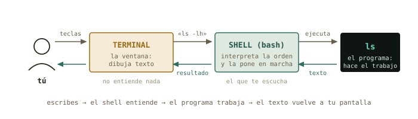
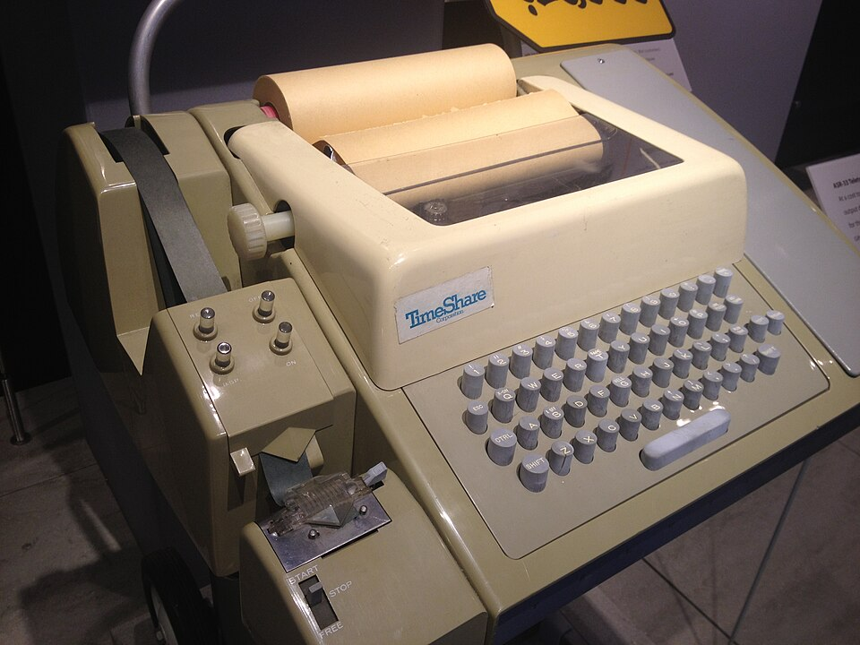
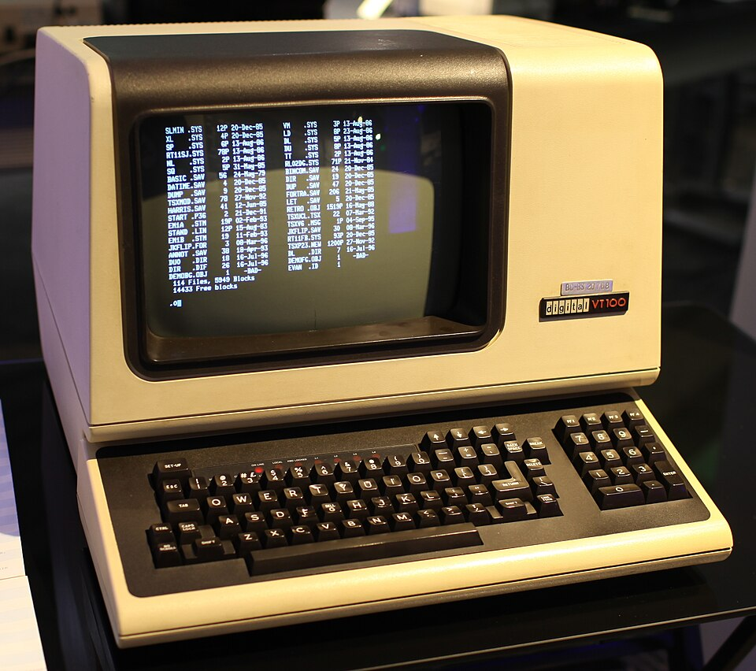
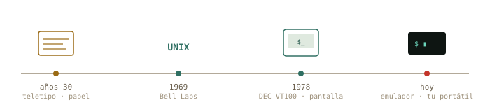
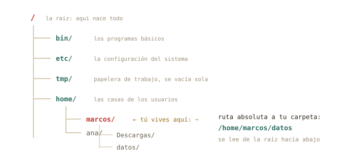
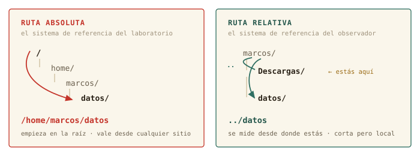
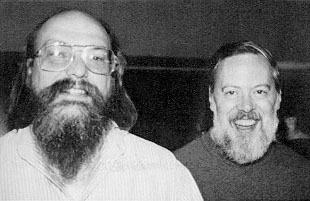

# Abrir la caja negra {#sec-cap01}

::: {.lede}
Llevas años usando Linux sin haber hablado nunca con él directamente.
Hoy empieza la conversación: qué es realmente esa ventana negra, por qué
sigue siendo la herramienta central del cálculo científico medio siglo
después, y tus primeros pasos dentro.
:::

::: {.chapmeta}
⏱ **2–3 h** con ejercicios · requisitos: **ninguno** · máquina: **tu Linux de diario**
:::

::: {.objetivos}
**Al terminar esta sesión sabrás**

- Distinguir terminal, shell y consola (y por qué casi todo el mundo los confunde).
- Leer y escribir la anatomía de cualquier comando: programa, opciones, argumentos.
- Moverte por el árbol de directorios con `pwd`, `ls` y `cd`, con rutas absolutas y relativas.
- Usar los dos superpoderes que separan a quien sufre la terminal de quien la disfruta: el tabulador y el historial.
- Pedir ayuda al propio sistema con `man` y `--help`, sin salir a internet.
- Registrar tu sesión con `script`: tu cuaderno de laboratorio de este curso.
:::

## Qué es esto que parpadea {#sec-terminal-shell}

Abre la terminal de tu equipo (en Mint: menú → Terminal, o
<kbd>Ctrl</kbd>+<kbd>Alt</kbd>+<kbd>T</kbd>). Verás algo así:

```terminal
marcos@portatil:~$ ▮
```

Esa línea se llama **prompt**, y es una frase completa aunque no lo
parezca: «soy el usuario `marcos`, en la máquina `portatil`, estoy en el
directorio `~`, y el `$` significa que te escucho». Cada símbolo
informa. El cursor parpadeante es la pregunta: *¿qué quieres?*

Antes de responder, deshagamos una confusión que arrastra todo el
mundo. Aquí hay **dos programas distintos** colaborando, no uno:

| Pieza | Qué es | Analogía de laboratorio |
|-------|--------|-------------------------|
| **Terminal** | La ventana: dibuja texto, recoge tus teclas. No entiende nada de lo que escribes. | La pantalla del osciloscopio |
| **Shell** | El intérprete que vive dentro: lee tu orden, la ejecuta, devuelve el resultado. El tuyo se llama `bash`. | La electrónica que procesa la señal |
| **Consola** | Históricamente, el hardware físico conectado a la máquina. Hoy se usa como sinónimo informal. | El instrumento completo sobre la mesa |

{#fig-circuito fig-alt="Esquema del circuito de una orden: tú, terminal, shell y programa, con flechas de ida y vuelta"}

::: {.historia}
**◷ Historia · Por qué tu terminal se llama tty**

En los años 30, mucho antes de los ordenadores, las agencias de
noticias transmitían texto con *teletipos* (*teletypewriters*, «tty»):
máquinas de escribir que enviaban cada tecla por un cable e imprimían
lo que llegaba. Cuando en los 60 hubo que hablar con los primeros
ordenadores compartidos, nadie diseñó una interfaz nueva: se enchufó el
teletipo que ya existía. El ordenador «contestaba» imprimiendo en papel.

Las pantallas sustituyeron al papel en los 70 —el DEC VT100 de 1978
fijó el estándar que tu terminal aún emula— pero el nombre se quedó.
Escribe `tty` en tu terminal y el sistema te dirá qué «teletipo» eres.
Hay medio siglo de arqueología funcionando en tu portátil.
:::

:::: {.content-visible when-format="html"}
::: {layout-ncol=2}
{#fig-asr33 fig-alt="Teletipo ASR-33 con rollo de papel en un museo"}

{#fig-vt100 fig-alt="Terminal DEC VT100 con un listado de ficheros en pantalla"}
:::
::::

:::: {.content-visible when-format="pdf"}
{#fig-asr33 fig-alt="Teletipo ASR-33 con rollo de papel en un museo" width="70%"}

{#fig-vt100 fig-alt="Terminal DEC VT100 con un listado de ficheros en pantalla" width="70%"}
::::

{#fig-cronologia fig-alt="Cronología del teletipo a tu terminal: años 30, UNIX 1969, VT100 1978, hoy"}

::: {.por-dentro}
**◉ Por dentro · ¿Por qué sobrevive una interfaz de los años 60?**

No es nostalgia. El texto tiene tres propiedades que ninguna interfaz
gráfica iguala: es **componible** (la salida de un programa puede ser
la entrada de otro, lo verás en el capítulo 3), es **reproducible** (un
comando se copia en un correo, un artículo o un script y produce
exactamente lo mismo), y **viaja bien** (manejar un superordenador a
2 000 km por SSH cuesta lo mismo que manejar tu portátil). En física
computacional, esas tres propiedades son la diferencia entre un
resultado y un resultado *reproducible*.
:::

## Primeras palabras {#sec-primeras-palabras}

Vamos a hablarle. Una regla para todo el curso, y es innegociable:
**no copies y pegues los comandos — tecléalos**. Los dedos aprenden lo
que los ojos solo reconocen. Escribe cada línea y pulsa <kbd>Intro</kbd>:

```terminal
marcos@portatil:~$ whoami
marcos
marcos@portatil:~$ date
domingo, 23 de agosto de 2026, 18:04:11 CEST
marcos@portatil:~$ echo "hola, máquina"
hola, máquina
marcos@portatil:~$ tty
/dev/pts/0
```

Cuatro comandos, cuatro respuestas instantáneas. `whoami` — quién soy.
`date` — qué hora es. `echo` — repite lo que te digo. `tty` — qué
terminal soy (ahí está el teletipo fantasma). Fíjate en el patrón:
escribes una orden, el shell la ejecuta, te devuelve texto, y el prompt
reaparece pidiendo la siguiente. Ese ciclo es toda la terminal.

¿Y si te equivocas? Prueba a escribir `whoami` mal a propósito:

```terminal
marcos@portatil:~$ woami
bash: woami: orden no encontrada
```

Nada explota. El shell te dice exactamente qué pasó: no conoce ningún
programa con ese nombre. **Los mensajes de error de la terminal se
leen, no se temen** — casi siempre contienen el diagnóstico completo.
Aprender a leerlos es la mitad de este curso.

## Anatomía de un comando {#sec-anatomia}

Casi todo lo que escribirás en tu vida en una terminal sigue una única
gramática de tres piezas:

{#fig-anatomia fig-alt="Anatomía de un comando: programa, opciones y argumento señalados sobre una línea de terminal"}

Las **opciones** empiezan por guion y modifican el comportamiento. Las
cortas se pueden agrupar: `ls -l -h` y `ls -lh` son idénticos. Muchas
tienen versión larga y legible: `-h` es `--human-readable`. Los
**argumentos** son el objeto de la acción — normalmente ficheros o
carpetas. Si no das argumento, cada programa tiene un valor por defecto
razonable: `ls` a secas lista *donde estás*.

::: {.truco}
**✚ Truco · Los espacios importan**

El shell separa las piezas por espacios. `ls-lh` (sin espacio) es para
él un solo programa llamado «ls-lh», que no existe. Y una carpeta
llamada `mis datos` son *dos* argumentos salvo que la protejas con
comillas: `ls "mis datos"`. Por eso los científicos veteranos nombran
todo `sin_espacios` — adopta la costumbre desde hoy.
:::

## El territorio: moverse por el árbol {#sec-arbol}

Todo el sistema — programas, configuración, tus datos, tus fotos — vive
en un único árbol de directorios que nace en la raíz, escrita `/`. No
hay «unidades C: y D:»: todo cuelga del mismo tronco. Tu casa está en
`/home/tu_usuario`, y como es el sitio donde pasarás la vida, tiene
apodo: la virgulilla `~`.

{#fig-arbol fig-alt="Árbol de directorios de Linux desde la raíz, con home, etc, tmp y las casas de los usuarios"}

Tres comandos son tu GPS:

```terminal
marcos@portatil:~$ pwd
/home/marcos
marcos@portatil:~$ ls
Descargas  Documentos  Escritorio  Imágenes  Música  Vídeos
marcos@portatil:~$ cd Descargas
marcos@portatil:~/Descargas$ pwd
/home/marcos/Descargas
```

`pwd` (*print working directory*) responde «¿dónde estoy?». `ls`
(*list*) responde «¿qué hay aquí?». `cd` (*change directory*) te mueve.
Observa que el prompt cambió: ahora dice `~/Descargas`. El prompt es tu
brújula permanente.

### Rutas absolutas y relativas

Hay dos maneras de indicar cualquier lugar del árbol, y la diferencia
es idéntica a la de un sistema de referencia en mecánica:

Una **ruta absoluta** empieza por `/` y se mide desde la raíz:
`/home/marcos/datos`. Vale desde cualquier sitio, siempre, como unas
coordenadas del sistema de laboratorio. Una **ruta relativa** se mide
desde donde estás ahora: si estás en `~`, escribir `datos` basta. Es el
sistema de referencia del observador — más corto, pero depende de tu
posición.

{#fig-rutas fig-alt="Comparación entre ruta absoluta desde la raíz y ruta relativa desde el directorio actual"}

Dos atajos completan el mapa: `..` es «el directorio padre» (un nivel
hacia la raíz) y `.` es «aquí mismo». Y `cd` tiene dos gestos que
usarás mil veces: sin argumentos te lleva a casa desde cualquier lugar,
y `cd -` vuelve al sitio donde estabas justo antes.

```terminal
marcos@portatil:~/Descargas$ cd ..
marcos@portatil:~$ cd /etc
marcos@portatil:/etc$ cd
marcos@portatil:~$ cd -
/etc
marcos@portatil:/etc$
```

::: {.aviso}
**△ Tranquilidad · Hoy no puedes romper nada**

Todos los comandos de este capítulo son de *solo lectura*: miran, no
tocan. Aún no sabes borrar ni modificar nada — disfruta de esta era de
inocencia mientras dure. Cuando lleguen los comandos con consecuencias
(capítulo 2), llegarán también las redes de seguridad.
:::

## Los dos superpoderes {#sec-superpoderes}

Lo que de verdad separa a quien sufre la terminal de quien la habita no
es saber más comandos. Son dos teclas.

### El tabulador: nunca escribas nombres enteros

Escribe `cd Des` y pulsa <kbd>Tab</kbd>. El shell completa:
`cd Descargas/`. Si hay varias opciones que empiezan igual, pulsa
<kbd>Tab</kbd> *dos veces* y te las muestra todas. Esto no es solo
comodidad: **si el tabulador no completa, el fichero no está donde
crees** — acabas de detectar un error antes de cometerlo. El tabulador
es tu comprobación experimental continua.

### El historial: nunca escribas nada dos veces

La flecha <kbd>↑</kbd> recupera comandos anteriores, uno a uno. Pero el
gesto profesional es <kbd>Ctrl</kbd>+<kbd>R</kbd>: búsqueda inversa.
Púlsalo, teclea un fragmento de cualquier comando que hayas usado
(«des», por ejemplo), y aparecerá el más reciente que lo contenga.
<kbd>Intro</kbd> lo ejecuta; <kbd>Ctrl</kbd>+<kbd>R</kbd> otra vez
busca más atrás. El comando `history` te enseña la lista completa
numerada.

::: {.por-dentro}
**◉ Por dentro · Dónde vive tu memoria**

El historial no es magia: bash lo va guardando en un fichero oculto
llamado `.bashhistory`… casi: `.bash_history`, dentro de tu casa. Los
ficheros cuyo nombre empieza por punto están ocultos por convención —
`ls` no los muestra salvo que le pidas `ls -a` (*all*). Pruébalo en
`~`: descubrirás docenas de ficheros de configuración que llevan años
viviendo contigo sin que los hayas visto. En el capítulo 4 aprenderás
qué hacen.
:::

## Pedir ayuda sin salir del sistema {#sec-ayuda}

Aquí está la clave de la autonomía, el motivo por el que este curso
existe. Ante una duda, el reflejo entrenado es preguntarle a Google o a
una IA. Pero tu sistema lleva dentro la documentación completa y exacta
de cada comando *de tu versión concreta*, disponible sin conexión:

```terminal
marcos@portatil:~$ ls --help
Modo de empleo: ls [OPCIÓN]... [FICHERO]...
Lista información sobre los FICHEROs...
marcos@portatil:~$ man ls
```

`--help` da el resumen rápido en pantalla. `man` (*manual*) abre la
página completa en un visor con sus propias teclas: <kbd>↑</kbd>/<kbd>↓</kbd>
y <kbd>Espacio</kbd> para moverte, <kbd>/</kbd> para *buscar* dentro
(escribe el término y <kbd>Intro</kbd>; <kbd>n</kbd> salta a la
siguiente aparición), y <kbd>q</kbd> para salir. Esa tecla <kbd>/</kbd>
convierte cada página de manual en un documento consultable en
segundos.

::: {.historia}
**◷ Historia · El manual nació con el sistema**

Unix nació en 1969 en los Bell Labs, escrito por Ken Thompson y Dennis
Ritchie en un PDP-7 arrinconado — el proyecto oficial de sistema
operativo del laboratorio acababa de cancelarse, y ellos siguieron por
gusto. En 1971, su jefe puso una condición para comprarles una máquina
mejor: que documentaran el sistema. Así nació el *Unix Programmer's
Manual*, y con él la costumbre, viva 55 años después, de que cada
programa lleve su página `man`. La notación `ls(1)` que verás por ahí
significa «la página de `ls` en la sección 1 del manual» — la
numeración original de 1971.
:::

{#fig-thompson-ritchie fig-alt="Fotografía en blanco y negro de Ken Thompson y Dennis Ritchie" width="65%"}

## Tu cuaderno de laboratorio: `script` {#sec-script}

En el laboratorio no se te ocurriría medir sin cuaderno. En la
terminal, tampoco: el comando `script` graba *todo* lo que aparezca en
pantalla — tus órdenes y las respuestas — en un fichero, hasta que
escribas `exit`.

```terminal
marcos@portatil:~$ script sesion01.log
Script iniciado, el fichero de anotación es 'sesion01.log'
marcos@portatil:~$ pwd
/home/marcos
marcos@portatil:~$ exit
Script terminado, el fichero de anotación es 'sesion01.log'
```

Desde ahora, **cada sesión de este curso empieza con
`script sesionNN.log` y termina con `exit`**. Te servirá para revisar
qué hiciste, para preguntar con evidencia («esto es exactamente lo que
pasó») — y durante el piloto, esos logs son los datos experimentales
con los que mejoraremos el curso. Eres a la vez el físico y el
experimento.

## Práctica: la expedición {#sec-practica}

Sesión de campo. Arranca tu cuaderno (`script sesion01.log`) y responde
a cada pregunta *ejecutando comandos*, no de memoria. Las soluciones
están plegadas: inténtalo de verdad antes de abrirlas.

::: {.ejercicio}
**Ejercicio 1.1 · Reconocimiento del territorio**

Ve a la raíz del sistema y lista lo que hay. Después responde:
¿cuántos directorios de primer nivel tiene tu Mint, aproximadamente?
¿Reconoces `etc`, `home` y `tmp` de la @fig-arbol?

:::: {.solucion}
::: {.callout-tip collapse="true" title="Solución razonada"}
`cd /` y después `ls`. Verás en torno a 20 entradas:
`bin  boot  dev  etc  home  lib  ...`

**Por qué así** — También valía `ls /` directamente, sin moverte —
recuerda que `ls` acepta como argumento cualquier ruta. Dos caminos
correctos para lo mismo: en la terminal casi siempre los hay, y ninguno
es «el bueno».
:::
::::
:::

::: {.ejercicio}
**Ejercicio 1.2 · Sistemas de referencia**

Estás en `/home/marcos/Descargas`. Escribe **dos** comandos distintos,
uno con ruta relativa y otro con absoluta, que te lleven a
`/home/marcos/Documentos`.

:::: {.solucion}
::: {.callout-tip collapse="true" title="Solución razonada"}
Relativa: `cd ../Documentos` · Absoluta: `cd /home/marcos/Documentos`
(o el híbrido `cd ~/Documentos`).

**Por qué así** — `..` sube a `/home/marcos` y desde ahí baja a
`Documentos`: es el cambio de sistema de referencia pasando por el
origen común. La absoluta funciona idéntica estés donde estés — por eso
los scripts que escribas en el futuro preferirán rutas absolutas: no
dependen de dónde los ejecutes.
:::
::::
:::

::: {.ejercicio}
**Ejercicio 1.3 · Leer al instrumento**

Ejecuta `ls -lh /etc` y elige cualquier línea. Identifica en ella: el
tamaño del fichero y su fecha de modificación. ¿Qué crees que aporta la
opción `-h`? Compruébalo repitiendo sin ella.

:::: {.solucion}
::: {.callout-tip collapse="true" title="Solución razonada"}
En una línea como `-rw-r--r-- 1 root root 3,0K ago 12 10:33 fstab`, el
tamaño es `3,0K` y la fecha `ago 12 10:33`. Sin `-h`, el tamaño aparece
en bytes crudos: `3044`.

**Por qué así** — `-h` es `--human-readable`: convierte bytes a K, M,
G. El resto de la línea (ese `-rw-r--r--` y los dos `root`) es el
sistema de permisos y propietarios — protagonista del capítulo 4. Por
ahora te basta con saber que está ahí y que significa algo.
:::
::::
:::

::: {.ejercicio}
**Ejercicio 1.4 · La biblioteca responde**

Sin usar internet: encuentra en `man ls` la opción que ordena los
ficheros por fecha de modificación, del más reciente al más antiguo.
Pista: dentro del visor, la tecla <kbd>/</kbd> busca.

:::: {.solucion}
::: {.callout-tip collapse="true" title="Solución razonada"}
`man ls`, luego `/modificación` (o `/time` si tu manual está en inglés)
e <kbd>Intro</kbd>. La opción es `-t`. Prueba: `ls -lt ~/Descargas` —
tu descarga más reciente aparece la primera.

**Por qué así** — Este gesto — `man` + <kbd>/</kbd> — sustituye a la
mayoría de búsquedas en Google que hace un principiante. Es más rápido,
no requiere conexión, y describe exactamente *tu* versión del programa,
no la de un tutorial de 2019.
:::
::::
:::

::: {.ejercicio}
**Ejercicio 1.5 · Predicción teórica**

Sin ejecutarlo todavía: partiendo de `/home/marcos`, ¿qué imprimirá
`pwd` tras esta secuencia? `cd /tmp` → `cd` → `cd Descargas` → `cd ..`
— Escribe tu predicción, luego compruébala experimentalmente.

:::: {.solucion}
::: {.callout-tip collapse="true" title="Solución razonada"}
`/home/marcos`.

**Por qué así** — Paso a paso: `cd /tmp` te lleva a `/tmp`; `cd` sin
argumentos, a casa (`/home/marcos`); `cd Descargas`, a
`/home/marcos/Descargas`; y `..` sube al padre: de vuelta a casa. Si
predijiste bien las cuatro, las rutas ya son tuyas. Si no, repite la
secuencia mirando el prompt en cada paso: es tu brújula.
:::
::::
:::

::: {.ejercicio}
**Ejercicio 1.6 · Preparando el material de la próxima sesión**

::: {.content-visible when-format="html"}
Descarga este fichero de medidas — veinte periodos de un péndulo, el
clásico de primero:
[`pendulo_medidas.csv`](../datos/pendulo_medidas.csv){download="pendulo_medidas.csv"}.
Después, *desde la terminal*, localízalo: comprueba con `ls` que está
en tu carpeta de descargas, y averigua su tamaño y su fecha con lo
aprendido en @sec-anatomia.
:::

::: {.content-visible when-format="pdf"}
Descarga el fichero de medidas `pendulo_medidas.csv` — veinte periodos
de un péndulo, el clásico de primero — desde la versión web del curso
(sección Datos del capítulo 1). Después, *desde la terminal*,
localízalo: comprueba con `ls` que está en tu carpeta de descargas, y
averigua su tamaño y su fecha con lo aprendido en @sec-anatomia.
:::

:::: {.solucion}
::: {.callout-tip collapse="true" title="Solución razonada"}
`ls -lh ~/Descargas` — y ahí estará `pendulo_medidas.csv`, con menos de
1K y fecha de hoy. Con `ls -lt ~/Descargas` saldrá el primero de la
lista.

**Por qué así** — Fíjate en lo que *no* hemos hecho: abrirlo. Sabes
llegar hasta cualquier fichero del sistema, pero aún no sabes mirar
dentro desde la terminal. Ese es, exactamente, el primer gesto de la
próxima sesión.
:::
::::
:::

## Autocomprobación {#sec-quiz}

::: {.content-visible when-format="html"}

Marca una respuesta por pregunta; la corrección es inmediata.

```{=html}
<div class="quiz" id="quiz-cap01">
  <div class="qz"><p class="qq" data-n="1">El programa que interpreta tus órdenes y las ejecuta es…</p>
    <label><input type="radio" name="z1" value="a"><span>la terminal</span></label>
    <label><input type="radio" name="z1" value="b"><span>el shell</span></label>
    <label><input type="radio" name="z1" value="c"><span>la consola</span></label>
    <div class="fb good"><b>Correcto.</b> La terminal solo dibuja; quien entiende y ejecuta es el shell — en tu caso, bash.</div>
    <div class="fb bad"><b>No exactamente.</b> La terminal es la ventana que dibuja texto; quien interpreta y ejecuta es el shell (bash). Revisa la tabla de la sección 1.1.</div>
  </div>
  <div class="qz"><p class="qq" data-n="2">En <code>ls -lt /etc</code>, la pieza <code>/etc</code> es…</p>
    <label><input type="radio" name="z2" value="a"><span>una opción</span></label>
    <label><input type="radio" name="z2" value="b"><span>el programa</span></label>
    <label><input type="radio" name="z2" value="c"><span>el argumento</span></label>
    <div class="fb good"><b>Correcto.</b> Es el objeto de la acción: qué directorio listar. Las opciones son <code>-lt</code> y el programa, <code>ls</code>.</div>
    <div class="fb bad"><b>No exactamente.</b> <code>/etc</code> no lleva guion ni es lo primero: es el argumento, el objeto sobre el que actúa <code>ls</code>. Vuelve a la figura de la anatomía del comando.</div>
  </div>
  <div class="qz"><p class="qq" data-n="3">Estás en <code>/home/ana/datos</code> y ejecutas <code>cd ..</code>. ¿Dónde acabas?</p>
    <label><input type="radio" name="z3" value="a"><span>/home/ana</span></label>
    <label><input type="radio" name="z3" value="b"><span>/home</span></label>
    <label><input type="radio" name="z3" value="c"><span>/</span></label>
    <div class="fb good"><b>Correcto.</b> <code>..</code> sube exactamente un nivel: al directorio padre.</div>
    <div class="fb bad"><b>No exactamente.</b> <code>..</code> sube un solo nivel: el padre de <code>/home/ana/datos</code> es <code>/home/ana</code>.</div>
  </div>
  <div class="qz"><p class="qq" data-n="4">¿Cuál de estas es una ruta relativa?</p>
    <label><input type="radio" name="z4" value="a"><span><code>/home/marcos/datos</code></span></label>
    <label><input type="radio" name="z4" value="b"><span><code>../figuras/fig01.png</code></span></label>
    <label><input type="radio" name="z4" value="c"><span><code>/etc</code></span></label>
    <div class="fb good"><b>Correcto.</b> No empieza por <code>/</code>: se mide desde donde estés, como el sistema de referencia del observador.</div>
    <div class="fb bad"><b>No exactamente.</b> La regla es una sola: si empieza por <code>/</code>, es absoluta (se mide desde la raíz). <code>../figuras/fig01.png</code> no empieza por <code>/</code>.</div>
  </div>
  <div class="qz"><p class="qq" data-n="5">Dentro de <code>man ls</code>, ¿qué tecla inicia una búsqueda?</p>
    <label><input type="radio" name="z5" value="a"><span><kbd>/</kbd></span></label>
    <label><input type="radio" name="z5" value="b"><span><kbd>Ctrl</kbd>+<kbd>F</kbd></span></label>
    <label><input type="radio" name="z5" value="c"><span><kbd>Tab</kbd></span></label>
    <div class="fb good"><b>Correcto.</b> <kbd>/</kbd> busca, <kbd>n</kbd> salta a la siguiente aparición, <kbd>q</kbd> sale. Tres teclas que sustituyen muchas búsquedas en Google.</div>
    <div class="fb bad"><b>No exactamente.</b> El visor de man usa sus propias teclas: <kbd>/</kbd> para buscar, <kbd>n</kbd> para la siguiente aparición, <kbd>q</kbd> para salir.</div>
  </div>
  <div class="qz"><p class="qq" data-n="6">Escribes <code>cd Des</code>, pulsas <kbd>Tab</kbd> y no se completa nada. La lectura correcta es…</p>
    <label><input type="radio" name="z6" value="a"><span>el tabulador está desactivado</span></label>
    <label><input type="radio" name="z6" value="b"><span>probablemente no existe nada que empiece por «Des» aquí</span></label>
    <label><input type="radio" name="z6" value="c"><span>hay que pulsarlo más fuerte</span></label>
    <div class="fb good"><b>Correcto.</b> El silencio del tabulador es un dato: o no existe, o hay varias opciones (dos <kbd>Tab</kbd> las muestran). Acabas de detectar un error antes de cometerlo.</div>
    <div class="fb bad"><b>No exactamente.</b> Cuando Tab calla, te está dando información: nada empieza así en este directorio (o hay empate entre varias opciones — dos pulsaciones lo revelan).</div>
  </div>
</div>
<script>
(function(){
  const OK = {z1:"b", z2:"c", z3:"a", z4:"b", z5:"a", z6:"b"};
  document.querySelectorAll("#quiz-cap01 .qz input").forEach(i => {
    i.addEventListener("change", () => {
      const qz = i.closest(".qz");
      qz.classList.remove("ok","ko");
      qz.classList.add(i.value === OK[i.name] ? "ok" : "ko");
    });
  });
})();
</script>
```

:::

:::: {.content-visible when-format="pdf"}

Responde de memoria; las respuestas están al final del capítulo.

1.  El programa que interpreta tus órdenes y las ejecuta es…
    a)  la terminal
    b)  el shell
    c)  la consola

2.  En `ls -lt /etc`, la pieza `/etc` es…
    a)  una opción
    b)  el programa
    c)  el argumento

3.  Estás en `/home/ana/datos` y ejecutas `cd ..`. ¿Dónde acabas?
    a)  `/home/ana`
    b)  `/home`
    c)  `/`

4.  ¿Cuál de estas es una ruta relativa?
    a)  `/home/marcos/datos`
    b)  `../figuras/fig01.png`
    c)  `/etc`

5.  Dentro de `man ls`, ¿qué tecla inicia una búsqueda?
    a)  `/`
    b)  Ctrl+F
    c)  Tab

6.  Escribes `cd Des`, pulsas Tab y no se completa nada. La lectura correcta es…
    a)  el tabulador está desactivado
    b)  probablemente no existe nada que empiece por «Des» aquí
    c)  hay que pulsarlo más fuerte

::::

::: {.solucion-final}
**Autocomprobación (test de la sección 1.9)** — Respuestas: 1 b · 2 c · 3 a · 4 b · 5 a · 6 b.
:::

::: {.proxima}
**La próxima sesión**

Tienes un fichero de medidas esperando en `~/Descargas` y todavía no
sabes abrirlo, copiarlo ni ponerlo a salvo. En el capítulo 2 los
ficheros dejan de ser intocables: leerlos, copiarlos, moverlos,
organizarlos en lote — y el primer comando capaz de destruir, con su
red de seguridad correspondiente. Cierra tu cuaderno con `exit` y
guarda `sesion01.log`: es tu primera medida experimental de este curso.
:::

::: {.pie-piloto}
cap. 1 v0.2 · piloto — anota tiempo real invertido, dudas y erratas junto a tu `sesion01.log`
:::
