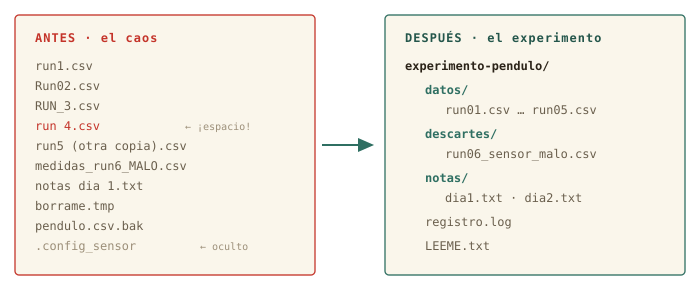

# Ficheros: tocar sin romper {#sec-cap02}

::: {.lede}
En la primera sesión aprendiste a mirar: dónde estás, qué hay, cómo
moverte. Hoy los ficheros dejan de ser intocables: vas a leerlos,
crearlos, copiarlos, moverlos y — por primera vez — destruirlos. Con
red de seguridad, porque en esta casa el borrado no tiene papelera.
:::

::: {.chapmeta}
⏱ **2–3 h** con ejercicios · requisitos: **capítulo 1** · máquina: **tu Linux de diario**
:::

::: {.objetivos}
**Al terminar esta sesión sabrás**

- Mirar dentro de cualquier fichero de texto con `cat`, `less`, `head` y `tail`, sin abrir ningún programa gráfico.
- Crear estructura con `mkdir` y copiar, mover y renombrar con `cp` y `mv` — y por qué mover y renombrar son el mismo gesto.
- Borrar con `rm` sabiendo exactamente por qué no perdona, y qué hacer antes de pulsar Intro.
- Seleccionar familias enteras de ficheros con comodines (`*`, `?`), entendiendo quién los expande de verdad.
- Localizar cualquier cosa con `find`.
- Editar ficheros en la terminal con `nano`, y estrenar tus *dotfiles* con un alias propio.
:::

## Mirar dentro sin miedo {#sec-mirar}

Tienes desde la sesión pasada un fichero de medidas esperando en
`~/Descargas`. Sabes llegar hasta él; hoy, por fin, vas a abrirlo. El
gesto más directo es `cat` (*concatenate*), que vuelca el contenido
completo en la pantalla:

```terminal
marcos@portatil:~$ cd ~/Descargas
marcos@portatil:~/Descargas$ cat pendulo_medidas.csv
medida,longitud_m,periodo_s,incertidumbre_s
1,0.50,1.42,0.02
2,0.50,1.40,0.02
3,0.50,1.43,0.02
```

Para veinte líneas, perfecto. Pero un fichero de adquisición real puede
tener veinte millones, y `cat` las escupiría todas. Para eso existe
`less`: un visor por páginas — exactamente el mismo que usa `man`, así
que ya te sabes sus teclas: <kbd>↑</kbd>/<kbd>↓</kbd> y
<kbd>Espacio</kbd> para avanzar, <kbd>/</kbd> para buscar,
<kbd>q</kbd> para salir.

```terminal
marcos@portatil:~/Descargas$ less pendulo_medidas.csv
```

Y muchas veces no quieres el fichero entero, sino un vistazo: `head`
enseña las primeras líneas y `tail` las últimas — la forma más rápida
de comprobar cómo empieza y cómo acaba una tanda de medidas:

```terminal
marcos@portatil:~/Descargas$ head -3 pendulo_medidas.csv
medida,longitud_m,periodo_s,incertidumbre_s
1,0.50,1.42,0.02
2,0.50,1.40,0.02
marcos@portatil:~/Descargas$ tail -2 pendulo_medidas.csv
19,1.10,2.10,0.02
20,1.10,2.12,0.02
```

La opción `-3` es el número de líneas. Fíjate en que acabas de leer un
fichero de datos con cuatro herramientas distintas sin abrir una sola
ventana. ¿Podías haberle hecho doble clic? Claro. Pero el doble clic no
escala: cuando tengas doscientos ficheros de un barrido de
simulaciones, `head` seguirá costando un segundo.

::: {.por-dentro}
**◉ Por dentro · Por qué todo esto funciona con cualquier fichero**

Para Linux un fichero es solo una secuencia de bytes con nombre. No hay
ficheros «de Word» o «de Excel» a nivel del sistema: la extensión
`.csv` es una pista para humanos, no una regla. Por eso `cat` y `less`
abren cualquier cosa — aunque si abres un binario (una foto, un
ejecutable) verás caracteres sin sentido: los bytes no eran texto. En
el capítulo 3 exprimirás esta idea: si todo es texto o bytes, todo se
puede encadenar.
:::

## Crear: `mkdir` y `touch` {#sec-crear}

Un experimento ordenado empieza por su estructura de carpetas. `mkdir`
(*make directory*) crea directorios, y con la opción `-p` crea de una
vez toda una ruta con sus niveles intermedios:

```terminal
marcos@portatil:~$ mkdir fisica
marcos@portatil:~$ mkdir -p fisica/practicas/optica/datos
marcos@portatil:~$ ls fisica/practicas
optica
```

Su compañero menor es `touch`, que crea un fichero vacío (o actualiza
la fecha de uno existente). Útil para dejar un marcador o preparar un
fichero de notas:

```terminal
marcos@portatil:~$ touch fisica/practicas/optica/notas.txt
```

## Copiar y mover: `cp` y `mv` {#sec-cp-mv}

Los dos siguen la misma gramática de tres piezas del capítulo 1:
programa, origen, destino.

```terminal
marcos@portatil:~/Descargas$ cp pendulo_medidas.csv copia_seguridad.csv
marcos@portatil:~/Descargas$ mv copia_seguridad.csv ~/fisica/
marcos@portatil:~/Descargas$ ls ~/fisica
copia_seguridad.csv  practicas
```

`cp` (*copy*) duplica: el original no se toca. `mv` (*move*) traslada:
solo queda el destino. Y aquí viene el gesto que confunde a todo el
mundo la primera vez: **renombrar es mover**. No hay comando
«rename» — mover un fichero a otro nombre dentro de la misma carpeta
*es* renombrarlo:

```terminal
marcos@portatil:~/fisica$ mv copia_seguridad.csv pendulo_v1.csv
```

Para copiar carpetas enteras con todo lo que contienen, `cp` necesita
la opción `-r` (*recursive*): `cp -r practicas practicas_backup`.

{#fig-cpmvrm fig-alt="Esquema comparando cp, que deja dos ficheros, mv, que deja solo el destino, y rm, que no deja ninguno"}

::: {.truco}
**✚ Truco · El tabulador vale doble aquí**

En `cp` y `mv` casi todo son nombres de ficheros: territorio ideal del
tabulador. `mv pen`<kbd>Tab</kbd> completa el origen; y si el destino
es una carpeta, <kbd>Tab</kbd> también la completa. Menos teclear,
cero erratas — y recuerda: si Tab no completa, el fichero no está
donde crees. Esa comprobación gratuita evita la mitad de los `mv`
arrepentidos.
:::

## Borrar: el comando sin papelera {#sec-rm}

Llegó el primer comando con consecuencias. `rm` (*remove*) borra
ficheros, y `rm -r` borra carpetas con todo lo que contengan:

```terminal
marcos@portatil:~/fisica$ rm pendulo_v1.csv
marcos@portatil:~/fisica$ ls
practicas
```

Ahora lee esto despacio, porque es de las frases importantes del curso:
**`rm` no pasa por la papelera**. No hay icono desde el que restaurar,
no hay «deshacer». El espacio se marca como libre y el sistema lo
reutilizará cuando quiera. En el escritorio llevas años protegido por
la papelera del gestor de archivos; en la terminal, la protección eres
tú.

Tu red de seguridad son dos costumbres y una opción:

- **Antes de un `rm` con comodines, ensaya con `ls`.** El mismo patrón
  que vas a borrar, pero listándolo: `ls run*.csv`. Lo que te enseñe
  `ls` es exactamente lo que borrará `rm`. Es tu predicción teórica
  antes del experimento irreversible.
- **En `rm -r`, ruta completa y tabulador**, nunca escrita a mano.
- La opción `-i` (*interactive*) pide confirmación fichero a fichero:
  `rm -i *.tmp`.

::: {.aviso}
**△ Cuidado · La papelera gráfica sí perdona; `rm` no**

Si arrastras un fichero a la papelera del escritorio de Mint, puedes
recuperarlo: esa es la diferencia real entre las dos vías, y no es
menor. Mientras aprendes, borra en tus carpetas de prácticas, no en
tus datos reales — y recuerda que la regla del curso es que lo
destructivo de verdad (particionar, formatear) vivirá siempre en la
máquina virtual del bloque C.
:::

## Comodines: hablar de familias enteras {#sec-comodines}

Hasta ahora has nombrado los ficheros de uno en uno. Los **comodines**
(*wildcards*) nombran familias: `*` significa «cualquier cosa, incluso
nada» y `?` «exactamente un carácter». `run*.csv` son todos los CSV que
empiecen por `run`; `run?.csv` solo los de un dígito.

```terminal
marcos@portatil:~/Descargas$ ls run*.csv
run1.csv  run2.csv  run3.csv
marcos@portatil:~/Descargas$ cp run*.csv ~/fisica/practicas/optica/datos/
```

Una sola línea acaba de copiar toda una serie de medidas. Este es el
momento en que la terminal empieza a pagar el peaje de aprenderla: lo
que en el gestor de archivos serían tres viajes de ratón (o treinta,
con más series), aquí es una orden.

{#fig-globbing fig-alt="Esquema: el patrón run asterisco punto csv pasa por el shell, que lo convierte en una lista de nombres antes de ejecutar ls"}

::: {.por-dentro}
**◉ Por dentro · El asterisco nunca llega al programa**

La expansión (*globbing*) la hace el **shell**, antes de ejecutar
nada: cuando `ls` arranca, ya recibe `run1.csv run2.csv run3.csv` como
argumentos, y no sabe que hubo un asterisco. Por eso los comodines
funcionan igual con *cualquier* comando, incluso con programas que
escribas tú — nadie tuvo que programarlos. Y por eso, si el patrón no
casa con nada, el programa recibe el asterisco tal cual y suele
protestar: el shell no tenía nada que expandir.
:::

::: {.aviso}
**△ Cuidado · El espacio asesino**

`rm run*.csv` borra la familia `run…`. Pero `rm run* .csv` — con un
espacio colado — son *dos* argumentos: la familia `run*` entera y un
fichero llamado `.csv`. El shell expande y `rm` obedece sin preguntar.
Es el accidente clásico de esta sesión: antes de cualquier `rm` con
patrón, ensáyalo con `ls`. Siempre.
:::

## Encontrar: `find` {#sec-find}

`ls` enseña lo que hay *aquí*; `find` busca *por todo el árbol*. Sus
argumentos son un punto de partida y condiciones:

```terminal
marcos@portatil:~$ find ~/fisica -name "*.csv"
/home/marcos/fisica/practicas/optica/datos/run1.csv
/home/marcos/fisica/practicas/optica/datos/run2.csv
/home/marcos/fisica/practicas/optica/datos/run3.csv
marcos@portatil:~$ find ~/fisica -type d
/home/marcos/fisica
/home/marcos/fisica/practicas
/home/marcos/fisica/practicas/optica
/home/marcos/fisica/practicas/optica/datos
```

`-name` filtra por nombre (fíjate en las comillas: protegen el `*`
para que lo expanda `find` y no el shell — acabas de usar lo que
aprendiste en la caja anterior). `-type d` pide solo directorios;
`-mtime -1`, solo lo modificado en el último día. En el capítulo 3,
`find` se convertirá en el generador de listas que alimenta a todos
los demás comandos.

## Editar: `nano` (y la verdad sobre `vim`) {#sec-nano}

Leer y organizar está bien; en algún momento hay que *escribir*. El
editor de terminal del curso es `nano`, por una razón honesta: se
aprende en un minuto y está en todas partes.

```terminal
marcos@portatil:~/fisica$ nano practicas/optica/notas.txt
```

Se abre un editor a pantalla completa. Escribes como en cualquier
sitio, y las dos teclas que importan están siempre rotuladas abajo:
<kbd>Ctrl</kbd>+<kbd>O</kbd> guarda (*write Out*, confirma el nombre
con <kbd>Intro</kbd>) y <kbd>Ctrl</kbd>+<kbd>X</kbd> sale. El símbolo
`^` de la barra inferior significa <kbd>Ctrl</kbd>.

¿Y para qué sirve un editor de terminal existiendo el editor gráfico
de Mint? Hoy, para poco. Pero dentro de unas sesiones estarás dentro de
un servidor remoto donde **no hay ventanas**: allí `nano` no es una
opción retro, es la única mesa de trabajo. Lo aprendes hoy, en casa,
para que ese día sea trámite.

::: {.historia}
**◷ Historia · Por qué `vim` asusta (y por qué existe)**

El editor que verás mencionado con reverencia es `vim`. Su antepasado
`ed` (1969) se diseñó para teletipos: sin pantalla, editar era dar
órdenes a ciegas línea a línea — con papel, refrescar la vista costaba
tinta. Cuando llegaron las pantallas nació `vi` (*visual*, 1976), que
arrastra ese ADN: tiene *modos* — uno para órdenes y otro para
escribir — y por eso millones de personas han tecleado texto y visto
cómo el editor lo interpretaba como comandos. Es potentísimo y quizá
lo ames algún día; este curso solo te pide saber salir si caes dentro
por accidente: <kbd>Esc</kbd> y luego `:q!` e <kbd>Intro</kbd>. Ya
formas parte del club de los que saben salir de vim.
:::

## Tus primeros *dotfiles* {#sec-dotfiles}

En el capítulo 1 descubriste con `ls -a` los ficheros ocultos de tu
casa: los que empiezan por punto, los *dotfiles*. No están ocultos por
secretos, sino por higiene: son configuración, y estarían en medio
todo el día. Hoy vas a editar el más importante: `.bashrc`, el fichero
que bash lee cada vez que abres una terminal.

```terminal
marcos@portatil:~$ nano .bashrc
```

Baja hasta el final (con <kbd>Ctrl</kbd>+<kbd>V</kbd> avanzas página a
página) y añade esta línea:

```terminal
alias ll='ls -lh'
```

Guarda y sal. Un **alias** es un atajo: a partir de ahora `ll`
significará `ls -lh`. Para que la terminal actual se entere sin
cerrarla, recarga la configuración:

```terminal
marcos@portatil:~$ source ~/.bashrc
marcos@portatil:~$ ll
total 44K
drwxr-xr-x 2 marcos marcos 4,0K ago 24 10:12 Descargas
drwxr-xr-x 3 marcos marcos 4,0K ago 24 10:15 fisica
```

Acabas de configurar tu sistema editando un fichero de texto. Ese es
el modo Linux de configurar *todo* — el capítulo 4 te enseñará cuántas
cosas de tu máquina son exactamente esto: un fichero de texto en el
sitio correcto.

{#fig-ramac fig-alt="Pila de platos del disco duro IBM RAMAC en un museo" width="60%"}

## Práctica: poner orden en el laboratorio {#sec-practica-2}

Sesión de campo. Te ha llegado el directorio de un experimento tal
como quedó el último día: duplicados, nombres con espacios, una serie
(«run», en la jerga del laboratorio — así se llaman los ficheros)
inservible y ficheros temporales. Tu misión: dejarlo presentable
usando todo lo de esta sesión.

::: {.content-visible when-format="html"}
Arranca tu cuaderno (`script sesion02.log`) y descarga
[`experimento-desordenado.zip`](../datos/cap02/experimento-desordenado.zip){download="experimento-desordenado.zip"}.
Extráelo como prefieras — doble clic en el gestor de archivos vale:
descomprimir es una de esas cosas que la vía gráfica hace
perfectamente bien. Te quedará una carpeta `experimento-pendulo` en
`~/Descargas`.
:::

::: {.content-visible when-format="pdf"}
Arranca tu cuaderno (`script sesion02.log`) y descarga
`experimento-desordenado.zip` desde esta misma sección en la versión
web del curso. Extráelo como prefieras — doble clic en el gestor de
archivos vale: descomprimir es una de esas cosas que la vía gráfica
hace perfectamente bien. Te quedará una carpeta `experimento-pendulo`
en `~/Descargas`.
:::

{#fig-orden fig-alt="Dos paneles: la lista caótica de ficheros original y la estructura final organizada en datos, descartes y notas"}

::: {.ejercicio}
**Ejercicio 2.1 · Reconocimiento**

Entra en la carpeta y haz inventario completo — incluido lo oculto.
Después mira dentro de `registro.log` y de las notas: ¿qué serie está
mal y por qué? ¿Qué dos ficheros son en realidad el mismo?

:::: {.solucion}
::: {.callout-tip collapse="true" title="Solución razonada"}
`cd ~/Descargas/experimento-pendulo`, `ls -a` (aparece
`.config_sensor`), y `cat registro.log` o `less` sobre las notas. El
log canta: `ERROR sensor congelado en 45.0 (run6)` — y `head
medidas_run6_MALO.csv` lo confirma: todos los ángulos valen ~45. Las
notas del día 2 confiesan que `run 4.csv` y `run5 (otra copia).csv`
son la misma serie guardada dos veces.

**Por qué así** — Antes de mover o borrar nada, un físico lee el
cuaderno del experimento. `head` te deja *ver* el fallo del sensor en
los datos sin abrir ningún programa: eso es diagnosticar desde la
terminal.
:::
::::
:::

::: {.ejercicio}
**Ejercicio 2.2 · Copia de seguridad primero**

Antes de tocar nada: haz una copia completa de la carpeta, llamada
`experimento-pendulo-original`. Comprueba que la copia existe y tiene
lo mismo.

:::: {.solucion}
::: {.callout-tip collapse="true" title="Solución razonada"}
Desde `~/Descargas`: `cp -r experimento-pendulo
experimento-pendulo-original`, y comprobación con `ls
experimento-pendulo-original` (o `ls -a`, si quieres verificar que el
oculto también viajó — sí: `-r` copia todo).

**Por qué así** — Regla de oro antes de reorganizar datos reales:
copia primero, ordena después. `cp -r` convierte «espero no
equivocarme» en «da igual si me equivoco». El coste es un comando; el
seguro, total.
:::
::::
:::

::: {.ejercicio}
**Ejercicio 2.3 · Estructura**

Dentro de `experimento-pendulo`, crea de una sola orden la estructura
`datos/`, `descartes/` y `notas/`.

:::: {.solucion}
::: {.callout-tip collapse="true" title="Solución razonada"}
`mkdir datos descartes notas` — `mkdir` acepta varios argumentos y los
crea todos. (También valía tres `mkdir` seguidos; y si hubieras
querido niveles anidados, `-p`.)

**Por qué así** — Un comando, varios argumentos: la gramática del
capítulo 1 trabajando para ti. La estructura antes que el contenido:
primero las estanterías, luego los libros.
:::
::::
:::

::: {.ejercicio}
**Ejercicio 2.4 · La serie, en limpio**

Lleva las cinco series buenas a `datos/` con nombres uniformes
`run01.csv` … `run05.csv` (recuerda las comillas para los nombres con
espacios), y la serie mala a `descartes/` con un nombre que avise:
`run06_sensor_malo.csv`.

:::: {.solucion}
::: {.callout-tip collapse="true" title="Solución razonada"}
Cinco `mv` con renombrado incluido — mover y renombrar son el mismo
gesto:

`mv run1.csv datos/run01.csv` ·
`mv Run02.csv datos/run02.csv` ·
`mv RUN_3.csv datos/run03.csv` ·
`mv "run 4.csv" datos/run04.csv` ·
`mv "run5 (otra copia).csv" datos/run05.csv` ·
`mv medidas_run6_MALO.csv descartes/run06_sensor_malo.csv`

**Por qué así** — Las comillas protegen los espacios y paréntesis: sin
ellas, `run 4.csv` serían dos argumentos y `mv` protestaría (o algo
peor). ¿Tedioso uno a uno? Sí — el renombrado *en lote* de verdad
llega cuando sepas encadenar comandos: esta molestia de hoy es la
motivación del capítulo 3. Y fíjate: `run01` y no `run1`, para que el
orden alfabético coincida con el numérico cuando haya más de nueve.
:::
::::
:::

::: {.ejercicio}
**Ejercicio 2.5 · Limpieza fina**

Mueve las notas a `notas/` (renombrándolas a `dia1.txt` y `dia2.txt`),
y borra lo que no aporta nada: el temporal y el `.bak`. Ensaya el
borrado con `ls` antes de ejecutarlo.

:::: {.solucion}
::: {.callout-tip collapse="true" title="Solución razonada"}
`mv "notas dia 1.txt" notas/dia1.txt` y `mv notas_dia2.txt
notas/dia2.txt`. Para el borrado, primero el ensayo: `ls *.tmp *.bak`
— lista exactamente `borrame.tmp` y `pendulo.csv.bak`, nada más. Ahora
sí: `rm *.tmp *.bak`.

**Por qué así** — El par `ls`-luego-`rm` con el mismo patrón es la red
de seguridad de esta sesión: la predicción antes de la medida
irreversible. Si el `ls` hubiera enseñado algo inesperado, habrías
corregido el patrón sin coste. `calibracion.txt` y `temperatura_lab.csv`
se quedan: son datos del experimento, no basura.
:::
::::
:::

::: {.ejercicio}
**Ejercicio 2.6 · El censo final**

Sin moverte de `experimento-pendulo`: obtén con un solo comando la
lista de todos los `.csv` que quedan, estén en la subcarpeta que
estén. ¿Cuántos hay? ¿Coincide con lo esperado?

:::: {.solucion}
::: {.callout-tip collapse="true" title="Solución razonada"}
`find . -name "*.csv"` — deben salir siete: cinco en `datos/`, uno en
`descartes/` y `temperatura_lab.csv` en la raíz de la carpeta. (Las
comillas en `"*.csv"`: el patrón es para `find`, no para el shell.)

**Por qué así** — `ls` mira una carpeta; `find` recorre el árbol
entero. Ese censo final contra lo esperado es el control de calidad
del experimentalista: no «creo que está ordenado», sino «lo he
contado». Cierra tu cuaderno con `exit` y guarda `sesion02.log`.
:::
::::
:::

## Autocomprobación {#sec-quiz-2}

::: {.content-visible when-format="html"}

Marca una respuesta por pregunta; la corrección es inmediata.

```{=html}
<div class="quiz" id="quiz-cap02">
  <div class="qz"><p class="qq" data-n="1">Quieres cambiar el nombre de <code>datos.csv</code> a <code>run01.csv</code>. ¿Qué comando usas?</p>
    <label><input type="radio" name="z1" value="a"><span><code>cp datos.csv run01.csv</code></span></label>
    <label><input type="radio" name="z1" value="b"><span><code>mv datos.csv run01.csv</code></span></label>
    <label><input type="radio" name="z1" value="c"><span><code>rename datos.csv run01.csv</code></span></label>
    <div class="fb good"><b>Correcto.</b> Renombrar es mover al nuevo nombre: mismo gesto, mismo comando.</div>
    <div class="fb bad"><b>No exactamente.</b> <code>cp</code> te dejaría dos ficheros, y el comando estándar de renombrar es precisamente <code>mv</code>: mover y renombrar son lo mismo.</div>
  </div>
  <div class="qz"><p class="qq" data-n="2">Borras un fichero con <code>rm</code> y te arrepientes al instante. ¿Qué puedes hacer?</p>
    <label><input type="radio" name="z2" value="a"><span>abrir la papelera y restaurarlo</span></label>
    <label><input type="radio" name="z2" value="b"><span>pulsar Ctrl+Z en la terminal</span></label>
    <label><input type="radio" name="z2" value="c"><span>nada razonable: <code>rm</code> no pasa por la papelera</span></label>
    <div class="fb good"><b>Correcto.</b> Por eso la red de seguridad va <em>antes</em>: ensayar con <code>ls</code>, usar <code>-i</code>, y practicar en carpetas de prueba.</div>
    <div class="fb bad"><b>No exactamente.</b> La papelera es cosa del gestor gráfico, y Ctrl+Z no deshace comandos ya ejecutados. <code>rm</code> es definitivo: la protección es ensayar antes con <code>ls</code>.</div>
  </div>
  <div class="qz"><p class="qq" data-n="3">En <code>ls run*.csv</code>, ¿quién convierte <code>run*.csv</code> en la lista de nombres?</p>
    <label><input type="radio" name="z3" value="a"><span>el shell, antes de ejecutar <code>ls</code></span></label>
    <label><input type="radio" name="z3" value="b"><span>el propio <code>ls</code>, al arrancar</span></label>
    <label><input type="radio" name="z3" value="c"><span>la terminal, al dibujar la línea</span></label>
    <div class="fb good"><b>Correcto.</b> <code>ls</code> nunca ve el asterisco: recibe la lista ya expandida. Por eso los comodines funcionan con cualquier programa.</div>
    <div class="fb bad"><b>No exactamente.</b> La expansión es trabajo del shell, antes de ejecutar nada — <code>ls</code> recibe los nombres ya listados. Revisa la figura del globbing.</div>
  </div>
  <div class="qz"><p class="qq" data-n="4">Quieres copiar la carpeta <code>practicas</code> con todo su contenido. ¿Qué necesitas?</p>
    <label><input type="radio" name="z4" value="a"><span><code>cp practicas backup</code></span></label>
    <label><input type="radio" name="z4" value="b"><span><code>cp -r practicas backup</code></span></label>
    <label><input type="radio" name="z4" value="c"><span><code>mv practicas backup</code></span></label>
    <div class="fb good"><b>Correcto.</b> <code>-r</code> (recursivo) hace que <code>cp</code> baje por toda la carpeta. Sin él, <code>cp</code> se niega a copiar directorios.</div>
    <div class="fb bad"><b>No exactamente.</b> Para carpetas hace falta <code>cp -r</code> (recursivo); <code>mv</code> la movería en vez de copiarla.</div>
  </div>
  <div class="qz"><p class="qq" data-n="5">Estás dentro de <code>nano</code> y quieres guardar y salir. La secuencia es…</p>
    <label><input type="radio" name="z5" value="a"><span><kbd>Ctrl</kbd>+<kbd>O</kbd>, <kbd>Intro</kbd>, <kbd>Ctrl</kbd>+<kbd>X</kbd></span></label>
    <label><input type="radio" name="z5" value="b"><span><kbd>Esc</kbd> y luego <code>:q!</code></span></label>
    <label><input type="radio" name="z5" value="c"><span>cerrar la ventana de la terminal</span></label>
    <div class="fb good"><b>Correcto.</b> <code>^O</code> guarda (confirmas el nombre con Intro) y <code>^X</code> sale. Está siempre rotulado en la barra inferior.</div>
    <div class="fb bad"><b>No exactamente.</b> <code>Esc :q!</code> es el gesto de escape de <em>vim</em> (y además descarta cambios). En nano todo está rotulado abajo: <code>^O</code> guarda, <code>^X</code> sale.</div>
  </div>
  <div class="qz"><p class="qq" data-n="6">¿Por qué <code>find . -name "*.csv"</code> lleva comillas en el patrón?</p>
    <label><input type="radio" name="z6" value="a"><span>por estética: sin ellas funciona igual siempre</span></label>
    <label><input type="radio" name="z6" value="b"><span>para que el asterisco le llegue a <code>find</code>, y no lo expanda antes el shell</span></label>
    <label><input type="radio" name="z6" value="c"><span>porque los nombres con espacios lo exigen</span></label>
    <div class="fb good"><b>Correcto.</b> Sin comillas, el shell expandiría <code>*.csv</code> contra la carpeta actual antes de ejecutar <code>find</code>, y el resultado dependería de dónde estés.</div>
    <div class="fb bad"><b>No exactamente.</b> Es lo del globbing al revés: aquí el patrón es <em>para</em> <code>find</code>, así que hay que protegerlo del shell con comillas para que llegue intacto.</div>
  </div>
</div>
<script>
(function(){
  const OK = {z1:"b", z2:"c", z3:"a", z4:"b", z5:"a", z6:"b"};
  document.querySelectorAll("#quiz-cap02 .qz input").forEach(i => {
    i.addEventListener("change", () => {
      const qz = i.closest(".qz");
      qz.classList.remove("ok","ko");
      qz.classList.add(i.value === OK[i.name] ? "ok" : "ko");
    });
  });
})();
</script>
```

:::

:::: {.content-visible when-format="pdf"}

Responde de memoria; las respuestas están al final del capítulo.

1.  Quieres cambiar el nombre de `datos.csv` a `run01.csv`. ¿Qué comando usas?
    a)  `cp datos.csv run01.csv`
    b)  `mv datos.csv run01.csv`
    c)  `rename datos.csv run01.csv`

2.  Borras un fichero con `rm` y te arrepientes al instante. ¿Qué puedes hacer?
    a)  abrir la papelera y restaurarlo
    b)  pulsar Ctrl+Z en la terminal
    c)  nada razonable: `rm` no pasa por la papelera

3.  En `ls run*.csv`, ¿quién convierte `run*.csv` en la lista de nombres?
    a)  el shell, antes de ejecutar `ls`
    b)  el propio `ls`, al arrancar
    c)  la terminal, al dibujar la línea

4.  Quieres copiar la carpeta `practicas` con todo su contenido. ¿Qué necesitas?
    a)  `cp practicas backup`
    b)  `cp -r practicas backup`
    c)  `mv practicas backup`

5.  Estás dentro de `nano` y quieres guardar y salir. La secuencia es…
    a)  Ctrl+O, Intro, Ctrl+X
    b)  Esc y luego `:q!`
    c)  cerrar la ventana de la terminal

6.  ¿Por qué `find . -name "*.csv"` lleva comillas en el patrón?
    a)  por estética: sin ellas funciona igual siempre
    b)  para que el asterisco le llegue a `find`, y no lo expanda antes el shell
    c)  porque los nombres con espacios lo exigen

::::

::: {.solucion-final}
**Autocomprobación (test de la sección 2.10)** — Respuestas: 1 b · 2 c · 3 a · 4 b · 5 a · 6 b.
:::

::: {.proxima}
**La próxima sesión**

Hoy has renombrado cinco series de medidas a mano y te ha sabido a
poco elegante — bien: esa molestia es la puerta del capítulo 3, donde
los comandos dejan de trabajar solos y empiezan a encadenarse, de modo
que la salida de uno se convierte en la entrada del siguiente. Ahí
aparecen `grep`, `sort` y las tuberías. Harás el análisis completo de
un registro de adquisición sin abrir Python, y aprenderás cuándo sí
conviene abrirlo. Guarda `sesion02.log`: ya tienes dos medidas en tu
cuaderno.
:::

::: {.pie-piloto}
cap. 2 v0.1 · piloto — anota tiempo real invertido, dudas y erratas junto a tu `sesion02.log`
:::
