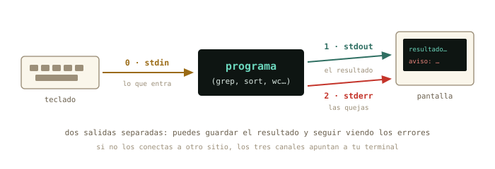
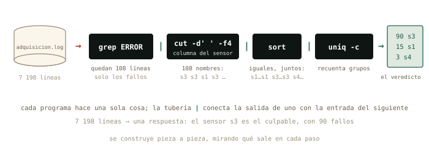

# El flujo de datos {#sec-cap03}

::: {.lede}
Esta noche tu experimento ha generado un registro de 7 198 líneas.
Nadie va a leerlas. Hoy aprendes cómo circula el texto entre programas:
de dónde sale, adónde va, cómo se guarda en un fichero y cómo pasa de
un programa a otro. Es fontanería, y como toda fontanería se ve poco —
pero está debajo de todo lo que harás después: guardar la salida de
una simulación, buscar un error en un registro, leer un comando ajeno
y entenderlo. El capítulo baja hasta el fondo del mecanismo; hasta
dónde bajas tú, lo decides tú.
:::

::: {.chapmeta}
⏱ **2–3 h** con ejercicios · requisitos: **capítulos 1 y 2** · máquina: **tu Linux de diario**
:::

::: {.objetivos}
**Al terminar esta sesión sabrás**

- Qué son los tres canales de todo programa — stdin, stdout, stderr — y por qué esa separación es una idea brillante.
- Guardar la salida de cualquier programa — tu simulación incluida — en un fichero con `>`, sin perder los errores por el camino.
- Los cuatro gestos de tubería que un físico usa a diario: `> fichero`, `| less`, `| grep` y `| tail`.
- Leer con soltura cualquier comando encadenado que te encuentres en una documentación, en un foro o en la respuesta de una IA.
- Por dentro, para quien quiera bajar al taller: cómo cinco filtros — `wc`, `grep`, `sort`, `uniq`, `cut` — resuelven un análisis entero, construido pieza a pieza.
- Decidir con criterio qué va en una tubería y qué va en Python.
:::

## Los tres chorros {#sec-canales}

Todo programa de terminal, sin excepción, nace conectado a tres
canales. Por uno le entra texto: la **entrada estándar** (*stdin*).
Por otro escupe sus resultados: la **salida estándar** (*stdout*). Y
por el tercero protesta: la **salida de errores** (*stderr*). Si no
dices lo contrario, los tres apuntan a tu terminal: stdin al teclado,
y las dos salidas a la pantalla.

{#fig-canales fig-alt="Esquema de un programa con su entrada estándar desde el teclado y sus dos salidas, resultado y errores, hacia la pantalla"}

¿Por qué *dos* salidas? Piensa en el log de esta noche: si el programa
de adquisición mezclara las medidas y los avisos de error en el mismo
chorro, guardar los datos limpios sería un suplicio. Separados, puedes
enviar cada uno a un sitio. Ese es exactamente el siguiente paso.

## Redirigir: `>` y `>>` {#sec-redirigir}

El símbolo `>` desvía la salida estándar de la pantalla a un fichero.
Descarga el registro de esta noche (está al final del capítulo, en la
práctica) y prueba:

```terminal
marcos@portatil:~/Descargas$ grep ERROR adquisicion.log > errores.txt
marcos@portatil:~/Descargas$ head -2 errores.txt
2026-08-18 10:03:00 ERROR s3 sin respuesta del sensor
2026-08-18 10:03:02 ERROR s3 sin respuesta del sensor
```

`grep` (lo conoces en un momento) no imprimió nada en pantalla: su
stdout fue a parar a `errores.txt`. Dos reglas de seguridad:

- `>` **sobrescribe** el fichero de destino sin preguntar. Su hermano
  `>>` **añade** al final sin destruir lo anterior.
- Los errores (stderr) *no* viajan con `>`: siguen saliendo por
  pantalla, que es donde quieres verlos. Para capturarlos también
  existe `2>` — el `2` es el número del canal de la figura.

{#fig-redireccion fig-alt="El stdout de grep desviado con el símbolo mayor que hacia el fichero errores.txt, mientras el stderr sigue llegando a la pantalla"}

```terminal
marcos@portatil:~/Descargas$ echo "Informe de la noche" > informe.txt
marcos@portatil:~/Descargas$ echo "generado el 19 de agosto" >> informe.txt
marcos@portatil:~/Descargas$ cat informe.txt
Informe de la noche
generado el 19 de agosto
```

`echo`, que conociste el primer día como un juguete, acaba de revelar
su oficio real: fabricar líneas de texto para tus ficheros.

## La tubería: `|` {#sec-tuberia}

Y aquí está la idea central del capítulo. Si `>` conecta un programa
con un fichero, la **tubería** `|` conecta un programa con *otro
programa*: el stdout del de la izquierda se convierte en el stdin del
de la derecha. Sin ficheros intermedios, sin pasos manuales.

```terminal
marcos@portatil:~/Descargas$ grep ERROR adquisicion.log | wc -l
108
```

Léelo como una cadena de montaje: `grep` filtra las líneas con
`ERROR`, y su salida — en vez de inundar la pantalla — entra en `wc -l`
(*word count*, opción *lines*), que solo cuenta. De 7 198 líneas a un
número: esta noche hubo 108 fallos.

{#fig-pipe fig-alt="El stdout de grep entra por una tubería en el stdin de wc, y solo el resultado final, 108, llega a la pantalla"}

::: {.historia}
**◷ Historia · Una manguera de jardín en Bell Labs**

La tubería tiene padre: Doug McIlroy, jefe del departamento donde
nació Unix. En 1964 — cinco años *antes* de Unix — ya escribía en un
memorándum que los programas deberían acoplarse «como los tramos de
una manguera de jardín: se enrosca otro segmento cuando hace falta
tratar el agua de otra manera». Estuvo casi una década insistiendo,
hasta que una noche de 1973 Ken Thompson cedió, la implementó en el
kernel, y en una semana el equipo reescribió medio sistema en forma de
filtros encadenables. De esa semana sale la **filosofía Unix** que
estás usando ahora: haz que cada programa haga una sola cosa bien, y
que todos hablen el mismo idioma — texto.
:::

## Lo que usarás de verdad {#sec-uso-real}

Seamos francos antes de bajar al mecanismo: **un físico no construye
tuberías largas.** Lo que sí hace, todos los días de su vida
profesional, son cuatro gestos de fontanería básica — y este es el
momento de dejarlos grabados:

```terminal
marcos@portatil:~/fisica$ python3 simula.py > resultados.txt
marcos@portatil:~/fisica$ ls -l /usr/share | less
marcos@portatil:~/fisica$ history | grep ssh
marcos@portatil:~/fisica$ tail -3 resultados.txt
```

Uno por uno. **La salida de tu programa, a un fichero** (`>`): cuando
la simulación escupe diez mil líneas no quieres verlas, quieres
guardarlas — y con un `2> errores.txt` detrás, las quejas van a otro
fichero para leerlas en calma. **Una salida larga, paginada**
(`| less`): cualquier comando que desborde la pantalla se lee con el
visor de `man` del capítulo 1 — su `/` para buscar, su `q` para
salir. **Buscar dentro de una salida** (`| grep`): el gesto más
frecuente de toda la terminal — ¿estaba ese comando en mi historial?,
¿aparece «usb» en los mensajes del sistema? En los próximos capítulos
verás `ps aux | grep`, `lsblk | grep`, `apt list | grep`: siempre el
mismo enchufe. Y **solo el final** (`| tail`, o `tail fichero`): las
últimas líneas de un registro te dicen cómo acabó la cosa.

Con estos cuatro tienes el noventa por ciento del uso real. Lo que
sigue — la caja de herramientas y el análisis completo — es el
*mecanismo por dentro*. No hace falta dominarlo; hace falta haberlo
visto una vez, para que ningún comando encadenado te intimide cuando
lo leas en una documentación o te lo proponga una IA.

## La caja de herramientas {#sec-herramientas}

Bajamos al taller. Estos cinco filtros son las piezas clásicas de Unix
— las verás en scripts ajenos y en respuestas de IA más veces de las
que las teclearás. Todos leen texto por stdin (o de un fichero que les
des) y escriben texto por stdout — por eso encajan entre sí en
cualquier orden:

| Herramienta | Qué hace | La opción estrella |
|-------------|----------|--------------------|
| `wc` | cuenta | `-l` solo líneas |
| `grep PATRON` | deja pasar las líneas que contienen el patrón | `-c` cuenta en vez de mostrar; `-v` invierte: las que NO lo contienen |
| `sort` | ordena las líneas | `-n` numérico; `-r` al revés |
| `uniq` | colapsa líneas repetidas **adyacentes** | `-c` antepone cuántas veces |
| `cut` | recorta columnas | `-d' '` separador, `-f4` cuarto campo |

Y los que ya conoces, `head` y `tail`, también son filtros: al final
de una tubería sirven para quedarte con lo primero o lo último.

::: {.aviso}
**△ Cuidado · `uniq` solo ve lo adyacente**

`uniq` no busca repetidos por todo el fichero: colapsa líneas iguales
*consecutivas*. Sueltas por ahí, se le escapan. Por eso el dúo
inseparable es `sort | uniq`: primero juntas los iguales, luego
colapsas. Si algún día un recuento te sale absurdo, revisa si te
faltó el `sort`.
:::

## El análisis, pieza a pieza {#sec-analisis}

Una demostración completa, para ver el mecanismo entero funcionando
una sola vez. Vamos a responder la pregunta que un físico se hace ante
ese log: **¿qué sensor está fallando?** Y vamos a hacerlo con el método
profesional: construir la tubería paso a paso, mirando qué sale de
cada pieza antes de añadir la siguiente.

Primer paso: aislar los errores y *mirar* unas cuantas líneas.

```terminal
marcos@portatil:~/Descargas$ grep ERROR adquisicion.log | head -3
2026-08-18 10:03:00 ERROR s3 sin respuesta del sensor
2026-08-18 10:03:02 ERROR s3 sin respuesta del sensor
2026-08-18 10:03:04 ERROR s3 sin respuesta del sensor
```

El nombre del sensor es una columna. Contemos con los dedos sobre una
línea: fecha (1), hora (2), nivel (3), **sensor (4)**, mensaje (5 en
adelante). Segundo paso: recortar esa columna… y comprobar.

```terminal
marcos@portatil:~/Descargas$ grep ERROR adquisicion.log | cut -d' ' -f5 | head -3
sin
sin
sin
```

¿«sin»? Hemos cortado el campo 5 — la primera palabra del *mensaje* —
en vez del 4. Este tropiezo está puesto aquí a propósito, porque es el
error más típico del capítulo y porque el método lo ha cazado al
instante: **cada pieza nueva se comprueba con un `head` antes de
seguir**. Corregimos y ahora sí:

```terminal
marcos@portatil:~/Descargas$ grep ERROR adquisicion.log | cut -d' ' -f4 | head -3
s3
s3
s3
```

Tercer paso: de 108 nombres de sensor al recuento. Los iguales juntos
(`sort`), colapsados contando (`uniq -c`), y el ranking de mayor a
menor (`sort -nr`):

```terminal
marcos@portatil:~/Descargas$ grep ERROR adquisicion.log | cut -d' ' -f4 | sort | uniq -c | sort -nr
     90 s3
     15 s1
      3 s4
```

Veredicto en una línea: el sensor **s3** es el culpable con 90 fallos
(un conector flojo, apostaría un físico), s1 tuvo una racha corta de
lecturas corruptas y s4 apenas tres tropiezos. Este es el momento del
capítulo: acabas de interrogar a 7 198 líneas con una sola orden.

{#fig-tuberia fig-alt="Cadena de programas grep, cut, sort y uniq que transforma el log de 7198 líneas en un ranking de tres sensores"}

::: {.truco}
**✚ Truco · La tubería perfecta no se memoriza: se pregunta**

Que no te intimide la de cinco piezas: es el ejemplo más completo del
curso a propósito, para que veas el mecanismo entero de una vez. Tu
día a día serán tuberías de dos o tres — y si esta la has entendido,
ya sabes cómo funcionan todas. Y una verdad incómoda de toda CLI:
**olvidar las herramientas y sus opciones es normal**, hasta para los
veteranos. Está permitido pedirle a una inteligencia artificial que te
construya el comando («¿cómo cuento los ERROR por sensor en este
log?») — con la disciplina del físico: *lee* el comando que te
proponga pieza a pieza, verifica con `man` o `--help` lo que no
reconozcas, y jamás ejecutes a ciegas nada que lleve `sudo` o `rm`.
Tú ya sabes leer comandos: la IA propone, tú dispones. Este oficio lo
afinaremos en un anexo del curso.
:::

¿Y las temperaturas? El valor viene como `temp_C=22.66`: un `=` de
separador y `cut` lo recorta igual de bien. Máxima de la noche:

```terminal
marcos@portatil:~/Descargas$ grep INFO adquisicion.log | grep temp_C | cut -d'=' -f2 | sort -n | tail -1
25.00
```

25.00 justos — sospechosamente redondo. Cruza el dato: `grep -c WARN
adquisicion.log` da 357 avisos de «saturada» del sensor s2. El sensor
no midió 25.00: se quedó *clavado* en su tope mientras la temperatura
real seguía subiendo. Dos tuberías te acaban de dar el diagnóstico
completo del montaje: s3 se desconecta, s2 está derivando hasta
saturar.

::: {.por-dentro}
**◉ Por dentro · ¿Y aquel renombrado en lote?**

En el capítulo 2 renombraste cinco series a mano y prometimos algo
mejor. La verdad completa: las tuberías transforman *texto*, no
ejecutan una orden por cada fichero — para eso hacen falta los bucles
del shell, que viven en el anexo de *scripting*. Pero ya tienes la
mitad de la solución: `find . -name "*.csv"` te fabrica la **lista**
sobre la que un bucle trabajaría. La tubería prepara el trabajo; el
bucle lo remata. Todo llega.
:::

## ¿Y Python? {#sec-python}

La pregunta honesta: tú sabes NumPy — ¿no era más fácil en Python? El
mismo recuento, en Python legible:

```python
recuento = {}
for linea in open("adquisicion.log"):
    if " ERROR " in linea:
        sensor = linea.split()[3]
        recuento[sensor] = recuento.get(sensor, 0) + 1
for sensor, n in sorted(recuento.items(), key=lambda kv: -kv[1]):
    print(n, sensor)
```

Ocho líneas, mismo resultado (`90 s3 · 15 s1 · 3 s4` — comprobado).
Entonces, ¿cuándo cada cosa?

- **Tubería** para el *sistema*: mirar, contar, buscar, guardar.
  Preguntas de diez segundos cuya respuesta cabe en pantalla — y que
  funcionan idénticas en el superordenador al que te conectes por
  SSH, donde quizá no puedas instalar nada.
- **Python** para los *datos*: el análisis de verdad — estadística,
  ajustes, gráficas — y todo lo que mañana querrás repetir con otros
  datos. Un script se documenta y se cita; una tubería se teclea y se
  olvida.

Para un físico la frontera es clara: las tuberías son la herramienta
de *administrar* — registros, ficheros, comprobaciones — y Python la
de *investigar*. El análisis de este capítulo lo hemos hecho con
tuberías para enseñarte el mecanismo; en la vida real lo harías en
Python, y las tuberías las reservarías para llegar hasta el fichero,
comprobar que es el bueno y guardar el resultado.

## Práctica: la noche en el laboratorio {#sec-practica-3}

::: {.content-visible when-format="html"}
Arranca tu cuaderno (`script sesion03.log`) y descarga el registro de
la noche:
[`adquisicion.log`](../datos/cap03/adquisicion.log){download="adquisicion.log"}
(305 KB de texto — ni se te ocurra abrirlo con doble clic: para eso
está la sesión de hoy). Trabaja en `~/Descargas` o muévelo a tu
carpeta de física del capítulo 2.
:::

::: {.content-visible when-format="pdf"}
Arranca tu cuaderno (`script sesion03.log`) y descarga el registro de
la noche, `adquisicion.log`, desde esta misma sección en la versión
web del curso (305 KB de texto — ni se te ocurra abrirlo con doble
clic: para eso está la sesión de hoy). Trabaja en `~/Descargas` o
muévelo a tu carpeta de física del capítulo 2.
:::

Los ejercicios van en tres niveles. **Lo esencial** (3.1–3.4) es lo
que usarás de verdad: no te saltes ninguno. **El mecanismo** (3.5–3.6)
es para entender cómo encajan las piezas. **El reto** (3.7–3.9)
encadena tres y cuatro tuberías: es opcional y está ahí para quien
disfrute — hasta un informático se lo pensaría dos veces. Cada uno
lleva su pista: úsala sin remordimientos.

**Nivel 1 · Lo esencial**

::: {.ejercicio}
**Ejercicio 3.1 · Recuento de daños (sin tuberías)**

¿Cuántas líneas tiene el log en total? ¿Cuántas son `ERROR`, y cuántas
`WARN`? *Pista: `wc -l` para lo primero; para lo demás, `grep -c`
cuenta él solo — hoy todavía no necesitas ninguna tubería.*

:::: {.solucion}
::: {.callout-tip collapse="true" title="Solución razonada"}
`wc -l adquisicion.log` → 7 198. `grep -c ERROR adquisicion.log` →
108. `grep -c WARN adquisicion.log` → 357.

**Por qué así** — Tres preguntas, tres comandos de una sola pieza.
Muchos filtros llevan incorporados sus propios atajos (`-c` es
«cuenta en vez de mostrar»): antes de encadenar, mira si una pieza
sola ya resuelve.
:::
::::
:::

::: {.ejercicio}
**Ejercicio 3.2 · Tu primera tubería (una `|`)**

¿A qué hora exacta empezó a fallar el primer sensor, y cuál fue?
*Pista: el log viene en orden cronológico. Filtra los errores con
`grep` y quédate con la primera línea que salga (`head -1`).*

:::: {.solucion}
::: {.callout-tip collapse="true" title="Solución razonada"}
`grep ERROR adquisicion.log | head -1` →
`2026-08-18 10:03:00 ERROR s3 sin respuesta del sensor`. El s3, a las
10:03:00 — tres minutos después de arrancar.

**Por qué así** — «El primer error» es literalmente la primera línea
que pase el filtro, porque el orden te lo da hecho el log. Cuando el
orden ya existe, aprovéchalo: ni `sort` ni nada.
:::
::::
:::

::: {.ejercicio}
**Ejercicio 3.3 · La salida enorme (lo que harás con tu simulación)**

`ls -lR /usr/share` lista decenas de miles de ficheros: la clase de
salida que produce una simulación larga. Primero léela con el
paginador: `ls -lR /usr/share | less` — muévete, busca `/png` con la
barra, sal con `q`. Después guárdala en un fichero:
`ls -lR /usr/share > inventario.txt 2> /dev/null`, y cuenta con
`grep -c` cuántas líneas contienen `.png`. *Pista: `less` tiene las
mismas teclas que `man`; el `2> /dev/null` manda las quejas de
permisos a la papelera del sistema; y `grep -c` acepta el fichero como
argumento, sin tubería.*

:::: {.solucion}
::: {.callout-tip collapse="true" title="Solución razonada"}
`ls -lR /usr/share | less` (la `R` es *recursivo*: entra en todas las
subcarpetas). Después `ls -lR /usr/share > inventario.txt 2> /dev/null`
y `grep -c "\.png" inventario.txt` → varios miles, según lo que tengas
instalado. (El `\.` fuerza un punto literal; sin la barra, el punto
significa «cualquier carácter» para `grep` — un matiz que puedes
archivar por ahora.)

**Por qué así** — Este es el patrón que repetirás con tu simulación:
salida larga → paginador si solo quieres mirar, fichero si quieres
conservar, y `grep` para preguntarle al fichero. Tres reflejos que
valen más que cualquier tubería de cinco piezas.
:::
::::
:::

::: {.ejercicio}
**Ejercicio 3.4 · A fichero (redirección, sin tuberías)**

Crea un fichero `errores.txt` que contenga solo las líneas de error, y
comprueba — con un comando sobre ese fichero — que contiene las 108
que esperabas. *Pista: `>` desvía el stdout al fichero; y `wc -l`
acepta un fichero como argumento, sin tubería.*

:::: {.solucion}
::: {.callout-tip collapse="true" title="Solución razonada"}
`grep ERROR adquisicion.log > errores.txt` y después
`wc -l errores.txt` → `108 errores.txt`.

**Por qué así** — Es la figura de la redirección, en vivo: `grep`
trabajó igual que siempre, pero su stdout acabó en el fichero. Fíjate
en que el recuento coincide con el `grep -c` del 3.1: dos caminos
distintos a la misma cifra — la comprobación cruzada de toda la vida
en el laboratorio.
:::
::::
:::

**Nivel 2 · El mecanismo**

::: {.ejercicio}
**Ejercicio 3.5 · La columna del sensor (dos `|`)**

De las líneas `WARN`, extrae solo el nombre del sensor y mira los
cinco primeros. ¿Se repite alguno? *Pista: tres piezas — `grep WARN`,
`cut -d' ' -f4`, `head -5` — y antes de decidir el `-f`, cuenta los
campos con los dedos sobre una línea real (ya sabes lo que pasa si
no).*

:::: {.solucion}
::: {.callout-tip collapse="true" title="Solución razonada"}
`grep WARN adquisicion.log | cut -d' ' -f4 | head -5` → `s2` cinco
veces.

**Por qué así** — Es el método del capítulo en miniatura: filtrar,
recortar, y un `head` de comprobación al final. Ese «s2, s2, s2…» ya
te está susurrando la respuesta del siguiente ejercicio.
:::
::::
:::

::: {.ejercicio}
**Ejercicio 3.6 · Sin repetidos (tres `|`)**

Obtén la lista de sensores *distintos* que emitieron avisos `WARN` —
cada nombre una sola vez. *Pista: al ejercicio anterior, quítale el
`head` y añádele la pareja inseparable del capítulo: `sort | uniq`.*

:::: {.solucion}
::: {.callout-tip collapse="true" title="Solución razonada"}
`grep WARN adquisicion.log | cut -d' ' -f4 | sort | uniq` → `s2`,
solo. (Con `uniq -c` verás además que fueron los 357 del 3.1.)

**Por qué así** — `sort | uniq` sobre una columna es la pregunta «¿qué
valores distintos hay aquí?». Apréndetela como frase hecha: la usarás
mil veces. Y fíjate en cómo has llegado: no escribiste tres tuberías
de golpe — le añadiste piezas a una que ya funcionaba.
:::
::::
:::

**Nivel 3 · El reto (opcional)**

::: {.ejercicio}
**Ejercicio 3.7 · El jefe final (cuatro `|`)**

El reto de la sesión: reconstruye — de memoria si puedes, con las
pistas si no — la tubería del ranking de errores por sensor. *Pistas,
por pasos: (1) filtra las líneas `ERROR`; (2) recorta el campo 4;
(3) junta los iguales; (4) colapsa contando; (5) ordena el recuento de
mayor a menor (`sort -nr`). Y en cada paso, tu `head` de comprobación
antes de añadir el siguiente.*

:::: {.solucion}
::: {.callout-tip collapse="true" title="Solución razonada"}
`grep ERROR adquisicion.log | cut -d' ' -f4 | sort | uniq -c | sort -nr`
→ `90 s3 · 15 s1 · 3 s4`.

**Por qué así** — Si te salió, enhorabuena: cuatro tuberías es más de
lo que la mayoría encadena en su día a día. Si no, ningún drama: el
objetivo era practicar el método — pieza, `head`, mirar, seguir. Una
tubería no se escribe: se *cultiva*. Y recuerda la caja del capítulo:
la que no recuerdes, se pregunta — a `man`, o a una IA, leyendo
siempre lo que te dé.
:::
::::
:::

::: {.ejercicio}
**Ejercicio 3.8 · El informe (redirecciones + tu tubería)**

Construye `informe.txt` con tres partes, usando solo `echo` y
redirecciones: una línea de título, el total de errores, y el ranking
del ejercicio anterior. *Pista: la primera orden con `>` (estrena el
fichero); las siguientes con `>>` (añaden). La tubería del 3.7 ya la
tienes: solo hay que redirigirla.*

:::: {.solucion}
::: {.callout-tip collapse="true" title="Solución razonada"}
```
echo "Informe de adquisicion - 18 de agosto" > informe.txt
grep -c ERROR adquisicion.log >> informe.txt
grep ERROR adquisicion.log | cut -d' ' -f4 | sort | uniq -c | sort -nr >> informe.txt
```
Comprueba con `cat informe.txt`: título, `108`, y las tres líneas del
ranking.

**Por qué así** — Si hubieras usado `>` en las tres, cada orden habría
borrado la anterior y el informe tendría solo el ranking. Crear una
vez, añadir después: la gramática de todo informe generado por
comandos. Cierra el cuaderno con `exit` y guarda `sesion03.log`.
:::
::::
:::

::: {.ejercicio}
**Ejercicio 3.9 · Para nota (opcional) · El termómetro sospechoso**

Solo si te has quedado con ganas: ¿entre qué mínima y máxima se
movieron las lecturas *válidas* (las líneas `INFO`)? ¿Y por qué la
máxima hay que mirarla con lupa? *Pistas: el valor viene tras un `=`,
y `cut` también sabe cortar por `=`; `sort -n` ordena como números; y
los extremos de una lista ordenada son `head -1` y `tail -1`.*

:::: {.solucion}
::: {.callout-tip collapse="true" title="Solución razonada"}
Mínima: `grep INFO adquisicion.log | grep temp_C | cut -d'=' -f2 |
sort -n | head -1` → 20.45. Máxima: la misma tubería con `tail -1` →
25.00. Y 25.00 es justo el tope donde s2 satura (los 357 `WARN`): la
«máxima» no es una medida, es el techo del instrumento.

**Por qué así** — `sort -n` ordena como números (sin `-n`, `9` iría
después de `25`, orden alfabético). Y la lección de física: un valor
sospechosamente redondo en el extremo del rango huele a saturación,
no a dato. La tubería te dio el número; el criterio lo pones tú.
:::
::::
:::

## Autocomprobación {#sec-quiz-3}

::: {.content-visible when-format="html"}

Marca una respuesta por pregunta; la corrección es inmediata.

```{=html}
<div class="quiz" id="quiz-cap03">
  <div class="qz"><p class="qq" data-n="1">En <code>grep ERROR log | wc -l</code>, la tubería conecta…</p>
    <label><input type="radio" name="z1" value="a"><span>el stdout de <code>grep</code> con el stdin de <code>wc</code></span></label>
    <label><input type="radio" name="z1" value="b"><span>el stderr de <code>grep</code> con la pantalla</span></label>
    <label><input type="radio" name="z1" value="c"><span>los dos programas con el fichero <code>log</code></span></label>
    <div class="fb good"><b>Correcto.</b> La salida estándar del de la izquierda se convierte en la entrada estándar del de la derecha. El fichero solo lo lee <code>grep</code>.</div>
    <div class="fb bad"><b>No exactamente.</b> La tubería une stdout→stdin entre programas; el fichero es asunto de <code>grep</code>, y stderr va por su propio canal. Revisa la figura de los tres chorros.</div>
  </div>
  <div class="qz"><p class="qq" data-n="2">¿Por qué <code>uniq -c</code> casi siempre lleva un <code>sort</code> delante?</p>
    <label><input type="radio" name="z2" value="a"><span>porque <code>uniq</code> solo colapsa repetidos adyacentes</span></label>
    <label><input type="radio" name="z2" value="b"><span>porque <code>uniq</code> exige entrada numérica</span></label>
    <label><input type="radio" name="z2" value="c"><span>por costumbre: sin <code>sort</code> da lo mismo</span></label>
    <div class="fb good"><b>Correcto.</b> Sin ordenar antes, los repetidos dispersos se le escapan y el recuento sale mal — el clásico error silencioso.</div>
    <div class="fb bad"><b>No exactamente.</b> <code>uniq</code> solo ve líneas iguales <em>consecutivas</em>: el <code>sort</code> previo junta los iguales para que el recuento sea completo.</div>
  </div>
  <div class="qz"><p class="qq" data-n="3">Ejecutas dos veces <code>echo hola > f.txt</code>. ¿Qué contiene <code>f.txt</code>?</p>
    <label><input type="radio" name="z3" value="a"><span>dos líneas con «hola»</span></label>
    <label><input type="radio" name="z3" value="b"><span>una sola línea con «hola»</span></label>
    <label><input type="radio" name="z3" value="c"><span>depende del contenido anterior</span></label>
    <div class="fb good"><b>Correcto.</b> <code>&gt;</code> sobrescribe cada vez: la segunda ejecución vació el fichero y volvió a escribir. Para acumular, <code>&gt;&gt;</code>.</div>
    <div class="fb bad"><b>No exactamente.</b> <code>&gt;</code> sobrescribe sin preguntar — cada ejecución deja el fichero solo con su línea. El que añade es <code>&gt;&gt;</code>.</div>
  </div>
  <div class="qz"><p class="qq" data-n="4">¿Qué hace <code>cut -d' ' -f4</code>?</p>
    <label><input type="radio" name="z4" value="a"><span>recorta los 4 primeros caracteres de cada línea</span></label>
    <label><input type="radio" name="z4" value="b"><span>se queda con el cuarto campo, separando por espacios</span></label>
    <label><input type="radio" name="z4" value="c"><span>elimina la cuarta columna y deja el resto</span></label>
    <div class="fb good"><b>Correcto.</b> <code>-d</code> fija el separador y <code>-f</code> elige el campo. Y ya sabes qué pasa si cuentas mal los campos: se comprueba con un <code>head</code>.</div>
    <div class="fb bad"><b>No exactamente.</b> <code>cut</code> trocea cada línea por el separador de <code>-d</code> y entrega el campo que pide <code>-f</code>: aquí, el cuarto.</div>
  </div>
  <div class="qz"><p class="qq" data-n="5">Quieres guardar los resultados en un fichero pero seguir viendo los errores en pantalla. ¿Qué canal captura <code>2&gt;</code>?</p>
    <label><input type="radio" name="z5" value="a"><span>stderr, la salida de errores</span></label>
    <label><input type="radio" name="z5" value="b"><span>stdout, la salida estándar</span></label>
    <label><input type="radio" name="z5" value="c"><span>stdin, la entrada</span></label>
    <div class="fb good"><b>Correcto.</b> El 2 es el número de stderr (0=stdin, 1=stdout). Con <code>&gt;</code> a un fichero y sin tocar el 2, consigues justo eso: datos guardados, quejas visibles.</div>
    <div class="fb bad"><b>No exactamente.</b> La numeración es 0=stdin, 1=stdout, 2=stderr — <code>2&gt;</code> desvía las quejas. Vuelve a la figura de los tres chorros.</div>
  </div>
  <div class="qz"><p class="qq" data-n="6">¿Cuál es el equivalente exacto de <code>grep ERROR log | wc -l</code>?</p>
    <label><input type="radio" name="z6" value="a"><span><code>grep -c ERROR log</code></span></label>
    <label><input type="radio" name="z6" value="b"><span><code>wc -l ERROR log</code></span></label>
    <label><input type="radio" name="z6" value="c"><span><code>sort ERROR log | uniq -c</code></span></label>
    <div class="fb good"><b>Correcto.</b> <code>grep -c</code> cuenta las líneas que casan, ahorrándose la tubería. Muchos filtros tienen estos atajos — se descubren en su <code>man</code>.</div>
    <div class="fb bad"><b>No exactamente.</b> El atajo es <code>grep -c</code>: cuenta en vez de mostrar. Mismo resultado, una pieza menos.</div>
  </div>
</div>
<script>
(function(){
  const OK = {z1:"a", z2:"a", z3:"b", z4:"b", z5:"a", z6:"a"};
  document.querySelectorAll("#quiz-cap03 .qz input").forEach(i => {
    i.addEventListener("change", () => {
      const qz = i.closest(".qz");
      qz.classList.remove("ok","ko");
      qz.classList.add(i.value === OK[i.name] ? "ok" : "ko");
    });
  });
})();
</script>
```

:::

:::: {.content-visible when-format="pdf"}

Responde de memoria; las respuestas están al final del capítulo.

1.  En `grep ERROR log | wc -l`, la tubería conecta…
    a)  el stdout de `grep` con el stdin de `wc`
    b)  el stderr de `grep` con la pantalla
    c)  los dos programas con el fichero `log`

2.  ¿Por qué `uniq -c` casi siempre lleva un `sort` delante?
    a)  porque `uniq` solo colapsa repetidos adyacentes
    b)  porque `uniq` exige entrada numérica
    c)  por costumbre: sin `sort` da lo mismo

3.  Ejecutas dos veces `echo hola > f.txt`. ¿Qué contiene `f.txt`?
    a)  dos líneas con «hola»
    b)  una sola línea con «hola»
    c)  depende del contenido anterior

4.  ¿Qué hace `cut -d' ' -f4`?
    a)  recorta los 4 primeros caracteres de cada línea
    b)  se queda con el cuarto campo, separando por espacios
    c)  elimina la cuarta columna y deja el resto

5.  ¿Qué canal captura `2>`?
    a)  stderr, la salida de errores
    b)  stdout, la salida estándar
    c)  stdin, la entrada

6.  ¿Cuál es el equivalente exacto de `grep ERROR log | wc -l`?
    a)  `grep -c ERROR log`
    b)  `wc -l ERROR log`
    c)  `sort ERROR log | uniq -c`

::::

::: {.solucion-final}
**Autocomprobación (test de la sección 3.8)** — Respuestas: 1 a · 2 a · 3 b · 4 b · 5 a · 6 a.
:::

::: {.proxima}
**La próxima sesión**

Con el bloque A completo, ya *hablas* con la máquina. En el capítulo 4
empieza el bloque B: abrir el capó. Recorrerás el mapa completo del
árbol — qué vive de verdad en `/etc`, `/var`, `/usr` —, sabrás quién
es `root` y qué significa exactamente ese `sudo` que tecleas con fe, y
aprenderás a leer el sistema de permisos `rwx` que llevas viendo en
cada `ls -l` sin entenderlo. Guarda
`sesion03.log`: tres medidas ya en tu cuaderno.
:::

::: {.pie-piloto}
cap. 3 v0.1 · piloto — anota tiempo real invertido, dudas y erratas junto a tu `sesion03.log`
:::
