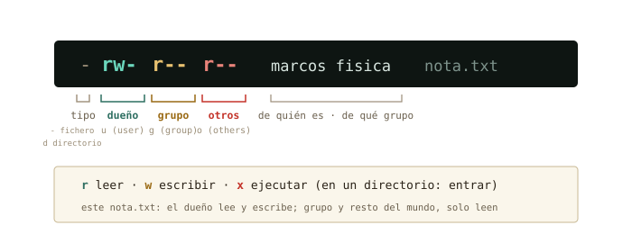

# El árbol y los permisos {#sec-cap04}

::: {.lede}
Ya hablas con la máquina; empieza el bloque B: abrir el capó. Hoy
recorres el mapa completo del árbol — qué vive de verdad en cada rama
—, descubres que tu sistema es multiusuario hasta la médula, entiendes
por fin qué firma exactamente ese `sudo` que tecleas con fe, y
aprendes a leer el idioma `rwx` que llevas dos capítulos viendo pasar
en cada `ls -l`.
:::

::: {.chapmeta}
⏱ **2–3 h** con ejercicios · requisitos: **bloque A (capítulos 1–3)** · máquina: **tu Linux de diario**
:::

::: {.objetivos}
**Al terminar esta sesión sabrás**

- Orientarte por el árbol completo: qué hay en `/etc`, `/home`, `/var`, `/usr`, `/tmp` — y qué rareza es `/proc`.
- Quién eres para el sistema: usuarios, grupos, y el fichero donde está apuntado todo el censo.
- Qué es `root`, qué hace `sudo` de verdad, y por qué te pide *tu* contraseña y no otra.
- Leer de un vistazo los permisos `rwx` de cualquier fichero, y cambiarlos con `chmod`.
- Convertir tus tuberías del capítulo 3 en tu primer *script* ejecutable.
- Localizar dónde guardan su configuración bash, conda y Jupyter — la tuya y la del sistema.
:::

## El mapa del territorio {#sec-fhs}

En el capítulo 1 asomaste la cabeza a la raíz; hoy toca el mapa
entero. Cada directorio de `/` tiene un oficio, y el reparto no es
casualidad: es un estándar — el *Filesystem Hierarchy Standard* — que
comparten casi todos los Linux del mundo. Apréndete el plano una vez y
te orientarás en cualquier máquina que toques el resto de tu vida,
incluido el clúster de cálculo que te espera en unos años.

{#fig-fhs fig-alt="Árbol de la raíz de Linux con la función de cada directorio: bin, boot, dev, etc, home, lib, proc, root, tmp, usr y var"}

Compruébalo sobre tu propia máquina, con las herramientas que ya
tienes:

```terminal
marcos@portatil:~$ ls /
bin  boot  dev  etc  home  lib  media  mnt  opt  proc  root  run  sbin  srv  tmp  usr  var
marcos@portatil:~$ ls /etc | wc -l
228
```

Doscientos y pico ficheros de configuración — la tubería del capítulo 3
acaba de contarlos sin despeinarse. Fíjate en la idea de fondo, porque
es la misma que viste con `.bashrc`: **en Linux, configurar el sistema
es editar ficheros de texto en `/etc`**. No hay registro opaco ni caja
negra: está todo ahí, legible con `less`.

::: {.por-dentro}
**◉ Por dentro · `/proc`, el directorio que no existe**

Haz `cat /proc/uptime`: dos números, los segundos que lleva encendida
la máquina. Ese «fichero» no está en tu disco — `/proc` es una ventana
que el kernel fabrica al vuelo para contarte su estado, disfrazada de
directorio para que puedas usar `cat`, `grep` y compañía sobre ella.
Prueba `grep "model name" /proc/cpuinfo`: acabas de interrogar a tu
procesador con las herramientas del capítulo 3. «Todo es un fichero»
no era una metáfora: es la decisión de diseño más rentable de Unix.
:::

## Quién eres: usuarios y grupos {#sec-usuarios}

`whoami` te lo dijo el primer día; la respuesta completa la da `id`:

```terminal
marcos@portatil:~$ id
uid=1000(marcos) gid=1000(marcos) grupos=1000(marcos),4(adm),24(cdrom),27(sudo),30(dip),46(plugdev)
```

Para el sistema no eres «marcos»: eres el **uid 1000** — el nombre es
un alias para humanos. Y perteneces a **grupos**: bolsas de usuarios a
las que se conceden permisos en bloque. Ahí en medio hay uno que va a
protagonizar la siguiente sección: `sudo`.

¿Y dónde está apuntado el censo? En un fichero de texto de `/etc`,
naturalmente:

```terminal
marcos@portatil:~$ less /etc/passwd
root:x:0:0:root:/root:/bin/bash
daemon:x:1:1:daemon:/usr/sbin:/usr/sbin/nologin
...
marcos:x:1000:1000:Marcos,,,:/home/marcos:/bin/bash
```

Cada línea, un usuario; los campos, separados por `:` — uid, casa,
shell. Dos sorpresas al leerlo: la primera línea es `root`, con
**uid 0**; y hay docenas de usuarios que no son personas (`daemon`,
`www-data`…) — cuentas de servicio con las que el sistema se reparte a
sí mismo el trabajo, cada una con los permisos justos de su oficio.

::: {.historia}
**◷ Historia · Los permisos nacieron porque el ordenador era de todos**

En los 70, «tener ordenador» significaba compartir *el* ordenador del
departamento: decenas de terminales enchufados a una sola máquina
Unix, cada usuario con su cuenta, todos a la vez — el *tiempo
compartido*. En ese mundo, que tus ficheros no fueran legibles por el
resto no era paranoia: era convivencia. Tu portátil ya no se comparte,
pero heredó intacto aquel esqueleto multiusuario — y le sigue sacando
partido: cada servicio corre como un usuario distinto para que un
fallo en uno no arrastre al sistema. Y en el clúster de cálculo al que
te conectarás algún día, el tiempo compartido sigue siendo,
literalmente, la forma de vida.
:::

{#fig-timesharing fig-alt="Usuario trabajando en un terminal Unix en 1978" width="75%"}

## `root` y `sudo`: llamar a la puerta del administrador {#sec-sudo}

`root`, uid 0, es el superusuario: el único para quien los permisos no
existen. Puede leerlo todo, borrarlo todo, romperlo todo. Por eso en
Mint nadie trabaja *como* root — ni siquiera tú, que administras tu
propia máquina. Compruébalo intentando entrar en su casa:

```terminal
marcos@portatil:~$ ls /root
ls: no se puede abrir el directorio '/root': Permiso denegado
marcos@portatil:~$ sudo ls /root
[sudo] contraseña de marcos:
marcos@portatil:~$
```

Ahí está el mecanismo civilizado: `sudo` (*superuser do*) ejecuta
**una única orden** con los poderes de root, y deja constancia en el
registro del sistema de quién la pidió y cuándo. Pide *tu* contraseña
— no una «contraseña de root» — porque lo que comprueba es que tú eres
tú y que estás autorizado: miembro del grupo `sudo` que viste en `id`.
La orden terminó, y volviste a ser el uid 1000 de siempre. Poderes de
administrador de usar y tirar, con recibo.

::: {.aviso}
**△ Cuidado · `sudo` firma con tu nombre**

Con `sudo` delante, `rm` ya no protege nada: puede vaciar el sistema
entero. La regla del curso es doble. Uno: **jamás teclees un `sudo`
que no entiendas** — y eso incluye los que te sugiera una IA o un foro
(cuando llegue el anexo sobre IA verás cómo verificarlos con `man`
antes). Dos: lo destructivo de verdad — particionar, formatear,
reinstalar — no se practica aquí, sino en la máquina virtual del
bloque C, donde romper es gratis.
:::

## Leer `rwx` de un vistazo {#sec-permisos}

Llevas desde el capítulo 1 viendo cosas como `-rw-r--r--` en cada
`ls -l` y esquivándolas educadamente. Se acabó: son diez caracteres
con una gramática exacta.

{#fig-permisos fig-alt="Descomposición de la cadena de permisos rw-r--r--: tipo de fichero, permisos del dueño, del grupo y de otros"}

Sobre un directorio, `x` no significa «ejecutar» sino **entrar**: sin
esa `x` no puedes hacer `cd` dentro. Y ahora ya puedes leer entradas
de `ls -l` como un nativo:

```terminal
marcos@portatil:~$ ls -l /etc/shadow
-rw-r----- 1 root shadow 1523 ago 20 10:11 /etc/shadow
marcos@portatil:~$ cat /etc/shadow
cat: /etc/shadow: Permiso denegado
```

Traducción: dueño `root` (lee y escribe), grupo `shadow` (solo lee),
y los demás — tú — **nada**. Por eso el `cat` rebota. Ese fichero
guarda los *hashes* de las contraseñas: es el ejemplo perfecto de un
permiso haciendo exactamente su trabajo. Compáralo con su vecino
`/etc/passwd` (`-rw-r--r--`): el censo es público, las contraseñas no.

Cambiar permisos es `chmod` (*change mode*), y su dialecto simbólico
se lee solo: a quién (`u`, `g`, `o`), qué gesto (`+` da, `-` quita),
qué permiso (`r`, `w`, `x`):

```terminal
marcos@portatil:~/fisica$ chmod go-r pendulo_v1.csv
marcos@portatil:~/fisica$ ls -l pendulo_v1.csv
-rw------- 1 marcos marcos 428 ago 24 11:02 pendulo_v1.csv
```

Grupo y otros acaban de perder la lectura: ese dato ya solo lo ves tú.
(También existe `chown` para cambiar el *dueño*, pero regalar ficheros
es cosa de root — te cruzarás con él al administrar tu servidor.)

## Tu primer script ejecutable {#sec-script-ejecutable}

Y aquí es donde los capítulos 2, 3 y 4 se dan la mano. Aquella tubería
del análisis que tecleabas una y otra vez — ¿y si fuera un *programa*?
Escríbela en un fichero con `nano informe.sh`:

```default
#!/bin/bash
echo "Informe de adquisicion"
grep -c ERROR adquisicion.log
grep ERROR adquisicion.log | cut -d' ' -f4 | sort | uniq -c | sort -nr
```

La primera línea — el *shebang* `#!` — le dice al sistema qué
intérprete ejecuta esto: bash. El resto es, literalmente, lo que
tecleabas. Dale el permiso que le falta y estrénalo:

```terminal
marcos@portatil:~/Descargas$ chmod u+x informe.sh
marcos@portatil:~/Descargas$ ./informe.sh
Informe de adquisicion
108
     90 s3
     15 s1
      3 s4
```

Acabas de escribir un programa. El `./` delante significa «el de
*este* directorio» — por qué hace falta exactamente eso lo entenderás
en el capítulo 5, cuando abramos el `$PATH`. La idea que importa hoy:
**un script no es más que comandos guardados, y `x` es lo que lo
convierte de apunte en herramienta.**

::: {.truco}
**✚ Truco · Los permisos, también con ratón**

Todo este sistema `rwx` lo tienes en la vía gráfica: clic derecho
sobre cualquier fichero en el gestor de archivos → Propiedades →
pestaña Permisos. Son las mismas casillas de leer, escribir y ejecutar
para dueño, grupo y otros. Para un fichero suelto es perfectamente
digno; la terminal gana cuando son doscientos — o cuando estás en un
servidor sin escritorio, que es tu futuro próximo.
:::

## La expedición de las configuraciones {#sec-configs}

El caso práctico del capítulo, y una pregunta que te harás mil veces:
*¿dónde guarda su configuración este programa?* La respuesta tiene un
patrón — la del **sistema** en `/etc`, la **tuya** en dotfiles de tu
casa — y ya tienes herramientas para verificarlo:

```terminal
marcos@portatil:~$ ls -a ~ | grep -i conda
.conda
.condarc
marcos@portatil:~$ ls ~/.jupyter
jupyter_notebook_config.py
marcos@portatil:~$ ls /etc/jupyter 2> /dev/null
```

Ahí está tu ecosistema científico: `.condarc` (tus canales y entornos
de conda), `~/.jupyter` (tu Jupyter), `.bashrc` (tu shell, del
capítulo 2). Ninguno necesita `sudo`: son tuyos, en tu casa. Cuando un
programa «se comporta raro» en tu cuenta pero no en la de otro, la
explicación vive casi siempre en uno de estos ficheros ocultos — ahora
sabes dónde mirar. (¿Y ese `2> /dev/null` del final? Los tres chorros
del capítulo 3: manda las quejas al agujero negro del sistema. Si
`/etc/jupyter` no existe, silencio en vez de error — útil cuando
solo exploras.)

## Práctica: inspección general {#sec-practica-4}

Cuaderno en marcha (`script sesion04.log`) y a explorar tu propia
máquina. Ningún ejercicio de hoy modifica nada fuera de tu casa.

::: {.ejercicio}
**Ejercicio 4.1 · El censo de `/etc`**

¿Cuántas entradas tiene tu `/etc`? ¿Qué Linux exacto ejecutas?
(Pista: la respuesta está en `/etc/os-release`, y `grep PRETTY` la
aísla.)

:::: {.solucion}
::: {.callout-tip collapse="true" title="Solución razonada"}
`ls /etc | wc -l` (en torno a 200, según lo instalado) y
`grep PRETTY /etc/os-release` →
`PRETTY_NAME="Linux Mint 22.2"` (o tu versión).

**Por qué así** — Todo son ficheros de texto, así que las herramientas
del capítulo 3 valen también para interrogar al sistema. Ese
`os-release` es exactamente lo que los programas leen cuando quieren
saber dónde están corriendo.
:::
::::
:::

::: {.ejercicio}
**Ejercicio 4.2 · Leer el censo**

Usando `/etc/passwd` y tuberías: ¿cuántas cuentas hay en total en tu
sistema? ¿Cuáles son personas de verdad? (Pista: las personas tienen
su casa en `/home` — y `grep` sabe buscar eso.)

:::: {.solucion}
::: {.callout-tip collapse="true" title="Solución razonada"}
Total: `wc -l /etc/passwd` (unas 40–50). Personas:
`grep /home /etc/passwd | cut -d':' -f1` — probablemente solo tú.

**Por qué así** — El separador aquí es `:`, y `cut -d':' -f1` recorta
el nombre igual que recortaba sensores en el log. El resto de cuentas
son los usuarios de servicio: el sistema repartiéndose el trabajo con
permisos mínimos.
:::
::::
:::

::: {.ejercicio}
**Ejercicio 4.3 · Tus credenciales**

Con un solo comando y sin leer ficheros: comprueba si tu usuario
pertenece al grupo `sudo`.

:::: {.solucion}
::: {.callout-tip collapse="true" title="Solución razonada"}
`id | grep sudo` — si tu línea de `id` aparece (con `27(sudo)`
iluminado), estás dentro. También valía `groups`, que lista solo los
nombres.

**Por qué así** — `id` escupe texto y `grep` filtra texto: la
componibilidad del capítulo 3 aplicada a la administración. Estar en
ese grupo es lo que hace que `sudo` te acepte; en un ordenador del
laboratorio, probablemente no lo estarás — y ahora entiendes por qué.
:::
::::
:::

::: {.ejercicio}
**Ejercicio 4.4 · Detective de permisos**

Ejecuta `ls -l /etc/passwd /etc/shadow /usr/bin/nano /tmp` (el último
con `ls -ld /tmp`: la `d` hace que describa el directorio en vez de su
contenido). Traduce a palabras los permisos de cada uno. ¿Cuál puede
leer todo el mundo pero escribir solo root? ¿En cuál puedes escribir
tú?

:::: {.solucion}
::: {.callout-tip collapse="true" title="Solución razonada"}
`/etc/passwd` → `-rw-r--r--`: censo público, lo escribe solo root.
`/etc/shadow` → `-rw-r-----`: ni leerlo puedes. `/usr/bin/nano` →
`-rwxr-xr-x`: todo el mundo lo ejecuta, solo root lo modifica — así
deben ser los programas del sistema. `/tmp` → `drwxrwxrwt`: escribible
por todos (esa `t` final es un matiz — impide borrar lo ajeno — que
puedes archivar como curiosidad).

**Por qué así** — Cuatro ficheros, cuatro políticas distintas, y las
cuatro se leen de un vistazo con la figura del capítulo. Los permisos
no son burocracia: son el diseño de seguridad del sistema, escrito en
diez caracteres.
:::
::::
:::

::: {.ejercicio}
**Ejercicio 4.5 · De tubería a herramienta**

Crea el script `diagnostico.sh` que imprima: quién eres, en qué
máquina estás (`hostname`), la fecha, y cuánto lleva encendido el
equipo (`/proc/uptime`). Hazlo ejecutable y ejecútalo dos veces —
comprueba que la fecha cambia y el uptime crece.

:::: {.solucion}
::: {.callout-tip collapse="true" title="Solución razonada"}
Con `nano diagnostico.sh`:

```
#!/bin/bash
whoami
hostname
date
cat /proc/uptime
```

Después `chmod u+x diagnostico.sh` y `./diagnostico.sh`.

**Por qué así** — Es el patrón completo de la sección: comandos
guardados + shebang + `u+x` + `./`. Cuando administres tu servidor,
tus scripts de diagnóstico serán exactamente esto con más líneas. El
uptime que crece entre ejecuciones te confirma que `/proc` se fabrica
al vuelo: dos lecturas, dos realidades.
:::
::::
:::

::: {.ejercicio}
**Ejercicio 4.6 · `sudo`, con recibo**

Ejecuta `ls /root` sin y con `sudo`. Después reflexiona por escrito en
tu cuaderno (una frase vale): ¿por qué es *mejor* este diseño — pedir
permiso orden a orden — que trabajar directamente como root todo el
rato?

:::: {.solucion}
::: {.callout-tip collapse="true" title="Solución razonada"}
Sin `sudo`: permiso denegado. Con él: tu contraseña, y la casa de root
(probablemente casi vacía). La reflexión, en la dirección de: como
root, *cualquier* errata es potencialmente fatal — un `rm` mal
apuntado, un espacio de más como el del capítulo 2. Con `sudo`
elevas los privilegios solo el segundo que hacen falta, y cada uso
queda registrado con tu nombre.

**Por qué así** — Es el principio de mínimo privilegio, y es idéntico
al del laboratorio: la llave del armario de isótopos no se lleva en el
bolsillo todo el día; se pide, se usa, se devuelve, y queda apuntado.
Cierra el cuaderno: `exit`, y a la colección `sesion04.log`.
:::
::::
:::

## Autocomprobación {#sec-quiz-4}

::: {.content-visible when-format="html"}

Marca una respuesta por pregunta; la corrección es inmediata.

```{=html}
<div class="quiz" id="quiz-cap04">
  <div class="qz"><p class="qq" data-n="1">¿Dónde vive la configuración del sistema en Linux?</p>
    <label><input type="radio" name="z1" value="a"><span>en <code>/etc</code>, como ficheros de texto</span></label>
    <label><input type="radio" name="z1" value="b"><span>en un registro binario central</span></label>
    <label><input type="radio" name="z1" value="c"><span>en <code>/tmp</code></span></label>
    <div class="fb good"><b>Correcto.</b> Texto plano en <code>/etc</code>: legible con <code>less</code>, buscable con <code>grep</code>, editable con <code>nano</code> (y sudo).</div>
    <div class="fb bad"><b>No exactamente.</b> Justo lo contrario de un registro opaco: <code>/etc</code> es texto plano a la vista. <code>/tmp</code> es la papelera de trabajo.</div>
  </div>
  <div class="qz"><p class="qq" data-n="2">El usuario con uid 0 es…</p>
    <label><input type="radio" name="z2" value="a"><span>el primero que se creó al instalar</span></label>
    <label><input type="radio" name="z2" value="b"><span><code>root</code>, para quien no existen los permisos</span></label>
    <label><input type="radio" name="z2" value="c"><span>una cuenta de servicio como <code>daemon</code></span></label>
    <div class="fb good"><b>Correcto.</b> El superusuario. Tu cuenta normal es el uid 1000; las de servicio, números bajos intermedios.</div>
    <div class="fb bad"><b>No exactamente.</b> El uid 0 es <code>root</code>. Tu usuario de la instalación es el 1000 — compruébalo con <code>id</code>.</div>
  </div>
  <div class="qz"><p class="qq" data-n="3">¿Qué hace exactamente <code>sudo ls /root</code>?</p>
    <label><input type="radio" name="z3" value="a"><span>te convierte en root hasta que cierres la terminal</span></label>
    <label><input type="radio" name="z3" value="b"><span>ejecuta solo ese <code>ls</code> como root, y lo deja registrado</span></label>
    <label><input type="radio" name="z3" value="c"><span>pide la contraseña de root para desbloquear la carpeta</span></label>
    <div class="fb good"><b>Correcto.</b> Una orden, con recibo, y de vuelta a tu uid de siempre. Y la contraseña que pide es la tuya: comprueba que tú eres tú y estás autorizado.</div>
    <div class="fb bad"><b>No exactamente.</b> <code>sudo</code> eleva una única orden y registra quién la pidió; la contraseña es la tuya, no la de root. Poderes de usar y tirar.</div>
  </div>
  <div class="qz"><p class="qq" data-n="4">Un fichero muestra <code>-rw-r-----</code> con dueño <code>root</code> y grupo <code>shadow</code>. Tú no estás en ese grupo. ¿Qué puedes hacer con él?</p>
    <label><input type="radio" name="z4" value="a"><span>leerlo, pero no modificarlo</span></label>
    <label><input type="radio" name="z4" value="b"><span>nada: ni leerlo</span></label>
    <label><input type="radio" name="z4" value="c"><span>leerlo y ejecutarlo</span></label>
    <div class="fb good"><b>Correcto.</b> Tu bloque es el tercero — «otros» — y está a ceros: <code>---</code>. Es la política de <code>/etc/shadow</code> haciendo su trabajo.</div>
    <div class="fb bad"><b>No exactamente.</b> Tú caes en el bloque «otros», el tercero: <code>---</code>. Ni leer, ni escribir, ni ejecutar — revisa la figura del decodificador.</div>
  </div>
  <div class="qz"><p class="qq" data-n="5">Sobre un <em>directorio</em>, el permiso <code>x</code> significa…</p>
    <label><input type="radio" name="z5" value="a"><span>poder entrar en él</span></label>
    <label><input type="radio" name="z5" value="b"><span>poder ejecutar sus ficheros</span></label>
    <label><input type="radio" name="z5" value="c"><span>nada: solo aplica a ficheros</span></label>
    <div class="fb good"><b>Correcto.</b> Sin la <code>x</code>, el <code>cd</code> rebota. La <code>r</code> lista nombres; la <code>x</code> deja pasar.</div>
    <div class="fb bad"><b>No exactamente.</b> En directorios, <code>x</code> es la llave de la puerta: permite entrar con <code>cd</code>. Lo que hagan los ficheros de dentro depende de sus propios permisos.</div>
  </div>
  <div class="qz"><p class="qq" data-n="6">Escribes un script y al hacer <code>./analisis.sh</code> el shell dice «Permiso denegado». ¿Qué falta?</p>
    <label><input type="radio" name="z6" value="a"><span>ejecutarlo con <code>sudo</code></span></label>
    <label><input type="radio" name="z6" value="b"><span><code>chmod u+x analisis.sh</code></span></label>
    <label><input type="radio" name="z6" value="c"><span>moverlo a <code>/bin</code></span></label>
    <div class="fb good"><b>Correcto.</b> Le falta el permiso de ejecución para su dueño. <code>sudo</code> no pinta nada aquí — y desconfía del reflejo de añadirlo «a ver si cuela».</div>
    <div class="fb bad"><b>No exactamente.</b> No es cuestión de privilegios ni de ubicación: al fichero le falta la <code>x</code>. <code>chmod u+x</code> lo convierte de apunte en herramienta.</div>
  </div>
</div>
<script>
(function(){
  const OK = {z1:"a", z2:"b", z3:"b", z4:"b", z5:"a", z6:"b"};
  document.querySelectorAll("#quiz-cap04 .qz input").forEach(i => {
    i.addEventListener("change", () => {
      const qz = i.closest(".qz");
      qz.classList.remove("ok","ko");
      qz.classList.add(i.value === OK[i.name] ? "ok" : "ko");
    });
  });
})();
</script>
```

:::

:::: {.content-visible when-format="pdf"}

Responde de memoria; las respuestas están al final del capítulo.

1.  ¿Dónde vive la configuración del sistema en Linux?
    a)  en `/etc`, como ficheros de texto
    b)  en un registro binario central
    c)  en `/tmp`

2.  El usuario con uid 0 es…
    a)  el primero que se creó al instalar
    b)  `root`, para quien no existen los permisos
    c)  una cuenta de servicio como `daemon`

3.  ¿Qué hace exactamente `sudo ls /root`?
    a)  te convierte en root hasta que cierres la terminal
    b)  ejecuta solo ese `ls` como root, y lo deja registrado
    c)  pide la contraseña de root para desbloquear la carpeta

4.  Un fichero muestra `-rw-r-----` con dueño `root` y grupo `shadow`. Tú no estás en ese grupo. ¿Qué puedes hacer con él?
    a)  leerlo, pero no modificarlo
    b)  nada: ni leerlo
    c)  leerlo y ejecutarlo

5.  Sobre un *directorio*, el permiso `x` significa…
    a)  poder entrar en él
    b)  poder ejecutar sus ficheros
    c)  nada: solo aplica a ficheros

6.  Escribes un script y al hacer `./analisis.sh` el shell dice «Permiso denegado». ¿Qué falta?
    a)  ejecutarlo con `sudo`
    b)  `chmod u+x analisis.sh`
    c)  moverlo a `/bin`

::::

::: {.solucion-final}
**Autocomprobación (test de la sección 4.8)** — Respuestas: 1 a · 2 b · 3 b · 4 b · 5 a · 6 b.
:::

::: {.proxima}
**La próxima sesión**

Sabes quién puede tocar qué; el capítulo 5 pregunta *qué está pasando
ahora mismo*: procesos, `top`, señales y el arte de matar un programa
colgado. Y la otra mitad del capó: qué hace de verdad el gestor de
software de Mint por debajo — `apt`, repositorios, dependencias — y el
misterio de por qué a veces `python` no es el Python que crees. Guarda
`sesion04.log`.
:::

::: {.pie-piloto}
cap. 4 v0.1 · piloto — anota tiempo real invertido, dudas y erratas junto a tu `sesion04.log`
:::
