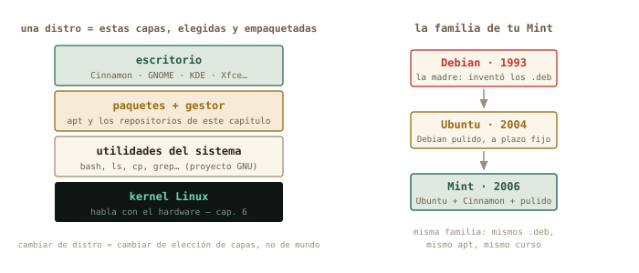

# Paquetes y procesos {#sec-cap05}

::: {.lede}
Dos misterios cotidianos caen hoy. Primero: qué pasa de verdad cuando
el Gestor de software instala un programa — vas a hacerlo tú por
debajo, con `apt`. Segundo: qué está *ejecutándose* ahora mismo en tu
máquina, cómo vigilarlo y cómo rematar un programa colgado. Y de
postre, la deuda del capítulo 4: por qué `./`, qué es el `$PATH`, y el
clásico «este no es mi Python» que algún día te robará una tarde si
hoy no lo desactivamos.
:::

::: {.chapmeta}
⏱ **2–3 h** con ejercicios · requisitos: **capítulos 1–4** · máquina: **tu Linux de diario**
:::

::: {.objetivos}
**Al terminar esta sesión sabrás**

- Instalar, buscar y desinstalar programas con `apt`, y qué son un repositorio y una dependencia.
- La diferencia exacta entre `apt update` y `apt upgrade` (y por qué van siempre en pareja).
- Qué es una distro de verdad — kernel, utilidades, paquetes, escritorio — y de qué familia es tu Mint.
- Ver los procesos vivos con `ps`, `top` y `htop`, y terminar uno colgado con `kill`.
- Lanzar tareas en segundo plano con `&`.
- Leer el `$PATH`: por qué `./`, y por qué a veces `python` no es el Python que crees.
:::

## Instalar por debajo del envoltorio {#sec-apt}

Cada vez que el Gestor de software de Mint instala algo, quien trabaja
es `apt` (*Advanced Package Tool*). Un programa en Linux se distribuye
como **paquete** — el programa, más sus metadatos: versión, de qué
otros paquetes depende — y los paquetes viven en **repositorios**:
almacenes en internet mantenidos por tu distro, con decenas de miles
de paquetes verificados. Tu máquina guarda un **catálogo local** con
la lista de lo que existe; instalar es elegir del catálogo.

{#fig-apt fig-alt="Esquema del repositorio en internet, el catálogo local que refresca apt update, y el sistema donde instalan apt install y apt upgrade"}

Vamos a instalar algo útil para el resto del capítulo. Tres pasos:
refrescar el catálogo, buscar, instalar — los dos que tocan el sistema
piden `sudo`, y ahora sabes exactamente por qué:

```terminal
marcos@portatil:~$ sudo apt update
[sudo] contraseña de marcos:
Obj:1 http://packages.linuxmint.com xia InRelease
Des:2 http://archive.ubuntu.com/ubuntu noble-updates InRelease [126 kB]
Leyendo lista de paquetes... Hecho
marcos@portatil:~$ apt search ^htop
htop/noble 3.3.0-4 amd64
  interactive processes viewer
marcos@portatil:~$ sudo apt install htop
Leyendo lista de paquetes... Hecho
Creando árbol de dependencias... Hecho
Se instalarán los siguientes paquetes NUEVOS:
  htop
Configurando htop (3.3.0-4) ...
```

Fíjate en «árbol de dependencias»: si el paquete necesita bibliotecas
que no tienes, `apt` las localiza, las trae y las instala en el orden
correcto, solo. Esa resolución automática — que hoy parece obvia — es
el gran invento de este sistema. Desinstalar es `sudo apt remove
htop`; y la pareja `sudo apt update && sudo apt upgrade` es
exactamente lo que el escudito de actualizaciones de Mint hace por ti
cada semana.

::: {.truco}
**✚ Truco · Las dos caras del mismo catálogo**

El Gestor de software y Synaptic (el gestor gráfico veterano, más
detallista) son *interfaces* del mismo `apt`: mismo catálogo, mismos
paquetes, mismos botones de fondo. Para descubrir software con capturas
y reseñas, la vía gráfica es estupenda. La terminal gana en precisión
— versiones exactas, `apt show` — y sobre todo donde no hay botones:
tu futuro servidor. Usa la que pida el momento.
:::

## Qué es una distro (ahora ya lo puedes entender) {#sec-distro}

Con el vocabulario de hoy, la pregunta «¿qué Linux tienes?» por fin
tiene respuesta técnica. **Linux**, en rigor, es solo el kernel: el
núcleo que habla con el hardware. Encima van las utilidades del
sistema (bash, `ls`, `grep`… — el proyecto GNU), encima el sistema de
paquetes con sus repositorios, y encima el escritorio. Una
**distribución** es una elección concreta y empaquetada de todas esas
capas.

{#fig-distro fig-alt="Pila de capas de una distro: kernel, utilidades, paquetes y escritorio, junto a la genealogía Debian, Ubuntu, Mint"}

Tu Mint pertenece a la familia Debian: hereda de Ubuntu, que hereda de
Debian, y por eso este capítulo te sirve igual en las tres — y en el
Debian *sin escritorio* que instalarás en el bloque C. Cuando leas
«Fedora usa `dnf`» o «Arch usa `pacman`», ya sabes qué significa: otra
familia, otro gestor de paquetes, mismas ideas. Y los escritorios —
Cinnamon en tu Mint, GNOME, KDE, Xfce — son la capa más visible y la
menos profunda: mismo sistema debajo, distinta carrocería.

::: {.historia}
**◷ Historia · Debra, Ian, y el infierno de las dependencias**

Debian nació en 1993, bautizado por su creador con su nombre y el de
su pareja: **Deb**ra + **Ian** Murdock. Su gran legado llegó en 1998
con `apt`: hasta entonces, instalar un programa era perseguir a mano
la cadena de bibliotecas que necesitaba — el «infierno de las
dependencias» que todavía traumatiza a los veteranos. La resolución
automática de `apt` lo enterró, y la idea es hoy universal: `pip` y
`conda` en Python son descendientes directos de ese concepto. Cuando
esta tarde `apt` te resuelva un árbol de dependencias en un segundo,
levanta la vista un momento: estás viendo el invento de Ian.
:::

{#fig-murdock fig-alt="Ian Murdock hablando en una conferencia en 2008" width="70%"}

## Qué está pasando ahora mismo: procesos {#sec-procesos}

Un **proceso** es un programa *en ejecución*: el fichero ejecutable
era la partitura, el proceso es el concierto. Cada uno tiene un número
único — el **PID** — y un dueño, con sus permisos del capítulo 4.
`ps` los lista; la variante que verás en todas partes es `ps aux`
(todos los procesos, de todos los usuarios, con detalle):

```terminal
marcos@portatil:~$ ps aux | wc -l
312
marcos@portatil:~$ ps aux | grep firefox
marcos     8113  4.2  3.1 ... /usr/lib/firefox/firefox
```

Trescientos procesos y solo tienes tres ventanas abiertas: el resto es
el sistema trabajando — servicios, el escritorio, controladores. Y
sí: acabas de filtrar procesos con las tuberías del capítulo 3,
porque `ps` escupe texto como todo el mundo.

Para *vigilar* en directo está `top`, y su versión moderna — la que
instalaste hace un rato — `htop`:

```terminal
marcos@portatil:~$ htop
```

Un panel vivo: barras de CPU por núcleo, memoria, y la lista de
procesos ordenada por consumo, actualizándose sola. Se sale con
<kbd>q</kbd>, como en `less` — y con <kbd>F6</kbd> eliges por qué
columna ordenar. Cuando el ventilador de tu portátil despegue en mitad
de una simulación, `htop` es la primera ventanilla de información: qué
proceso, cuánta CPU, cuánta memoria.

::: {.truco}
**✚ Truco · La versión con gráficas**

El Monitor del sistema de Mint (menú → Administración) es esta misma
información con gráficas de colores — perfectamente digno para un
vistazo rápido. `htop` gana en detalle, en velocidad… y en que
funciona idéntico dentro del servidor sin ventanas al que te
conectarás por SSH. Aprendido una vez, vale en todas partes.
:::

## Terminar lo colgado: señales y `kill` {#sec-kill}

El caso real: tu script de análisis lleva veinte minutos en un bucle
del que no va a salir. Los procesos se gobiernan mandándoles
**señales**. Una ya la usas sin saberlo: <kbd>Ctrl</kbd>+<kbd>C</kbd>
en la terminal envía SIGINT — «interrúmpete» — al proceso que ocupa el
primer plano. Para un proceso que no está en tu terminal, la señal se
envía por PID:

```terminal
marcos@portatil:~$ ps aux | grep analisis
marcos    9204 98.7  0.4 ... python analisis.py
marcos@portatil:~$ kill 9204
```

`kill`, pese al nombre, es educado: envía SIGTERM — «termina, por
favor» — y el proceso puede cerrar ficheros y despedirse. Si lo
ignora, queda el recurso final: `kill -9`, SIGKILL, que no se puede
ignorar ni atender — el kernel lo elimina en seco. La diferencia
importa: es apagar la centrífuga con su rampa de frenado frente a
cortarle la corriente. La segunda funciona siempre, pero lo que
hubiera a medio escribir se queda a medias. Protocolo: primero `kill`,
cinco segundos de cortesía, y solo entonces `kill -9`.

## Segundo plano: el `&` {#sec-background}

Hasta hoy, cada comando secuestra tu terminal hasta terminar. Un `&`
al final lo lanza al **segundo plano** y te devuelve el prompt:

```terminal
marcos@portatil:~$ sleep 600 &
[1] 9871
marcos@portatil:~$ jobs
[1]+  Ejecutando              sleep 600 &
```

El shell te dice su número de trabajo `[1]` y su PID. `jobs` lista lo
que tienes en marcha; `fg` lo trae de vuelta al primer plano; y si un
comando ya lanzado te está reteniendo, <kbd>Ctrl</kbd>+<kbd>Z</kbd> lo
pausa y `bg` lo reanuda detrás. Para una simulación de diez minutos
mientras sigues trabajando, esto basta. Para una de diez *horas* en un
servidor remoto hará falta algo más robusto — se llama `tmux`, y es el
plato fuerte del capítulo 12. El `&` de hoy es su semilla.

## El `$PATH`: la deuda del `./` {#sec-path}

Toca pagar lo prometido. El shell guarda **variables de entorno** —
datos con nombre que los programas heredan. Míralas: `env` las lista
todas; `echo` imprime una:

```terminal
marcos@portatil:~$ echo $HOME
/home/marcos
marcos@portatil:~$ echo $PATH
/home/marcos/.local/bin:/usr/local/bin:/usr/bin:/bin:/usr/games
```

Esa lista separada por `:` es el **PATH**: los directorios donde el
shell busca, *en orden*, cada comando que tecleas. Escribes `ls`, el
shell recorre la lista, lo encuentra en `/usr/bin` y lo ejecuta.
`which` te dice quién ganó la búsqueda:

```terminal
marcos@portatil:~$ which ls
/usr/bin/ls
marcos@portatil:~$ which python3
/usr/bin/python3
```

{#fig-path fig-alt="El shell busca el comando python recorriendo los directorios del PATH en orden; el entorno de conda va primero y gana"}

Y aquí las dos respuestas pendientes. **Por qué `./`**: el directorio
actual *no* está en el PATH — es una decisión de seguridad, para que
entrar en una carpeta ajena no pueda ejecutarte programas por sorpresa
—, así que a tus scripts se les da la ruta explícita: `./informe.sh`.
**Y el «no es mi Python»**: herramientas como conda funcionan
*anteponiendo* su directorio al PATH cuando activas un entorno. Desde
ese momento, `python` es el suyo — con sus paquetes, su versión — y no
el del sistema:

```terminal
marcos@portatil:~$ conda activate tfg
(tfg) marcos@portatil:~$ which python
/home/marcos/miniconda3/envs/tfg/bin/python
```

::: {.aviso}
**△ Cuidado · El primer gesto ante «aquí falta un paquete»**

El clásico: «en mi terminal funciona, en Jupyter no encuentra numpy» —
o al revés. Antes de reinstalar nada a lo loco, dos comandos de
diagnóstico: `which python` (¿*qué* Python está respondiendo?) y
`echo $PATH` (¿quién va primero en la cola?). El noventa por ciento de
esos misterios es un entorno activado — o sin activar — cambiando
quién gana la búsqueda. Ahora tienes el instrumento para verlo en diez
segundos.
:::

## Práctica: el taller {#sec-practica-5}

Cuaderno en marcha (`script sesion05.log`). Hoy instalarás software de
verdad — todo reversible con `apt remove`.

::: {.ejercicio}
**Ejercicio 5.1 · Tu primera instalación completa**

Instala el paquete `tree` con el ciclo completo: refresca el catálogo,
búscalo, léelo (`apt show tree` — mira su descripción y su campo
`Depends:`), instálalo. Después estrénalo:
`tree ~/Descargas/experimento-pendulo`.

:::: {.solucion}
::: {.callout-tip collapse="true" title="Solución razonada"}
`sudo apt update`, `apt search ^tree`, `apt show tree`, `sudo apt
install tree`. Y el estreno dibuja tu trabajo del capítulo 2:

```
experimento-pendulo
├── datos
│   ├── run01.csv
│   ├── ...
├── descartes
├── notas
├── LEEME.txt
└── registro.log
```

**Por qué así** — `apt show` antes de instalar es el hábito sano: qué
es, cuánto ocupa, de qué depende (`Depends: libc6` — la biblioteca C
que comparte casi todo el sistema). Buscar, leer, instalar: el mismo
rigor que con un reactivo nuevo en el laboratorio.
:::
::::
:::

::: {.ejercicio}
**Ejercicio 5.2 · El censo de procesos**

¿Cuántos procesos corren en tu máquina? ¿Y cuántos pertenecen a cada
usuario? Para lo segundo, `ps -eo user` te da la columna de dueños
limpia — termina tú la tubería (capítulo 3) que produce el ranking.

:::: {.solucion}
::: {.callout-tip collapse="true" title="Solución razonada"}
`ps aux | wc -l` (unos 300) y
`ps -eo user | sort | uniq -c | sort -nr | head -3` — root encabeza,
tú segundo, y el resto son cuentas de servicio del capítulo 4.

**Por qué así** — ¿Por qué `ps -eo user` y no `ps aux | cut -d' '
-f1`? Prueba el `cut` y verás rarezas: `ps aux` alinea columnas con
*varios* espacios seguidos, y para `cut` cada espacio separa un campo.
La lección del log del capítulo 3, reapareciendo: antes de cortar,
mira cómo está separado de verdad. Aquí es más limpio pedirle a `ps`
la columna exacta.
:::
::::
:::

::: {.ejercicio}
**Ejercicio 5.3 · Caza controlada**

Lanza `sleep 600 &`. Localiza su PID de dos maneras distintas
(`jobs -l` y `ps aux | grep`), termínalo educadamente, y verifica que
ya no está.

:::: {.solucion}
::: {.callout-tip collapse="true" title="Solución razonada"}
`sleep 600 &`, luego `jobs -l` (muestra el PID junto al `[1]`) o
`ps aux | grep sleep`. Con el número: `kill 9871` (el tuyo será otro).
Verificación: `jobs` vacío, o `ps aux | grep sleep` sin resultado —
salvo, quizá, ¡el propio `grep sleep` cazándose a sí mismo en la
lista! Es el clásico bucle del aprendiz: el grep aparece porque él
también es un proceso cuya línea de comando contiene «sleep».

**Por qué así** — `sleep` es el conejillo perfecto: un proceso
inofensivo que hace exactamente nada durante N segundos. El protocolo
practicado — localizar, `kill`, verificar — es idéntico para la
simulación colgada de verdad.
:::
::::
:::

::: {.ejercicio}
**Ejercicio 5.4 · update no es upgrade**

Sin ejecutarlos: escribe en tu cuaderno qué hará exactamente cada
mitad de `sudo apt update && sudo apt upgrade`. Después ejecuta la
pareja y comprueba tu predicción con la salida real.

:::: {.solucion}
::: {.callout-tip collapse="true" title="Solución razonada"}
`update` descarga las listas nuevas del repositorio: al final resume
cuántos paquetes «se pueden actualizar» — pero no toca ninguno.
`upgrade` compara esas listas con lo instalado y trae las versiones
nuevas (te enseña la lista y pide confirmación). El `&&` encadena:
«y si lo anterior salió bien, entonces…».

**Por qué así** — Predicción teórica y contraste experimental, como
siempre. Esta pareja es el mantenimiento básico de tu máquina — y la
versión terminal exacta de lo que el escudito de actualizaciones de
Mint te ofrece con un clic.
:::
::::
:::

::: {.ejercicio}
**Ejercicio 5.5 · Un `bin` propio**

Objetivo: que tu `diagnostico.sh` del capítulo 4 se ejecute desde
cualquier sitio, sin `./` ni rutas. Pasos: crea `~/bin`, mueve el
script dentro, añade el directorio al PATH de la sesión
(`export PATH="$HOME/bin:$PATH"`), y prueba `diagnostico.sh` a secas
desde varios directorios. Comprueba con `which` quién responde.

:::: {.solucion}
::: {.callout-tip collapse="true" title="Solución razonada"}
`mkdir -p ~/bin`, `mv ~/Descargas/diagnostico.sh ~/bin/` (ajusta el
origen), `export PATH="$HOME/bin:$PATH"`, y desde donde quieras:
`diagnostico.sh`. `which diagnostico.sh` → `/home/marcos/bin/diagnostico.sh`.
El `export` vale solo para esta terminal; en Mint, `~/bin` se añade
solo al PATH en cuanto existe — a partir de tu próximo inicio de
sesión será permanente sin tocar nada.

**Por qué así** — Acabas de hacer lo que hacen todos los
profesionales: una carpeta propia de herramientas, delante del PATH.
Tus scripts pasan de «ficheros que hay que buscar» a comandos de pleno
derecho. Es el patrón de conda a escala casera — y ahora entiendes
ambos.
:::
::::
:::

::: {.ejercicio}
**Ejercicio 5.6 · ¿Quién es tu Python?**

Averigua qué `python3` responde en tu sistema (`which`), y su versión
(`python3 --version`). Si usas conda o entornos virtuales: actívalo y
repite `which python` — documenta en tu cuaderno el antes y el
después del PATH (`echo $PATH | cut -d':' -f1` enseña quién va
primero).

:::: {.solucion}
::: {.callout-tip collapse="true" title="Solución razonada"}
Sin entorno: `/usr/bin/python3`, el del sistema. Con un entorno conda
activado, `which python` salta a
`~/miniconda3/envs/<nombre>/bin/python`, y el primer campo del PATH
(ese `cut -d':' -f1`) es ahora el directorio del entorno: la figura
del capítulo, en vivo.

**Por qué así** — Este par de comandos — `which python`,
`echo $PATH` — es el estetoscopio de los entornos de Python. El día
del misterioso «ModuleNotFoundError» los agradecerás. Cierra el
cuaderno: `exit`, `sesion05.log` a la colección.
:::
::::
:::

## Autocomprobación {#sec-quiz-5}

::: {.content-visible when-format="html"}

Marca una respuesta por pregunta; la corrección es inmediata.

```{=html}
<div class="quiz" id="quiz-cap05">
  <div class="qz"><p class="qq" data-n="1">`sudo apt update`…</p>
    <label><input type="radio" name="z1" value="a"><span>actualiza todos los programas instalados</span></label>
    <label><input type="radio" name="z1" value="b"><span>refresca el catálogo: qué existe y en qué versión</span></label>
    <label><input type="radio" name="z1" value="c"><span>actualiza el kernel</span></label>
    <div class="fb good"><b>Correcto.</b> Solo la lista. Quien instala versiones nuevas es <code>upgrade</code> — por eso van en pareja.</div>
    <div class="fb bad"><b>No exactamente.</b> <code>update</code> no toca ni un programa: pone al día el mapa. El territorio lo actualiza <code>upgrade</code>.</div>
  </div>
  <div class="qz"><p class="qq" data-n="2">Una «dependencia» de un paquete es…</p>
    <label><input type="radio" name="z2" value="a"><span>otro paquete que necesita para funcionar</span></label>
    <label><input type="radio" name="z2" value="b"><span>una versión antigua del mismo paquete</span></label>
    <label><input type="radio" name="z2" value="c"><span>el repositorio del que procede</span></label>
    <div class="fb good"><b>Correcto.</b> Y <code>apt</code> resuelve la cadena entera solo — el invento que enterró el «infierno de dependencias».</div>
    <div class="fb bad"><b>No exactamente.</b> Es otro paquete requerido (una biblioteca, casi siempre). <code>apt show</code> las lista en su campo <code>Depends:</code>.</div>
  </div>
  <div class="qz"><p class="qq" data-n="3">El PID de un proceso es…</p>
    <label><input type="radio" name="z3" value="a"><span>su prioridad de CPU</span></label>
    <label><input type="radio" name="z3" value="b"><span>su número identificador único mientras vive</span></label>
    <label><input type="radio" name="z3" value="c"><span>el puerto de red que usa</span></label>
    <div class="fb good"><b>Correcto.</b> Es la matrícula que usan <code>ps</code>, <code>htop</code> y <code>kill</code> para señalarlo sin ambigüedad.</div>
    <div class="fb bad"><b>No exactamente.</b> El PID es el identificador del proceso — la matrícula a la que apunta <code>kill</code>.</div>
  </div>
  <div class="qz"><p class="qq" data-n="4">Diferencia entre <code>kill PID</code> y <code>kill -9 PID</code>:</p>
    <label><input type="radio" name="z4" value="a"><span>ninguna: -9 solo es más rápido</span></label>
    <label><input type="radio" name="z4" value="b"><span><code>kill</code> pide terminar con orden; <code>-9</code> elimina en seco, sin opción a limpiar</span></label>
    <label><input type="radio" name="z4" value="c"><span><code>-9</code> mata también los procesos vecinos</span></label>
    <div class="fb good"><b>Correcto.</b> SIGTERM es la rampa de frenado; SIGKILL, cortar la corriente. Protocolo: primero el educado, luego el definitivo.</div>
    <div class="fb bad"><b>No exactamente.</b> <code>kill</code> a secas (SIGTERM) deja al proceso cerrar sus cosas; <code>-9</code> (SIGKILL) no se puede atender ni ignorar — lo a medias se queda a medias.</div>
  </div>
  <div class="qz"><p class="qq" data-n="5">Tecleas <code>python</code> con un entorno conda activado. ¿Cuál se ejecuta?</p>
    <label><input type="radio" name="z5" value="a"><span>el primero que aparezca recorriendo el PATH en orden — el del entorno</span></label>
    <label><input type="radio" name="z5" value="b"><span>siempre el del sistema, <code>/usr/bin/python3</code></span></label>
    <label><input type="radio" name="z5" value="c"><span>el más moderno de los instalados</span></label>
    <div class="fb good"><b>Correcto.</b> Conda antepone su directorio al PATH, y la búsqueda se detiene en el primer acierto. <code>which python</code> te lo confirma.</div>
    <div class="fb bad"><b>No exactamente.</b> Gana el primero del PATH — y conda se pone el primero al activarse. Ni antigüedad ni preferencias: orden de lista.</div>
  </div>
  <div class="qz"><p class="qq" data-n="6">Tu script está en el directorio actual, pero <code>informe.sh</code> da «orden no encontrada». ¿Por qué?</p>
    <label><input type="radio" name="z6" value="a"><span>le falta <code>chmod u+x</code></span></label>
    <label><input type="radio" name="z6" value="b"><span>el directorio actual no está en el PATH: es <code>./informe.sh</code></span></label>
    <label><input type="radio" name="z6" value="c"><span>los scripts requieren <code>sudo</code></span></label>
    <div class="fb good"><b>Correcto.</b> «Estar aquí» no basta: el shell solo busca en el PATH. La ruta explícita <code>./</code> se salta la búsqueda (sin permisos de ejecución daría «permiso denegado», que es otro mensaje).</div>
    <div class="fb bad"><b>No exactamente.</b> El mensaje «orden no encontrada» es de búsqueda, no de permisos: el directorio actual no está en el PATH. Con <code>./informe.sh</code> le das la ruta y no hay que buscar.</div>
  </div>
</div>
<script>
(function(){
  const OK = {z1:"b", z2:"a", z3:"b", z4:"b", z5:"a", z6:"b"};
  document.querySelectorAll("#quiz-cap05 .qz input").forEach(i => {
    i.addEventListener("change", () => {
      const qz = i.closest(".qz");
      qz.classList.remove("ok","ko");
      qz.classList.add(i.value === OK[i.name] ? "ok" : "ko");
    });
  });
})();
</script>
```

:::

:::: {.content-visible when-format="pdf"}

Responde de memoria; las respuestas están al final del capítulo.

1.  `sudo apt update`…
    a)  actualiza todos los programas instalados
    b)  refresca el catálogo: qué existe y en qué versión
    c)  actualiza el kernel

2.  Una «dependencia» de un paquete es…
    a)  otro paquete que necesita para funcionar
    b)  una versión antigua del mismo paquete
    c)  el repositorio del que procede

3.  El PID de un proceso es…
    a)  su prioridad de CPU
    b)  su número identificador único mientras vive
    c)  el puerto de red que usa

4.  Diferencia entre `kill PID` y `kill -9 PID`:
    a)  ninguna: -9 solo es más rápido
    b)  `kill` pide terminar con orden; `-9` elimina en seco, sin opción a limpiar
    c)  `-9` mata también los procesos vecinos

5.  Tecleas `python` con un entorno conda activado. ¿Cuál se ejecuta?
    a)  el primero que aparezca recorriendo el PATH en orden — el del entorno
    b)  siempre el del sistema, `/usr/bin/python3`
    c)  el más moderno de los instalados

6.  Tu script está en el directorio actual, pero `informe.sh` da «orden no encontrada». ¿Por qué?
    a)  le falta `chmod u+x`
    b)  el directorio actual no está en el PATH: es `./informe.sh`
    c)  los scripts requieren `sudo`

::::

::: {.solucion-final}
**Autocomprobación (test de la sección 5.8)** — Respuestas: 1 b · 2 a · 3 b · 4 b · 5 a · 6 b.
:::

::: {.proxima}
**La próxima sesión**

Último capítulo del bloque B, y el que abre la puerta a todo lo demás:
discos y particiones — `lsblk`, montar y desmontar, qué es esa
partición EFI —, y la película completa de lo que pasa entre el botón
de encendido y tu escritorio: UEFI, GRUB, kernel. Es el prerrequisito
directo de la instalación del bloque C: entender el quirófano antes de
operar. Guarda `sesion05.log`.
:::

::: {.pie-piloto}
cap. 5 v0.1 · piloto — anota tiempo real invertido, dudas y erratas junto a tu `sesion05.log`
:::
