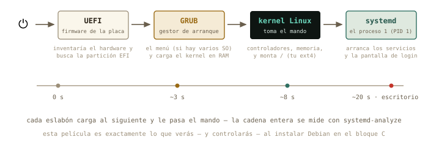
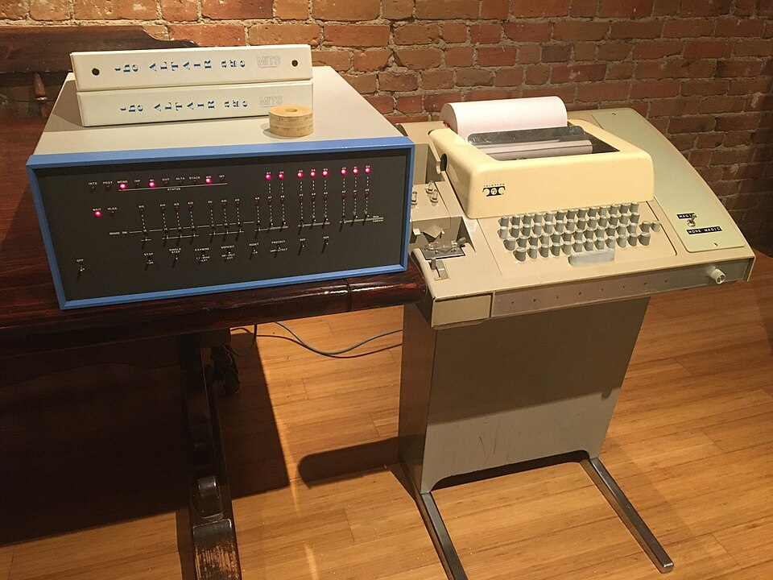

# Discos, particiones y arranque {#sec-cap06}

::: {.lede}
Última sesión del bloque B, y la que abre la puerta de todo lo que
viene: entender dónde viven físicamente tus ficheros — discos,
particiones, sistemas de ficheros — y qué pasa exactamente entre el
botón de encendido y tu escritorio. Hoy no se toca nada: se aprende a
leer el quirófano. Operar — particionar, formatear, instalar — será en
la máquina virtual del bloque C, donde equivocarse es gratis.
:::

::: {.chapmeta}
⏱ **2–3 h** con ejercicios · requisitos: **capítulos 1–5** · máquina: **tu Linux de diario (solo lectura)** · opcional: **un pendrive**
:::

::: {.objetivos}
**Al terminar esta sesión sabrás**

- Leer el mapa de tus discos y particiones con `lsblk`, e identificar cada pieza.
- Qué es un sistema de ficheros, y quién es quién: ext4, FAT32, NTFS, exFAT.
- Qué significa *montar*: cómo los discos se enganchan al árbol único — y por qué «expulsar con seguridad» no es un ritual supersticioso.
- Vigilar el espacio con `df` y encontrar qué lo devora con `du`.
- La película completa del arranque: UEFI → GRUB → kernel → systemd, y medirla en tu máquina.
- Qué es la partición EFI que te encontrarás al instalar Debian.
:::

## El mapa de tus discos: `lsblk` {#sec-lsblk}

Los discos son **dispositivos de bloque**: almacenes que leen y
escriben en bloques de bytes. Como todo en Linux, aparecen disfrazados
de fichero en `/dev` — `nvme0n1` si tu disco es NVMe moderno, `sda` si
es SATA — y sus **particiones**, las divisiones que un mismo disco
puede tener, se numeran detrás: `nvme0n1p1`, `nvme0n1p2`… El plano
completo lo dibuja `lsblk` (*list block devices*):

```terminal
marcos@portatil:~$ lsblk
NAME        MAJ:MIN RM   SIZE RO TYPE MOUNTPOINTS
nvme0n1     259:0    0 476,9G  0 disk
├─nvme0n1p1 259:1    0   512M  0 part /boot/efi
└─nvme0n1p2 259:2    0 476,4G  0 part /
```

Léelo como un físico lee un diagrama: un disco de 477 GB con dos
particiones — una pequeñita de 512 MB montada en `/boot/efi` (enseguida
sabrás quién es), y el resto montado en `/`: ahí vive todo tu sistema
y tu casa. Tu máquina puede variar — más particiones, un `sda` —
pero la gramática es esta.

## Sistemas de ficheros: el orden dentro del bloque {#sec-filesystems}

Un disco recién salido de fábrica es solo una pizarra de bloques
vacíos. Para que haya *ficheros* — con nombres, carpetas, permisos,
fechas — hace falta imponerle una estructura: el **sistema de
ficheros**. Formatear una partición es exactamente eso: estrenar su
estructura (borrando lo anterior, de ahí el respeto).

| Sistema | Dónde lo verás | Lo esencial |
|---------|----------------|-------------|
| **ext4** | tu `/`, todo Linux | robusto, con permisos y dueños (cap. 4) |
| **FAT32** | la partición EFI, pendrives viejos | antiguo y universal; sin permisos, ficheros de 4 GB máximo |
| **exFAT** | pendrives y tarjetas SD modernas | el FAT sin límite de tamaño; ideal para compartir |
| **NTFS** | discos con Windows | el de Windows; Linux lo lee y escribe sin drama |

La tabla explica media convivencia con Windows: un pendrive exFAT lo
leen ambos mundos; tu ext4, Windows ni lo ve. Y fíjate en el detalle
del capítulo 4: los permisos `rwx` son una *prestación del sistema de
ficheros* — por eso un pendrive FAT no los tiene, y todo aparece como
`rwxrwxrwx` cuando lo montas.

## Montar: enganchar discos al árbol {#sec-montar}

Y aquí se cierra por fin el círculo abierto el primer día, cuando te
dijimos «no hay unidades C: y D:». En Linux, un disco no aparece como
una isla con su letra: se **monta** — se engancha — en un directorio
del árbol único, su **punto de montaje**, y desde ese momento su
contenido *es* esa rama.

{#fig-montaje fig-alt="Tres dispositivos — disco interno, partición EFI y pendrive — enganchados al árbol en la raíz, /boot/efi y /media"}

Cuando pinchas un pendrive, Mint lo monta solo en
`/media/tu_usuario/NOMBRE` y te abre la ventana — cómodo y correcto.
La versión manual es `mount` (montar) y `umount` (desmontar; sí, sin
la primera *n*), y la usarás en el servidor sin escritorio. Hoy te
basta con saber *leerlo*:

```terminal
marcos@portatil:~$ lsblk
NAME        MAJ:MIN RM   SIZE RO TYPE MOUNTPOINTS
sda           8:0    1  28,9G  0 disk
└─sda1        8:1    1  28,9G  0 part /media/marcos/PRACTICAS
nvme0n1     259:0    0 476,9G  0 disk
...
```

::: {.por-dentro}
**◉ Por dentro · Por qué «expulsar» no es superstición**

Escribir en disco es lento, así que el sistema hace trampa legal:
apunta tus cambios en RAM — la *caché* — y los vuelca al dispositivo
cuando le conviene. Si arrancas el pendrive del puerto justo después
de copiar, puede que parte siga en la caché: fichero corrupto.
«Expulsar con seguridad» (o `umount`) significa «vuelca todo lo
pendiente y cierra». Es un compromiso físico clásico: velocidad a
cambio de un protocolo de salida. Respétalo como respetas la rampa de
frenado de la centrífuga.
:::

## ¿Cuánto espacio queda? `df` y `du` {#sec-espacio}

Dos preguntas distintas, dos herramientas. `df` (*disk free*)
responde «¿cómo van de llenos mis sistemas de ficheros?»:

```terminal
marcos@portatil:~$ df -h /
S.ficheros     Tamaño Usados Disp Uso% Montado en
/dev/nvme0n1p2   468G   187G 258G  43% /
```

Y `du` (*disk usage*) responde «¿cuánto ocupa *esto*?» — y combinado
con las tuberías del capítulo 3, «¿*quién* me está llenando el
disco?»:

```terminal
marcos@portatil:~$ du -sh ~/* 2> /dev/null | sort -h | tail -3
2,1G    /home/marcos/Descargas
8,7G    /home/marcos/simulaciones
64G     /home/marcos/Vídeos
```

`-s` resume cada carpeta en una línea, `-h` en unidades humanas, y
`sort -h` — fíjate — sabe ordenar esas unidades humanas (sabe que 8,7G
> 900M). El `2> /dev/null` es el silenciador de quejas del capítulo 4.
Culpable localizado en una línea.

::: {.truco}
**✚ Truco · El mismo censo, con gráfica de quesitos**

Mint trae el Analizador de uso de disco (menú → Accesorios): el mismo
`du` con anillos de colores clicables — francamente bueno para
explorar. Y en la terminal existe su equivalente interactivo, `ncdu`
(un `apt install` de distancia), que es lo que usarás en el servidor.
Tres herramientas, una idea.
:::

## La partición EFI y el arranque {#sec-arranque}

Queda explicar aquella partición enana de 512 MB. Para eso, la
pregunta que este curso te prometió responder: **¿qué pasa cuando
pulsas el botón de encendido?**

{#fig-arranque fig-alt="Secuencia de arranque: UEFI, GRUB, kernel Linux y systemd hasta la pantalla de entrada, sobre una línea de tiempo"}

1. **UEFI** — el firmware grabado en la placa base — despierta,
   inventaría el hardware, y busca un disco que tenga *partición EFI*:
   una partición FAT32 con cargadores de arranque dentro. Ahí está el
   misterio resuelto: `nvme0n1p1` es el buzón estándar donde los
   sistemas operativos dejan su llave de arranque.
2. **GRUB**, el cargador que Linux dejó en ese buzón, toma el relevo:
   si tienes varios sistemas te enseña el menú, y carga el **kernel**
   en memoria.
3. El **kernel** toma el mando de verdad: controladores, memoria,
   procesos — y monta tu ext4 en `/`.
4. El kernel lanza el primer proceso, **systemd** — mira su PID:
   `ps -p 1` — que arranca en cascada los servicios y, al final, tu
   pantalla de entrada.

Y como todo en esta casa, la película se puede *medir*:

```terminal
marcos@portatil:~$ systemd-analyze
Startup finished in 4.211s (firmware) + 2.108s (loader) + 3.998s (kernel) + 8.870s (userspace) = 19.188s
```

Ahí están los cuatro actos con sus tiempos. Cuando instales Debian en
el bloque C vas a *construir* esta cadena — elegir la partición EFI,
ver a GRUB instalarse — y cuando algo no arranque (a todos nos pasa),
sabrás en qué eslabón se rompió.

::: {.historia}
**◷ Historia · Levantarse tirando de los cordones**

«Arrancar» en inglés es *to boot*, de *bootstrapping*: levantarse en
el aire tirando de los cordones de las propias botas. El chiste es
exacto: para cargar un programa hace falta un programa ya cargado —
¿y el primero? En los ordenadores de los 70, como el Altair 8800, el
problema lo resolvía un humano: metía a mano el cargador inicial,
byte a byte, con los interruptores del panel frontal, para que ese
programita minúsculo pudiera cargar el siguiente desde la cinta.
Tu UEFI es ese operador, fosilizado en la placa base: la cadena
entera — firmware que carga al cargador que carga al kernel — sigue
siendo la misma idea, medio siglo después.
:::

{#fig-altair fig-alt="Ordenador Altair 8800 con panel de interruptores junto a un teletipo ASR-33" width="75%"}

## Práctica: inspección del quirófano {#sec-practica-6}

Cuaderno en marcha (`script sesion06.log`). Todo lo de hoy es lectura:
ningún comando cambia nada en tu disco.

::: {.ejercicio}
**Ejercicio 6.1 · Tu mapa**

Dibuja en tu cuaderno (en texto, como el ejemplo del capítulo) el mapa
completo que da `lsblk` de tu máquina: discos, particiones, tamaños y
puntos de montaje. Identifica: ¿cuál es tu partición EFI? ¿Dónde está
montado tu sistema?

:::: {.solucion}
::: {.callout-tip collapse="true" title="Solución razonada"}
`lsblk` — la EFI es la pequeña (unos cientos de MB) montada en
`/boot/efi`; el sistema, la grande montada en `/`. Si ves una tercera
de tipo `swap`, es el «desahogo» de la RAM (en los Mint recientes esa
función la hace un fichero, `/swapfile`, y no verás partición).

**Por qué así** — Este mapa es el que te pedirá el instalador de
Debian en el capítulo 8. Dibujarlo de tu propia máquina hoy — con
calma y sin riesgo — es el ensayo de leerlo allí, donde las decisiones
cuentan.
:::
::::
:::

::: {.ejercicio}
**Ejercicio 6.2 · Parte de capacidad**

¿A qué porcentaje de llenado está tu disco? ¿Cuánto espacio libre te
queda en números absolutos? Una línea de `df`.

:::: {.solucion}
::: {.callout-tip collapse="true" title="Solución razonada"}
`df -h /` — las columnas Usados, Disp y Uso% responden todo. (Un
`df -h` a secas lista además los pseudo-sistemas en RAM tipo `tmpfs`:
ignóralos hoy sin remordimiento.)

**Por qué así** — El hábito del `df -h` antes de una descarga o
simulación grande evita el clásico «disco lleno al 99 % de la
ejecución». En los clústeres, además, el espacio suele tener cuota:
esta lectura será rutina.
:::
::::
:::

::: {.ejercicio}
**Ejercicio 6.3 · ¿Quién llena tu casa?**

Con `du`, las tuberías y `sort -h`: obtén el top 5 de carpetas más
pesadas de tu home. ¿Te sorprende el resultado?

:::: {.solucion}
::: {.callout-tip collapse="true" title="Solución razonada"}
`du -sh ~/* 2> /dev/null | sort -h | tail -5`. Para incluir también
las ocultas del capítulo 4: `du -sh ~/.[a-z]* 2> /dev/null | sort -h |
tail -5` — no es raro que `~/.cache` o un `~/miniconda3` den la
sorpresa.

**Por qué así** — `du` mide, `sort -h` ordena magnitudes humanas, y
la tubería los compone: el capítulo 3 aplicado a la administración.
El silenciador `2>` evita el ruido de carpetas sin permiso de
lectura.
:::
::::
:::

::: {.ejercicio}
**Ejercicio 6.4 · El pendrive (si tienes uno a mano)**

Conéctalo. Con `lsblk`, localiza: qué nombre de dispositivo recibió,
qué sistema de ficheros trae (`lsblk -f` lo muestra) y dónde se montó.
Copia cualquier fichero dentro, y desmóntalo desde la terminal con
`umount /media/tu_usuario/NOMBRE`. Verifica con `lsblk` que el punto
de montaje desapareció antes de extraerlo.

:::: {.solucion}
::: {.callout-tip collapse="true" title="Solución razonada"}
Aparecerá como `sda1` (o `sdb1`), típicamente `vfat` o `exfat`,
montado en `/media/marcos/NOMBRE`. Tras `umount`, su columna
MOUNTPOINTS queda vacía: la caché se ha volcado y es seguro extraer.
Si `umount` protesta con «objetivo ocupado», algo lo está usando —
casi siempre una terminal con `cd` dentro del pendrive o la ventana
del gestor de archivos abierta ahí.

**Por qué así** — Es el ciclo completo de la sección de montaje, con
el matiz del «ocupado» incluido, que te encontrarás seguro. El botón
de expulsar del escritorio hace exactamente este `umount` — dos caras,
un mecanismo.
:::
::::
:::

::: {.ejercicio}
**Ejercicio 6.5 · Cronometrar el arranque**

¿Cuánto tardó tu último arranque, y qué acto de la película fue el más
lento? Después: ¿qué *servicio* concreto tardó más? (`systemd-analyze
blame` da el ranking; quédate con el top 3.)

:::: {.solucion}
::: {.callout-tip collapse="true" title="Solución razonada"}
`systemd-analyze` desglosa firmware, cargador, kernel y userspace —
lo normal es que gane userspace. Y `systemd-analyze blame | head -3`
señala a los servicios lentos (a menudo NetworkManager esperando red,
o algún escaneo de disco).

**Por qué así** — «No arranca» o «tarda muchísimo» dejan de ser
misterios cuando el proceso se puede medir por actos y por actores.
Es instrumentación pura: la misma mentalidad del laboratorio aplicada
a la máquina. PID 1, por cierto: compruébalo con `ps -p 1`.
:::
::::
:::

::: {.ejercicio}
**Ejercicio 6.6 · El buzón de las llaves**

Asómate (solo lectura) a la partición EFI: `sudo ls /boot/efi/EFI`.
¿Qué carpetas hay? ¿Reconoces quién dejó cada llave de arranque?

:::: {.solucion}
::: {.callout-tip collapse="true" title="Solución razonada"}
Típicamente `ubuntu` (la llave de tu Mint — hereda el nombre de su
familia, capítulo 5) y `BOOT` (el cargador de respaldo estándar). Si
tu máquina convivió con Windows, verás también `Microsoft`: los dos
sistemas, sus dos llaves, el mismo buzón FAT32.

**Por qué así** — Ver el buzón con tus ojos desmitifica el arranque
dual: no hay magia, hay una carpeta con cargadores y un firmware que
elige. Y el `sudo` — capítulo 4 — es porque el buzón del arranque no
es zona de paseo. Cierra el cuaderno: `exit`. Bloque B completo:
seis sesiones, seis logs.
:::
::::
:::

## Autocomprobación {#sec-quiz-6}

::: {.content-visible when-format="html"}

Marca una respuesta por pregunta; la corrección es inmediata.

```{=html}
<div class="quiz" id="quiz-cap06">
  <div class="qz"><p class="qq" data-n="1">En <code>lsblk</code>, <code>nvme0n1p2</code> es…</p>
    <label><input type="radio" name="z1" value="a"><span>el segundo disco NVMe del equipo</span></label>
    <label><input type="radio" name="z1" value="b"><span>la partición 2 del disco nvme0n1</span></label>
    <label><input type="radio" name="z1" value="c"><span>un pendrive</span></label>
    <div class="fb good"><b>Correcto.</b> Disco <code>nvme0n1</code>, partición <code>p2</code>. Los pendrives suelen aparecer como <code>sda1</code>, <code>sdb1</code>…</div>
    <div class="fb bad"><b>No exactamente.</b> La <code>p2</code> final es «partición 2»; el disco es la parte <code>nvme0n1</code>. Revisa el mapa de <code>lsblk</code>.</div>
  </div>
  <div class="qz"><p class="qq" data-n="2">Formatear una partición significa…</p>
    <label><input type="radio" name="z2" value="a"><span>borrarla de la tabla de particiones</span></label>
    <label><input type="radio" name="z2" value="b"><span>estrenarle un sistema de ficheros (perdiendo lo que hubiera)</span></label>
    <label><input type="radio" name="z2" value="c"><span>comprobarla en busca de errores</span></label>
    <div class="fb good"><b>Correcto.</b> Imponer la estructura — ext4, exFAT… — que convierte bloques en ficheros. Por eso es destructivo, y por eso se practica en la VM.</div>
    <div class="fb bad"><b>No exactamente.</b> Formatear es instalar la estructura de sistema de ficheros sobre la partición — lo anterior se pierde. La partición sigue existiendo.</div>
  </div>
  <div class="qz"><p class="qq" data-n="3">Montar un disco es…</p>
    <label><input type="radio" name="z3" value="a"><span>engancharlo a un directorio del árbol único</span></label>
    <label><input type="radio" name="z3" value="b"><span>asignarle una letra de unidad</span></label>
    <label><input type="radio" name="z3" value="c"><span>copiarlo a la RAM</span></label>
    <div class="fb good"><b>Correcto.</b> Su contenido pasa a <em>ser</em> esa rama — el punto de montaje. Las letras de unidad son del otro mundo.</div>
    <div class="fb bad"><b>No exactamente.</b> Nada de letras ni copias: el dispositivo se engancha en un directorio (su punto de montaje) y el árbol sigue siendo uno.</div>
  </div>
  <div class="qz"><p class="qq" data-n="4">¿Por qué «expulsar con seguridad» un pendrive?</p>
    <label><input type="radio" name="z4" value="a"><span>para descargar la electricidad estática</span></label>
    <label><input type="radio" name="z4" value="b"><span>para que la caché pendiente se vuelque al dispositivo antes de sacarlo</span></label>
    <label><input type="radio" name="z4" value="c"><span>es un vestigio: hoy ya no hace falta</span></label>
    <div class="fb good"><b>Correcto.</b> El sistema aplaza escrituras en RAM por velocidad; expulsar (o <code>umount</code>) fuerza el volcado y cierra. Sin eso, ficheros a medias.</div>
    <div class="fb bad"><b>No exactamente.</b> Es un asunto de cachés: lo «copiado» puede seguir en RAM esperando su volcado. Expulsar garantiza que llegó al pendrive.</div>
  </div>
  <div class="qz"><p class="qq" data-n="5">La partición EFI es…</p>
    <label><input type="radio" name="z5" value="a"><span>una FAT32 pequeña donde los sistemas dejan sus cargadores de arranque</span></label>
    <label><input type="radio" name="z5" value="b"><span>la partición donde vive el kernel en ejecución</span></label>
    <label><input type="radio" name="z5" value="c"><span>la memoria de intercambio (swap)</span></label>
    <div class="fb good"><b>Correcto.</b> El buzón que el UEFI sabe leer: en <code>/boot/efi/EFI</code> viste las llaves de cada sistema instalado.</div>
    <div class="fb bad"><b>No exactamente.</b> Es el buzón de cargadores que busca el firmware: pequeña, FAT32, montada en <code>/boot/efi</code>. El kernel en ejecución vive en RAM.</div>
  </div>
  <div class="qz"><p class="qq" data-n="6">El orden correcto del arranque es…</p>
    <label><input type="radio" name="z6" value="a"><span>GRUB → UEFI → systemd → kernel</span></label>
    <label><input type="radio" name="z6" value="b"><span>UEFI → GRUB → kernel → systemd</span></label>
    <label><input type="radio" name="z6" value="c"><span>kernel → UEFI → GRUB → systemd</span></label>
    <div class="fb good"><b>Correcto.</b> Firmware, cargador, núcleo, primer proceso. Cada eslabón carga al siguiente — y <code>systemd-analyze</code> los cronometra.</div>
    <div class="fb bad"><b>No exactamente.</b> La cadena de mando es UEFI (placa) → GRUB (cargador) → kernel → systemd (PID 1). Vuelve a la película del arranque.</div>
  </div>
</div>
<script>
(function(){
  const OK = {z1:"b", z2:"b", z3:"a", z4:"b", z5:"a", z6:"b"};
  document.querySelectorAll("#quiz-cap06 .qz input").forEach(i => {
    i.addEventListener("change", () => {
      const qz = i.closest(".qz");
      qz.classList.remove("ok","ko");
      qz.classList.add(i.value === OK[i.name] ? "ok" : "ko");
    });
  });
})();
</script>
```

:::

:::: {.content-visible when-format="pdf"}

Responde de memoria; las respuestas están al final del capítulo.

1.  En `lsblk`, `nvme0n1p2` es…
    a)  el segundo disco NVMe del equipo
    b)  la partición 2 del disco nvme0n1
    c)  un pendrive

2.  Formatear una partición significa…
    a)  borrarla de la tabla de particiones
    b)  estrenarle un sistema de ficheros (perdiendo lo que hubiera)
    c)  comprobarla en busca de errores

3.  Montar un disco es…
    a)  engancharlo a un directorio del árbol único
    b)  asignarle una letra de unidad
    c)  copiarlo a la RAM

4.  ¿Por qué «expulsar con seguridad» un pendrive?
    a)  para descargar la electricidad estática
    b)  para que la caché pendiente se vuelque al dispositivo antes de sacarlo
    c)  es un vestigio: hoy ya no hace falta

5.  La partición EFI es…
    a)  una FAT32 pequeña donde los sistemas dejan sus cargadores de arranque
    b)  la partición donde vive el kernel en ejecución
    c)  la memoria de intercambio (swap)

6.  El orden correcto del arranque es…
    a)  GRUB → UEFI → systemd → kernel
    b)  UEFI → GRUB → kernel → systemd
    c)  kernel → UEFI → GRUB → systemd

::::

::: {.solucion-final}
**Autocomprobación (test de la sección 6.8)** — Respuestas: 1 b · 2 b · 3 a · 4 b · 5 a · 6 b.
:::

::: {.proxima}
**La próxima sesión**

Bloque C: por fin, romper cosas. En el capítulo 7 creas tu primera
máquina virtual con el taller que Linux trae de serie — KVM y
virt-manager: CPU, RAM, disco y red *de mentira* dentro de tu máquina
de verdad — y conoces el superpoder que lo cambia todo: las
instantáneas, el «deshacer» que la vida real no tiene. Es el
laboratorio de riesgo cero donde harás la instalación del capítulo 8 y
los experimentos de red de los bloques D y E. Guarda `sesion06.log`.
:::

::: {.pie-piloto}
cap. 6 v0.1 · piloto — anota tiempo real invertido, dudas y erratas junto a tu `sesion06.log`
:::
