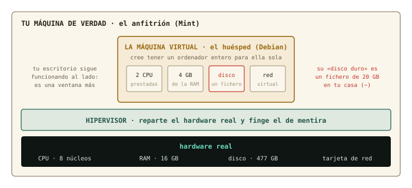
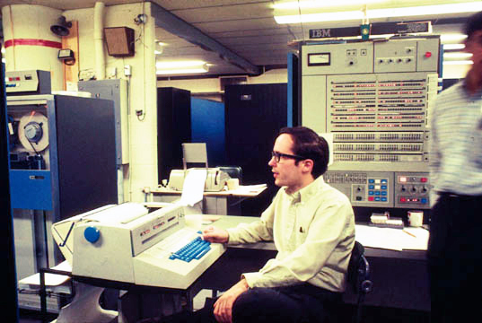
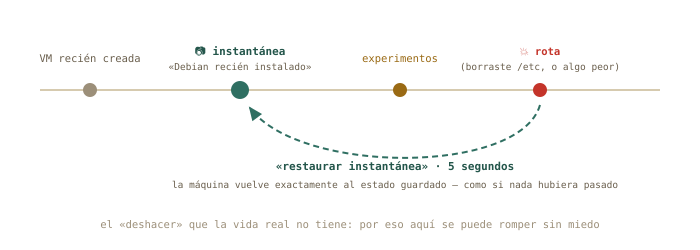
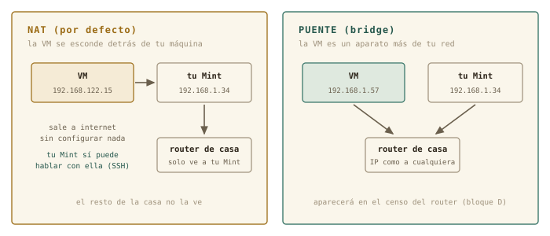

# Tu primera máquina virtual {#sec-cap07}

::: {.lede}
Empieza el bloque C, y con él la parte del curso en la que por fin
está permitido romper cosas. Hoy construyes un ordenador de mentira
dentro de tu ordenador de verdad — con su procesador, su memoria, su
disco y su cable de red, todos fingidos — y conoces el superpoder que
la vida real no tiene: guardar el estado de una máquina y volver a él
cuando algo salga mal. Es el laboratorio de riesgo cero donde harás la
instalación del capítulo 8 y los experimentos de red de los bloques
D y E.
:::

::: {.chapmeta}
⏱ **2–3 h** con ejercicios · requisitos: **capítulos 1–6** · máquina: **tu Linux de diario** (8 GB de RAM y 25 GB libres recomendados)
:::

::: {.objetivos}
**Al terminar esta sesión sabrás**

- Qué es una máquina virtual, qué es un hipervisor, y qué se virtualiza exactamente: CPU, memoria, disco y red.
- Instalar el taller de virtualización de Linux — KVM, QEMU, libvirt y `virt-manager` — desde el Gestor de software o con un solo `apt`.
- Descargar la imagen de instalación de Debian y comprobar que no viene corrupta.
- Crear una máquina virtual desde cero, arrancarla y apagarla sin miedo.
- Usar instantáneas: guardar el estado de la máquina y restaurarlo en segundos.
- Distinguir las dos formas de conectar la VM a la red — NAT y puente — y por qué importarán en los bloques D y E.
- Entender qué te están dando cuando te asignen «una máquina virtual» en la universidad o en una nube.
:::

## Un ordenador dentro del ordenador {#sec-que-es-vm}

Una **máquina virtual** (VM) es un ordenador completo que existe solo
como software: arranca, instala un sistema operativo, se conecta a la
red, se cuelga y se reinicia — todo dentro de una ventana de tu
escritorio. El programa que hace el truco es el **hipervisor**: toma
el hardware real de tu máquina — el **anfitrión** (*host*) — y le
presenta al sistema invitado — el **huésped** (*guest*) — un hardware
de mentira que este cree suyo.

{#fig-hipervisor fig-alt="Esquema del anfitrión con su hardware real, la capa del hipervisor y la máquina virtual con CPU, memoria, disco y red virtuales"}

Cuatro cosas se fingen. **CPU**: la VM recibe un par de núcleos
prestados — no simulados: el procesador real ejecuta sus instrucciones
directamente, por eso va rápido. **Memoria**: un trozo de tu RAM
reservado para ella. **Disco**: un fichero en tu casa que la VM cree
que es un disco físico — con sus particiones, su sistema de ficheros,
su GRUB, todo lo del capítulo 6 dentro. **Red**: una tarjeta de red
virtual, conectada a un cable virtual que llega hasta tu conexión
real. Mientras tanto tu escritorio sigue funcionando al lado: la VM es
una ventana más.

En Linux, el taller de virtualización viene de serie y se llama por
sus piezas:

| Pieza | Qué hace | Analogía |
|-------|----------|----------|
| **KVM** | el hipervisor, dentro del propio kernel: presta la CPU real | el motor |
| **QEMU** | finge los dispositivos: disco, red, pantalla | la carrocería |
| **libvirt** | el gestor: define, arranca, guarda y vigila las máquinas | el cuadro de mandos |
| **virt-manager** | la ventana gráfica sobre libvirt (y `virsh`, su CLI) | el volante |

Nada que descargar de una web ajena, nada que se rompa con la próxima
actualización del kernel: KVM *es* parte de Linux. Y es exactamente lo
que hay debajo de la mayoría de las nubes del mundo — dato que cobrará
sentido al final del capítulo.

::: {.historia}
**◷ Historia · Ordenadores de mentira desde 1967**

La virtualización es más vieja que Unix. En 1967, en el centro de
investigación de IBM en Cambridge, un equipo escribió CP-67 para el
mainframe System/360-67: un sistema que en vez de repartir *tiempo* de
un ordenador entre muchos usuarios — el tiempo compartido del capítulo
4 — le daba a cada uno un ordenador *entero* de mentira, con su propio
sistema operativo dentro. La idea funcionó tan bien que IBM la vendió
durante décadas como VM/370. Luego el PC la olvidó casi treinta años:
resucitó en 1999 con VMware y en 2007 entró en el kernel de Linux con
el nombre de KVM. Hoy, cuando alquilas «un servidor en la nube», estás
alquilando una máquina de mentira exactamente en el sentido de 1967.
:::

{#fig-360 fig-alt="Operador sentado ante la consola de un mainframe IBM System/360-67" width="70%"}

## Montar el taller {#sec-instalar-taller}

Primero, comprueba que tu procesador sabe virtualizar — casi todos los
de la última década saben, pero preguntar cuesta un segundo, y lo
haces con las herramientas de los capítulos 3 y 4:

```terminal
marcos@portatil:~$ grep -c -E 'vmx|svm' /proc/cpuinfo
8
marcos@portatil:~$ lscpu | grep -i virtualiz
Virtualización:                       VT-x
```

Un número mayor que cero (`vmx` es Intel, `svm` es AMD) significa que
sí. Si saliera 0, la virtualización suele estar apagada en el UEFI del
capítulo 6: se activa allí, en la opción llamada *VT-x*, *AMD-V* o
*SVM Mode*.

El taller entero se instala como cualquier programa: abre el
**Gestor de software** de Mint, busca «Gestor de máquinas virtuales»
(o `virt-manager`) e **Instalar**. Fíjate en la lista que te enseña
antes de aceptar: además de la ventana, trae `qemu`, `libvirt` y
compañía — son las dependencias del capítulo 5, y el gestor las
resuelve solo. La misma operación, en una línea de terminal, es el
gesto de siempre:

```terminal
marcos@portatil:~$ sudo apt install virt-manager
[sudo] contraseña de marcos:
Se instalarán los siguientes paquetes NUEVOS:
  libvirt-daemon-system qemu-system-x86 virt-manager virt-viewer ...
```

Al abrir por primera vez el Gestor de máquinas virtuales (menú →
Administración) te pedirá tu contraseña: es el sistema comprobando
que eres administrador antes de dejarte tocar el hipervisor. Funciona
tal cual — pero hay un paso que la instalación gráfica *no* hace por
ti y que conviene dar: añadirte al grupo `libvirt`.

```terminal
marcos@portatil:~$ sudo usermod -aG libvirt marcos
```

Capítulo 4: los grupos son bolsas de permisos, y este es el que
autoriza a manejar máquinas virtuales sin `sudo` — virt-manager deja
de pedirte la contraseña, y `virsh`, su cara de terminal, funciona
directamente. Como con todo cambio de grupos, hace efecto al **cerrar
sesión y volver a entrar**. Después, la comprobación de que todo
respira:

```terminal
marcos@portatil:~$ groups
marcos adm cdrom sudo dip plugdev libvirt
marcos@portatil:~$ virsh list --all
 Id   Nombre   Estado
------------------------
marcos@portatil:~$ virsh net-list --all
 Nombre    Estado   Inicio automático   Persistente
----------------------------------------------------
 default   activo   sí                  sí
```

`virsh` es la cara CLI de libvirt — el mismo cuadro de mandos que
`virt-manager` enseña con ventanas. Una lista vacía de máquinas y una
red `default` activa: el taller está montado.

::: {.truco}
**✚ Truco · Si tu anfitrión es Windows o macOS**

KVM vive en el kernel de Linux, así que en otros sistemas no existe.
Su equivalente allí es **VirtualBox**, gratuito y muy parecido en la
práctica: las mismas ideas de este capítulo — hipervisor, disco como
fichero, instantáneas, NAT frente a puente — con otros nombres en los
menús. Si sigues el curso desde el anexo «Vengo de Windows», lee este
capítulo con VirtualBox abierto al lado: te reconocerás en cada paso.
:::

## La imagen de instalación {#sec-iso}

Para instalar un sistema en una máquina — real o virtual — hace falta
el medio de instalación. Antes era un CD; hoy es un fichero **ISO**:
la imagen exacta, byte a byte, de aquel disco. En un PC real se graba
en un pendrive (capítulo 8); en una VM, el fichero *es* el disco, y se
«inserta» sin más.

Descarga la imagen *netinst* de Debian desde
[debian.org](https://www.debian.org/distrib/) — unos 700 MB: lo mínimo
para arrancar el instalador, que después descargará el resto de la red
— y guárdala en `~/Descargas`. Y antes de usarla, un hábito de físico:
comprueba que llegó intacta. Junto a la ISO, Debian publica un fichero
`SHA256SUMS` con la **huella digital** de cada imagen — un número que
cambia si cambia un solo bit del fichero:

```terminal
marcos@portatil:~/Descargas$ sha256sum debian-13.1.0-amd64-netinst.iso
9b6f1e0c…  debian-13.1.0-amd64-netinst.iso
marcos@portatil:~/Descargas$ grep netinst SHA256SUMS
9b6f1e0c…  debian-13.1.0-amd64-netinst.iso
```

Si las dos huellas coinciden, el fichero es exactamente el que Debian
publicó (el número de versión será el que toque cuando lo descargues).
Si no, se descarga de nuevo — nunca se instala desde una imagen
sospechosa. Es la misma lógica que verificar la calibración antes de
medir.

## Crear la máquina {#sec-crear-vm}

Abre `virt-manager` (menú → Administración → Gestor de máquinas
virtuales, o tecléalo en la terminal). La ventana muestra la conexión
`QEMU/KVM` con la lista vacía. Pulsa **Archivo → Nueva máquina
virtual** y sigue el asistente — es un formulario de cinco pasos, y
cada uno es una decisión que ya entiendes:

1. **Medio de instalación local (imagen ISO)** → *Explorar* → *Buscar
   local* → tu `debian-13.x-amd64-netinst.iso`. Comprobará solo que es
   Debian.
2. **Memoria y CPU**: 4096 MB y 2 CPU es un buen taller. Regla:
   nunca más de la mitad de tu RAM real — la otra mitad la necesita tu
   Mint para seguir vivo al lado.
3. **Disco**: 20 GB. Es el fichero de la figura. Y un detalle
   elegante: el fichero *crece según se usa* — hoy ocupará unos cientos
   de MB aunque diga 20 GB.
4. **Nombre**: `debian-lab`. Sin espacios (capítulo 1: los espacios
   importan). **Selección de red**: *Red virtual 'default': NAT* — la
   opción por defecto, y la correcta hoy.
5. **Finalizar.** La máquina arranca sola: verás en su ventana una
   pantalla azul con el menú del instalador de Debian.

**Y aquí paras.** La instalación es la sesión del capítulo 8 entera;
hoy solo querías ver la máquina *nacer*. Apágala desde el menú de su
ventana: **Máquina virtual → Apagar → Forzar apagado**. En un PC real,
cortar la corriente a un instalador a medias sería una barbaridad;
aquí no hay nada instalado que perder — primer aviso de que las reglas
dentro de la VM son otras.

```terminal
marcos@portatil:~$ virsh list --all
 Id   Nombre       Estado
----------------------------
 -    debian-lab   apagado
marcos@portatil:~$ sudo ls -lh /var/lib/libvirt/images/
-rw------- 1 root root 20G ago 25 12:40 debian-lab.qcow2
marcos@portatil:~$ sudo du -h /var/lib/libvirt/images/debian-lab.qcow2
197M    /var/lib/libvirt/images/debian-lab.qcow2
```

Ahí está el ordenador entero, en un fichero de `/var` — el directorio
de «lo que varía», capítulo 4 — que dice 20 GB pero ocupa 197 MB de
verdad. Ese `du` frente a `ls -l` es el capítulo 6 enseñándote tamaño
nominal frente a espacio real: el fichero es **disperso** (*sparse*),
y solo consume disco a medida que la VM escribe en él.

::: {.aviso}
**△ Cuidado · Lo que vale y lo que no vale en la máquina de mentira**

Dentro de la VM, todo vale: particionar, formatear, borrar `/etc`,
reinstalar — para eso está. Pero dos cosas siguen siendo reales. Su
**consumo**: mientras corre, se lleva la RAM y los núcleos que le
diste (por eso se apaga cuando no se usa). Y su **fichero**: borrarlo
es borrar la máquina; si un día quieres deshacerte de ella, se hace
desde virt-manager (*Eliminar*, marcando borrar el disco) — no con un
`rm` a ciegas en `/var/lib/libvirt/images`. Y la ISO no es la
máquina: es el CD de instalación; puede borrarse cuando ya no la
necesites.
:::

## El superpoder: instantáneas {#sec-instantaneas}

Una **instantánea** (*snapshot*) guarda el estado completo de la
máquina virtual — su disco, y si está encendida, también su memoria —
con un nombre. Después puedes hacer lo que quieras y **volver a ese
estado exacto en segundos**. Es el «deshacer» que un ordenador real no
tiene, y cambia por completo cómo se aprende: el miedo a romper
desaparece, porque romper cuesta cinco segundos de arreglar.

{#fig-instantaneas fig-alt="Línea de tiempo de una máquina virtual con una instantánea guardada, experimentos, una rotura y la vuelta atrás a la instantánea"}

En virt-manager: abre la ventana de la máquina, **Ver → Instantáneas**,
y el botón **+** crea una nueva con el nombre que le pongas. Para
volver: selecciónala y pulsa **Ejecutar instantánea seleccionada**.
En la CLI es igual de sencillo:

```terminal
marcos@portatil:~$ virsh snapshot-create-as debian-lab vm-recien-creada
Instantánea de dominio vm-recien-creada creada
marcos@portatil:~$ virsh snapshot-list debian-lab
 Nombre              Hora de creación             Estado
--------------------------------------------------------
 vm-recien-creada    2026-08-25 12:52:10 +0200    shutoff
```

El protocolo del curso, a partir del capítulo 8: en cuanto Debian esté
instalado y funcionando, instantánea «recién instalado». Cada
experimento arriesgado, instantánea antes. Todo lo que se rompa, se
restaura. Nunca más reinstalar por un error — salvo cuando reinstalar
sea el ejercicio.

## Dos formas de conectarla: NAT y puente {#sec-redes-vm}

Al crear la máquina elegiste *Red virtual 'default': NAT*. Conviene
entender qué elegiste, porque los bloques D y E se apoyan en ello.

{#fig-redes-vm fig-alt="Comparación entre red NAT, donde la máquina virtual se esconde tras el anfitrión, y red puente, donde recibe su propia dirección del router"}

Con **NAT**, libvirt monta una red privada minúscula dentro de tu
máquina — la `default`, con direcciones `192.168.122.x` — y hace de
router entre ella y el mundo: la VM sale a internet sin configurar
nada, tu Mint puede hablar con ella (lo harás por SSH en el capítulo
11), y el resto de la casa ni sabe que existe. Con un **puente**
(*bridge*), la VM se conecta directamente a tu red doméstica y el
router de casa le da una dirección como a cualquier portátil o móvil:
aparecería en el censo de dispositivos del bloque D. Es más «real» y
también más delicado — en portátiles con Wi-Fi da guerra —, así que
el curso trabaja en NAT y deja el puente como experimento opcional.
Puedes ver la red `default` desde el anfitrión, con un comando que
será el protagonista del capítulo 9:

```terminal
marcos@portatil:~$ ip a | grep virbr0
3: virbr0: <NO-CARRIER,BROADCAST,MULTICAST,UP> mtu 1500 ...
    inet 192.168.122.1/24 brd 192.168.122.255 scope global virbr0
```

Tu Mint tiene ahora una segunda tarjeta de red — virtual — con la
dirección `192.168.122.1`: es el router de la red de mentira. Guarda
este dato; cuando en el capítulo 9 hablemos de direcciones y máscaras,
ya tendrás una red propia sobre la que experimentar.

## Qué te dan cuando te dan «una VM» {#sec-vm-remota}

La escena que el diseño de este curso tenía en mente: el grupo de
investigación o el servicio de informática te dice «te hemos creado
una máquina virtual». Ahora sabes exactamente qué es: lo mismo que
acabas de hacer, sobre un anfitrión grande de la universidad o de una
nube, con KVM o un primo suyo debajo. Te darán una dirección, un
usuario y probablemente una clave SSH (capítulo 12), y no verás
ninguna ventana con su pantalla: la máquina existe, pero solo hablarás
con ella por la red. Los núcleos y la memoria que tiene son
«prestados» como los de tu `debian-lab`, y compartes el anfitrión con
otros — el tiempo compartido de 1967, otra vez. Y si te hablan de
**contenedores** (Docker y compañía): son el primo ligero — no fingen
un ordenador entero, comparten el kernel del anfitrión y aíslan solo
un programa. Más rápidos, menos independientes. Vocabulario para
reconocerlos; el curso se queda con las máquinas virtuales.

::: {.truco}
**✚ Truco · Ventanas o comandos, la misma máquina**

`virt-manager` y `virsh` son dos caras de libvirt: todo lo que haces
con clics tiene su orden. Para crear y explorar, la ventana es más
amable; para el servidor sin escritorio del bloque E — donde
gestionarás máquinas solo por SSH — `virsh` es la única cara que hay.
El principio de siempre: aprende el concepto una vez, y elige la
puerta según el momento.
:::

## Práctica: el taller en marcha {#sec-practica-7}

Cuaderno en marcha (`script sesion07.log`). Hoy instalas software y
creas tu laboratorio — nada de lo que hagas toca tu sistema más allá
de instalar paquetes y crear un fichero grande en `/var`.

**Nivel 1 · Lo esencial**

::: {.ejercicio}
**Ejercicio 7.1 · ¿Sabe virtualizar tu procesador?**

Comprueba de dos formas que tu CPU tiene soporte de virtualización, y
anota en el cuaderno cuál de las dos tecnologías tiene (Intel o AMD).
*Pista: `/proc/cpuinfo` con `grep -c`, y `lscpu` con `grep -i`.*

:::: {.solucion}
::: {.callout-tip collapse="true" title="Solución razonada"}
`grep -c -E 'vmx|svm' /proc/cpuinfo` (un número > 0) y
`lscpu | grep -i virtualiz` (`VT-x` para Intel, `AMD-V` para AMD). Si
sale 0 o vacío, la opción está apagada en el UEFI: reinicia, entra en
la configuración (capítulo 6) y actívala.

**Por qué así** — Dos instrumentos distintos para la misma medida,
como siempre. Y fíjate en `/proc`: el capítulo 4 te enseñó que ahí el
kernel te cuenta lo que sabe del hardware — hoy le preguntas por una
capacidad concreta de la CPU.
:::
::::
:::

::: {.ejercicio}
**Ejercicio 7.2 · Montar el taller**

Instala el Gestor de máquinas virtuales por la vía que prefieras —
Gestor de software o `apt` —, ábrelo una vez (te pedirá la
contraseña), añádete al grupo `libvirt`, cierra y vuelve a abrir
sesión, y comprueba con `groups` y `virsh list --all` que estás dentro
y que el taller responde. *Pista: las dos vías instalan exactamente
los mismos paquetes; `usermod -aG` añade sin quitar los grupos que ya
tienes; los grupos nuevos no aparecen hasta reiniciar la sesión.*

:::: {.solucion}
::: {.callout-tip collapse="true" title="Solución razonada"}
Gestor de software → «Gestor de máquinas virtuales» → Instalar (o
`sudo apt install virt-manager`), `sudo usermod -aG libvirt $USER`,
cerrar sesión y entrar. `groups` debe listar `libvirt`; `virsh list
--all` devuelve una tabla vacía sin quejarse. Si protesta con «permiso
denegado» hablando de un *socket*, es que no reiniciaste la sesión.

**Por qué así** — Un paquete, un grupo, una comprobación: el capítulo
5 y el 4 trabajando juntos. `$USER` es la variable de entorno del
capítulo 5 con tu nombre — escribirlo así vale para cualquier usuario.
:::
::::
:::

::: {.ejercicio}
**Ejercicio 7.3 · La imagen, verificada**

Descarga la ISO *netinst* de Debian para amd64 y su fichero
`SHA256SUMS`, y comprueba que la huella coincide. *Pista: `sha256sum
fichero.iso` calcula; `grep netinst SHA256SUMS` te aísla la línea
correcta para compararla a ojo — o deja que `sha256sum -c SHA256SUMS
2> /dev/null | grep netinst` lo compare por ti.*

:::: {.solucion}
::: {.callout-tip collapse="true" title="Solución razonada"}
Las dos huellas deben ser idénticas carácter a carácter. Con
`sha256sum -c`, la línea buena dice `debian-13.x-amd64-netinst.iso: La
suma coincide`; el `2> /dev/null` silencia las quejas por las otras
imágenes del fichero que no descargaste.

**Por qué así** — Nunca se instala desde una imagen sin verificar: una
descarga cortada o manipulada produce instalaciones que fallan de
formas misteriosas. El `2>` del capítulo 3 y el `grep` de siempre te
dan la comprobación en una línea.
:::
::::
:::

::: {.ejercicio}
**Ejercicio 7.4 · Nace `debian-lab`**

Crea la máquina con el asistente (4 GB, 2 CPU, 20 GB, red NAT), deja
que arranque hasta el menú del instalador, mírala un minuto — y
apágala con *Forzar apagado*. Comprueba con `virsh` que existe y está
apagada. *Pista: el asistente son cinco pantallas; si algo no encaja
con el capítulo, avanza igual — cualquier decisión se cambia después
en la configuración de la máquina.*

:::: {.solucion}
::: {.callout-tip collapse="true" title="Solución razonada"}
`virsh list --all` → `debian-lab   apagado`. Si la máquina no arranca
con un error sobre KVM, vuelve al 7.1: la virtualización está apagada
en el UEFI. Si el asistente no encuentra la ISO, pulsa *Buscar local*
y navega hasta `~/Descargas`.

**Por qué así** — Acabas de hacer, con clics, exactamente lo que el
servicio de informática hace cuando te «da una VM». La única
diferencia es la escala del anfitrión.
:::
::::
:::

::: {.ejercicio}
**Ejercicio 7.5 · Un disco de 20 GB que pesa 200 MB**

Localiza el fichero de disco de tu máquina y mide su tamaño de las dos
maneras del capítulo 6: el nominal (`ls -lh`) y el real (`du -h`).
Explica en tu cuaderno la diferencia. *Pista: los discos de libvirt
viven en `/var/lib/libvirt/images/`, y ese directorio es de root.*

:::: {.solucion}
::: {.callout-tip collapse="true" title="Solución razonada"}
`sudo ls -lh /var/lib/libvirt/images/` dice 20G; `sudo du -h
/var/lib/libvirt/images/debian-lab.qcow2` dice unos cientos de MB. El
fichero es *disperso*: reserva 20 GB de tamaño lógico pero solo ocupa
lo que la VM ha escrito de verdad. Crecerá durante la instalación del
capítulo 8.

**Por qué así** — Tamaño nominal frente a ocupación real: un físico
distingue una capacidad de una medida sin pestañear. Y `sudo` porque
el directorio es del sistema (`/var`, capítulo 4): las máquinas de
todos los usuarios viven ahí.
:::
::::
:::

::: {.ejercicio}
**Ejercicio 7.6 · La primera instantánea**

Con la máquina apagada, crea una instantánea llamada `vm-recien-creada`
desde virt-manager, y compruébala desde la terminal. Después, borra
esa instantánea (será inútil en cuanto instales Debian) y verifica que
desapareció. *Pista: `virsh snapshot-list debian-lab` lista; `virsh
snapshot-delete debian-lab NOMBRE` borra.*

:::: {.solucion}
::: {.callout-tip collapse="true" title="Solución razonada"}
En virt-manager: ventana de la máquina → Ver → Instantáneas → **+**.
En terminal: `virsh snapshot-list debian-lab` la muestra;
`virsh snapshot-delete debian-lab vm-recien-creada` la elimina, y la
lista vuelve a estar vacía.

**Por qué así** — Has recorrido el ciclo completo — crear, comprobar,
borrar — con las dos caras de libvirt. El que importa, «recién
instalado», lo harás al final del capítulo 8, y será el punto de
retorno de todo el resto del curso.
:::
::::
:::

**Nivel 2 · Para curiosos (opcional)**

::: {.ejercicio}
**Ejercicio 7.7 · La máquina, por dentro de libvirt**

libvirt guarda la definición de cada máquina como texto. Con `virsh
dumpxml debian-lab` y las tuberías esenciales del capítulo 3, averigua
cuánta memoria tiene asignada, cuántas CPU, y dónde está su disco.
*Pista: `| grep -i memory`, `| grep vcpu`, `| grep -i qcow2`.*

:::: {.solucion}
::: {.callout-tip collapse="true" title="Solución razonada"}
`virsh dumpxml debian-lab | grep -i memory` → `<memory
unit='KiB'>4194304</memory>` (4 GB en KiB); `| grep vcpu` → `2`;
`| grep qcow2` → la ruta en `/var/lib/libvirt/images/`.

**Por qué así** — «Todo es un fichero de texto» llega hasta aquí: tu
ordenador de mentira es, en última instancia, un documento XML que
describe su hardware. Cambiar la RAM de la máquina es editar un
número — y `grep` es tu lupa para encontrarlo. Cierra el cuaderno:
`exit`, `sesion07.log` a la colección.
:::
::::
:::

## Autocomprobación {#sec-quiz-7}

::: {.content-visible when-format="html"}

Marca una respuesta por pregunta; la corrección es inmediata.

```{=html}
<div class="quiz" id="quiz-cap07">
  <div class="qz"><p class="qq" data-n="1">El hipervisor es…</p>
    <label><input type="radio" name="z1" value="a"><span>el sistema operativo que instalas dentro de la VM</span></label>
    <label><input type="radio" name="z1" value="b"><span>el programa que reparte el hardware real y presenta hardware de mentira al huésped</span></label>
    <label><input type="radio" name="z1" value="c"><span>la ventana donde se ve la máquina virtual</span></label>
    <div class="fb good"><b>Correcto.</b> En Linux se llama KVM y vive en el kernel; la ventana es virt-manager, y lo que instalas dentro es el huésped.</div>
    <div class="fb bad"><b>No exactamente.</b> El hipervisor es la capa intermedia: toma el hardware del anfitrión y finge el de la VM. Vuelve a la figura de las capas.</div>
  </div>
  <div class="qz"><p class="qq" data-n="2">El disco duro de tu máquina virtual es…</p>
    <label><input type="radio" name="z2" value="a"><span>una partición que se crea en tu disco real</span></label>
    <label><input type="radio" name="z2" value="b"><span>un fichero (<code>.qcow2</code>) en <code>/var/lib/libvirt/images</code></span></label>
    <label><input type="radio" name="z2" value="c"><span>un trozo de la RAM</span></label>
    <div class="fb good"><b>Correcto.</b> Un fichero disperso que crece según se usa: 20 GB nominales, unos cientos de MB reales hasta que instales algo.</div>
    <div class="fb bad"><b>No exactamente.</b> Es un fichero normal en <code>/var</code>. Ni particiones nuevas ni RAM — por eso crear y borrar máquinas es tan barato.</div>
  </div>
  <div class="qz"><p class="qq" data-n="3">Una instantánea sirve para…</p>
    <label><input type="radio" name="z3" value="a"><span>guardar el estado de la VM y volver a él cuando quieras</span></label>
    <label><input type="radio" name="z3" value="b"><span>hacer una captura de pantalla de la VM</span></label>
    <label><input type="radio" name="z3" value="c"><span>copiar la VM a otro ordenador</span></label>
    <div class="fb good"><b>Correcto.</b> El «deshacer» que la vida real no tiene: el protocolo del bloque C es instantánea antes de cada experimento arriesgado.</div>
    <div class="fb bad"><b>No exactamente.</b> Guarda disco (y memoria, si está encendida) con un nombre, y permite restaurarlo en segundos. Nada de fotos ni copias a otro sitio.</div>
  </div>
  <div class="qz"><p class="qq" data-n="4">Con la red NAT por defecto de libvirt…</p>
    <label><input type="radio" name="z4" value="a"><span>la VM recibe una IP del router de casa como cualquier otro aparato</span></label>
    <label><input type="radio" name="z4" value="b"><span>la VM sale a internet y el anfitrión puede hablar con ella, pero el resto de la casa no la ve</span></label>
    <label><input type="radio" name="z4" value="c"><span>la VM no tiene red</span></label>
    <div class="fb good"><b>Correcto.</b> Red privada <code>192.168.122.x</code> dentro de tu máquina, con tu Mint como router. Lo de recibir IP del router de casa es el modo puente.</div>
    <div class="fb bad"><b>No exactamente.</b> NAT esconde la VM detrás del anfitrión: internet sí, anfitrión↔VM sí, resto de la casa no. Que la vea el router es el puente.</div>
  </div>
  <div class="qz"><p class="qq" data-n="5">Te añaden al grupo <code>libvirt</code> y <code>virsh</code> sigue dando «permiso denegado». Lo más probable:</p>
    <label><input type="radio" name="z5" value="a"><span>hay que reinstalar virt-manager</span></label>
    <label><input type="radio" name="z5" value="b"><span>no has cerrado y vuelto a abrir sesión: los grupos nuevos no se aplican hasta entonces</span></label>
    <label><input type="radio" name="z5" value="c"><span>necesitas usar <code>sudo</code> siempre con <code>virsh</code></span></label>
    <div class="fb good"><b>Correcto.</b> La pertenencia a grupos se lee al iniciar sesión (capítulo 4). Cierra sesión, entra, y <code>groups</code> te lo confirmará.</div>
    <div class="fb bad"><b>No exactamente.</b> Es el clásico de los grupos: se aplican al iniciar sesión. Ni reinstalar ni <code>sudo</code> permanente — reinicia la sesión.</div>
  </div>
  <div class="qz"><p class="qq" data-n="6">Un contenedor (Docker) se diferencia de una VM en que…</p>
    <label><input type="radio" name="z6" value="a"><span>es lo mismo con otro nombre</span></label>
    <label><input type="radio" name="z6" value="b"><span>comparte el kernel del anfitrión y aísla solo un programa, en vez de fingir un ordenador entero</span></label>
    <label><input type="radio" name="z6" value="c"><span>necesita hardware especial</span></label>
    <div class="fb good"><b>Correcto.</b> El primo ligero: más rápido, menos independiente. El curso trabaja con VMs porque son el ordenador completo que quieres aprender a instalar.</div>
    <div class="fb bad"><b>No exactamente.</b> Un contenedor no tiene kernel propio: usa el del anfitrión y aísla un programa. Una VM finge la máquina entera, kernel incluido.</div>
  </div>
</div>
<script>
(function(){
  const OK = {z1:"b", z2:"b", z3:"a", z4:"b", z5:"b", z6:"b"};
  document.querySelectorAll("#quiz-cap07 .qz input").forEach(i => {
    i.addEventListener("change", () => {
      const qz = i.closest(".qz");
      qz.classList.remove("ok","ko");
      qz.classList.add(i.value === OK[i.name] ? "ok" : "ko");
    });
  });
})();
</script>
```

:::

:::: {.content-visible when-format="pdf"}

Responde de memoria; las respuestas están al final del capítulo.

1.  El hipervisor es…
    a)  el sistema operativo que instalas dentro de la VM
    b)  el programa que reparte el hardware real y presenta hardware de mentira al huésped
    c)  la ventana donde se ve la máquina virtual

2.  El disco duro de tu máquina virtual es…
    a)  una partición que se crea en tu disco real
    b)  un fichero (`.qcow2`) en `/var/lib/libvirt/images`
    c)  un trozo de la RAM

3.  Una instantánea sirve para…
    a)  guardar el estado de la VM y volver a él cuando quieras
    b)  hacer una captura de pantalla de la VM
    c)  copiar la VM a otro ordenador

4.  Con la red NAT por defecto de libvirt…
    a)  la VM recibe una IP del router de casa como cualquier otro aparato
    b)  la VM sale a internet y el anfitrión puede hablar con ella, pero el resto de la casa no la ve
    c)  la VM no tiene red

5.  Te añaden al grupo `libvirt` y `virsh` sigue dando «permiso denegado». Lo más probable:
    a)  hay que reinstalar virt-manager
    b)  no has cerrado y vuelto a abrir sesión
    c)  necesitas usar `sudo` siempre con `virsh`

6.  Un contenedor (Docker) se diferencia de una VM en que…
    a)  es lo mismo con otro nombre
    b)  comparte el kernel del anfitrión y aísla solo un programa
    c)  necesita hardware especial

::::

::: {.solucion-final}
**Autocomprobación (test de la sección 7.9)** — Respuestas: 1 b · 2 b · 3 a · 4 b · 5 b · 6 b.
:::

::: {.proxima}
**La próxima sesión**

Tienes una máquina vacía con el instalador de Debian esperando en su
bandeja. En el capítulo 8 la instalas de verdad — y no con el botón de
«siguiente, siguiente»: particionando a mano con lo que aprendiste en
el capítulo 6, eligiendo dónde va la partición EFI, viendo a GRUB
instalarse. Después la romperás y la reinstalarás hasta que aburra,
y saldrás con la lista de comprobación para el día en que lo hagas en
un PC real. Guarda `sesion07.log`.
:::

::: {.pie-piloto}
cap. 7 v0.1 · piloto — anota tiempo real invertido, dudas y erratas junto a tu `sesion07.log`
:::
