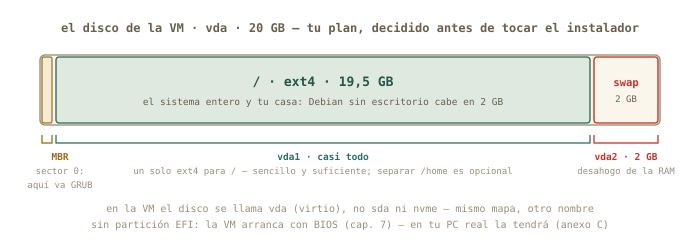
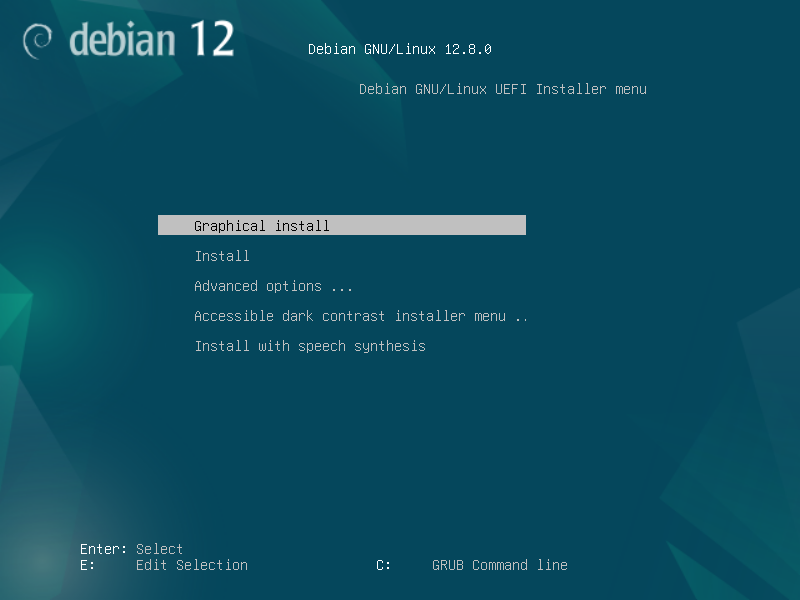
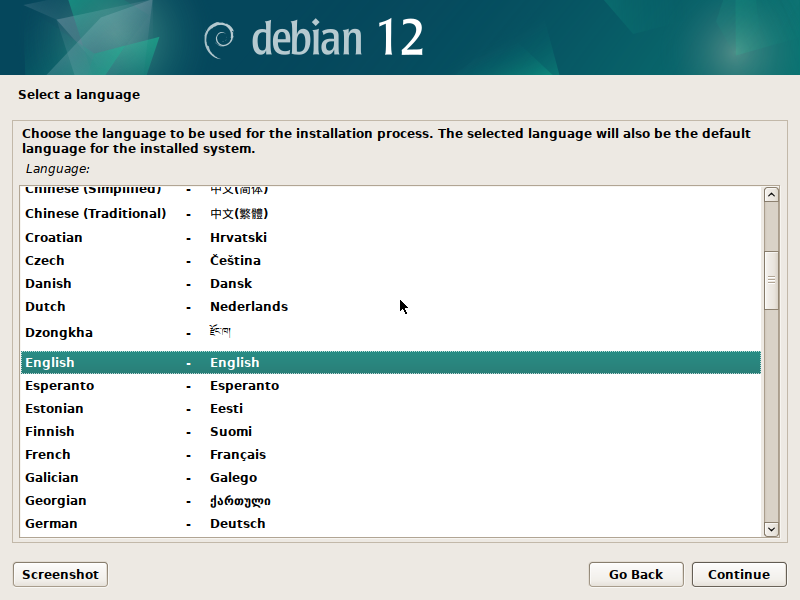
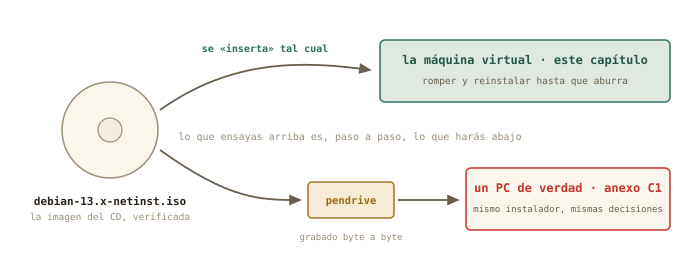
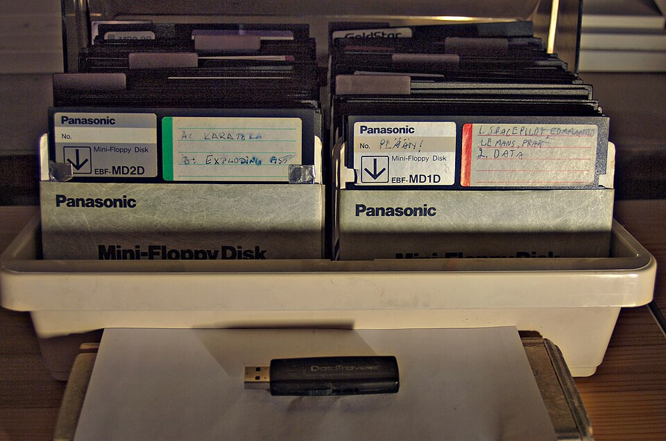

# Instalar Linux de verdad {#sec-cap08}

::: {.lede}
Hasta hoy, tu Linux te lo instalaron. Esta sesión lo instalas tú —
en la máquina virtual del capítulo 7, sin red de seguridad más que
las instantáneas, y sin el botón de «siguiente, siguiente»: eligiendo
particiones a mano con el mapa del capítulo 6, viendo dónde va la
partición EFI, mirando a GRUB instalarse. Después la romperás a
propósito y la reinstalarás, porque la segunda vez tarda un cuarto de
hora y la tercera ya aburre. Y saldrás con la lista de comprobación
para el día en que lo hagas en un ordenador de verdad.
:::

::: {.chapmeta}
⏱ **3 h** con ejercicios (la instalación en sí, 20–30 min) · requisitos: **capítulos 6 y 7** · máquina: **la VM `debian-lab`** — nada de hoy toca tu Mint
:::

::: {.objetivos}
**Al terminar esta sesión sabrás**

- Decidir un plan de particiones *antes* de tocar el instalador — y por qué EFI + raíz + swap es el plan que vale casi siempre.
- Recorrer el instalador de Debian entero: idioma, red, usuarios, particionado manual, espejo, selección de programas, GRUB.
- Por qué se deja la contraseña de `root` vacía, y qué consigue eso.
- Instalar un Debian *sin escritorio* — un servidor — con SSH desde el primer día, y comprobar que respira.
- Qué se rompe cuando se rompe el arranque, y cómo la instantánea lo convierte en un susto de cinco segundos.
- Qué cambia — y qué no — cuando lo hagas en un PC real desde un pendrive.
:::

## El plan, antes que el instalador {#sec-plan}

Los instaladores modernos permiten no pensar: «usar el disco entero»,
siguiente, siguiente. Hoy no vas a pulsar ese botón, y la razón es la
misma por la que un físico no arranca un montaje sin un esquema:
**cuando lo hagas en tu PC de verdad, con un Windows al lado o un
disco con datos, «usar el disco entero» será exactamente lo que no
quieres.** Se decide el plan en papel, se ejecuta en la VM, se repite
hasta que sea rutina.

Lo que instalas: **Debian 13** — la madre de tu Mint (capítulo 5) —,
imagen *netinst*, **sin escritorio**. Sí, sin escritorio: un servidor
al que hablarás por terminal y, a partir del capítulo 11, por SSH.
Es lo que te encontrarás en el clúster y en la nube, y es lo que
construye el proyecto final. Nombre de la máquina: `debian-lab`.
Usuario: el tuyo.

{#fig-particiones fig-alt="Disco virtual de 20 GB dividido en partición EFI de 512 MB, raíz ext4 con casi todo el espacio, y swap de 2 GB"}

Tres particiones, y cada decisión la tomas con el capítulo 6 en la
cabeza: la **EFI** (512 MB, FAT32, montada en `/boot/efi`) es el buzón
donde GRUB dejará su llave; la **raíz** (`/`, ext4) se lleva casi
todo; y **swap** (2 GB) es el desahogo de la RAM cuando se llena —
en una VM de 4 GB, un seguro barato. ¿Y `/home` separado? Es una
opción respetable — permite reinstalar el sistema sin tocar tus datos
— pero complica el reparto de espacio; para el taller, un solo `/`
basta. Un detalle nuevo: dentro de la VM el disco no se llama `sda`
ni `nvme0n1` sino **`vda`** — *virtio disk*, el disco de mentira del
hipervisor. Mismo mapa, otro nombre.

## Arrancar el instalador {#sec-arrancar-instalador}

Abre virt-manager, selecciona `debian-lab` y pulsa el triángulo de
*Ejecutar* (o, desde la terminal, `virsh start debian-lab` y abre su
ventana). La ISO sigue en la bandeja, así que la VM arranca en el
menú del instalador: *Graphical install*, *Install*, y opciones
avanzadas. Los dos primeros son el mismo instalador con dos caras —
la gráfica es más cómoda con ratón; la de texto funciona en cualquier
sitio, incluida una consola remota sin ventanas. Elige la que quieras;
las pantallas y las decisiones son idénticas.

{#fig-menu-iso fig-alt="Menú de arranque UEFI del instalador de Debian con las opciones Graphical install e Install" width="70%"}

{#fig-instalador fig-alt="Pantalla del instalador gráfico de Debian" width="70%"}

Las primeras pantallas son las fáciles, y una de ellas esconde la
decisión más importante del día:

1. **Idioma, país, teclado**: español, España, español. (Un
   profesional a veces deja el *sistema* en inglés para buscar errores
   en internet con más éxito; para el curso, español, que es como
   verás los mensajes en los ejemplos.)
2. **Red**: la VM recibe dirección sola de la red NAT — es el DHCP del
   capítulo 9, adelantado. Nombre de la máquina: `debian-lab`. Dominio:
   vacío.
3. **Contraseña de root: déjala vacía.** No es un descuido, es un
   truco documentado de Debian: si `root` queda sin contraseña, el
   instalador **desactiva la cuenta de root y añade a tu usuario al
   grupo `sudo`** — exactamente el modelo de tu Mint, el del capítulo
   4. Si pones contraseña, tendrás un root activo y un usuario *sin*
   sudo, y el primer `sudo apt` te dará un disgusto.
4. **Tu usuario**: nombre completo, nombre de usuario (`marcos`),
   contraseña. Zona horaria: la tuya.

## Particionar a mano {#sec-particionar}

Llega la pantalla que asusta a todo el mundo, y que tú vas a leer con
calma. Elige **Manual**. Verás el disco — `vda`, 20 GB, «Virtio Block
Device» — sin particiones. El procedimiento, pantalla a pantalla:

1. Selecciona el disco `vda` → **Crear una nueva tabla de particiones
   vacía** → sí → tipo **gpt** (la tabla moderna que UEFI espera,
   capítulo 6). Aparece una línea «ESPACIO LIBRE» de 20 GB.
2. Selecciona el espacio libre → **Crear una partición nueva** →
   tamaño `512 MB` → al principio → *Utilizar como:* **Partición del
   sistema EFI** → *Se ha terminado de definir la partición*.
3. Espacio libre otra vez → partición nueva → tamaño `17.5 GB` (o lo
   que quede menos 2 GB) → *Utilizar como:* **ext4** → *Punto de
   montaje:* `/` → terminar.
4. Espacio libre restante → partición nueva → todo lo que queda →
   *Utilizar como:* **área de intercambio** (swap) → terminar.
5. Compara la tabla con la figura: `vda1` EFI, `vda2` ext4 `/`, `vda3`
   swap. **Finalizar el particionado y escribir los cambios en el
   disco** → «¿Desea escribir los cambios?» → **Sí**.

Ese último *Sí* es el punto sin retorno de cualquier instalación: a
partir de ahí el disco se formatea. En tu VM el disco es un fichero
vacío y el susto es gratis; en tu PC real será el momento de haber
leído tres veces qué disco has elegido — vuelve a esta frase cuando
llegue el día.

::: {.aviso}
**△ Cuidado · Lo que este capítulo no hace en tu Mint**

Ni una sola orden de hoy se ejecuta en tu máquina real: todo pasa
dentro de la ventana de `debian-lab`. Si en algún momento ves el
prompt `marcos@portatil`, estás fuera de la VM — para en seco. Dentro,
el prompt dirá `marcos@debian-lab`. Ese nombre de máquina que pusiste
en el instalador acaba de convertirse en tu cinturón de seguridad.
:::

## Espejo, programas y GRUB {#sec-espejo-grub}

Con el disco listo, el instalador copia el sistema base y hace las
últimas preguntas:

- **Réplica de Debian** (*mirror*, el espejo): el repositorio del
  capítulo 5, en su versión Debian. `deb.debian.org` sirve; proxy,
  vacío. De aquí descargará todo lo que no cabía en la netinst.
- **Concurso de popularidad**: no.
- **Selección de programas** — la pantalla decisiva del *servidor*.
  **Desmarca** *Entorno de escritorio Debian* y *GNOME* (vienen
  marcados). **Marca** *Servidor SSH* — el bloque E te lo agradecerá —
  y *Utilidades estándar del sistema*. Nada más.
- **Cargador de arranque**: arrancaste la VM en modo UEFI, así que
  GRUB se instala solo en la partición EFI que creaste. Si pregunta
  por «forzar la instalación en la ruta de medios extraíbles», no.

Reinicia cuando lo pida. La ISO se expulsa sola, y en el primer
arranque desde el disco recién estrenado verás, durante unos segundos,
el menú de GRUB — el eslabón del capítulo 6 que hoy has puesto tú.
Es el mismo menú de la figura anterior, pero ahora sirve *tu* sistema
en vez del instalador.

## El primer arranque: comprobar que respira {#sec-primer-arranque}

Sin escritorio, el sistema te recibe con una consola de texto y un
`login:`. Entra con tu usuario, y pásale la revisión del bloque B —
son tus comandos, sobre tu instalación:

```terminal
marcos@debian-lab:~$ lsblk
NAME   MAJ:MIN RM  SIZE RO TYPE MOUNTPOINTS
vda    254:0    0   20G  0 disk
├─vda1 254:1    0  512M  0 part /boot/efi
├─vda2 254:2    0 17,5G  0 part /
└─vda3 254:3    0    2G  0 part [SWAP]
marcos@debian-lab:~$ df -h /
S.ficheros     Tamaño Usados  Disp Uso% Montado en
/dev/vda2         17G   1,3G   15G   8% /
marcos@debian-lab:~$ ip a | grep "inet "
    inet 127.0.0.1/8 scope host lo
    inet 192.168.122.15/24 brd 192.168.122.255 scope global dynamic enp1s0
marcos@debian-lab:~$ systemctl status ssh | head -3
● ssh.service - OpenBSD Secure Shell server
     Loaded: loaded (/lib/systemd/system/ssh.service; enabled)
     Active: active (running) since Tue 2026-08-25 19:02:11 CEST
```

Léelo como el parte de un experimento que ha salido bien: las tres
particiones montadas donde las pusiste; un sistema completo que ocupa
1,3 GB; una dirección `192.168.122.x` — la red NAT del capítulo 7,
repartida por tu Mint —; y un servidor SSH ya activo, esperando al
capítulo 11. Pon la instalación al día con el gesto del capítulo 5
(`sudo apt update && sudo apt upgrade`) — y fíjate en que `sudo`
funciona: el truco de la contraseña vacía de root ha hecho su efecto.

Y ahora, el protocolo del capítulo 7. Apaga la máquina con
`sudo poweroff` — un servidor se apaga desde dentro, no desde el
botón —, y en virt-manager crea la instantánea **`recien-instalado`**.
Es el punto de retorno del resto del curso.

::: {.truco}
**✚ Truco · Dos cosas que verás y no te esperabas**

La consola de texto no muestra nada mientras tecleas la contraseña —
ni asteriscos: es normal, escribe y pulsa Intro. Y la ventana de la
VM se queda con tu ratón y tu teclado cuando haces clic dentro: la
tecla para soltarlos es <kbd>Ctrl</kbd> derecho (virt-manager lo
indica en la barra de título). Ambas cosas son mucho más frecuentes
de lo que parece: la primera pasa en todo servidor, la segunda en
toda VM.
:::

## Romper, mirar, restaurar {#sec-romper}

Hay una cosa que un instalador nunca enseña: **qué pasa cuando se
rompe**. Hoy sí. Restaura la instantánea si has hecho pruebas, arranca
la VM, entra, y haz lo impensable — con el capítulo 6 en mente:

```terminal
marcos@debian-lab:~$ sudo rm -rf /boot
marcos@debian-lab:~$ ls /boot
ls: no se puede acceder a '/boot': No existe el fichero o el directorio
marcos@debian-lab:~$ sudo reboot
```

Acabas de borrar el kernel y la configuración de GRUB. El sistema
sigue funcionando *hasta que se apaga*: todo lo que necesitaba ya
estaba cargado en RAM. Pero al reiniciar, la cadena del capítulo 6 se
rompe en el segundo eslabón: GRUB no encuentra el kernel, y te quedas
en su consola de emergencia (`grub>`) o en un aviso del UEFI. Míralo
bien. Es la pantalla que aterroriza a quien no sabe qué es GRUB — y tú
sabes exactamente qué falta y por qué.

Ahora, desde virt-manager: *Forzar apagado* → Instantáneas →
`recien-instalado` → *Ejecutar*. Arranca. Cinco segundos, y `/boot`
está de vuelta como si nada. Ese es el bloque C entero en una escena:
el miedo a romper ha desaparecido porque romper cuesta cinco segundos.

## Del ensayo al ordenador de verdad {#sec-pc-real}

Todo lo que has hecho hoy es, paso a paso, lo que harás el día que
instales Linux en un PC físico. Cambian tres cosas — la ISO viaja en
un pendrive, el disco tiene nombre real y quizá un Windows dentro, y
no hay instantánea que te salve — y por eso existe el
[anexo C1](../anexos/anexo-c1-pc-real.qmd): la lista de comprobación
completa para ese día, con la grabación del pendrive por la vía
gráfica y por terminal.

{#fig-dos-caminos fig-alt="La ISO de Debian va directa a la máquina virtual, o grabada en un pendrive hacia un PC físico"}

::: {.historia}
**◷ Historia · De ochenta disquetes a un pendrive**

Instalar Linux en 1994 empezaba por descargar decenas de imágenes de
disquete — Slackware llegó a necesitar más de cincuenta, en series con
nombres como *A*, *AP*, *D*, *N* — y grabarlas una a una, rezando para
que ninguna viniera mal. El CD (1995) lo redujo a un disco; el
pendrive de arranque, a un fichero copiado byte a byte. Lo que no ha
cambiado en treinta años es la parte que hoy has practicado: decidir
las particiones, elegir el cargador de arranque, y aguantar el pulso
en el «¿desea escribir los cambios?». Los soportes se encogen; las
decisiones son las mismas.
:::

{#fig-disquetes fig-alt="Caja con decenas de disquetes de cinco pulgadas y cuarto y un pendrive USB al lado" width="75%"}

## Práctica: la sala de operaciones {#sec-practica-8}

Cuaderno en marcha *en tu Mint* (`script sesion08.log`): anota ahí
tus decisiones y tiempos; dentro de la VM no hace falta grabar nada.

**Nivel 1 · Lo esencial**

::: {.ejercicio}
**Ejercicio 8.1 · El plan, por escrito**

Antes de arrancar el instalador, escribe en tu cuaderno la tabla de
particiones que vas a crear: nombre de dispositivo, tamaño, sistema de
ficheros y punto de montaje de cada una. Y dos decisiones más: nombre
de la máquina y contraseña de root (vacía, y por qué). *Pista: la
figura del plan tiene todo; el «por qué» de root está en la sección
de arrancar el instalador.*

:::: {.solucion}
::: {.callout-tip collapse="true" title="Solución razonada"}
`vda1` 512 MB · FAT32 · `/boot/efi` (EFI) — `vda2` ~17,5 GB · ext4 ·
`/` — `vda3` 2 GB · swap. Máquina `debian-lab`. Root vacío: Debian
desactiva root y da `sudo` a tu usuario, como en Mint.

**Por qué así** — El plan escrito es lo que separa una instalación de
una apuesta. En el PC real añadirás una columna: «¿qué había antes en
esa partición?» — y ahí es donde el hábito te salvará los datos.
:::
::::
:::

::: {.ejercicio}
**Ejercicio 8.2 · La instalación**

Ejecuta la instalación completa siguiendo las secciones del capítulo
— particionado manual, sin escritorio, con servidor SSH — y anota en
el cuaderno cuánto ha tardado y en qué pantalla dudaste. *Pista: si
en el particionado te pierdes, «Deshacer los cambios realizados a las
particiones» vuelve al principio sin coste; y si algo sale mal de
verdad, *Forzar apagado* y volver a arrancar la VM reinicia el
instalador desde cero.*

:::: {.solucion}
::: {.callout-tip collapse="true" title="Solución razonada"}
Entre 20 y 40 minutos la primera vez, gran parte esperando descargas
del espejo. Las dudas típicas: la pantalla de root (vacío), el tamaño
de la raíz (lo que quede menos el swap) y la selección de programas
(desmarcar el escritorio). Al terminar, el `login:` en consola de
texto es la señal de éxito.

**Por qué así** — La primera instalación siempre es lenta y torpe; la
segunda (ejercicio 8.5) es donde se nota que has aprendido. Por eso
el diseño de este capítulo insiste en repetir.
:::
::::
:::

::: {.ejercicio}
**Ejercicio 8.3 · El parte del primer arranque**

Entra en `debian-lab` y ejecuta la revisión del capítulo: `lsblk`,
`df -h /`, `ip a | grep "inet "` y `systemctl status ssh`. Copia los
cuatro resultados al cuaderno y compáralos con tu plan del 8.1.
Después, actualiza el sistema con `apt`. *Pista: son exactamente los
comandos de los capítulos 5 y 6, ahora sobre una instalación tuya.*

:::: {.solucion}
::: {.callout-tip collapse="true" title="Solución razonada"}
Las tres particiones montadas según el plan; alrededor de 1,3 GB
usados; una dirección `192.168.122.x`; y `ssh.service` en *active
(running)*. `sudo apt update && sudo apt upgrade` debe funcionar sin
pedir nada raro: la prueba de que el truco de root funcionó.

**Por qué así** — Cada comando verifica una decisión del instalador:
particiones, tamaño, red, SSH. Un físico no da por bueno un montaje
sin medirlo; tú tampoco das por buena una instalación.
:::
::::
:::

::: {.ejercicio}
**Ejercicio 8.4 · La instantánea que importa**

Apaga la VM desde dentro (`sudo poweroff`) y crea la instantánea
`recien-instalado`. Compruébala con `virsh` desde tu Mint. *Pista:
capítulo 7, sección de instantáneas — con la máquina apagada, la
instantánea guarda el disco y es la más limpia de restaurar.*

:::: {.solucion}
::: {.callout-tip collapse="true" title="Solución razonada"}
Ver → Instantáneas → **+** → nombre `recien-instalado`. En Mint:
`virsh snapshot-list debian-lab` la muestra con estado `shutoff`.

**Por qué así** — Es el punto de retorno de todo lo que queda de
curso: los experimentos de red del bloque D y el servidor del bloque E
parten de aquí. Restaurarla es siempre una opción legítima.
:::
::::
:::

**Nivel 2 · El reto**

::: {.ejercicio}
**Ejercicio 8.5 · Romper el arranque**

Con la instantánea a salvo: borra `/boot`, reinicia, y observa
exactamente dónde se rompe la cadena del capítulo 6. Describe la
pantalla en el cuaderno. Después restaura la instantánea y comprueba
que `/boot` está de vuelta. *Pista: la orden está en la sección
«Romper, mirar, restaurar». Antes de teclearla, mira el prompt: debe
decir `debian-lab`.*

:::: {.solucion}
::: {.callout-tip collapse="true" title="Solución razonada"}
`sudo rm -rf /boot`, `sudo reboot` → GRUB arranca (su llave sigue en
la partición EFI, que no has tocado) pero no encuentra el kernel: te
deja en `grub>` o en un error de «file not found». Forzar apagado →
restaurar `recien-instalado` → `ls /boot` muestra el kernel
(`vmlinuz-…`) y la carpeta `grub` como si nada.

**Por qué así** — Ver romperse un eslabón concreto de la cadena
convierte «no arranca» en «falta el kernel, GRUB sigue ahí»: un
diagnóstico. Y la restauración es la demostración práctica de para
qué sirve el bloque C.
:::
::::
:::

::: {.ejercicio}
**Ejercicio 8.6 · La segunda instalación, cronometrada**

Borra la máquina entera desde virt-manager (Eliminar, marcando borrar
el disco), vuelve al capítulo 7 para crearla de nuevo, y reinstala
Debian desde cero — esta vez con `/home` en su propia partición de
5 GB — sin mirar el capítulo más que para lo imprescindible. Anota el
tiempo. *Pista: el plan cambia en una línea: la raíz se queda con
~12,5 GB y `/home` recibe 5 GB, ext4, punto de montaje `/home`. Crea
las cuatro particiones en orden: EFI, raíz, home, swap.*

:::: {.solucion}
::: {.callout-tip collapse="true" title="Solución razonada"}
Normalmente la mitad del tiempo de la primera vez, y `lsblk` mostrará
`vda3` montado en `/home`. Renueva la instantánea `recien-instalado`
sobre esta máquina — es la definitiva.

**Por qué así** — «Romperla y reinstalar hasta que aburra» era el
objetivo declarado del capítulo. La variante del `/home` separado
enseña el matiz que más se discute en foros — y te deja decidir con
criterio propio, que es lo único que cuenta.
:::
::::
:::

**Nivel 3 · Opcional · el pendrive real**

::: {.ejercicio}
**Ejercicio 8.7 · El pendrive de arranque (sin instalar nada)**

Siguiendo el anexo C1, graba la ISO en un pendrive que puedas borrar,
arranca tu portátil desde él hasta el menú del instalador — **y sal
sin elegir nada**: apaga y arranca de nuevo tu Mint. Objetivo: haber
visto el menú de arranque del UEFI y el instalador en hardware real
sin tocar un solo byte de tu disco. *Pista: en el anexo tienes las dos
vías — la aplicación «Discos» de Mint y la orden `dd` — y la regla de
oro: `lsblk` antes y después de pinchar el pendrive para estar seguro
de su nombre.*

:::: {.solucion}
::: {.callout-tip collapse="true" title="Solución razonada"}
El pendrive aparece como `sda` (o `sdb`) al pinchar; se graba con
«Discos → Restaurar imagen de disco» o con `sudo dd if=debian….iso
of=/dev/sdX bs=4M status=progress` (con la X correcta, verificada dos
veces); se reinicia pulsando la tecla del menú de arranque (F12, F2 o
Esc según la marca) y se elige el pendrive. Verás el mismo menú que en
la VM; *Ctrl+Alt+Supr* o apagar te devuelve a Mint intacto.

**Por qué así** — Es el ensayo general con el vestuario de verdad, y
la única parte del capítulo con un riesgo real: equivocar la letra del
pendrive en `dd` borra el disco equivocado. Por eso la vía gráfica es
perfectamente honorable — elige por su nombre y tamaño, sin letras —
y por eso el anexo insiste en comprobar dos veces.
:::
::::
:::

## Autocomprobación {#sec-quiz-8}

::: {.content-visible when-format="html"}

Marca una respuesta por pregunta; la corrección es inmediata.

```{=html}
<div class="quiz" id="quiz-cap08">
  <div class="qz"><p class="qq" data-n="1">La imagen «netinst» de Debian…</p>
    <label><input type="radio" name="z1" value="a"><span>contiene el sistema completo con escritorio</span></label>
    <label><input type="radio" name="z1" value="b"><span>contiene solo lo mínimo para arrancar el instalador; el resto lo descarga del espejo</span></label>
    <label><input type="radio" name="z1" value="c"><span>solo sirve para máquinas virtuales</span></label>
    <div class="fb good"><b>Correcto.</b> Por eso pesa 700 MB y por eso el instalador pregunta por la «réplica»: el repositorio del capítulo 5 hace el resto.</div>
    <div class="fb bad"><b>No exactamente.</b> Es la imagen mínima: arranca el instalador y descarga lo demás de la red. Vale para VM y para PC real por igual.</div>
  </div>
  <div class="qz"><p class="qq" data-n="2">Dejar vacía la contraseña de root en el instalador de Debian…</p>
    <label><input type="radio" name="z2" value="a"><span>es un fallo de seguridad grave</span></label>
    <label><input type="radio" name="z2" value="b"><span>desactiva root y da <code>sudo</code> a tu usuario, como en Mint</span></label>
    <label><input type="radio" name="z2" value="c"><span>hace que el instalador se detenga</span></label>
    <div class="fb good"><b>Correcto.</b> Es el comportamiento documentado de Debian y el modelo del capítulo 4: poderes de administrador orden a orden, con recibo.</div>
    <div class="fb bad"><b>No exactamente.</b> Con root vacío, Debian bloquea esa cuenta y mete a tu usuario en el grupo <code>sudo</code>. Con contraseña, tendrías root activo y un usuario sin sudo.</div>
  </div>
  <div class="qz"><p class="qq" data-n="3">En una instalación UEFI, GRUB deja su llave de arranque en…</p>
    <label><input type="radio" name="z3" value="a"><span>la partición EFI (FAT32, montada en <code>/boot/efi</code>)</span></label>
    <label><input type="radio" name="z3" value="b"><span>la swap</span></label>
    <label><input type="radio" name="z3" value="c"><span>el sector cero del disco, siempre</span></label>
    <div class="fb good"><b>Correcto.</b> El buzón del capítulo 6. Por eso la EFI es la primera partición del plan, y por eso borrar <code>/boot</code> rompe el kernel pero no a GRUB.</div>
    <div class="fb bad"><b>No exactamente.</b> El UEFI busca cargadores en la partición EFI: ahí va GRUB. El «sector cero» era el mundo antiguo (BIOS/MBR).</div>
  </div>
  <div class="qz"><p class="qq" data-n="4">Marcaste «Servidor SSH» en la selección de programas para…</p>
    <label><input type="radio" name="z4" value="a"><span>poder navegar por internet desde la VM</span></label>
    <label><input type="radio" name="z4" value="b"><span>que la máquina acepte conexiones remotas desde tu Mint (bloque E)</span></label>
    <label><input type="radio" name="z4" value="c"><span>acelerar la instalación</span></label>
    <div class="fb good"><b>Correcto.</b> Un servidor sin escritorio se administra por SSH; instalarlo desde el primer día es lo que hace cualquier administrador.</div>
    <div class="fb bad"><b>No exactamente.</b> SSH es la puerta remota: permite que tu Mint entre en la VM por la red. Es la semilla del capítulo 11.</div>
  </div>
  <div class="qz"><p class="qq" data-n="5">Tras <code>sudo rm -rf /boot</code>, el sistema sigue funcionando hasta reiniciar porque…</p>
    <label><input type="radio" name="z5" value="a"><span>el kernel ya estaba cargado en RAM; solo falta al arrancar</span></label>
    <label><input type="radio" name="z5" value="b"><span>Linux protege <code>/boot</code> y no lo borra de verdad</span></label>
    <label><input type="radio" name="z5" value="c"><span>GRUB tiene una copia</span></label>
    <div class="fb good"><b>Correcto.</b> Lo cargado en memoria no depende ya del disco. Al reiniciar, GRUB busca el kernel en <code>/boot</code> y no lo encuentra: cadena rota en el segundo eslabón.</div>
    <div class="fb bad"><b>No exactamente.</b> Con <code>sudo</code>, <code>rm</code> borra de verdad. Lo que te mantiene vivo es que el kernel ya está en RAM — hasta el próximo arranque.</div>
  </div>
  <div class="qz"><p class="qq" data-n="6">La diferencia más peligrosa entre instalar en la VM y en un PC real es…</p>
    <label><input type="radio" name="z6" value="a"><span>que el instalador es distinto</span></label>
    <label><input type="radio" name="z6" value="b"><span>que en el PC real hay discos con datos y no hay instantánea que restaurar</span></label>
    <label><input type="radio" name="z6" value="c"><span>que en el PC real no se puede particionar a mano</span></label>
    <div class="fb good"><b>Correcto.</b> Mismo instalador, mismas decisiones — pero el «¿desea escribir los cambios?» es irreversible. De ahí el plan escrito y la lista del anexo C1.</div>
    <div class="fb bad"><b>No exactamente.</b> El instalador y el particionado son idénticos. Lo que cambia es el riesgo: datos reales, disco real, sin deshacer.</div>
  </div>
</div>
<script>
(function(){
  const OK = {z1:"b", z2:"b", z3:"a", z4:"b", z5:"a", z6:"b"};
  document.querySelectorAll("#quiz-cap08 .qz input").forEach(i => {
    i.addEventListener("change", () => {
      const qz = i.closest(".qz");
      qz.classList.remove("ok","ko");
      qz.classList.add(i.value === OK[i.name] ? "ok" : "ko");
    });
  });
})();
</script>
```

:::

:::: {.content-visible when-format="pdf"}

Responde de memoria; las respuestas están al final del capítulo.

1.  La imagen «netinst» de Debian…
    a)  contiene el sistema completo con escritorio
    b)  contiene solo lo mínimo para arrancar el instalador; el resto lo descarga del espejo
    c)  solo sirve para máquinas virtuales

2.  Dejar vacía la contraseña de root en el instalador de Debian…
    a)  es un fallo de seguridad grave
    b)  desactiva root y da `sudo` a tu usuario, como en Mint
    c)  hace que el instalador se detenga

3.  En una instalación UEFI, GRUB deja su llave de arranque en…
    a)  la partición EFI (FAT32, montada en `/boot/efi`)
    b)  la swap
    c)  el sector cero del disco, siempre

4.  Marcaste «Servidor SSH» en la selección de programas para…
    a)  poder navegar por internet desde la VM
    b)  que la máquina acepte conexiones remotas desde tu Mint (bloque E)
    c)  acelerar la instalación

5.  Tras `sudo rm -rf /boot`, el sistema sigue funcionando hasta reiniciar porque…
    a)  el kernel ya estaba cargado en RAM; solo falta al arrancar
    b)  Linux protege `/boot` y no lo borra de verdad
    c)  GRUB tiene una copia

6.  La diferencia más peligrosa entre instalar en la VM y en un PC real es…
    a)  que el instalador es distinto
    b)  que en el PC real hay discos con datos y no hay instantánea que restaurar
    c)  que en el PC real no se puede particionar a mano

::::

::: {.solucion-final}
**Autocomprobación (test de la sección 8.9)** — Respuestas: 1 b · 2 b · 3 a · 4 b · 5 a · 6 b.
:::

::: {.proxima}
**La próxima sesión**

Tienes un servidor instalado por ti, con una dirección `192.168.122.x`
que todavía no sabes leer. El bloque D empieza ahí: aprenderás qué es
una dirección IP, qué es esa máscara `/24` y quién reparte las
direcciones en tu casa, y harás la expedición al router de la
compañía, en modo solo lectura, para censar todos los aparatos que
viven en tu red. Guarda `sesion08.log`: bloque C completo.
:::

::: {.pie-piloto}
cap. 8 v0.1 · piloto — anota tiempo real invertido, dudas y erratas junto a tu `sesion08.log`
:::
