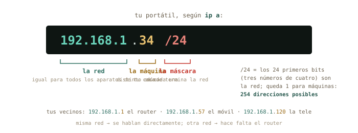
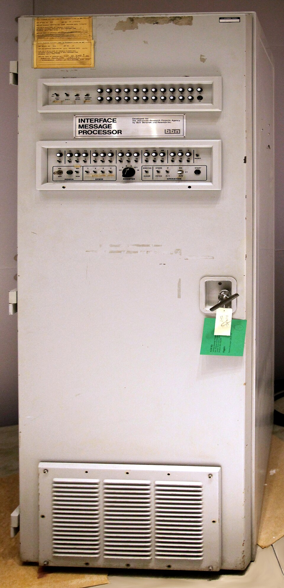
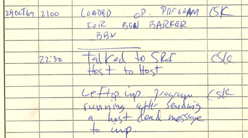

# Qué es una red {#sec-cap09}

::: {.lede}
Tu servidor recién instalado tiene una dirección — `192.168.122.15` —
que todavía no sabes leer. Empieza el bloque D con la pregunta que
todo el mundo se hace y casi nadie responde: qué significan esos
cuatro números, quién los reparte, por qué tu casa entera sale a
internet con una sola dirección, y qué hay dentro de esa caja con
lucecitas que te dio la compañía. Hoy la abres — en modo solo lectura
— y haces el censo de todos los aparatos que viven en tu red.
:::

::: {.chapmeta}
⏱ **2–3 h** con ejercicios · requisitos: **capítulos 1–8** · máquina: **tu Linux de diario, la VM y el router de casa (solo lectura)**
:::

::: {.objetivos}
**Al terminar esta sesión sabrás**

- Leer tu ficha de red con `ip a` e `ip route`: interfaz, dirección MAC, dirección IP, máscara y puerta de enlace.
- Qué significa el `/24` de una dirección, y cómo decide quién puede hablar con quién directamente.
- Quién reparte las direcciones — DHCP — y por qué tu portátil sabe la suya sin que se la hayas dicho.
- Medir con `ping` si una máquina responde y cuánto tarda — y qué tiene que ver ese tiempo con la velocidad de la luz.
- La diferencia entre tu dirección privada y la pública, y qué es el NAT que las separa.
- Entrar en la página de administración de tu router, orientarte en ella y hacer el censo de tu red sin tocar nada.
:::

## Tu ficha de red: `ip a` {#sec-ip-a}

El comando de este bloque es `ip`, y su primera pregunta es
«¿quién soy en la red?»: `ip a` (*address*). La salida asusta la
primera vez; léela por bloques, que cada bloque es una **interfaz** —
una tarjeta de red, real o virtual:

```terminal
marcos@portatil:~$ ip a
1: lo: <LOOPBACK,UP,LOWER_UP> mtu 65536 ...
    inet 127.0.0.1/8 scope host lo
2: wlp3s0: <BROADCAST,MULTICAST,UP,LOWER_UP> mtu 1500 ...
    link/ether a4:34:d9:1c:7e:02 brd ff:ff:ff:ff:ff:ff
    inet 192.168.1.34/24 brd 192.168.1.255 scope global dynamic wlp3s0
3: virbr0: <NO-CARRIER,BROADCAST,MULTICAST,UP> mtu 1500 ...
    inet 192.168.122.1/24 brd 192.168.122.255 scope global virbr0
```

Tres interfaces. `lo` es el *loopback*: la máquina hablando consigo
misma (`127.0.0.1` siempre eres tú — la usarás en el capítulo 11).
`wlp3s0` es tu Wi-Fi (`enp…` sería el cable), con dos direcciones
distintas: la **MAC** (`link/ether a4:34:…`, el número de serie
grabado en la tarjeta de fábrica) y la **IP** (`inet 192.168.1.34/24`,
la que te ha tocado en esta red). Y `virbr0` es el router de mentira
del capítulo 7 — la red NAT de tus máquinas virtuales. Ese `dynamic`
al final de tu IP es una pista para dentro de dos secciones.

::: {.truco}
**✚ Truco · La misma ficha, en el icono de red**

El icono de red de tu escritorio (clic → *Información de la
conexión*) muestra exactamente esto: dirección IP, máscara, puerta de
enlace, DNS. Es la vía gráfica de `ip a`, y perfectamente digna para
un vistazo. La terminal gana cuando la máquina no tiene escritorio —
tu `debian-lab` — o cuando quieres pegarlo en un correo pidiendo
ayuda: «esto es lo que dice `ip a`» es la frase con la que empiezan
todos los diagnósticos de red.
:::

## El `/24`: red y máquina {#sec-mascara}

Una dirección IP son cuatro números de 0 a 255 — cuatro bytes, tú
sabes de esto — y el `/24` es la **máscara**: dice cuántos bits del
principio identifican la *red* y cuántos quedan para la *máquina*.

{#fig-ip-mascara fig-alt="Dirección 192.168.1.34/24 descompuesta en parte de red, parte de máquina y máscara"}

Con `/24`, los 24 primeros bits — tres números — son la red:
`192.168.1`. Queda un byte para las máquinas: 254 direcciones útiles
(la `.0` nombra a la red y la `.255` es la de «todos a la vez»). Y la
regla que lo explica todo: **dos máquinas de la misma red se hablan
directamente; para llegar a otra red hace falta un intermediario**, el
**router**, al que tu máquina llama *puerta de enlace* (*gateway*).
`ip route` te dice cuál es la tuya:

```terminal
marcos@portatil:~$ ip route
default via 192.168.1.1 dev wlp3s0 proto dhcp metric 600
192.168.1.0/24 dev wlp3s0 proto kernel scope link src 192.168.1.34
192.168.122.0/24 dev virbr0 proto kernel scope link src 192.168.122.1
```

Léelo como instrucciones de un GPS: «para `192.168.1.0/24` (mi casa),
sal directo por la Wi-Fi; para `192.168.122.0/24` (mis VMs), por
`virbr0`; para *todo lo demás* (`default`), entrégaselo a
`192.168.1.1`». Ese `192.168.1.1` es tu router — el que abrirás al
final del capítulo.

## ¿Quién reparte las direcciones? DHCP {#sec-dhcp}

Nunca le has dicho a tu portátil que es el `.34`. Se lo dijo el
router, mediante **DHCP** (*Dynamic Host Configuration Protocol*): al
conectarte, tu máquina grita a la red «¿alguien me da una dirección?»
y el servidor DHCP del router le responde con un *préstamo* — una
dirección libre, la máscara, la puerta de enlace y el servidor de
nombres (capítulo 10) — por un tiempo limitado, que se renueva solo.
De ahí el `dynamic` de `ip a`, y de ahí que tu móvil cambie de número
de vez en cuando.

Y ya lo has visto funcionar dos veces sin saberlo: la red `default`
de libvirt lleva su propio servidor DHCP — por eso `debian-lab`
apareció con `192.168.122.15` sin configurar nada —, y el instalador
de Debian pidió su dirección exactamente así. El mismo mecanismo a
tres escalas: tu casa, tu hipervisor, el campus de la universidad.

::: {.historia}
**◷ Historia · La primera palabra de la red fue «LO»**

El 29 de octubre de 1969, un estudiante de UCLA llamado Charley Kline
intentó escribir `LOGIN` en un ordenador de Stanford, a 500 km, a
través de dos armarios llamados IMP — los primeros routers de la
historia, fabricados por BBN a partir de un miniordenador Honeywell
blindado para uso militar. Tecleó la L, llegó. Tecleó la O, llegó. Al
teclear la G, el sistema de Stanford se cayó. La primera palabra
transmitida por la red que acabaría siendo internet fue, por
accidente, «LO». Aquella red, ARPANET, tenía cuatro nodos; las reglas
que inventó para que máquinas distintas se entendieran — trocear los
mensajes en paquetes, darle a cada máquina una dirección, dejar que
los intermediarios decidan el camino — son las que tu `ip route` está
aplicando ahora mismo.
:::

::: {layout-ncol=2}
{#fig-imp fig-alt="Armario del Interface Message Processor de ARPANET, el primer router"}

{#fig-log-lo fig-alt="Página manuscrita del registro del IMP de UCLA anotando la primera conexión"}
:::

## ¿Estás ahí? `ping` {#sec-ping}

`ping` manda un paquete diminuto a una dirección y cronometra la
respuesta. Es el estetoscopio de las redes: responde a «¿esa máquina
existe y me oye?» y de propina mide *cuánto tarda*:

```terminal
marcos@portatil:~$ ping -c 3 192.168.1.1
PING 192.168.1.1 (192.168.1.1) 56(84) bytes of data.
64 bytes from 192.168.1.1: icmp_seq=1 ttl=64 time=2.31 ms
64 bytes from 192.168.1.1: icmp_seq=2 ttl=64 time=2.08 ms
64 bytes from 192.168.1.1: icmp_seq=3 ttl=64 time=2.44 ms
--- 192.168.1.1 ping statistics ---
3 packets transmitted, 3 received, 0% packet loss, time 2003ms
marcos@portatil:~$ ping -c 3 192.168.122.15
64 bytes from 192.168.122.15: icmp_seq=1 ttl=64 time=0.41 ms
...
marcos@portatil:~$ ping -c 3 8.8.8.8
64 bytes from 8.8.8.8: icmp_seq=1 ttl=115 time=14.7 ms
...
```

Tres medidas, tres escalas: el router de casa a 2 ms, la máquina
virtual a 0,4 ms (no hay cable que recorrer: está dentro de tu RAM), y
un servidor de Google a 15 ms. `-c 3` limita a tres paquetes —
sin él, `ping` sigue hasta que lo pares con <kbd>Ctrl</kbd>+<kbd>C</kbd>
(la señal del capítulo 5). Y ese `8.8.8.8` sin nombre es a propósito:
hoy hablamos con números; los nombres llegan en el capítulo 10.

::: {.por-dentro}
**◉ Por dentro · `ping` y la velocidad de la luz**

Ese tiempo es de *ida y vuelta*, y tiene un mínimo físico que puedes
calcular. En fibra la luz va a unos dos tercios de *c* — 200 000 km/s
—, así que cada milisegundo de ida y vuelta corresponde como mucho a
100 km de distancia. Un servidor a 15 ms está, como mínimo, en un
radio de 1 500 km; uno a 150 ms está seguro al otro lado de un
océano, y nada lo bajará de ahí — ni la fibra más cara. Es la razón
por la que los centros de datos se construyen cerca de sus usuarios,
y por la que un clúster «en la nube» a 5 000 km nunca se sentirá tan
inmediato como la máquina de al lado. Pocas veces un comando de
terminal te deja medir una constante fundamental.
:::

## Privada, pública, y el NAT entre medias {#sec-nat}

Hay algo raro en tu `192.168.1.34`: millones de casas del mundo tienen
exactamente esa misma dirección. No es un error: las redes
`192.168.x.x`, `10.x.x.x` y `172.16–31.x.x` son **direcciones
privadas**, reservadas para uso interno y repetidas en cada casa,
oficina o laboratorio. Internet nunca las ve. Lo que internet ve es
la **dirección pública** de tu router — una sola para toda la casa —
y la traducción entre ambas es el **NAT** (*Network Address
Translation*):

{#fig-nat fig-alt="Red doméstica con portátil, móvil y televisor con direcciones privadas, un router que traduce, e internet que solo ve una dirección pública"}

Puedes ver las dos caras desde tu terminal: la privada en `ip a`, y la
pública preguntándole a un servidor de fuera qué dirección ve:

```terminal
marcos@portatil:~$ curl ifconfig.me
83.44.120.9
```

Esa es tu casa vista desde internet — y coincidirá con la que el
router llama *WAN* en su página. Dos consecuencias que dan forma a los
tres capítulos siguientes. La cómoda: **desde fuera nadie puede entrar
en tus aparatos sin invitación**, porque no tienen dirección pública
que apuntar. La incómoda: cuando *quieras* que alguien entre — tú
mismo, por SSH desde la universidad —, tendrás que pedirle al router
que abra una puerta concreta (capítulo 10). Y fíjate en el detalle
elegante: tu `debian-lab` vive detrás de *dos* NAT — el de libvirt y
el de casa. Las muñecas rusas de la sección anterior, otra vez.

## El router por dentro (solo lectura) {#sec-router}

El `192.168.1.1` de `ip route` no es solo una dirección: es una
**página web**. Escríbela en el navegador y aparecerá la
administración de tu router — usuario y contraseña suelen estar en la
pegatina de la caja (y si son los de fábrica, el capítulo 10 tendrá
algo que decir). Cada compañía diseña la suya, pero todas tienen los
mismos cajones; tu tarea hoy es *encontrarlos sin tocar nada*:

- **Estado / Información**: la dirección WAN (compárala con
  `curl ifconfig.me`), el tiempo encendido, la versión del firmware.
- **Red local / LAN**: la dirección del router (`192.168.1.1`), y la
  configuración del **servidor DHCP** — el rango de direcciones que
  reparte (algo como `.2` a `.254`) y la duración de los préstamos.
- **Dispositivos conectados / Tabla DHCP / Lista de clientes**: el
  tesoro del capítulo. Cada aparato con su nombre, su IP y su MAC —
  el censo de tu red.
- **Wi-Fi**: nombre de la red (SSID), canal, tipo de cifrado.

::: {.aviso}
**△ Cuidado · Hoy se mira; el capítulo 10 se toca**

La regla de seguridad del curso, aplicada al router: esta sesión es
**de solo lectura**. No cambies contraseñas, no reinicies, no toques
el DHCP ni la Wi-Fi — un clic de más deja a toda la casa sin
internet, y no hay instantánea que restaurar. En el capítulo 10 harás
cambios *reversibles*, cada uno con su procedimiento de vuelta atrás
escrito antes de tocar. Hoy, si te pica el dedo: `ip a` en la
terminal, que no rompe nada.
:::

¿Y si tu router no enseña la tabla de dispositivos, o la enseña a
medias? Tu propia máquina lleva un censo parcial: `ip neigh` (*los
vecinos*) lista las máquinas de tu red con las que has hablado
últimamente, con sus MAC:

```terminal
marcos@portatil:~$ ip neigh
192.168.1.1 dev wlp3s0 lladdr 3c:84:6a:b2:10:f1 REACHABLE
192.168.1.57 dev wlp3s0 lladdr 8e:12:5b:0a:77:c3 STALE
192.168.122.15 dev virbr0 lladdr 52:54:00:9a:4e:21 REACHABLE
```

Y para un censo completo por tu cuenta existe `nmap`, el explorador de
redes: `sudo apt install nmap` y `nmap -sn 192.168.1.0/24` toca a la
puerta de las 254 direcciones y lista quién responde. Es una
herramienta legítima **sobre tu propia red**; usarla sobre redes
ajenas es, según dónde, un delito. Aquí, en casa, es tu censo de
respaldo.

## Práctica: el censo de casa {#sec-practica-9}

Cuaderno en marcha (`script sesion09.log`). Todo lo de hoy es
lectura: ni un cambio en el router, ni un cambio en tu máquina.

**Nivel 1 · Lo esencial**

::: {.ejercicio}
**Ejercicio 9.1 · Tu ficha de red**

Con `ip a` e `ip route`, rellena en tu cuaderno la ficha de tu
portátil: nombre de la interfaz, dirección MAC, dirección IP, máscara
y puerta de enlace. Después contrástala con la *Información de la
conexión* del icono de red. *Pista: la MAC es la línea `link/ether`;
la IP y la máscara van juntas en `inet`; la puerta de enlace es el
`default via` de `ip route`.*

:::: {.solucion}
::: {.callout-tip collapse="true" title="Solución razonada"}
Algo como: `wlp3s0` · `a4:34:d9:1c:7e:02` · `192.168.1.34` · `/24` ·
`192.168.1.1`. El icono de red dice lo mismo con otras palabras
(«máscara de subred 255.255.255.0» es el `/24` escrito en decimal).

**Por qué así** — Esta ficha es lo primero que te pedirá cualquiera a
quien pidas ayuda con la red, y lo primero que tú pedirás cuando seas
el que ayuda. Dos vías, una ficha: el principio de siempre.
:::
::::
:::

::: {.ejercicio}
**Ejercicio 9.2 · Tres distancias**

Haz `ping -c 5` a tu router, a tu `debian-lab` (arráncala si está
apagada) y a `8.8.8.8`. Anota el tiempo medio de cada uno, y con la
regla de «100 km por milisegundo» estima a qué distancia *máxima*
está ese servidor de Google. *Pista: la línea final `rtt min/avg/max`
te da la media sin calcular nada.*

:::: {.solucion}
::: {.callout-tip collapse="true" title="Solución razonada"}
Típicamente: router 1–5 ms, VM < 1 ms, `8.8.8.8` 10–30 ms. Con 15 ms
de ida y vuelta, el servidor está como mucho a unos 1 500 km — y
probablemente mucho más cerca, porque el tiempo incluye el trabajo de
cada router del camino, no solo el vuelo de la luz.

**Por qué así** — `ping` mide; la física acota. Distinguir «el mínimo
que impone *c*» del «tiempo real con sus retrasos» es exactamente lo
que hace un físico con cualquier medida — y te será útil cuando un
clúster remoto «vaya lento»: primero, ¿cuánto tarda el `ping`?
:::
::::
:::

::: {.ejercicio}
**Ejercicio 9.3 · Las dos caras**

Averigua tu dirección pública con `curl ifconfig.me` y compárala con
la privada de `ip a`. Después, en la página del router, localiza la
dirección *WAN* y comprueba que coincide con la pública. *Pista: si
`curl` no está instalado, ya sabes: `sudo apt install curl`.*

:::: {.solucion}
::: {.callout-tip collapse="true" title="Solución razonada"}
Privada `192.168.1.x`; pública algo como `83.44.120.9`, idéntica a la
WAN del router. Si la WAN del router es *también* del tipo
`100.64.x.x` o `10.x.x.x`, tu compañía te tiene detrás de un NAT
adicional (se llama CG-NAT), y eso condicionará el capítulo 10.

**Por qué así** — Ver las dos direcciones con tus propios ojos
convierte el NAT de concepto en hecho: toda la casa, un número.
:::
::::
:::

::: {.ejercicio}
**Ejercicio 9.4 · El censo**

En la página del router, encuentra la tabla de dispositivos
conectados y pásala a tu cuaderno: nombre, IP y MAC de cada aparato.
Identifica cuál es cada uno (portátil, móviles, tele, impresora…) y
anota los que no reconozcas. *Pista: si el router no la muestra o está
incompleta, `ip neigh` en tu Mint es el plan B, y `nmap -sn` sobre tu
`/24`, el plan C.*

:::: {.solucion}
::: {.callout-tip collapse="true" title="Solución razonada"}
Una tabla de entre 5 y 20 filas es lo normal en una casa. Los
aparatos «misteriosos» suelen ser el propio router, un enchufe
inteligente, la consola o el móvil de alguien de visita — los tres
primeros bytes de la MAC identifican al fabricante, y buscarlos en
internet («MAC lookup») resuelve casi todos.

**Por qué así** — Es el ejercicio central del capítulo: saber quién
vive en tu red es el principio de saber administrarla. En el capítulo
10, con esta lista, podrás hacer los cambios con criterio.
:::
::::
:::

**Nivel 2 · El mecanismo**

::: {.ejercicio}
**Ejercicio 9.5 · La VM en el mapa**

Dentro de `debian-lab`, ejecuta `ip a` e `ip route`. Compara con tu
Mint: ¿cuál es la puerta de enlace de la VM? ¿Por qué la VM puede
hacer `ping` a tu Mint y a `8.8.8.8`, pero el router de casa no la
tiene en su censo? *Pista: mira el `default via` de la VM y búscalo
en el `ip a` de tu Mint.*

:::: {.solucion}
::: {.callout-tip collapse="true" title="Solución razonada"}
Puerta de enlace de la VM: `192.168.122.1` — que es `virbr0`, tu
propio Mint. La VM está en la red privada de libvirt; tu Mint hace
de router y NAT para ella, igual que el de casa hace para tu Mint. El
router de casa solo ve salir paquetes de `192.168.1.34`: la VM está
escondida detrás, en un segundo NAT.

**Por qué así** — Es la figura del NAT aplicada dos veces, y la
demostración de que un «router» no es una caja: es un *papel* que
cualquier máquina Linux puede hacer. Tu Mint lleva haciéndolo desde
el capítulo 7.
:::
::::
:::

**Nivel 3 · El reto (opcional)**

::: {.ejercicio}
**Ejercicio 9.6 · Leer máscaras**

Sin ejecutar nada: (a) ¿cuántas máquinas caben en una red `/8` como
`10.0.0.0/8`? (b) ¿Y en una `/30`? (c) `192.168.1.34/24` y
`192.168.2.10/24`, ¿se hablan directamente o necesitan un router?
*Pista: bits para máquinas = 32 − máscara; caben 2 elevado a eso,
menos las dos direcciones reservadas.*

:::: {.solucion}
::: {.callout-tip collapse="true" title="Solución razonada"}
(a) 32 − 8 = 24 bits → 2²⁴ − 2 = 16 777 214 máquinas — el tamaño de
una multinacional. (b) 32 − 30 = 2 bits → 4 − 2 = 2 máquinas: la red
mínima, típica de un enlace punto a punto. (c) Con `/24`, sus redes
son `192.168.1` y `192.168.2`: distintas → necesitan un router aunque
estén en la misma mesa.

**Por qué así** — La máscara es aritmética binaria, que dominas de la
asignatura de computación; solo cambia el vocabulario. Y la (c) es la
avería de red más común del mundo: dos máquinas «al lado» que no se
ven porque alguien escribió mal un número.
:::
::::
:::

## Autocomprobación {#sec-quiz-9}

::: {.content-visible when-format="html"}

Marca una respuesta por pregunta; la corrección es inmediata.

```{=html}
<div class="quiz" id="quiz-cap09">
  <div class="qz"><p class="qq" data-n="1">En <code>192.168.1.34/24</code>, el <code>/24</code> indica…</p>
    <label><input type="radio" name="z1" value="a"><span>que hay 24 máquinas en la red</span></label>
    <label><input type="radio" name="z1" value="b"><span>que los 24 primeros bits (tres números) identifican la red</span></label>
    <label><input type="radio" name="z1" value="c"><span>el número de saltos hasta internet</span></label>
    <div class="fb good"><b>Correcto.</b> Red <code>192.168.1</code>, máquina <code>.34</code>, y 254 direcciones útiles para los vecinos.</div>
    <div class="fb bad"><b>No exactamente.</b> La máscara reparte los 32 bits entre red y máquina: <code>/24</code> deja tres números para la red y uno para las máquinas.</div>
  </div>
  <div class="qz"><p class="qq" data-n="2">Tu portátil sabe su dirección IP porque…</p>
    <label><input type="radio" name="z2" value="a"><span>viene grabada de fábrica, como la MAC</span></label>
    <label><input type="radio" name="z2" value="b"><span>el servidor DHCP del router se la prestó al conectarse</span></label>
    <label><input type="radio" name="z2" value="c"><span>la eligió al azar</span></label>
    <div class="fb good"><b>Correcto.</b> Un préstamo con caducidad, junto con la máscara, la puerta de enlace y el DNS. Lo grabado de fábrica es la MAC.</div>
    <div class="fb bad"><b>No exactamente.</b> La MAC es de fábrica; la IP es un préstamo del DHCP del router — por eso <code>ip a</code> la marca como <code>dynamic</code>.</div>
  </div>
  <div class="qz"><p class="qq" data-n="3">La «puerta de enlace» (<code>default via</code> en <code>ip route</code>) es…</p>
    <label><input type="radio" name="z3" value="a"><span>la máquina a la que se entregan los paquetes que van a otras redes</span></label>
    <label><input type="radio" name="z3" value="b"><span>el servidor de nombres</span></label>
    <label><input type="radio" name="z3" value="c"><span>tu propia dirección</span></label>
    <div class="fb good"><b>Correcto.</b> En casa, el router. Misma red → directo; otra red → a la puerta de enlace.</div>
    <div class="fb bad"><b>No exactamente.</b> Es el router: el intermediario para todo lo que no está en tu propia red. Los nombres son otro asunto (capítulo 10).</div>
  </div>
  <div class="qz"><p class="qq" data-n="4">¿Cuál de estas es una dirección privada?</p>
    <label><input type="radio" name="z4" value="a"><span><code>8.8.8.8</code></span></label>
    <label><input type="radio" name="z4" value="b"><span><code>10.20.30.40</code></span></label>
    <label><input type="radio" name="z4" value="c"><span><code>83.44.120.9</code></span></label>
    <div class="fb good"><b>Correcto.</b> <code>10.x.x.x</code>, <code>192.168.x.x</code> y <code>172.16–31.x.x</code> son privadas: repetidas en millones de redes, invisibles desde internet.</div>
    <div class="fb bad"><b>No exactamente.</b> Las privadas son <code>10.x</code>, <code>192.168.x</code> y <code>172.16–31.x</code>. Las otras dos son públicas: únicas en el mundo.</div>
  </div>
  <div class="qz"><p class="qq" data-n="5">Gracias al NAT del router…</p>
    <label><input type="radio" name="z5" value="a"><span>cada aparato de casa tiene su propia dirección pública</span></label>
    <label><input type="radio" name="z5" value="b"><span>toda la casa sale con una sola dirección pública, y desde fuera nadie entra sin invitación</span></label>
    <label><input type="radio" name="z5" value="c"><span>internet va más rápido</span></label>
    <div class="fb good"><b>Correcto.</b> Traducción de direcciones: una pública para todos. La contrapartida — abrir puertas cuando sí quieres que entren — es del capítulo 10.</div>
    <div class="fb bad"><b>No exactamente.</b> El NAT es justo lo contrario de «una pública por aparato»: una para toda la casa, con el router traduciendo.</div>
  </div>
  <div class="qz"><p class="qq" data-n="6">Un <code>ping</code> de 150 ms a un servidor te dice que…</p>
    <label><input type="radio" name="z6" value="a"><span>tu Wi-Fi está estropeada</span></label>
    <label><input type="radio" name="z6" value="b"><span>el servidor está, como poco, a miles de kilómetros: ninguna mejora lo bajará mucho</span></label>
    <label><input type="radio" name="z6" value="c"><span>el servidor está apagado</span></label>
    <div class="fb good"><b>Correcto.</b> Ida y vuelta a 200 000 km/s: 150 ms es del orden de un océano. La física impone un mínimo que ninguna tarifa mejora.</div>
    <div class="fb bad"><b>No exactamente.</b> El servidor responde (si no, no habría tiempo). 150 ms de ida y vuelta es distancia: la luz en fibra no da para más.</div>
  </div>
</div>
<script>
(function(){
  const OK = {z1:"b", z2:"b", z3:"a", z4:"b", z5:"b", z6:"b"};
  document.querySelectorAll("#quiz-cap09 .qz input").forEach(i => {
    i.addEventListener("change", () => {
      const qz = i.closest(".qz");
      qz.classList.remove("ok","ko");
      qz.classList.add(i.value === OK[i.name] ? "ok" : "ko");
    });
  });
})();
</script>
```

:::

:::: {.content-visible when-format="pdf"}

Responde de memoria; las respuestas están al final del capítulo.

1.  En `192.168.1.34/24`, el `/24` indica…
    a)  que hay 24 máquinas en la red
    b)  que los 24 primeros bits (tres números) identifican la red
    c)  el número de saltos hasta internet

2.  Tu portátil sabe su dirección IP porque…
    a)  viene grabada de fábrica, como la MAC
    b)  el servidor DHCP del router se la prestó al conectarse
    c)  la eligió al azar

3.  La «puerta de enlace» es…
    a)  la máquina a la que se entregan los paquetes que van a otras redes
    b)  el servidor de nombres
    c)  tu propia dirección

4.  ¿Cuál de estas es una dirección privada?
    a)  `8.8.8.8`
    b)  `10.20.30.40`
    c)  `83.44.120.9`

5.  Gracias al NAT del router…
    a)  cada aparato de casa tiene su propia dirección pública
    b)  toda la casa sale con una sola dirección pública, y desde fuera nadie entra sin invitación
    c)  internet va más rápido

6.  Un `ping` de 150 ms a un servidor te dice que…
    a)  tu Wi-Fi está estropeada
    b)  el servidor está, como poco, a miles de kilómetros
    c)  el servidor está apagado

::::

::: {.solucion-final}
**Autocomprobación (test de la sección 9.8)** — Respuestas: 1 b · 2 b · 3 a · 4 b · 5 b · 6 b.
:::

::: {.proxima}
**La próxima sesión**

Hoy has hablado con números; el capítulo 10 les pone nombre. Verás
qué pasa exactamente al escribir `debian.org` — el DNS, la guía
telefónica de internet —, seguirás el camino paquete a paquete hasta
la universidad con `tracepath`, entenderás por qué SSH es el puerto 22
y la web el 443, y harás los primeros cambios *reversibles* en el
router, con su vuelta atrás escrita antes de tocar. Guarda `sesion09.log`.
:::

::: {.pie-piloto}
cap. 9 v0.1 · piloto — anota tiempo real invertido, dudas y erratas junto a tu `sesion09.log`
:::
