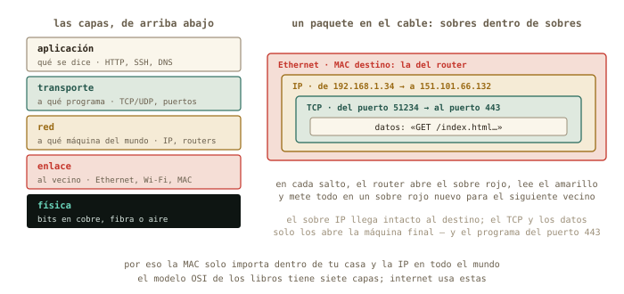
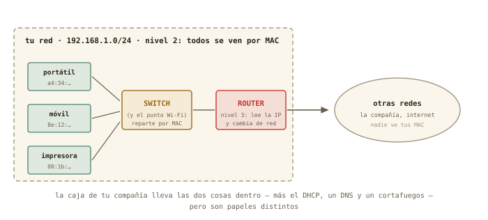

# Qué es una red {#sec-cap09}

::: {.lede}
Tu servidor recién instalado tiene una dirección — `192.168.122.15` —
que todavía no sabes leer. Este es el primero de tres capítulos sobre
redes, y se ocupa de lo más básico y lo más importante: cómo se hablan
dos ordenadores, qué significan esos cuatro números y la barra que
los sigue, quién es tu router, y cómo saber si una máquina está ahí —
y a qué distancia. Nada de configurar todavía: hoy se aprende a leer.
:::

::: {.chapmeta}
⏱ **2 h** con ejercicios · requisitos: **capítulos 1–8** · máquina: **tu Linux de diario y la VM**
:::

::: {.objetivos}
**Al terminar esta sesión sabrás**

- Cómo se hablan dos ordenadores: el modelo de capas, qué sobre pone cada una, y por qué la MAC no sale de tu casa mientras la IP recorre el mundo.
- Qué hace un switch y qué hace un router — y por qué la caja de tu compañía es varias cosas a la vez.
- Leer tu ficha de red con `ip a` e `ip route`: interfaz, dirección MAC, dirección IP, máscara y puerta de enlace.
- Qué significa el `/24` de una dirección, en sus tres notaciones, y cómo decide quién puede hablar con quién directamente.
- Medir con `ping` si una máquina responde y cuánto tarda — y qué tiene que ver ese tiempo con la velocidad de la luz.
:::

## Cómo se hablan dos ordenadores {#sec-capas}

Antes de teclear nada, el modelo mental — porque con él, todo lo que
sigue es leer; sin él, es memorizar. Cuando tu portátil envía algo a
otro ordenador — una página, un `ping`, una sesión SSH — no manda «un
mensaje»: lo trocea en **paquetes** de unos pocos miles de bytes, y
cada paquete viaja por su cuenta, metido en varios sobres, uno dentro
de otro. Cada sobre lo escribe y lo lee una **capa** distinta, y eso
es todo lo que hay que saber del famoso *modelo de capas*: los libros
lo cuentan con siete (el modelo OSI); internet usa en la práctica
cinco, y son estas:

| Capa | Qué resuelve | Con qué | Dónde la verás |
|------|--------------|---------|----------------|
| **Aplicación** | qué se dice | HTTP, SSH, DNS | capítulos 11–13 |
| **Transporte** | a qué *programa* de la máquina va, y si llega entero y en orden | TCP, UDP, los **puertos** | capítulo 11 |
| **Red** | a qué *máquina* del mundo va, aunque esté a diez saltos | **IP**, direcciones, routers | este capítulo |
| **Enlace** | al vecino de al lado, por este cable o esta Wi-Fi | Ethernet, Wi-Fi, direcciones **MAC** | `ip a`, línea `link/ether` |
| **Física** | bits convertidos en voltios, luz o radio | cobre, fibra, aire | tu asignatura |

{#fig-capas fig-alt="La pila de capas de la red y un paquete dibujado como sobres anidados: Ethernet, IP, TCP y los datos"}

La analogía postal lo deja claro. Tú escribes la carta (los **datos**).
La metes en un sobre con el número de piso (el **puerto**: qué
programa, entre los muchos de esa máquina, debe abrirla). Ese sobre
va dentro de otro con la dirección de la calle (la **IP**: qué máquina
del mundo). Y ese, dentro de un sobre más que solo entiende el
repartidor de tu barrio (la **MAC**: qué aparato de *esta* red, por
este cable). En cada salto, el repartidor abre el sobre exterior, lee
la calle del siguiente, y vuelve a envolver para el siguiente
repartidor. Por eso la MAC **solo importa dentro de tu casa** y la IP
importa en todo el mundo; por eso un **router** no es más que una
máquina que lee el sobre IP y decide por qué puerta sale; y por eso
los puertos, que verás en el capítulo 11, son el número de piso que
hace posible que una dirección sirva a muchos programas — y, como
descubrirás dentro de un rato, a muchas casas.

## Nivel 2 y nivel 3: switches y routers {#sec-switch-router}

Dos de esas capas tienen aparato propio, y conviene distinguirlos
porque en la caja de tu compañía van juntos. Un **switch** trabaja en
el nivel 2, el de enlace: tiene varias bocas de cable, aprende qué
MAC hay detrás de cada una y reparte los sobres *dentro de tu red*
sin mirar la IP — es el repartidor del barrio. El punto de acceso
Wi-Fi es un switch sin cables. Un **router** trabaja en el nivel 3, el
de red: tiene una pata en cada red, lee el sobre IP y decide por cuál
sale el paquete — es el que te saca del barrio. La regla que ya
conoces, dicha con los aparatos: **misma red, switch; otra red,
router.**

{#fig-switch-router fig-alt="Portátil, móvil e impresora conectados a un switch que reparte por MAC dentro de la red; un router al lado conecta esa red con otras por IP"}

La «caja del router» de tu salón es en realidad cuatro o cinco
aparatos en uno: un switch (las bocas amarillas de detrás), un punto
de acceso Wi-Fi, un router, un servidor DHCP y un pequeño servidor de
nombres — y un cortafuegos (capítulo 11). Cuando su página web te
enseñe pestañas separadas para LAN, Wi-Fi, WAN y DHCP, estás viendo
esos papeles por separado. Si algún día necesitas más bocas de cable,
lo que compras es un switch de veinte euros: se enchufa al router y
todo sigue siendo una sola red.

## Tu ficha de red: `ip a` {#sec-ip-a}

El comando de este bloque es `ip`, y su primera pregunta es
«¿quién soy en la red?»: `ip a` (*address*). La salida asusta la
primera vez; léela por bloques, que cada bloque es una **interfaz** —
una tarjeta de red, real o virtual:

```terminal
marcos@portatil:~$ ip a
1: lo: <LOOPBACK,UP,LOWER_UP> mtu 65536 ...
    inet 127.0.0.1/8 scope host lo
2: wlp3s0: <BROADCAST,MULTICAST,UP,LOWER_UP> mtu 1500 ...
    link/ether a4:34:d9:1c:7e:02 brd ff:ff:ff:ff:ff:ff
    inet 192.168.1.34/24 brd 192.168.1.255 scope global dynamic wlp3s0
3: virbr0: <NO-CARRIER,BROADCAST,MULTICAST,UP> mtu 1500 ...
    inet 192.168.122.1/24 brd 192.168.122.255 scope global virbr0
```

Tres interfaces. `lo` es el *loopback*: la máquina hablando consigo
misma (`127.0.0.1` siempre eres tú — la usarás en el capítulo 12).
`wlp3s0` es tu Wi-Fi (`enp…` sería el cable), con dos direcciones
distintas — una por capa: la **MAC** (`link/ether a4:34:…`, el número
de serie grabado en la tarjeta de fábrica: capa de enlace, el sobre
del barrio) y la **IP** (`inet 192.168.1.34/24`, la que te ha tocado
en esta red: capa de red, el sobre con la calle). Y `virbr0` es el router de mentira
del capítulo 7 — la red NAT de tus máquinas virtuales. Ese `dynamic`
al final de tu IP es una pista para dentro de dos secciones.

::: {.truco}
**✚ Truco · La misma ficha, en el icono de red**

El icono de red de tu escritorio (clic → *Información de la
conexión*) muestra exactamente esto: dirección IP, máscara, puerta de
enlace, DNS. Es la vía gráfica de `ip a`, y perfectamente digna para
un vistazo. La terminal gana cuando la máquina no tiene escritorio —
tu `debian-lab` — o cuando quieres pegarlo en un correo pidiendo
ayuda: «esto es lo que dice `ip a`» es la frase con la que empiezan
todos los diagnósticos de red.
:::

## El `/24`: red y máquina {#sec-mascara}

Una dirección IP son cuatro números de 0 a 255 — cuatro bytes, tú
sabes de esto — y el `/24` es la **máscara**: dice cuántos bits del
principio identifican la *red* y cuántos quedan para la *máquina*.

{#fig-ip-mascara fig-alt="Dirección 192.168.1.34/24 descompuesta en parte de red, parte de máquina y máscara"}

Con `/24`, los 24 primeros bits — tres números — son la red:
`192.168.1`. Queda un byte para las máquinas: 254 direcciones útiles
(la `.0` nombra a la red y la `.255` es la de «todos a la vez»).

La misma máscara se escribe de tres maneras, y te encontrarás las
tres: la **barra** (`/24`) que usa `ip a`; la **decimal con puntos**
(`255.255.255.0`) que enseñan el icono de red y el router; y la
**binaria**, que es lo que la máquina usa de verdad — unos donde hay
red, ceros donde hay máquina. Basta con escribirla en binario una vez
para que las otras dos dejen de ser arbitrarias:

| Barra | Decimal con puntos | Binario | Máquinas útiles | Típico de… |
|-------|--------------------|---------|-----------------|------------|
| `/24` | `255.255.255.0` | `11111111.11111111.11111111.00000000` | 254 | tu casa, un laboratorio |
| `/16` | `255.255.0.0` | `11111111.11111111.00000000.00000000` | 65 534 | un campus |
| `/8` | `255.0.0.0` | `11111111.00000000.00000000.00000000` | 16 777 214 | la red `10.x.x.x` de una multinacional |
| `/25` | `255.255.255.128` | `11111111.11111111.11111111.10000000` | 126 | media casa: la máscara ya no cae en un punto |
| `/30` | `255.255.255.252` | `11111111.11111111.11111111.11111100` | 2 | un enlace entre dos routers |

Dos ejemplos leídos del todo. `192.168.1.34/24`: máscara
`255.255.255.0`, en binario 24 unos y 8 ceros; red `192.168.1.0`,
máquina `34`, vecinos del `.1` al `.254`. Y `10.20.30.40/8`: máscara
`255.0.0.0`, 8 unos y 24 ceros; red `10.0.0.0`, y los otros tres
números — `20.30.40` — identifican la máquina entre casi 17 millones.
El `/25` es el que delata a quien no ha visto el binario: el `128` de
`255.255.255.128` es simplemente `10000000` — un bit más de red,
robado a las máquinas.

Y la regla que lo explica todo: **dos máquinas de la misma red se hablan
directamente; para llegar a otra red hace falta un intermediario**, el
**router**, al que tu máquina llama *puerta de enlace* (*gateway*).
`ip route` te dice cuál es la tuya:

```terminal
marcos@portatil:~$ ip route
default via 192.168.1.1 dev wlp3s0 proto dhcp metric 600
192.168.1.0/24 dev wlp3s0 proto kernel scope link src 192.168.1.34
192.168.122.0/24 dev virbr0 proto kernel scope link src 192.168.122.1
```

Léelo como instrucciones de un GPS: «para `192.168.1.0/24` (mi casa),
sal directo por la Wi-Fi; para `192.168.122.0/24` (mis VMs), por
`virbr0`; para *todo lo demás* (`default`), entrégaselo a
`192.168.1.1`». Ese `192.168.1.1` es tu router — el que abrirás al
final del capítulo.

## ¿Estás ahí? `ping` {#sec-ping}

`ping` manda un paquete diminuto a una dirección y cronometra la
respuesta. Es el estetoscopio de las redes: responde a «¿esa máquina
existe y me oye?» y de propina mide *cuánto tarda*:

```terminal
marcos@portatil:~$ ping -c 3 192.168.1.1
PING 192.168.1.1 (192.168.1.1) 56(84) bytes of data.
64 bytes from 192.168.1.1: icmp_seq=1 ttl=64 time=2.31 ms
64 bytes from 192.168.1.1: icmp_seq=2 ttl=64 time=2.08 ms
64 bytes from 192.168.1.1: icmp_seq=3 ttl=64 time=2.44 ms
--- 192.168.1.1 ping statistics ---
3 packets transmitted, 3 received, 0% packet loss, time 2003ms
marcos@portatil:~$ ping -c 3 192.168.122.15
64 bytes from 192.168.122.15: icmp_seq=1 ttl=64 time=0.41 ms
...
marcos@portatil:~$ ping -c 3 8.8.8.8
64 bytes from 8.8.8.8: icmp_seq=1 ttl=115 time=14.7 ms
...
```

Tres medidas, tres escalas: el router de casa a 2 ms, la máquina
virtual a 0,4 ms (no hay cable que recorrer: está dentro de tu RAM), y
un servidor de Google a 15 ms. `-c 3` limita a tres paquetes —
sin él, `ping` sigue hasta que lo pares con <kbd>Ctrl</kbd>+<kbd>C</kbd>
(la señal del capítulo 5). Y ese `8.8.8.8` sin nombre es a propósito:
hoy hablamos con números; los nombres llegan en el capítulo 11.

::: {.por-dentro}
**◉ Por dentro · `ping` y la velocidad de la luz**

Ese tiempo es de *ida y vuelta*, y tiene un mínimo físico que puedes
calcular. En fibra la luz va a unos dos tercios de *c* — 200 000 km/s
—, así que cada milisegundo de ida y vuelta corresponde como mucho a
100 km de distancia. Un servidor a 15 ms está, como mínimo, en un
radio de 1 500 km; uno a 150 ms está seguro al otro lado de un
océano, y nada lo bajará de ahí — ni la fibra más cara. Es la razón
por la que los centros de datos se construyen cerca de sus usuarios,
y por la que un clúster «en la nube» a 5 000 km nunca se sentirá tan
inmediato como la máquina de al lado. Pocas veces un comando de
terminal te deja medir una constante fundamental.
:::

::: {.historia}
**◷ Historia · La primera palabra de la red fue «LO»**

El 29 de octubre de 1969, un estudiante de UCLA llamado Charley Kline
intentó escribir `LOGIN` en un ordenador de Stanford, a 500 km, a
través de dos armarios llamados IMP — los primeros routers de la
historia, fabricados por BBN a partir de un miniordenador Honeywell
blindado para uso militar. Tecleó la L, llegó. Tecleó la O, llegó. Al
teclear la G, el sistema de Stanford se cayó. La primera palabra
transmitida por la red que acabaría siendo internet fue, por
accidente, «LO». Aquella red, ARPANET, tenía cuatro nodos; las reglas
que inventó para que máquinas distintas se entendieran — trocear los
mensajes en paquetes, darle a cada máquina una dirección, dejar que
los intermediarios decidan el camino — son las que tu `ip route` está
aplicando ahora mismo.
:::

::: {layout-ncol=2}
{#fig-imp fig-alt="Armario del Interface Message Processor de ARPANET, el primer router"}

{#fig-log-lo fig-alt="Página manuscrita del registro del IMP de UCLA anotando la primera conexión"}
:::

## Práctica: leer la red {#sec-practica-9}

Cuaderno en marcha (`script sesion09.log`). Todo lo de hoy es lectura:
ni un cambio en tu máquina.

**Nivel 1 · Lo esencial**

::: {.ejercicio}
**Ejercicio 9.1 · Tu ficha de red**

Con `ip a` e `ip route`, rellena en tu cuaderno la ficha de tu
portátil: nombre de la interfaz, dirección MAC, dirección IP, máscara
y puerta de enlace. Después contrástala con la *Información de la
conexión* del icono de red. *Pista: la MAC es la línea `link/ether`;
la IP y la máscara van juntas en `inet`; la puerta de enlace es el
`default via` de `ip route`.*

:::: {.solucion}
::: {.callout-tip collapse="true" title="Solución razonada"}
Algo como: `wlp3s0` · `a4:34:d9:1c:7e:02` · `192.168.1.34` · `/24` ·
`192.168.1.1`. El icono de red dice lo mismo con otras palabras
(«máscara de subred 255.255.255.0» es el `/24` escrito en decimal).

**Por qué así** — Esta ficha es lo primero que te pedirá cualquiera a
quien pidas ayuda con la red, y lo primero que tú pedirás cuando seas
el que ayuda. Dos vías, una ficha: el principio de siempre.
:::
::::
:::

::: {.ejercicio}
**Ejercicio 9.2 · Tres distancias**

Haz `ping -c 5` a tu router, a tu `debian-lab` (arráncala si está
apagada) y a `8.8.8.8`. Anota el tiempo medio de cada uno, y con la
regla de «100 km por milisegundo» estima a qué distancia *máxima*
está ese servidor de Google. *Pista: la línea final `rtt min/avg/max`
te da la media sin calcular nada.*

:::: {.solucion}
::: {.callout-tip collapse="true" title="Solución razonada"}
Típicamente: router 1–5 ms, VM < 1 ms, `8.8.8.8` 10–30 ms. Con 15 ms
de ida y vuelta, el servidor está como mucho a unos 1 500 km — y
probablemente mucho más cerca, porque el tiempo incluye el trabajo de
cada router del camino, no solo el vuelo de la luz.

**Por qué así** — `ping` mide; la física acota. Distinguir «el mínimo
que impone *c*» del «tiempo real con sus retrasos» es exactamente lo
que hace un físico con cualquier medida — y te será útil cuando un
clúster remoto «vaya lento»: primero, ¿cuánto tarda el `ping`?
:::
::::
:::

**Nivel 3 · El reto (opcional)**

::: {.ejercicio}
**Ejercicio 9.3 · Leer máscaras**

Sin ejecutar nada: (a) ¿cuántas máquinas caben en una red `/8` como
`10.0.0.0/8`? (b) ¿Y en una `/30`? (c) `192.168.1.34/24` y
`192.168.2.10/24`, ¿se hablan directamente o necesitan un router?
*Pista: bits para máquinas = 32 − máscara; caben 2 elevado a eso,
menos las dos direcciones reservadas.*

:::: {.solucion}
::: {.callout-tip collapse="true" title="Solución razonada"}
(a) 32 − 8 = 24 bits → 2²⁴ − 2 = 16 777 214 máquinas — el tamaño de
una multinacional. (b) 32 − 30 = 2 bits → 4 − 2 = 2 máquinas: la red
mínima, típica de un enlace punto a punto. (c) Con `/24`, sus redes
son `192.168.1` y `192.168.2`: distintas → necesitan un router aunque
estén en la misma mesa.

**Por qué así** — La máscara es aritmética binaria, que dominas de la
asignatura de computación; solo cambia el vocabulario. Y la (c) es la
avería de red más común del mundo: dos máquinas «al lado» que no se
ven porque alguien escribió mal un número.
:::
::::
:::

## Autocomprobación {#sec-quiz-cap09}

::: {.content-visible when-format="html"}

Marca una respuesta por pregunta; la corrección es inmediata.

```{=html}
<div class="quiz" id="quiz-cap09">
  <div class="qz"><p class="qq" data-n="1">La dirección MAC de tu portátil…</p>
    <label><input type="radio" name="z1" value="a"><span>viaja en cada paquete hasta el servidor de destino</span></label>
    <label><input type="radio" name="z1" value="b"><span>solo importa dentro de tu propia red: es el sobre del barrio</span></label>
    <label><input type="radio" name="z1" value="c"><span>es lo mismo que la dirección IP</span></label>
    <div class="fb good"><b>Correcto.</b> Cada router del camino abre el sobre de enlace y lo sustituye por uno nuevo. Lo que llega al otro extremo es el sobre IP.</div>
    <div class="fb bad"><b>No exactamente.</b> La MAC es la capa de enlace: identifica aparatos <em>en tu red</em>. Para cruzar redes se usa la IP; la MAC se queda en casa.</div>
  </div>
  <div class="qz"><p class="qq" data-n="2">Dos máquinas de la misma red se hablan…</p>
    <label><input type="radio" name="z2" value="a"><span>a través del router, siempre</span></label>
    <label><input type="radio" name="z2" value="b"><span>directamente, a través del switch o la Wi-Fi</span></label>
    <label><input type="radio" name="z2" value="c"><span>solo si tienen IP pública</span></label>
    <div class="fb good"><b>Correcto.</b> Misma red, switch; otra red, router. El router solo entra en juego cuando el destino está fuera de tu red.</div>
    <div class="fb bad"><b>No exactamente.</b> Si comparten red, el switch (o el punto Wi-Fi) reparte por MAC sin que el router intervenga. El router es para salir del barrio.</div>
  </div>
  <div class="qz"><p class="qq" data-n="3">En <code>192.168.1.34/24</code>, el <code>/24</code> indica…</p>
    <label><input type="radio" name="z3" value="a"><span>que hay 24 máquinas en la red</span></label>
    <label><input type="radio" name="z3" value="b"><span>que los 24 primeros bits (tres números) identifican la red</span></label>
    <label><input type="radio" name="z3" value="c"><span>el número de saltos hasta internet</span></label>
    <div class="fb good"><b>Correcto.</b> Red <code>192.168.1</code>, máquina <code>.34</code>, y 254 direcciones útiles para los vecinos. En decimal, <code>255.255.255.0</code>.</div>
    <div class="fb bad"><b>No exactamente.</b> La máscara reparte los 32 bits entre red y máquina: <code>/24</code> deja tres números para la red y uno para las máquinas.</div>
  </div>
  <div class="qz"><p class="qq" data-n="4">La «puerta de enlace» (<code>default via</code> en <code>ip route</code>) es…</p>
    <label><input type="radio" name="z4" value="a"><span>la máquina a la que se entregan los paquetes que van a otras redes</span></label>
    <label><input type="radio" name="z4" value="b"><span>el servidor de nombres</span></label>
    <label><input type="radio" name="z4" value="c"><span>tu propia dirección</span></label>
    <div class="fb good"><b>Correcto.</b> En casa, el router. Misma red → directo; otra red → a la puerta de enlace.</div>
    <div class="fb bad"><b>No exactamente.</b> Es el router: el intermediario para todo lo que no está en tu propia red. Los nombres son otro asunto (capítulo 11).</div>
  </div>
  <div class="qz"><p class="qq" data-n="5">Un <code>ping</code> de 150 ms a un servidor te dice que…</p>
    <label><input type="radio" name="z5" value="a"><span>tu Wi-Fi está estropeada</span></label>
    <label><input type="radio" name="z5" value="b"><span>el servidor está, como poco, a miles de kilómetros: ninguna mejora lo bajará mucho</span></label>
    <label><input type="radio" name="z5" value="c"><span>el servidor está apagado</span></label>
    <div class="fb good"><b>Correcto.</b> Ida y vuelta a 200 000 km/s: 150 ms es del orden de un océano. La física impone un mínimo que ninguna tarifa mejora.</div>
    <div class="fb bad"><b>No exactamente.</b> El servidor responde (si no, no habría tiempo). 150 ms de ida y vuelta es distancia: la luz en fibra no da para más.</div>
  </div>
  <div class="qz"><p class="qq" data-n="6">Un router del camino, al recibir un paquete tuyo…</p>
    <label><input type="radio" name="z6" value="a"><span>abre todos los sobres y lee tus datos</span></label>
    <label><input type="radio" name="z6" value="b"><span>abre solo el sobre de enlace, lee el destino IP y reenvía</span></label>
    <label><input type="radio" name="z6" value="c"><span>lo devuelve si no es para él</span></label>
    <div class="fb good"><b>Correcto.</b> Lee la calle, no la carta. Los datos y el sobre TCP solo los abre la máquina de destino — y el programa del puerto correspondiente.</div>
    <div class="fb bad"><b>No exactamente.</b> Los routers trabajan en la capa de red: leen la IP de destino para decidir por dónde sale. Ni miran el puerto ni leen los datos.</div>
  </div>
</div>
<script>
(function(){
  const OK = {z1:"b", z2:"b", z3:"b", z4:"a", z5:"b", z6:"b"};
  document.querySelectorAll("#quiz-cap09 .qz input").forEach(i => {
    i.addEventListener("change", () => {
      const qz = i.closest(".qz");
      qz.classList.remove("ok","ko");
      qz.classList.add(i.value === OK[i.name] ? "ok" : "ko");
    });
  });
})();
</script>
```

:::

:::: {.content-visible when-format="pdf"}

Responde de memoria; las respuestas están al final del capítulo.

1.  La dirección MAC de tu portátil…
    a)  viaja en cada paquete hasta el servidor de destino
    b)  solo importa dentro de tu propia red: es el sobre del barrio
    c)  es lo mismo que la dirección IP

2.  Dos máquinas de la misma red se hablan…
    a)  a través del router, siempre
    b)  directamente, a través del switch o la Wi-Fi
    c)  solo si tienen IP pública

3.  En `192.168.1.34/24`, el `/24` indica…
    a)  que hay 24 máquinas en la red
    b)  que los 24 primeros bits (tres números) identifican la red
    c)  el número de saltos hasta internet

4.  La «puerta de enlace» (`default via` en `ip route`) es…
    a)  la máquina a la que se entregan los paquetes que van a otras redes
    b)  el servidor de nombres
    c)  tu propia dirección

5.  Un `ping` de 150 ms a un servidor te dice que…
    a)  tu Wi-Fi está estropeada
    b)  el servidor está, como poco, a miles de kilómetros: ninguna mejora lo bajará mucho
    c)  el servidor está apagado

6.  Un router del camino, al recibir un paquete tuyo…
    a)  abre todos los sobres y lee tus datos
    b)  abre solo el sobre de enlace, lee el destino IP y reenvía
    c)  lo devuelve si no es para él

::::

::: {.solucion-final}
**Autocomprobación** — Respuestas: 1 b · 2 b · 3 b · 4 a · 5 b · 6 b.
:::

::: {.proxima}
**La próxima sesión**

Ya sabes leer una dirección y medir una distancia. En el capítulo 10
abres la caja con lucecitas: verás quién reparte las direcciones en
tu casa y con qué parámetros, entenderás por qué todos tus aparatos
salen a internet con un solo número — el NAT, paso a paso —, harás el
censo de todo lo que vive en tu red, y tocarás el router por primera
vez con un cambio reversible. Guarda `sesion09.log`.
:::

::: {.pie-piloto}
cap. 9 v0.2 · piloto — anota tiempo real invertido, dudas y erratas junto a tu `sesion09.log`
:::
