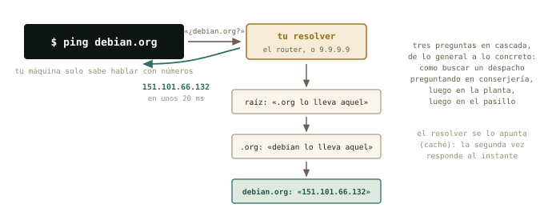
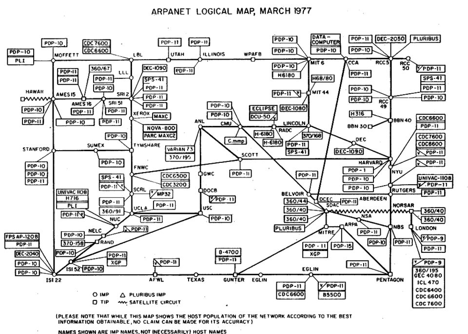
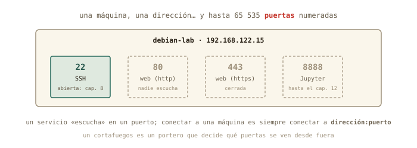

# Nombres y caminos {#sec-cap10}

::: {.lede}
Ayer hablaste con la red por números. Hoy descubres todo lo que pasa
en el segundo que transcurre entre escribir `debian.org` y ver la
página: la guía telefónica de internet, el camino que recorren tus
paquetes salto a salto hasta la universidad, y por qué una máquina
tiene una dirección pero miles de puertas. Y por primera vez tocas el
router — con cambios reversibles, cada uno con su vuelta atrás escrita
antes de tocar nada.
:::

::: {.chapmeta}
⏱ **2–3 h** con ejercicios · requisitos: **capítulo 9** · máquina: **tu Linux de diario, la VM y el router (cambios reversibles)**
:::

::: {.objetivos}
**Al terminar esta sesión sabrás**

- Qué es el DNS, quién responde cuando preguntas por un nombre, y cómo ver la respuesta con `host`.
- El fichero `/etc/hosts`: la guía telefónica más antigua, y cómo usarla para bautizar a tu máquina virtual.
- Seguir el camino de tus paquetes hasta la universidad con `tracepath`, salto a salto.
- Qué es un puerto, por qué SSH es el 22 y la web el 443, y cómo ver qué puertas tiene abiertas una máquina.
- TCP frente a UDP en diez minutos, y qué es un cortafuegos.
- Por qué el cable gana a la Wi-Fi para un servidor — y medirlo.
- El protocolo de cambio reversible: anotar, escribir la vuelta atrás, cambiar, verificar.
:::

## Qué pasa al escribir un nombre: DNS {#sec-dns}

Tu máquina solo sabe hablar con números; tú solo recuerdas nombres.
Entre ambos está el **DNS** (*Domain Name System*): un servicio
distribuido por todo el planeta que traduce `debian.org` en
`151.101.66.132`. Lo usas cada vez que escribes un nombre, y `ping` te
lo enseña sin pedírselo:

```terminal
marcos@portatil:~$ ping -c 1 debian.org
PING debian.org (151.101.66.132) 56(84) bytes of data.
64 bytes from 151.101.66.132: icmp_seq=1 ttl=57 time=18.2 ms
marcos@portatil:~$ host debian.org
debian.org has address 151.101.66.132
marcos@portatil:~$ resolvectl status | grep "DNS Servers"
       DNS Servers: 192.168.1.1
```

`host` hace la pregunta a secas y te da la respuesta. Y
`resolvectl status` te dice **a quién** se la hace tu máquina: a
`192.168.1.1` — el router, que a su vez pregunta a los servidores de
tu compañía. Es uno de los datos que el DHCP del capítulo 9 te prestó
junto con la dirección.

{#fig-dns fig-alt="Tu máquina pregunta al resolver, que consulta en cascada a los servidores raíz, a los de .org y a los de debian.org hasta obtener la dirección"}

¿Y antes del DNS? Un fichero de texto — en Linux siempre hay un
fichero de texto — que sigue existiendo y que tu máquina consulta
*antes* que a cualquier servidor: `/etc/hosts`.

```terminal
marcos@portatil:~$ cat /etc/hosts
127.0.0.1       localhost
127.0.1.1       portatil
```

Dos líneas: `localhost` eres tú, y `portatil` también. Lo interesante
es lo que puedes *añadir*: una línea `192.168.122.15  debian-lab` y,
desde ese momento, `ping debian-lab` — y en el capítulo 11,
`ssh debian-lab` — funciona sin números. Es la guía telefónica
privada de tu máquina, y la práctica de hoy la estrena.

::: {.historia}
**◷ Historia · Cuando internet cabía en un folio**

En los años 70, la «guía» de ARPANET era literalmente un fichero,
`HOSTS.TXT`, que una oficina de Stanford mantenía a mano y que cada
máquina de la red descargaba periódicamente: nombre, dirección, y ya.
Funcionó mientras internet tenía docenas de máquinas; en 1983, con
cientos y creciendo, Paul Mockapetris diseñó el DNS — un sistema
*distribuido* en el que nadie tiene la lista entera y cada uno
responde por su parcela. Tu `/etc/hosts` es el descendiente directo
de aquel fichero: la guía de bolsillo que sobrevivió a la guía
telefónica.
:::

{#fig-arpanet-mapa fig-alt="Diagrama de los nodos y enlaces de ARPANET en 1977" width="80%"}

## El camino: `tracepath` {#sec-tracepath}

`ping` te decía *cuánto* tardaba un paquete; `tracepath` te enseña
*por dónde* pasa. Cada router del camino es un **salto**, y la
herramienta los va descubriendo uno a uno:

```terminal
marcos@portatil:~$ tracepath -n uma.es
 1?: [LOCALHOST]                      pmtu 1500
 1:  192.168.1.1                        2.104ms
 2:  10.40.128.1                        9.870ms
 3:  81.46.12.201                      12.335ms
 ...
 9:  150.214.40.10                     21.482ms reached
```

El primer salto es siempre tu router; el segundo ya está en la
compañía (fíjate: una dirección `10.x` — privada, capítulo 9 — que la
operadora usa por dentro); y unos saltos después, la universidad. El
tiempo crece con cada salto, y el mínimo lo pone la física de ayer.
Cuando «no va internet», `tracepath` te dice *hasta dónde* llega: si
se corta en el salto 1, el problema es tuyo; si en el 2 o el 3, de la
compañía. (`traceroute`, su hermano clásico, hace lo mismo con más
opciones — `apt install traceroute` si lo echas de menos.)

## Una dirección, muchas puertas: los puertos {#sec-puertos}

Una máquina tiene una dirección, pero ofrece muchos servicios a la
vez. Cada uno escucha en un **puerto**: un número del 1 al 65 535 que
acompaña a la dirección. Conectarse a una máquina es siempre
conectarse a *dirección:puerto*, y los puertos de los servicios
clásicos están acordados desde hace décadas:

| Puerto | Servicio | Dónde lo verás |
|--------|----------|----------------|
| **22** | SSH | el capítulo 11 entero |
| **53** | DNS | cada nombre que resuelves |
| **80** / **443** | web sin cifrar / cifrada (https) | cada página que abres |
| **8888** | Jupyter | el caso estrella del capítulo 12 |

{#fig-puertos fig-alt="Una máquina con varias puertas numeradas; solo la 22, SSH, está abierta"}

Y puedes *mirar* las puertas. Desde dentro, `ss` (*socket
statistics*) lista lo que escucha; desde fuera, el `nmap` que
instalaste ayer toca a la puerta de cada una:

```terminal
marcos@debian-lab:~$ ss -tln
State   Recv-Q  Send-Q  Local Address:Port  Peer Address:Port
LISTEN  0       128           0.0.0.0:22         0.0.0.0:*
```

```terminal
marcos@portatil:~$ nmap 192.168.122.15
PORT   STATE SERVICE
22/tcp open  ssh
```

Tu servidor, visto desde dentro y desde fuera, cuenta lo mismo: una
puerta abierta, la 22, y detrás el servidor SSH que marcaste en el
instalador. Mañana entrarás por ella.

::: {.por-dentro}
**◉ Por dentro · TCP y UDP en diez minutos**

Los paquetes viajan de dos maneras. **TCP** es correo certificado:
antes de enviar se establece una conexión, cada paquete se confirma,
los perdidos se reenvían y todo llega en orden — más lento, pero
fiable. SSH, la web y el correo van así. **UDP** es una postal: se
envía y ya, sin conexión ni confirmación — rapidísimo, y si una se
pierde, se pierde. Las consultas DNS, el vídeo en directo y los juegos
van así: prefieren perder un paquete a esperar. Por eso `nmap` decía
`22/tcp`: el puerto 22 *de TCP*. Los dos sistemas conviven en la misma
dirección con números independientes.
:::

::: {.truco}
**✚ Truco · El cortafuegos, en una frase**

Un **cortafuegos** (*firewall*) es un portero que decide qué puertas
se ven desde fuera. Tu router lo es sin que lo sepas: gracias al NAT
del capítulo 9, ninguna puerta de tu casa es visible desde internet
salvo que la abras a propósito. En Linux, `ufw` hace ese papel en una
máquina concreta (`sudo ufw status` te dirá que en tu Mint está
inactivo — no hace falta activarlo hoy). En el servidor de la
universidad, en cambio, el portero existirá y será estricto: si un
día «no puedes conectar», la pregunta es siempre «¿qué puerta hay
abierta y quién la vigila?».
:::

## Cable o Wi-Fi {#sec-cable-wifi}

Un dato práctico que separa el portátil del servidor: por Wi-Fi, los
paquetes comparten el aire con los vecinos, se pierden y tardan más
de forma *irregular*; por cable, no. Y como todo aquí, se mide. Tu
tarjeta Wi-Fi te dice cuánta señal recibe — en dBm, una unidad que
reconoces:

```terminal
marcos@portatil:~$ iw dev wlp3s0 link | grep signal
        signal: -58 dBm
marcos@portatil:~$ ping -c 20 192.168.1.1 | tail -2
20 packets transmitted, 19 received, 5% packet loss, time 19031ms
rtt min/avg/max/mdev = 1.9/6.4/48.2/11.7 ms
```

Un −58 dBm es buena señal (−30 sería pegado al router; −80, cobertura
mala). Y fíjate en la línea de `ping`: un paquete perdido de veinte, y
un tiempo que oscila entre 2 y 48 ms — ese `mdev` es la desviación
típica, y por Wi-Fi es grande. Por cable serían 20 de 20, 1 ms, y
`mdev` de décimas. Moraleja para el futuro: **un servidor va por
cable**; y si tu `debian-lab` un día vive en un PC físico, ese PC
tendrá un cable.

## El protocolo del cambio reversible {#sec-cambios}

Hoy tocas el router por primera vez, y lo haces con un método que
vale para cualquier sistema que no tenga instantáneas — es decir,
para casi todo en la vida real:

1. **Anota el valor actual** — captura de pantalla o línea en el
   cuaderno. Sin esto, no hay vuelta atrás posible.
2. **Escribe la vuelta atrás** *antes* de tocar: «para deshacer,
   ir a X y poner Y».
3. **Cambia una sola cosa.**
4. **Verifica** con un comando que el cambio hizo lo que esperabas.
5. **Decide**: se queda, o se ejecuta la vuelta atrás.

Los cambios de hoy son dos, elegidos por útiles y reversibles: una
**reserva de dirección** — pedirle al DHCP del router que a tu
portátil le dé siempre la misma IP, identificándolo por su MAC — y
el **servidor DNS** que el router reparte a la casa. Y uno previo,
si procede: si la contraseña de administración del router sigue
siendo la de la pegatina, cámbiala — apuntando la nueva en un sitio
seguro *antes* de pulsar guardar. Lo que **no** se toca hoy: la
Wi-Fi, el rango del DHCP, y nada que diga «restablecer».

::: {.aviso}
**△ Cuidado · Los dos cambios que dejan a la casa sin internet**

Cambiar la dirección del propio router (`192.168.1.1`) o desactivar
su DHCP son cambios *legales* pero que cortan la red a todos los
aparatos hasta que se arregla — y arreglarlo exige saber más de lo
que sabes hoy. Ni siquiera con vuelta atrás escrita: no en el piloto.
El curso los deja para quien administre un router en serio, con un
segundo equipo por cable para rescatarlo.
:::

## Práctica: la guía y las puertas {#sec-practica-10}

Cuaderno en marcha (`script sesion10.log`). Los cambios de hoy se
hacen con el protocolo: valor actual, vuelta atrás escrita, cambio,
verificación.

**Nivel 1 · Lo esencial**

::: {.ejercicio}
**Ejercicio 10.1 · El DNS en acción**

Con `host`, averigua la dirección de `uma.es`, de `debian.org` y de
`google.com` (esta última te dará varias: anota cuántas). Averigua
también a qué servidor le pregunta tu máquina (`resolvectl status`).
*Pista: `host nombre` a secas; si `host` no existe, `sudo apt install
bind9-host`.*

:::: {.solucion}
::: {.callout-tip collapse="true" title="Solución razonada"}
`host uma.es`, `host debian.org`, `host google.com` — Google devuelve
varias direcciones (y una de tipo IPv6, más larga: es la nueva
numeración de internet, que hoy dejamos de lado). El resolver será tu
router, `192.168.1.1`, salvo que tu compañía configure otro.

**Por qué así** — Ver que un nombre tiene *varias* direcciones
desmonta la idea de «la dirección de Google»: son granjas de
servidores, y el DNS reparte. Y saber a quién preguntas es el primer
paso para cambiarlo con criterio en el 10.5.
:::
::::
:::

::: {.ejercicio}
**Ejercicio 10.2 · Bautizar a la VM**

Añade a `/etc/hosts` de tu Mint una línea con la IP de `debian-lab`
(la de `ip a` dentro de la VM) y su nombre, y comprueba que
`ping debian-lab` funciona. Antes de editar, aplica el protocolo:
copia de seguridad del fichero y vuelta atrás escrita. *Pista: `sudo
cp /etc/hosts /etc/hosts.bak`, `sudo nano /etc/hosts`, y una línea
como `192.168.122.15  debian-lab` al final. Vuelta atrás: `sudo cp
/etc/hosts.bak /etc/hosts`.*

:::: {.solucion}
::: {.callout-tip collapse="true" title="Solución razonada"}
Tras guardar, `ping -c 1 debian-lab` responde desde `192.168.122.15`
sin haber preguntado a ningún DNS: `/etc/hosts` se consulta primero.
Si la IP de la VM cambiara algún día (el DHCP de libvirt suele
mantenerla, pero no lo jura), basta actualizar la línea.

**Por qué así** — Es tu primera edición de un fichero de `/etc` con
`sudo` — capítulo 4 — hecha con red: copia antes, vuelta atrás
escrita. Y el premio llega mañana: `ssh debian-lab` en vez de una
ristra de números.
:::
::::
:::

::: {.ejercicio}
**Ejercicio 10.3 · El camino a la universidad**

Ejecuta `tracepath -n uma.es` (o el dominio de tu universidad).
¿Cuántos saltos hay? ¿Cuál es el primero? ¿En qué salto aparece la
primera dirección que *no* es privada — es decir, dónde sale tu
paquete a internet? *Pista: privadas son `10.x`, `192.168.x` y
`172.16–31.x`; repasa la figura del NAT del capítulo 9.*

:::: {.solucion}
::: {.callout-tip collapse="true" title="Solución razonada"}
Entre 8 y 15 saltos es lo normal. El primero es `192.168.1.1`, tu
router; a menudo el segundo o tercero sigue siendo privado (la red
interna de la compañía), y la primera pública marca la salida real a
internet. Algún salto puede aparecer como `no reply`: routers que no
contestan por política — no es un fallo.

**Por qué así** — Tu paquete acaba de contarte su viaje. La próxima
vez que «no vaya internet», este comando te dirá en qué salto muere —
y por tanto a quién llamar.
:::
::::
:::

::: {.ejercicio}
**Ejercicio 10.4 · Las puertas de tu servidor**

Desde dentro de `debian-lab`, lista los puertos que escuchan
(`ss -tln`); desde tu Mint, tócalos desde fuera (`nmap debian-lab` —
ya tiene nombre). ¿Coinciden las dos vistas? *Pista: `-t` TCP, `-l`
solo los que escuchan, `-n` números en vez de nombres.*

:::: {.solucion}
::: {.callout-tip collapse="true" title="Solución razonada"}
Dentro: `LISTEN` en `0.0.0.0:22` (y quizá `[::]:22`, su versión
IPv6). Fuera: `22/tcp open ssh`. Una puerta, dos puntos de vista, el
mismo resultado — y `nmap` funcionando ya por nombre gracias al 10.2.

**Por qué así** — Comparar la vista interior con la exterior es el
diagnóstico básico de cualquier servicio: si dentro escucha pero
fuera no se ve, hay un portero en medio (cortafuegos o NAT). Hoy no lo
hay; en la universidad lo habrá.
:::
::::
:::

**Nivel 2 · El mecanismo**

::: {.ejercicio}
**Ejercicio 10.5 · Dos cambios en el router, con vuelta atrás**

Con el protocolo completo (valor actual anotado, vuelta atrás
escrita, cambio, verificación): (a) crea una **reserva DHCP** para tu
portátil, de modo que siempre reciba la misma dirección — la que
tiene ahora vale —; (b) cambia el **servidor DNS** que el router
reparte por `9.9.9.9` (Quad9) o `1.1.1.1` (Cloudflare). Verifica (a)
reconectando la Wi-Fi y mirando `ip a`, y (b) con `resolvectl status`
tras reconectar. *Pista: los menús se llaman «Reserva de dirección»,
«DHCP estático» o «Asignación fija» en la sección LAN/DHCP; el DNS
suele estar en LAN/DHCP o en WAN/Internet. Si no encuentras uno de
los dos, deja constancia y sigue: no todos los routers lo exponen.*

:::: {.solucion}
::: {.callout-tip collapse="true" title="Solución razonada"}
(a) La reserva asocia tu MAC (capítulo 9) a una IP; tras reconectar,
`ip a` la muestra, y ahora tu `/etc/hosts` o el SSH de mañana pueden
contar con ella. (b) `resolvectl status` pasa de `192.168.1.1` a
`9.9.9.9`; `host debian.org` sigue resolviendo. Vuelta atrás de cada
uno: borrar la reserva; devolver el DNS al valor anotado (a menudo
«automático»).

**Por qué así** — Dos cambios pequeños, útiles y deshechos en un
minuto si molestan: exactamente el tipo de administración que se hace
en una casa. Y el protocolo que has seguido es el mismo con el que
tocarás un servidor de verdad — donde tampoco habrá instantáneas.
:::
::::
:::

**Nivel 3 · El reto (opcional)**

::: {.ejercicio}
**Ejercicio 10.6 · Wi-Fi contra cable, con datos**

Si tienes un cable de red a mano: mide con `ping -c 30` al router por
Wi-Fi y por cable, y compara media, máximo, `mdev` y paquetes
perdidos. Añade la señal Wi-Fi en dBm (`iw dev … link`). Escribe en el
cuaderno una conclusión de dos líneas, como en un informe de
prácticas. *Pista: `ip a` te dirá qué interfaz está activa en cada
caso (`wlp…` o `enp…`); desactiva la Wi-Fi mientras mides por cable
para no mezclar.*

:::: {.solucion}
::: {.callout-tip collapse="true" title="Solución razonada"}
Cable: 30 de 30, ~1 ms, `mdev` de décimas. Wi-Fi: alguna pérdida
posible, media mayor y `mdev` de varios ms — más cuanto peor la señal
(por debajo de −70 dBm empieza a notarse). Conclusión típica: «la
media apenas cambia; la *dispersión* y las pérdidas sí — por eso el
servidor va por cable».

**Por qué así** — Media, desviación y pérdidas: el mismo trío que
resume cualquier medida de laboratorio. Has convertido una opinión de
foro («el cable va mejor») en un resultado con incertidumbre.
:::
::::
:::

## Autocomprobación {#sec-quiz-10}

::: {.content-visible when-format="html"}

Marca una respuesta por pregunta; la corrección es inmediata.

```{=html}
<div class="quiz" id="quiz-cap10">
  <div class="qz"><p class="qq" data-n="1">El DNS sirve para…</p>
    <label><input type="radio" name="z1" value="a"><span>traducir nombres como <code>debian.org</code> en direcciones IP</span></label>
    <label><input type="radio" name="z1" value="b"><span>repartir direcciones IP a los aparatos de casa</span></label>
    <label><input type="radio" name="z1" value="c"><span>cifrar la conexión</span></label>
    <div class="fb good"><b>Correcto.</b> La guía telefónica distribuida. Repartir direcciones es el DHCP (capítulo 9); cifrar es cosa de SSH y https.</div>
    <div class="fb bad"><b>No exactamente.</b> El DNS traduce nombres a números. Las direcciones las reparte el DHCP; el cifrado es otro asunto.</div>
  </div>
  <div class="qz"><p class="qq" data-n="2">Añades <code>192.168.122.15 debian-lab</code> a <code>/etc/hosts</code>. Al hacer <code>ping debian-lab</code>…</p>
    <label><input type="radio" name="z2" value="a"><span>tu máquina pregunta al DNS y falla, porque ese nombre no existe en internet</span></label>
    <label><input type="radio" name="z2" value="b"><span>tu máquina usa la línea de <code>/etc/hosts</code> sin preguntar a ningún servidor</span></label>
    <label><input type="radio" name="z2" value="c"><span>el router aprende el nombre</span></label>
    <div class="fb good"><b>Correcto.</b> <code>/etc/hosts</code> se consulta antes que el DNS: es la guía privada de tu máquina.</div>
    <div class="fb bad"><b>No exactamente.</b> El fichero local tiene prioridad: el nombre se resuelve ahí y el DNS ni se entera. El router tampoco.</div>
  </div>
  <div class="qz"><p class="qq" data-n="3">En <code>tracepath</code>, el primer salto es siempre…</p>
    <label><input type="radio" name="z3" value="a"><span>el servidor de destino</span></label>
    <label><input type="radio" name="z3" value="b"><span>tu router, la puerta de enlace</span></label>
    <label><input type="radio" name="z3" value="c"><span>un servidor de la compañía</span></label>
    <div class="fb good"><b>Correcto.</b> Todo lo que sale de tu red pasa primero por la puerta de enlace del capítulo 9. Si el salto 1 no responde, el problema está en casa.</div>
    <div class="fb bad"><b>No exactamente.</b> El salto 1 es tu propio router; la compañía viene después, y el destino, al final.</div>
  </div>
  <div class="qz"><p class="qq" data-n="4">Un puerto es…</p>
    <label><input type="radio" name="z4" value="a"><span>un conector físico del ordenador</span></label>
    <label><input type="radio" name="z4" value="b"><span>un número que identifica un servicio concreto dentro de una dirección</span></label>
    <label><input type="radio" name="z4" value="c"><span>otro nombre para la dirección IP</span></label>
    <div class="fb good"><b>Correcto.</b> Dirección:puerto. El 22 es SSH, el 443 la web cifrada — y <code>ss</code> o <code>nmap</code> te enseñan cuáles están abiertos.</div>
    <div class="fb bad"><b>No exactamente.</b> Nada físico: es la «puerta» numerada por la que escucha un servicio en una máquina. Una dirección, miles de puertas.</div>
  </div>
  <div class="qz"><p class="qq" data-n="5">SSH va sobre TCP y no sobre UDP porque…</p>
    <label><input type="radio" name="z5" value="a"><span>TCP garantiza que todo llega, en orden, reenviando lo perdido</span></label>
    <label><input type="radio" name="z5" value="b"><span>UDP no funciona en Linux</span></label>
    <label><input type="radio" name="z5" value="c"><span>TCP es más rápido</span></label>
    <div class="fb good"><b>Correcto.</b> Correo certificado frente a postal: para una sesión de terminal, perder un carácter es inaceptable. El precio es algo de velocidad.</div>
    <div class="fb bad"><b>No exactamente.</b> UDP existe y se usa muchísimo (DNS, vídeo). SSH elige TCP por fiabilidad — que cuesta velocidad, no la da.</div>
  </div>
  <div class="qz"><p class="qq" data-n="6">El primer paso del protocolo de cambio reversible es…</p>
    <label><input type="radio" name="z6" value="a"><span>hacer el cambio y ver qué pasa</span></label>
    <label><input type="radio" name="z6" value="b"><span>anotar el valor actual y escribir la vuelta atrás</span></label>
    <label><input type="radio" name="z6" value="c"><span>reiniciar el router</span></label>
    <div class="fb good"><b>Correcto.</b> Sin el valor anterior no hay deshacer. Es la instantánea de los sistemas que no tienen instantáneas.</div>
    <div class="fb bad"><b>No exactamente.</b> Primero se anota lo que hay y cómo volver; después se cambia una cosa y se verifica. El «a ver qué pasa» es lo que deja a la casa sin internet.</div>
  </div>
</div>
<script>
(function(){
  const OK = {z1:"a", z2:"b", z3:"b", z4:"b", z5:"a", z6:"b"};
  document.querySelectorAll("#quiz-cap10 .qz input").forEach(i => {
    i.addEventListener("change", () => {
      const qz = i.closest(".qz");
      qz.classList.remove("ok","ko");
      qz.classList.add(i.value === OK[i.name] ? "ok" : "ko");
    });
  });
})();
</script>
```

:::

:::: {.content-visible when-format="pdf"}

Responde de memoria; las respuestas están al final del capítulo.

1.  El DNS sirve para…
    a)  traducir nombres como `debian.org` en direcciones IP
    b)  repartir direcciones IP a los aparatos de casa
    c)  cifrar la conexión

2.  Añades `192.168.122.15 debian-lab` a `/etc/hosts`. Al hacer `ping debian-lab`…
    a)  tu máquina pregunta al DNS y falla
    b)  tu máquina usa la línea de `/etc/hosts` sin preguntar a ningún servidor
    c)  el router aprende el nombre

3.  En `tracepath`, el primer salto es siempre…
    a)  el servidor de destino
    b)  tu router, la puerta de enlace
    c)  un servidor de la compañía

4.  Un puerto es…
    a)  un conector físico del ordenador
    b)  un número que identifica un servicio concreto dentro de una dirección
    c)  otro nombre para la dirección IP

5.  SSH va sobre TCP y no sobre UDP porque…
    a)  TCP garantiza que todo llega, en orden, reenviando lo perdido
    b)  UDP no funciona en Linux
    c)  TCP es más rápido

6.  El primer paso del protocolo de cambio reversible es…
    a)  hacer el cambio y ver qué pasa
    b)  anotar el valor actual y escribir la vuelta atrás
    c)  reiniciar el router

::::

::: {.solucion-final}
**Autocomprobación (test de la sección 10.8)** — Respuestas: 1 a · 2 b · 3 b · 4 b · 5 a · 6 b.
:::

::: {.proxima}
**La próxima sesión**

Empieza el bloque E: trabajar en remoto. Tienes un servidor con
nombre (`debian-lab`), una puerta abierta (la 22) y, desde hoy, el
mapa entero de cómo llegar a ella. En el capítulo 11 entras: usarás
SSH, sustituirás las contraseñas por claves y copiarás ficheros entre
máquinas con `scp` y `rsync` — primero contigo mismo, luego con tu
VM, y después con cualquier servidor del mundo. Guarda `sesion10.log`: bloque D
completo.
:::

::: {.pie-piloto}
cap. 10 v0.1 · piloto — anota tiempo real invertido, dudas y erratas junto a tu `sesion10.log`
:::
