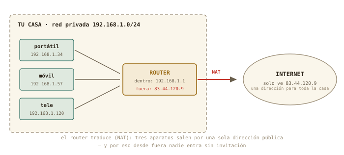
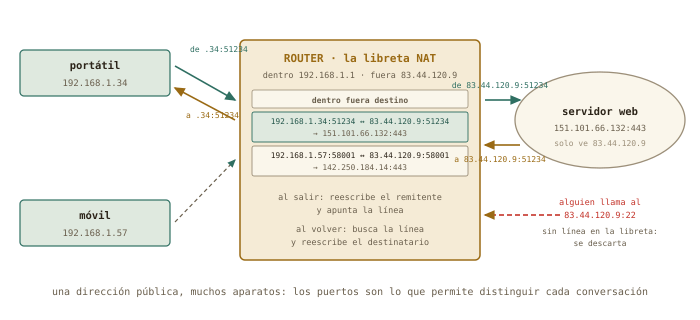

# Tu red de casa: el router por dentro {#sec-cap10}

::: {.lede}
Ya sabes leer una dirección. Hoy abres la caja con lucecitas que te
dio la compañía: quién reparte las direcciones en tu casa y con qué
parámetros, por qué todos tus aparatos salen a internet con un solo
número, y cómo hacer el censo de tu red sin tocar nada. Y, por
primera vez, tocas el router — un solo cambio, útil, con su vuelta
atrás escrita antes de pulsar guardar.
:::

::: {.chapmeta}
⏱ **2–3 h** con ejercicios · requisitos: **capítulo 9** · máquina: **tu Linux de diario, la VM y el router (solo lectura, y un cambio reversible)**
:::

::: {.objetivos}
**Al terminar esta sesión sabrás**

- Quién reparte las direcciones — DHCP —, los cinco parámetros que entrega, y qué son el rango y las reservas de tu router.
- Por qué casi todas las casas usan `192.168.1.x`: los tres bloques de direcciones privadas.
- La diferencia entre tu dirección privada y la pública, y cómo el router traduce entre ambas con su tabla NAT — paso a paso, con la respuesta de vuelta incluida.
- Entrar en la página de administración de tu router, orientarte en ella y hacer el censo de tu red.
- Por qué el cable gana a la Wi-Fi para un servidor — y medirlo.
- El protocolo del cambio reversible: anotar, escribir la vuelta atrás, cambiar, verificar — aplicado a una reserva DHCP.
:::

## ¿Quién reparte las direcciones? DHCP {#sec-dhcp}

Nunca le has dicho a tu portátil que es el `.34`. Se lo dijo el
router, mediante **DHCP** (*Dynamic Host Configuration Protocol*): al
conectarte, tu máquina grita a la red «¿alguien me da una dirección?»
y el servidor DHCP del router le responde con un *préstamo* — una
dirección libre, la máscara, la puerta de enlace y el servidor de
nombres (capítulo 11) — por un tiempo limitado, que se renueva solo.
De ahí el `dynamic` de `ip a`, y de ahí que tu móvil cambie de número
de vez en cuando.

Y ya lo has visto funcionar dos veces sin saberlo: la red `default`
de libvirt lleva su propio servidor DHCP — por eso `debian-lab`
apareció con `192.168.122.15` sin configurar nada —, y el instalador
de Debian pidió su dirección exactamente así. El mismo mecanismo a
tres escalas: tu casa, tu hipervisor, el campus de la universidad.

Lo que reparte un DHCP es siempre el mismo lote, y son los cuatro o
cinco parámetros que verás en cualquier pantalla de red del mundo:

| Parámetro | Ejemplo | Para qué |
|-----------|---------|----------|
| **Dirección IP** | `192.168.1.34` | tu número en la red |
| **Máscara** | `/24` = `255.255.255.0` | hasta dónde llega «mi red» |
| **Puerta de enlace** | `192.168.1.1` | a quién dar lo que va a otra red: el router |
| **Servidor DNS** | `192.168.1.1` o `9.9.9.9` | quién traduce nombres (capítulo 11) |
| **Duración del préstamo** | 24 h | cada cuánto se renueva |

Y con eso ya puedes leer — y al final de este capítulo, tocar — la pestaña
DHCP de tu router, que tiene siempre la misma forma: la dirección del
propio router, un **rango** de direcciones que reparte (algo como
`192.168.1.100` a `.200`), la duración, y una lista de **reservas**:
«a esta MAC, siempre esta IP». Lo usual en una casa bien puesta es
dejar el rango para lo que va y viene (móviles, visitas) y reservar
direcciones fijas para lo que debe encontrarse siempre en el mismo
sitio: la impresora, un NAS, tu `debian-lab` si algún día vive en un
PC físico. Lo que no se toca sin motivo: la dirección del router y la
máscara.

¿Y por qué `192.168.1.x` en casi todas las casas? Porque hay tres
bloques de direcciones reservados para uso privado, y los fabricantes
eligen del más pequeño:

| Bloque privado | Cuántas redes /24 caben | Dónde lo verás |
|----------------|-------------------------|----------------|
| `192.168.0.0/16` | 256 | casas y oficinas pequeñas (`192.168.0.x`, `192.168.1.x`) |
| `172.16.0.0/12` | 4 096 | empresas, y la red interna de Docker |
| `10.0.0.0/8` | 65 536 | universidades, multinacionales, redes de la compañía |

Si dos casas usan `192.168.1.x` no chocan: cada una está detrás de su
propio NAT, que es la siguiente sección. Y si un día montas una VPN
con la universidad y las dos redes se llaman igual, sabrás por qué
no funciona — y que la solución es cambiar la tuya a `192.168.37.x`,
cualquier número que nadie use.

::: {.truco}
**✚ Truco · Los mismos parámetros, en la ventana de red**

El icono de red de Mint → *Configuración de red* (o *Editar
conexiones*) → tu Wi-Fi → pestaña **IPv4**: ahí están, con botones,
los cinco parámetros de la tabla. *Automático (DHCP)* es lo normal;
*Manual* te deja escribir IP, máscara, puerta de enlace y DNS a mano
— lo que necesitarías en un laboratorio sin DHCP. Para que tu portátil
tenga siempre la misma dirección en casa, la vía limpia no es
*Manual* aquí sino una reserva en el router (al final de este capítulo): así la
decisión vive en un solo sitio y no choca con el reparto del DHCP.
:::

## Privada, pública, y el NAT entre medias {#sec-nat}

Hay algo raro en tu `192.168.1.34`: millones de casas del mundo tienen
exactamente esa misma dirección. No es un error: las redes
`192.168.x.x`, `10.x.x.x` y `172.16–31.x.x` son **direcciones
privadas**, reservadas para uso interno y repetidas en cada casa,
oficina o laboratorio. Internet nunca las ve. Lo que internet ve es
la **dirección pública** de tu router — una sola para toda la casa —
y la traducción entre ambas es el **NAT** (*Network Address
Translation*):

{#fig-nat fig-alt="Red doméstica con portátil, móvil y televisor con direcciones privadas, un router que traduce, e internet que solo ve una dirección pública"}

¿Cómo puede una sola dirección servir a toda la casa? Con los sobres
de la primera sección, paso a paso. Tu portátil pide una página web:
sale un paquete que dice *«de 192.168.1.34, puerto 51234 → a
151.101.66.132, puerto 443»*. El router lo intercepta antes de que
salga a internet y hace dos cosas: **reescribe el remitente** — ahora
dice *«de 83.44.120.9, puerto 51234»*, su dirección pública — y
**apunta una línea en su libreta**: «lo que vuelva dirigido a
83.44.120.9:51234 es en realidad para 192.168.1.34:51234». El servidor
responde a la única dirección que conoce, la pública; el router recibe
la respuesta, busca la línea, y **reescribe el destinatario**: → a
192.168.1.34:51234. Tu portátil recibe su página y nunca supo que le
cambiaron el nombre. Mientras, tu móvil hace lo mismo con otro puerto
(58001) y tiene su propia línea. Esa libreta es la **tabla NAT**:

| Dentro (privado) | Fuera (público) | Hablando con |
|------------------|-----------------|--------------|
| `192.168.1.34:51234` | `83.44.120.9:51234` | `151.101.66.132:443` |
| `192.168.1.57:58001` | `83.44.120.9:58001` | `142.250.184.14:443` |

{#fig-nat-tabla fig-alt="El router reescribe el remitente de los paquetes que salen, anota la correspondencia en una tabla y la usa para devolver las respuestas; un paquete no solicitado desde internet se descarta"}

De esta libreta salen todas las consecuencias que importan. Un
paquete que llega desde internet *sin que nadie de casa lo haya
pedido* — alguien probando suerte en tu puerto 22 — no tiene línea en
la tabla: el router no sabe a quién dárselo y lo descarta. Por eso
**desde fuera nadie entra sin invitación**. Cuando *quieras* que
alguien entre — tú mismo por SSH desde la universidad —, tendrás que
escribir a mano una línea permanente: «lo que llegue al puerto 22
público, dáselo siempre a 192.168.1.34» — es el *reenvío de puertos*
del capítulo 11. Y fíjate en el detalle que explica el capítulo
siguiente: la traducción funciona **gracias a los puertos**. La
dirección pública es la calle; los puertos son los pisos, y el router
puede permitirse una sola calle porque tiene sesenta y cinco mil
pisos que repartir entre las conversaciones de toda la casa.

Puedes ver las dos caras desde tu terminal: la privada en `ip a`, y la
pública preguntándole a un servidor de fuera qué dirección ve:

```terminal
marcos@portatil:~$ curl ifconfig.me
83.44.120.9
```

Esa es tu casa vista desde internet — y coincidirá con la que el
router llama *WAN* en su página. Dos remates. Tu `debian-lab` vive
detrás de *dos* libretas — la de tu Mint (para la red `192.168.122.x`)
y la del router —: cada paquete suyo cambia de remitente dos veces al
salir y de destinatario dos veces al volver. Y algunas compañías
añaden una tercera libreta en sus propias instalaciones para miles de
casas a la vez (el CG-NAT del ejercicio 9.3): entonces ni la línea
escrita a mano en tu router sirve, porque el intruso — o tú desde la
universidad — nunca llega a tu router. Muñecas rusas, todas con la
misma lógica.

## El router por dentro (solo lectura) {#sec-router}

El `192.168.1.1` de `ip route` no es solo una dirección: es una
**página web**. Escríbela en el navegador y aparecerá la
administración de tu router — usuario y contraseña suelen estar en la
pegatina de la caja (y si son los de fábrica, el final de este capítulo tendrá
algo que decir). Cada compañía diseña la suya, pero todas tienen los
mismos cajones; tu tarea hoy es *encontrarlos sin tocar nada*:

- **Estado / Información**: la dirección WAN (compárala con
  `curl ifconfig.me`), el tiempo encendido, la versión del firmware.
- **Red local / LAN**: la dirección del router (`192.168.1.1`), y la
  configuración del **servidor DHCP** — el rango de direcciones que
  reparte (algo como `.2` a `.254`) y la duración de los préstamos.
- **Dispositivos conectados / Tabla DHCP / Lista de clientes**: el
  tesoro del capítulo. Cada aparato con su nombre, su IP y su MAC —
  el censo de tu red.
- **Wi-Fi**: nombre de la red (SSID), canal, tipo de cifrado.

::: {.aviso}
**△ Cuidado · Primero se mira; al final, se toca**

La regla de seguridad del curso, aplicada al router: esta sección es
**de solo lectura**. No cambies contraseñas, no reinicies, no toques
el DHCP ni la Wi-Fi — un clic de más deja a toda la casa sin
internet, y no hay instantánea que restaurar. Al final del capítulo harás
cambios *reversibles*, cada uno con su procedimiento de vuelta atrás
escrito antes de tocar. Hoy, si te pica el dedo: `ip a` en la
terminal, que no rompe nada.
:::

¿Y si tu router no enseña la tabla de dispositivos, o la enseña a
medias? Tu propia máquina lleva un censo parcial: `ip neigh` (*los
vecinos*) lista las máquinas de tu red con las que has hablado
últimamente, con sus MAC:

```terminal
marcos@portatil:~$ ip neigh
192.168.1.1 dev wlp3s0 lladdr 3c:84:6a:b2:10:f1 REACHABLE
192.168.1.57 dev wlp3s0 lladdr 8e:12:5b:0a:77:c3 STALE
192.168.122.15 dev virbr0 lladdr 52:54:00:9a:4e:21 REACHABLE
```

Y para un censo completo por tu cuenta existe `nmap`, el explorador de
redes: `sudo apt install nmap` y `nmap -sn 192.168.1.0/24` toca a la
puerta de las 254 direcciones y lista quién responde. Es una
herramienta legítima **sobre tu propia red**; usarla sobre redes
ajenas es, según dónde, un delito. Aquí, en casa, es tu censo de
respaldo.

## Cable o Wi-Fi {#sec-cable-wifi}

Un dato práctico que separa el portátil del servidor: por Wi-Fi, los
paquetes comparten el aire con los vecinos, se pierden y tardan más
de forma *irregular*; por cable, no. Y como todo aquí, se mide. Tu
tarjeta Wi-Fi te dice cuánta señal recibe — en dBm, una unidad que
reconoces:

```terminal
marcos@portatil:~$ iw dev wlp3s0 link | grep signal
        signal: -58 dBm
marcos@portatil:~$ ping -c 20 192.168.1.1 | tail -2
20 packets transmitted, 19 received, 5% packet loss, time 19031ms
rtt min/avg/max/mdev = 1.9/6.4/48.2/11.7 ms
```

Un −58 dBm es buena señal (−30 sería pegado al router; −80, cobertura
mala). Y fíjate en la línea de `ping`: un paquete perdido de veinte, y
un tiempo que oscila entre 2 y 48 ms — ese `mdev` es la desviación
típica, y por Wi-Fi es grande. Por cable serían 20 de 20, 1 ms, y
`mdev` de décimas. Moraleja para el futuro: **un servidor va por
cable**; y si tu `debian-lab` un día vive en un PC físico, ese PC
tendrá un cable.

## El protocolo del cambio reversible {#sec-cambios}

Hoy tocas el router por primera vez, y lo haces con un método que
vale para cualquier sistema que no tenga instantáneas — es decir,
para casi todo en la vida real:

1. **Anota el valor actual** — captura de pantalla o línea en el
   cuaderno. Sin esto, no hay vuelta atrás posible.
2. **Escribe la vuelta atrás** *antes* de tocar: «para deshacer,
   ir a X y poner Y».
3. **Cambia una sola cosa.**
4. **Verifica** con un comando que el cambio hizo lo que esperabas.
5. **Decide**: se queda, o se ejecuta la vuelta atrás.

El cambio de hoy es uno, elegido por útil y reversible: una
**reserva de dirección** — pedirle al DHCP del router que a tu
portátil le dé siempre la misma IP, identificándolo por su MAC (en el
capítulo 11 harás el segundo: el servidor de nombres que el router
reparte a la casa). Y uno previo, si procede: si la contraseña de administración del router sigue
siendo la de la pegatina, cámbiala — apuntando la nueva en un sitio
seguro *antes* de pulsar guardar. Lo que **no** se toca hoy: la
Wi-Fi, el rango del DHCP, y nada que diga «restablecer».

::: {.aviso}
**△ Cuidado · Los dos cambios que dejan a la casa sin internet**

Cambiar la dirección del propio router (`192.168.1.1`) o desactivar
su DHCP son cambios *legales* pero que cortan la red a todos los
aparatos hasta que se arregla — y arreglarlo exige saber más de lo
que sabes hoy. Ni siquiera con vuelta atrás escrita: no en el piloto.
El curso los deja para quien administre un router en serio, con un
segundo equipo por cable para rescatarlo.
:::

## Práctica: el censo de casa {#sec-practica-10}

Cuaderno en marcha (`script sesion10.log`). Todo es lectura salvo el
ejercicio 10.4, que sigue el protocolo del cambio reversible.

**Nivel 1 · Lo esencial**

::: {.ejercicio}
**Ejercicio 10.1 · Las dos caras**

Averigua tu dirección pública con `curl ifconfig.me` y compárala con
la privada de `ip a`. Después, en la página del router, localiza la
dirección *WAN* y comprueba que coincide con la pública. *Pista: si
`curl` no está instalado, ya sabes: `sudo apt install curl`.*

:::: {.solucion}
::: {.callout-tip collapse="true" title="Solución razonada"}
Privada `192.168.1.x`; pública algo como `83.44.120.9`, idéntica a la
WAN del router. Si la WAN del router es *también* del tipo
`100.64.x.x` o `10.x.x.x`, tu compañía te tiene detrás de un NAT
adicional (se llama CG-NAT), y eso condicionará el reenvío de puertos del capítulo 11.

**Por qué así** — Ver las dos direcciones con tus propios ojos
convierte el NAT de concepto en hecho: toda la casa, un número.
:::
::::
:::

::: {.ejercicio}
**Ejercicio 10.2 · El censo**

En la página del router, encuentra la tabla de dispositivos
conectados y pásala a tu cuaderno: nombre, IP y MAC de cada aparato.
Identifica cuál es cada uno (portátil, móviles, tele, impresora…) y
anota los que no reconozcas. *Pista: si el router no la muestra o está
incompleta, `ip neigh` en tu Mint es el plan B, y `nmap -sn` sobre tu
`/24`, el plan C.*

:::: {.solucion}
::: {.callout-tip collapse="true" title="Solución razonada"}
Una tabla de entre 5 y 20 filas es lo normal en una casa. Los
aparatos «misteriosos» suelen ser el propio router, un enchufe
inteligente, la consola o el móvil de alguien de visita — los tres
primeros bytes de la MAC identifican al fabricante, y buscarlos en
internet («MAC lookup») resuelve casi todos.

**Por qué así** — Es el ejercicio central del capítulo: saber quién
vive en tu red es el principio de saber administrarla. En el capítulo
10, con esta lista, podrás hacer los cambios con criterio.
:::
::::
:::

**Nivel 2 · El mecanismo**

::: {.ejercicio}
**Ejercicio 10.3 · La VM en el mapa**

Dentro de `debian-lab`, ejecuta `ip a` e `ip route`. Compara con tu
Mint: ¿cuál es la puerta de enlace de la VM? ¿Por qué la VM puede
hacer `ping` a tu Mint y a `8.8.8.8`, pero el router de casa no la
tiene en su censo? *Pista: mira el `default via` de la VM y búscalo
en el `ip a` de tu Mint.*

:::: {.solucion}
::: {.callout-tip collapse="true" title="Solución razonada"}
Puerta de enlace de la VM: `192.168.122.1` — que es `virbr0`, tu
propio Mint. La VM está en la red privada de libvirt; tu Mint hace
de router y NAT para ella, igual que el de casa hace para tu Mint. El
router de casa solo ve salir paquetes de `192.168.1.34`: la VM está
escondida detrás, en un segundo NAT.

**Por qué así** — Es la figura del NAT aplicada dos veces, y la
demostración de que un «router» no es una caja: es un *papel* que
cualquier máquina Linux puede hacer. Tu Mint lleva haciéndolo desde
el capítulo 7.
:::
::::
:::

::: {.ejercicio}
**Ejercicio 10.4 · Una reserva en el router, con vuelta atrás**

Con el protocolo completo — valor actual anotado, vuelta atrás
escrita, cambio, verificación —: crea en el router una **reserva
DHCP** para tu portátil, de modo que siempre reciba la misma dirección
(la que tiene ahora vale). Verifica reconectando la Wi-Fi y mirando
`ip a`. *Pista: el menú se llama «Reserva de dirección», «DHCP
estático» o «Asignación fija», en la sección LAN/DHCP; necesita tu MAC
(`ip a`, línea `link/ether`). Si tu router no lo ofrece, deja
constancia en el cuaderno y sigue: no todos lo exponen.*

:::: {.solucion}
::: {.callout-tip collapse="true" title="Solución razonada"}
La reserva asocia tu MAC a una IP; tras reconectar, `ip a` la muestra
— y a partir de ahora tu `/etc/hosts` (capítulo 11) o el SSH del
capítulo 12 pueden contar con ella. Vuelta atrás: borrar la reserva;
tu portátil volverá a coger la que le toque del rango.

**Por qué así** — Un cambio pequeño, útil y deshecho en un minuto si
molesta: exactamente el tipo de administración que se hace en una
casa. Y el protocolo que has seguido es el mismo con el que tocarás
un servidor de verdad — donde tampoco habrá instantáneas.
:::
::::
:::

**Nivel 3 · El reto (opcional)**

::: {.ejercicio}
**Ejercicio 10.5 · Wi-Fi contra cable, con datos**

Si tienes un cable de red a mano: mide con `ping -c 30` al router por
Wi-Fi y por cable, y compara media, máximo, `mdev` y paquetes
perdidos. Añade la señal Wi-Fi en dBm (`iw dev … link`). Escribe en el
cuaderno una conclusión de dos líneas, como en un informe de
prácticas. *Pista: `ip a` te dirá qué interfaz está activa en cada
caso (`wlp…` o `enp…`); desactiva la Wi-Fi mientras mides por cable
para no mezclar.*

:::: {.solucion}
::: {.callout-tip collapse="true" title="Solución razonada"}
Cable: 30 de 30, ~1 ms, `mdev` de décimas. Wi-Fi: alguna pérdida
posible, media mayor y `mdev` de varios ms — más cuanto peor la señal
(por debajo de −70 dBm empieza a notarse). Conclusión típica: «la
media apenas cambia; la *dispersión* y las pérdidas sí — por eso el
servidor va por cable».

**Por qué así** — Media, desviación y pérdidas: el mismo trío que
resume cualquier medida de laboratorio. Has convertido una opinión de
foro («el cable va mejor») en un resultado con incertidumbre.
:::
::::
:::

## Autocomprobación {#sec-quiz-cap10}

::: {.content-visible when-format="html"}

Marca una respuesta por pregunta; la corrección es inmediata.

```{=html}
<div class="quiz" id="quiz-cap10">
  <div class="qz"><p class="qq" data-n="1">Tu portátil sabe su dirección IP porque…</p>
    <label><input type="radio" name="z1" value="a"><span>viene grabada de fábrica, como la MAC</span></label>
    <label><input type="radio" name="z1" value="b"><span>el servidor DHCP del router se la prestó al conectarse</span></label>
    <label><input type="radio" name="z1" value="c"><span>la eligió al azar</span></label>
    <div class="fb good"><b>Correcto.</b> Un préstamo con caducidad, junto con la máscara, la puerta de enlace y el DNS. Lo grabado de fábrica es la MAC.</div>
    <div class="fb bad"><b>No exactamente.</b> La MAC es de fábrica; la IP es un préstamo del DHCP del router — por eso <code>ip a</code> la marca como <code>dynamic</code>.</div>
  </div>
  <div class="qz"><p class="qq" data-n="2">Una «reserva» en el DHCP del router sirve para…</p>
    <label><input type="radio" name="z2" value="a"><span>que un aparato reciba siempre la misma dirección, identificándolo por su MAC</span></label>
    <label><input type="radio" name="z2" value="b"><span>acelerar la Wi-Fi</span></label>
    <label><input type="radio" name="z2" value="c"><span>dar dirección pública a un aparato</span></label>
    <div class="fb good"><b>Correcto.</b> La forma limpia de fijar la dirección de la impresora, el NAS o tu servidor: la decisión vive en el router, no en cada aparato.</div>
    <div class="fb bad"><b>No exactamente.</b> La reserva asocia una MAC a una IP fija dentro del rango privado. Ni velocidad ni direcciones públicas: solo estabilidad.</div>
  </div>
  <div class="qz"><p class="qq" data-n="3">¿Cuál de estas es una dirección privada?</p>
    <label><input type="radio" name="z3" value="a"><span><code>8.8.8.8</code></span></label>
    <label><input type="radio" name="z3" value="b"><span><code>10.20.30.40</code></span></label>
    <label><input type="radio" name="z3" value="c"><span><code>83.44.120.9</code></span></label>
    <div class="fb good"><b>Correcto.</b> <code>10.x.x.x</code>, <code>192.168.x.x</code> y <code>172.16–31.x.x</code> son privadas: repetidas en millones de redes, invisibles desde internet.</div>
    <div class="fb bad"><b>No exactamente.</b> Las privadas son <code>10.x</code>, <code>192.168.x</code> y <code>172.16–31.x</code>. Las otras dos son públicas: únicas en el mundo.</div>
  </div>
  <div class="qz"><p class="qq" data-n="4">Gracias al NAT del router…</p>
    <label><input type="radio" name="z4" value="a"><span>cada aparato de casa tiene su propia dirección pública</span></label>
    <label><input type="radio" name="z4" value="b"><span>toda la casa sale con una sola dirección pública, y desde fuera nadie entra sin invitación</span></label>
    <label><input type="radio" name="z4" value="c"><span>internet va más rápido</span></label>
    <div class="fb good"><b>Correcto.</b> Traducción de direcciones: una pública para todos, y una libreta que recuerda cada conversación. Lo que llega sin línea en la libreta, se descarta.</div>
    <div class="fb bad"><b>No exactamente.</b> El NAT es justo lo contrario de «una pública por aparato»: una para toda la casa, con el router reescribiendo remitentes y apuntando.</div>
  </div>
  <div class="qz"><p class="qq" data-n="5">El router de casa no ve a tu máquina virtual en su censo porque…</p>
    <label><input type="radio" name="z5" value="a"><span>las VM no tienen red</span></label>
    <label><input type="radio" name="z5" value="b"><span>está detrás de un segundo NAT: el de tu Mint, que hace de router para ella</span></label>
    <label><input type="radio" name="z5" value="c"><span>el router bloquea a Debian</span></label>
    <div class="fb good"><b>Correcto.</b> Muñecas rusas: tu Mint tiene su propia libreta para la red <code>192.168.122.x</code>. El router solo ve salir paquetes de tu Mint.</div>
    <div class="fb bad"><b>No exactamente.</b> La VM tiene red y sale a internet; lo que pasa es que su tráfico sale con el remitente de tu Mint. Doble NAT.</div>
  </div>
  <div class="qz"><p class="qq" data-n="6">El primer paso del protocolo de cambio reversible es…</p>
    <label><input type="radio" name="z6" value="a"><span>hacer el cambio y ver qué pasa</span></label>
    <label><input type="radio" name="z6" value="b"><span>anotar el valor actual y escribir la vuelta atrás</span></label>
    <label><input type="radio" name="z6" value="c"><span>reiniciar el router</span></label>
    <div class="fb good"><b>Correcto.</b> Sin el valor anterior no hay deshacer. Es la instantánea de los sistemas que no tienen instantáneas.</div>
    <div class="fb bad"><b>No exactamente.</b> Primero se anota lo que hay y cómo volver; después se cambia una cosa y se verifica. El «a ver qué pasa» es lo que deja a la casa sin internet.</div>
  </div>
</div>
<script>
(function(){
  const OK = {z1:"b", z2:"a", z3:"b", z4:"b", z5:"b", z6:"b"};
  document.querySelectorAll("#quiz-cap10 .qz input").forEach(i => {
    i.addEventListener("change", () => {
      const qz = i.closest(".qz");
      qz.classList.remove("ok","ko");
      qz.classList.add(i.value === OK[i.name] ? "ok" : "ko");
    });
  });
})();
</script>
```

:::

:::: {.content-visible when-format="pdf"}

Responde de memoria; las respuestas están al final del capítulo.

1.  Tu portátil sabe su dirección IP porque…
    a)  viene grabada de fábrica, como la MAC
    b)  el servidor DHCP del router se la prestó al conectarse
    c)  la eligió al azar

2.  Una «reserva» en el DHCP del router sirve para…
    a)  que un aparato reciba siempre la misma dirección, identificándolo por su MAC
    b)  acelerar la Wi-Fi
    c)  dar dirección pública a un aparato

3.  ¿Cuál de estas es una dirección privada?
    a)  `8.8.8.8`
    b)  `10.20.30.40`
    c)  `83.44.120.9`

4.  Gracias al NAT del router…
    a)  cada aparato de casa tiene su propia dirección pública
    b)  toda la casa sale con una sola dirección pública, y desde fuera nadie entra sin invitación
    c)  internet va más rápido

5.  El router de casa no ve a tu máquina virtual en su censo porque…
    a)  las VM no tienen red
    b)  está detrás de un segundo NAT: el de tu Mint, que hace de router para ella
    c)  el router bloquea a Debian

6.  El primer paso del protocolo de cambio reversible es…
    a)  hacer el cambio y ver qué pasa
    b)  anotar el valor actual y escribir la vuelta atrás
    c)  reiniciar el router

::::

::: {.solucion-final}
**Autocomprobación** — Respuestas: 1 b · 2 a · 3 b · 4 b · 5 b · 6 b.
:::

::: {.proxima}
**La próxima sesión**

Hoy has hablado con números; el capítulo 11 les pone nombre. Verás
qué pasa exactamente al escribir `debian.org` — el DNS, la guía
telefónica de internet —, seguirás el camino paquete a paquete hasta
la universidad con `tracepath`, entenderás qué es exactamente un
puerto y por qué SSH es el 22 y la web el 443, pondrás un cortafuegos
básico, y harás el segundo cambio reversible en el router: el
servidor de nombres. Guarda `sesion10.log`.
:::

::: {.pie-piloto}
cap. 10 v0.2 · piloto — anota tiempo real invertido, dudas y erratas junto a tu `sesion10.log`
:::
