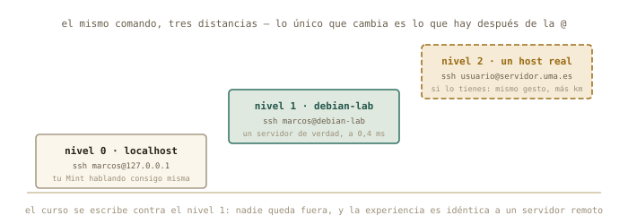
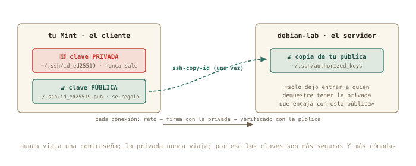

# SSH: entrar en otra máquina {#sec-cap11}

::: {.lede}
Bloque E: trabajar en remoto. Todo lo anterior conducía aquí — un
servidor instalado por ti, con nombre, con una puerta abierta, y el
mapa de cómo llegar. Hoy entras por esa puerta. Aprendes el comando
con el que un físico computacional pasa media vida, sustituyes las
contraseñas por claves — más seguras y más cómodas a la vez —, y
mueves ficheros entre máquinas como si estuvieran en la misma mesa.
Primero contigo mismo, luego con tu VM, y después con cualquier
servidor del mundo.
:::

::: {.chapmeta}
⏱ **2–3 h** con ejercicios · requisitos: **capítulos 8 y 10** · máquina: **tu Linux de diario y `debian-lab`** · nivel: **el capítulo más avanzado del curso — lo esencial cabe en las dos primeras secciones**
:::

::: {.objetivos}
**Al terminar esta sesión sabrás**

- Conectarte a otro ordenador *con ratón*, desde el gestor de archivos: SSH, Samba, FTP y NFS por el mismo diálogo.
- Qué son el cliente y el servidor SSH, y qué pasa exactamente al conectar por primera vez (la huella, `known_hosts`).
- Convertir tu propia máquina en servidor con `openssh-server`, y entrar en ella desde ella misma.
- Crear un par de claves ed25519, instalarlo en el servidor con `ssh-copy-id` y no volver a teclear una contraseña.
- Bautizar servidores en `~/.ssh/config` para conectar con una palabra.
- Copiar ficheros entre máquinas con `scp` y sincronizar carpetas con `rsync`.
- Ejecutar un comando en otra máquina sin abrir sesión — y por qué eso cambia tu forma de trabajar.
- Qué cambia cuando el servidor es de verdad: la universidad, una nube, o tu casa desde fuera.
:::

::: {.aviso}
**△ Aviso · Este capítulo tiene dos velocidades**

Lo **esencial** — y suficiente para el proyecto final — son las dos
primeras secciones: conectarte a otro ordenador con el gestor de
archivos, y abrir una sesión SSH con tu contraseña. Todo lo demás —
claves, agenda, `rsync`, comandos remotos, endurecer el servidor — es
lo que usa un profesional a diario, pero es **avanzado**: si en algún
punto te pierdes, quédate con lo esencial, sigue al capítulo 12 (que
solo necesita saber entrar) y vuelve aquí cuando el resto te haga
falta. Nadie aprende SSH entero en una tarde.
:::

## Primero con ratón: otro ordenador en tu gestor de archivos {#sec-con-raton}

Antes de teclear un solo comando, la versión que ya sabes usar. Tu
gestor de archivos — Nemo en Mint (Caja, Nautilus o Thunar en otros
escritorios) — sabe abrir carpetas que viven en *otra máquina*, y lo
hace con un solo diálogo para todos los protocolos que te vas a
encontrar. Menú **Archivo → Conectar al servidor…** y verás un
desplegable con el tipo de conexión:

| Tipo | Qué es | Cuándo te lo encontrarás |
|------|--------|--------------------------|
| **SSH** (SFTP) | ficheros a través de una sesión SSH cifrada | cualquier máquina Linux con SSH — tu `debian-lab`, el clúster |
| **Windows / Samba** (SMB) | el «compartir carpeta» de Windows y de los NAS | la impresora de casa, el disco de red, el PC con Windows |
| **FTP** | el protocolo veterano de transferir ficheros, sin cifrar | servidores públicos de datos, alojamientos web antiguos |
| **WebDAV** | ficheros sobre una web | nubes universitarias, Nextcloud |
| **NFS** (escribiendo `nfs://…` en la barra de dirección) | el compartir de Unix | laboratorios y clústeres (anexo B2) |

Pruébalo ahora con lo que ya tienes: tipo **SSH**, servidor
`debian-lab` (el nombre que le diste en el capítulo 10), carpeta
`/home/marcos`, usuario `marcos`, y tu contraseña. La casa del
servidor aparece en la barra lateral como una carpeta más: arrastra
un fichero, ábrelo, edítalo, bórralo — todo viaja por el servidor
SSH que dejaste instalado en el capítulo 8. Eso que acaba de pasar
*es* SSH; el resto del capítulo es el mismo mecanismo visto desde la
terminal, donde además de mover ficheros podrás *ejecutar* cosas en
la otra máquina. Si hoy no pasas de esta sección, ya sabes conectarte
a otro ordenador — que era el objetivo.

## Cliente y servidor {#sec-cliente-servidor}

**SSH** (*Secure Shell*) es un shell — el del capítulo 1 — que corre
en *otra* máquina, con tu teclado y tu pantalla conectados a él por
la red, cifrado de punta a punta. Tiene dos mitades: el **servidor**
(`sshd`, el que escucha en el puerto 22 que viste ayer) y el
**cliente** (`ssh`, el comando que tecleas). Tu `debian-lab` lleva el
servidor desde la instalación; tu Mint trae el cliente de serie. Y
gracias al `/etc/hosts` de ayer, la máquina tiene nombre:

```terminal
marcos@portatil:~$ ssh marcos@debian-lab
The authenticity of host 'debian-lab (192.168.122.15)' can't be established.
ED25519 key fingerprint is SHA256:kX9v2Lm4pQ7rT1sW8yZaBcDeFgHiJkLmNoPqRsTuVwX.
Are you sure you want to continue connecting (yes/no/[fingerprint])? yes
Warning: Permanently added 'debian-lab' (ED25519) to the list of known hosts.
marcos@debian-lab's password:
Linux debian-lab 6.12.0-amd64 #1 SMP Debian 6.12.41-1 x86_64
marcos@debian-lab:~$ hostname
debian-lab
marcos@debian-lab:~$ exit
Connection to debian-lab closed.
marcos@portatil:~$
```

Léelo con calma, porque cada línea enseña algo. La pregunta de la
**huella** (*fingerprint*) solo aparece la primera vez: SSH no conoce
a esa máquina y te pide que confirmes que es quien dice ser; al decir
`yes`, apunta su huella en `~/.ssh/known_hosts` y a partir de ahí la
reconoce sola. (Si algún día esa huella *cambia*, SSH se negará a
conectar con un aviso en mayúsculas: o han reinstalado el servidor, o
alguien se está haciendo pasar por él. Nunca se ignora.) Después, la
contraseña de tu usuario *en el servidor*, y el prompt cambia:
**`marcos@debian-lab`**. Tu terminal está ahora en la otra máquina —
cada comando que teclees se ejecuta allí, con sus ficheros, sus
permisos, su `apt`. `exit` te devuelve a casa. Ese cambio de prompt es
tu brújula del bloque E: mira siempre dónde estás antes de teclear.

::: {.historia}
**◷ Historia · Del teléfono al cifrado**

Entrar en un ordenador lejano es más viejo que internet: en los 70 se
hacía colgando el auricular del teléfono en un *acoplador acústico*
que convertía los bits en pitidos, a 300 bits por segundo — un folio
de texto por minuto. Los protocolos de entonces, `telnet` y `rlogin`,
enviaban tu contraseña tal cual por la línea; nadie pensó que
importara hasta que importó: en 1995, tras descubrir que alguien había
pinchado la red de la Universidad de Helsinki y estaba recolectando
contraseñas, el investigador Tatu Ylönen escribió en unos meses un
sustituto cifrado y lo liberó. Lo llamó Secure Shell. Cuatro años
después el proyecto OpenBSD lo reescribió como software libre —
OpenSSH — y es el que corre hoy en tu `debian-lab`, en el clúster de
la universidad y en cada servidor de cada nube.
:::

{#fig-acoplador fig-alt="Acoplador acústico con un auricular de teléfono apoyado" width="70%"}

## Nivel 0: tu propia máquina como servidor {#sec-nivel-0}

Antes de irte lejos, el experimento más corto posible: convertir tu
Mint en servidor y entrar en él *desde él mismo*. Suena absurdo, pero
tiene dos utilidades — practicar sin red de por medio, y abrir tu
portátil a otras máquinas de tu casa (o a tu móvil, con cualquier app
de SSH):

```terminal
marcos@portatil:~$ sudo apt install openssh-server
marcos@portatil:~$ systemctl status ssh | head -3
● ssh.service - OpenBSD Secure Shell server
     Loaded: loaded (/usr/lib/systemd/system/ssh.service; enabled)
     Active: active (running) since Tue 2026-08-25 18:40:02 CEST
marcos@portatil:~$ ssh marcos@localhost
marcos@localhost's password:
marcos@portatil:~$ exit
```

`localhost` es el `127.0.0.1` del capítulo 9: tú mismo. El prompt no
cambia — estás en la misma máquina — pero la sesión es una sesión SSH
completa, cifrada y con servidor en medio.

{#fig-tres-niveles fig-alt="Escalera de tres niveles: localhost, la máquina virtual debian-lab y un host real de la universidad"}

## Claves en vez de contraseñas {#sec-claves}

Teclear la contraseña en cada conexión es incómodo, y en un servidor
expuesto a internet es peligroso: hay robots probando contraseñas en
el puerto 22 de todas las máquinas del mundo, a todas horas. La
solución es a la vez más cómoda y más segura, y es física de la
buena: un **par de claves**. La **privada** se queda en tu máquina y
no sale de ella jamás; la **pública** se regala a cada servidor en el
que quieras entrar. El servidor te lanza un reto que solo la privada
puede resolver, comprueba la respuesta con la pública, y te deja
pasar. Ninguna contraseña viaja; ningún secreto se copia.

{#fig-ssh-claves fig-alt="Esquema del par de claves SSH: la privada permanece en el cliente, la pública se copia al servidor en authorized_keys"}

Tres comandos y no vuelves a teclear una contraseña:

```terminal
marcos@portatil:~$ ssh-keygen -t ed25519 -C "marcos@portatil"
Generating public/private ed25519 key pair.
Enter file in which to save the key (/home/marcos/.ssh/id_ed25519):
Enter passphrase (empty for no passphrase):
Your identification has been saved in /home/marcos/.ssh/id_ed25519
Your public key has been saved in /home/marcos/.ssh/id_ed25519.pub
marcos@portatil:~$ ssh-copy-id marcos@debian-lab
marcos@debian-lab's password:
Number of key(s) added: 1
marcos@portatil:~$ ssh marcos@debian-lab
marcos@debian-lab:~$
```

`ssh-keygen` crea el par (`ed25519` es el algoritmo moderno: claves
cortas, rápidas, seguras). Pon una **frase de paso** (*passphrase*)
cuando la pida: es la contraseña *de la clave*, por si alguien te
roba el portátil; tu escritorio la recuerda durante la sesión, así
que solo la escribirás una vez al día. `ssh-copy-id` hace el reparto:
entra con tu contraseña una última vez y deja tu clave pública en el
servidor, en `~/.ssh/authorized_keys`. Y la tercera línea es el
premio: dentro sin preguntar nada.

::: {.por-dentro}
**◉ Por dentro · Los permisos vuelven a mandar**

Mira en `debian-lab`: `ls -la ~/.ssh` → `drwx------` para la carpeta
y `-rw-------` para `authorized_keys`. Y en tu Mint,
`ls -l ~/.ssh/id_ed25519` → `-rw-------`. SSH **se niega a usar
claves que otros puedan leer**: si un día tu clave «deja de
funcionar» tras copiarla o restaurarla, el diagnóstico es casi
siempre `chmod 600` sobre la privada y `chmod 700` sobre `~/.ssh`.
El capítulo 4 no era teoría: es la razón por la que tu llave está a
salvo de los demás usuarios de la máquina.
:::

## Un nombre para cada servidor: `~/.ssh/config` {#sec-config}

Con varias máquinas — la VM, la universidad, un servidor de cálculo —
recordar usuarios, direcciones y puertos cansa. `~/.ssh/config` es la
agenda de SSH: un fichero de texto (¿qué si no?) que crea alias.
`nano ~/.ssh/config`:

```default
Host lab
    HostName debian-lab
    User marcos

Host uni
    HostName servidor.uma.es
    User m.garcia
    Port 22
```

Desde ahora, `ssh lab` basta — y también vale para `scp` y `rsync`.
Cuando la universidad te dé una cuenta, será una entrada más en esta
agenda, y todo lo que sigue funcionará igual con `uni` que con `lab`.

## Mover ficheros: `scp` y `rsync` {#sec-copiar}

Copiar entre máquinas usa la misma gramática que `cp` del capítulo 2,
con un `máquina:` delante de la ruta remota:

```terminal
marcos@portatil:~/Descargas$ scp adquisicion.log lab:~/
adquisicion.log                          100%  298KB  41.2MB/s   00:00
marcos@portatil:~/Descargas$ scp -r experimento-pendulo lab:~/
marcos@portatil:~/Descargas$ scp lab:~/informe.txt .
```

Subir, subir una carpeta (`-r`), bajar: tres formas del mismo gesto.
Para carpetas grandes que cambian — los resultados de una simulación
que vas recogiendo — el profesional es **`rsync`**: copia solo lo que
ha cambiado, se puede interrumpir y reanudar, y muestra el progreso:

```terminal
marcos@portatil:~$ rsync -av --progress simulaciones/ lab:~/simulaciones/
sending incremental file list
run07.csv
        1,204,112 100%   38.12MB/s    0:00:00
sent 1,204,589 bytes  received 42 bytes  2,409,262.00 bytes/sec
```

`-a` conserva fechas y permisos, `-v` cuenta lo que hace. Y un matiz
que muerde a todo el mundo una vez: **la barra final importa**.
`simulaciones/` (con barra) sincroniza *el contenido* de la carpeta;
`simulaciones` (sin barra) copia *la carpeta entera* dentro del
destino. La segunda vez que ejecutes el mismo `rsync` tardará un
segundo: solo viaja lo nuevo.

::: {.truco}
**✚ Truco · Arrastrar y soltar sigue valiendo**

La conexión con ratón de la primera sección es SFTP — el primo de
`scp` que viaja por el mismo túnel — y también se abre escribiendo
`sftp://debian-lab/home/marcos` en la barra de direcciones
(<kbd>Ctrl</kbd>+<kbd>L</kbd>). Para un fichero suelto es perfecto;
`rsync` gana cuando son mil ficheros o hay que repetir la copia cada
día. Y si prefieres que la casa del servidor aparezca
como una carpeta *de verdad* en tu árbol — para abrirla desde
cualquier programa —, eso se llama montar por SSHFS, y está en el
[anexo B2](../anexos/anexo-b2-montajes.qmd).
:::

## Ejecutar allí, sin quedarse {#sec-comando-remoto}

El detalle que convierte SSH de «terminal lejana» en herramienta de
trabajo: puedes pedirle a otra máquina que ejecute **un comando** y te
devuelva la salida, sin abrir sesión:

```terminal
marcos@portatil:~$ ssh lab hostname
debian-lab
marcos@portatil:~$ ssh lab "grep -c ERROR adquisicion.log"
108
marcos@portatil:~$ ssh lab df -h / | tail -1
/dev/vda2         17G   1,4G   15G   9% /
```

Ahí están los tres bloques anteriores dándose la mano: el `grep` del
capítulo 3 corriendo en el servidor del capítulo 8, con el resultado
llegando a tu terminal por la red del bloque D — y ese `| tail -1` se
ejecuta *en tu Mint*, sobre lo que el servidor devolvió. Cuando
tengas una simulación en un clúster, «¿ha terminado?» será
`ssh cluster ls resultados/`, sin moverte de tu editor.

## Nivel 2: cuando el servidor es de verdad {#sec-nivel-2}

Todo lo anterior funciona idéntico con un servidor a mil kilómetros;
solo cambia lo que hay después de la `@`. Dónde conseguir uno,
mientras el curso se escribe (comprueba disponibilidad y condiciones,
que cambian):

| Vía | Qué es | Coste |
|-----|--------|-------|
| **Universidad o alguien conocido** | el servicio de informática, tu grupo, o el servidor de un profesor: una máquina Linux con SSH | gratis; pídela — es la mejor opción |
| **Azure for Students / GitHub Student Developer Pack** | con tu correo de la universidad: créditos para VMs *reales* con IP pública (Azure 100 $, DigitalOcean 200 $ y más), sin tarjeta | gratis para estudiantes |
| **Oracle Cloud «Always Free»** | una VM real y permanente (ARM, hasta 4 núcleos) con IP pública | gratis; pide tarjeta para identificarte, y a veces no hay plazas |
| **tilde.town, SDF** | un servidor Unix compartido por SSH; la cuenta se pide *entregando tu clave pública* — el ejercicio 11.3 en la vida real | gratis, sin tarjeta; sin `sudo`: para practicar |
| **GitHub Codespaces** | un contenedor Ubuntu con terminal (60 h/mes en la cuenta gratuita); se entra con `gh codespace ssh` | gratis; es un contenedor, no una VM |
| **Google Cloud Shell** | una terminal en el navegador con 5 GB de casa persistente; `gcloud cloud-shell ssh` desde tu Mint | gratis, sin tarjeta; la máquina es efímera |

(Las condiciones de estos servicios cambian cada pocos meses:
comprueba disponibilidad y letra pequeña antes de contar con uno.)
Las diferencias prácticas: la dirección será pública o un nombre DNS;
el puerto puede no ser el 22 (`-p 2222`, o `Port` en tu `config`);
te pedirán tu **clave pública** por adelantado — la que ya sabes
generar — y quizá un segundo factor. Y la lección de seguridad que
cierra el capítulo: un servidor a la vista de internet recibe miles
de intentos de contraseña al día. Se sobrevive con claves y con la
contraseña *desactivada* — exactamente lo que harás en el ejercicio
11.6, en tu VM y con instantánea.

::: {.aviso}
**△ Cuidado · La clave privada es tu identidad**

Tres reglas sin excepción. Uno: la **privada nunca se copia** a otro
sitio — ni al servidor, ni a un correo, ni «para tenerla en el
portátil del laboratorio»: allí se genera otro par. Dos: **frase de
paso** siempre. Tres: si una huella de servidor conocido *cambia*
de repente, no se acepta a ciegas — se pregunta a quien lo administra.
Con esas tres, SSH es hoy la forma más segura que existe de trabajar
a distancia; sin ellas, es una puerta abierta con tu nombre.
:::

::: {.por-dentro}
**◉ Por dentro · El camino inverso: tu casa desde fuera (opcional)**

¿Y entrar en tu Mint desde la universidad? Ayer viste por qué no se
puede sin más: tu casa está detrás del NAT. Haría falta pedirle al
router que *reenvíe* el puerto 22 de su dirección pública a tu Mint
(«reenvío de puertos» o *port forwarding*, en la sección WAN) — un
cambio reversible más, que abriría una puerta de tu casa a todo
internet. Solo tiene sentido con claves y contraseña desactivada, y
si tu compañía te tiene tras un CG-NAT (ejercicio 9.3), ni así. Lo
dejamos como experimento avanzado para quien lo necesite; el
capítulo 12 enseña una vía más elegante para casi todos los casos.
:::

## Práctica: la escalera {#sec-practica-11}

Cuaderno en marcha (`script sesion11.log`). Los cambios de hoy en la
VM se hacen con instantánea previa; en tu Mint, solo se instala un
paquete y se crean ficheros en `~/.ssh`.

**Nivel 1 · Lo esencial**

::: {.ejercicio}
**Ejercicio 11.0 · Con ratón**

Desde el gestor de archivos, conéctate a `debian-lab` por SSH con el
diálogo *Conectar al servidor…*, copia un fichero cualquiera de tu
Mint a la casa del servidor arrastrándolo, y comprueba en la barra
lateral que la conexión queda como marcador. Después desconéctala
(botón ⏏ junto al marcador). *Pista: tipo SSH, servidor `debian-lab`,
usuario `marcos`; si pide aceptar una «identidad» desconocida, es la
huella que explica la sección siguiente — acepta.*

:::: {.solucion}
::: {.callout-tip collapse="true" title="Solución razonada"}
Archivo → Conectar al servidor → SSH · `debian-lab` · `/home/marcos` ·
`marcos` → contraseña → la carpeta aparece; arrastrar el fichero;
⏏ para desconectar. Desde la VM, `ls ~` muestra el fichero copiado.

**Por qué así** — Es exactamente `scp` con ratón, y para mucha gente
es *toda* la SSH que necesitan. El resto del capítulo existe para
cuando el ratón se queda corto: ejecutar cosas allí, automatizar, o
entrar en máquinas sin ventanas.
:::
::::
:::

::: {.ejercicio}
**Ejercicio 11.1 · Nivel 0: contigo mismo**

Instala `openssh-server` en tu Mint, comprueba que el servicio
escucha (`systemctl status ssh` y, del capítulo 10, `ss -tln`), y
entra con `ssh marcos@localhost`. Dentro, ejecuta `who` para ver tu
sesión listada, y sal. *Pista: `who` muestra las sesiones abiertas;
la tuya por SSH aparecerá con un `pts/` y una dirección.*

:::: {.solucion}
::: {.callout-tip collapse="true" title="Solución razonada"}
`sudo apt install openssh-server`, `ss -tln | grep :22` muestra
`LISTEN`, y tras `ssh marcos@localhost` la primera vez pedirá aceptar
la huella (de tu propia máquina). `who` lista dos sesiones: la de tu
escritorio y la SSH desde `127.0.0.1`. `exit`.

**Por qué así** — El servidor SSH en tu portátil es lo que permitirá,
en el capítulo 12, cosas como entrar desde el móvil o conectar dos
portátiles en el laboratorio. Y practicar la huella con una máquina
que sabes que es de fiar quita el susto para las siguientes.
:::
::::
:::

::: {.ejercicio}
**Ejercicio 11.2 · Nivel 1: el servidor**

Entra en `debian-lab` con contraseña, demuestra dónde estás con tres
comandos (`hostname`, `ip a | grep "inet "`, `whoami`) y mira el
fichero de huellas de tu Mint tras salir. *Pista: `cat
~/.ssh/known_hosts` — verás la entrada que acabas de aceptar.*

:::: {.solucion}
::: {.callout-tip collapse="true" title="Solución razonada"}
`ssh marcos@debian-lab` → `yes` → contraseña. Dentro: `debian-lab`,
`192.168.122.15`, `marcos`. Fuera: `known_hosts` guarda una línea por
máquina conocida — ahora dos, `localhost` y `debian-lab`.

**Por qué así** — Tres comandos que responden «¿dónde estoy?», la
pregunta que hay que hacerse antes de cualquier `rm` en una sesión
remota. Y `known_hosts` es la memoria de confianza de tu cliente:
saber que existe es saber leer el aviso de huella cambiada.
:::
::::
:::

**Nivel 2 · Avanzado (pero muy útil)**

::: {.ejercicio}
**Ejercicio 11.3 · Las claves**

Genera tu par ed25519 con frase de paso, instálalo en `debian-lab`
con `ssh-copy-id`, y comprueba que `ssh marcos@debian-lab` ya no pide
contraseña. Después mira, en el servidor, dónde ha quedado tu clave
pública y con qué permisos. *Pista: `cat ~/.ssh/authorized_keys` y
`ls -la ~/.ssh` dentro de la VM.*

:::: {.solucion}
::: {.callout-tip collapse="true" title="Solución razonada"}
`ssh-keygen -t ed25519 -C "marcos@portatil"`, `ssh-copy-id
marcos@debian-lab`, y la siguiente conexión entra directa (pedirá la
frase de paso de la clave la primera vez de la sesión de escritorio).
En la VM, `authorized_keys` contiene una línea larga que empieza por
`ssh-ed25519` — tu pública —, con permisos `-rw-------`.

**Por qué así** — Es el ritual que repetirás con cada servidor nuevo
de tu vida: generar una vez, copiar la pública a cada máquina. La
línea de `authorized_keys` es exactamente el contenido de tu
`id_ed25519.pub`: compáralos con `cat` y verás que coinciden.
:::
::::
:::

::: {.ejercicio}
**Ejercicio 11.4 · Alias, copia y comando remoto**

Crea `~/.ssh/config` con el alias `lab`. Después: sube
`adquisicion.log` con `scp`, y sin abrir sesión, pídele al servidor
que cuente los `ERROR` y que te diga el sensor que más falla (la
tubería del capítulo 3, entre comillas). *Pista: `ssh lab "grep …
| … | sort -nr | head -1"` — las comillas hacen que la tubería entera
se ejecute allí.*

:::: {.solucion}
::: {.callout-tip collapse="true" title="Solución razonada"}
Con el alias: `scp ~/Descargas/adquisicion.log lab:~/`, luego
`ssh lab "grep -c ERROR adquisicion.log"` → 108, y
`ssh lab "grep ERROR adquisicion.log | cut -d' ' -f4 | sort | uniq -c | sort -nr | head -1"`
→ `90 s3`.

**Por qué así** — Sin las comillas, tu Mint interpretaría el `|` y
ejecutaría la mitad de la tubería en casa sobre un fichero que no
tiene. Con ellas, el servidor recibe la orden completa. Es el patrón
del trabajo remoto: los datos y el cálculo allí, el resultado aquí.
:::
::::
:::

::: {.ejercicio}
**Ejercicio 11.5 · `rsync` y la barra**

Crea en tu Mint una carpeta `resultados/` con tres ficheros
cualesquiera. Sincronízala a la VM con `rsync -av` — primero con
barra final, luego sin ella — y observa con `ssh lab ls -R` dónde ha
acabado cada cosa. Después modifica un fichero, repite el `rsync` y
fíjate en qué viaja. *Pista: `rsync -av resultados/ lab:~/resultados/`
frente a `rsync -av resultados lab:~/otra/`.*

:::: {.solucion}
::: {.callout-tip collapse="true" title="Solución razonada"}
Con barra, los tres ficheros aparecen dentro de `~/resultados/`; sin
barra, aparece la carpeta `resultados` entera *dentro* de `~/otra/`.
En la repetición tras el cambio, `rsync` envía solo el fichero
modificado — la lista dice un nombre, no tres.

**Por qué así** — La barra es la trampa clásica y la copia
incremental es la virtud clásica: entender las dos en un experimento
de dos minutos evita una tarde de carpetas duplicadas y horas de
transferencias repetidas.
:::
::::
:::

::: {.ejercicio}
**Ejercicio 11.6 · Cerrar la puerta a las contraseñas**

Con instantánea previa de la VM y el protocolo del capítulo 10 (copia
del fichero, vuelta atrás escrita): edita en `debian-lab` el fichero
`/etc/ssh/sshd_config`, pon `PasswordAuthentication no`, reinicia el
servicio y verifica que con tu clave sigues entrando — y que sin ella
(prueba `ssh -o PubkeyAuthentication=no lab`) te rechaza. *Pista:
`sudo cp /etc/ssh/sshd_config /etc/ssh/sshd_config.bak`, `sudo nano`,
`sudo systemctl restart ssh`. No cierres tu sesión abierta hasta haber
comprobado que una nueva entra.*

:::: {.solucion}
::: {.callout-tip collapse="true" title="Solución razonada"}
La línea suele venir comentada (`#PasswordAuthentication yes`):
descoméntala y ponla a `no`. Tras el reinicio del servicio, `ssh lab`
entra por clave; `ssh -o PubkeyAuthentication=no lab` devuelve
`Permission denied (publickey)`. Vuelta atrás: restaurar el `.bak` y
reiniciar `ssh` — o la instantánea.

**Por qué así** — Es *el* endurecimiento básico de cualquier servidor
expuesto, y lo has hecho con todas las redes: instantánea, copia,
sesión abierta de reserva. La regla de oro de los administradores —
«nunca cierres la sesión que funciona hasta probar la nueva» — acaba
de entrar en tu repertorio.
:::
::::
:::

**Nivel 3 · Opcional · el host real**

::: {.ejercicio}
**Ejercicio 11.7 · Nivel 2, si tienes dónde**

Si dispones de una cuenta en un servidor real (universidad, nube o
shell público): añádelo a tu `~/.ssh/config`, instala tu clave
pública por la vía que te indiquen, entra, y repite el parte de
«¿dónde estoy?» del 11.2 más un `ping` de vuelta a tu casa desde allí
— para ver la distancia con los ojos del capítulo 9. *Pista: si el
puerto no es el 22, `Port` en la agenda; si te dan solo un formulario
web para la clave, el contenido a pegar es tu `id_ed25519.pub`
completo.*

:::: {.solucion}
::: {.callout-tip collapse="true" title="Solución razonada"}
La experiencia es idéntica a `debian-lab` con dos diferencias
visibles: el `ping` de vuelta a tu IP pública tarda decenas de
milisegundos (kilómetros reales), y probablemente `sudo` no
funcione — no eres administrador allí, y ahora entiendes exactamente
qué significa eso.

**Por qué así** — El curso se escribió para que llegaras aquí sin
necesitar este ejercicio; hacerlo cierra el círculo: la escalera de
tres niveles era la misma máquina a tres distancias.
:::
::::
:::

## Autocomprobación {#sec-quiz-11}

::: {.content-visible when-format="html"}

Marca una respuesta por pregunta; la corrección es inmediata.

```{=html}
<div class="quiz" id="quiz-cap11">
  <div class="qz"><p class="qq" data-n="1">Al conectar por primera vez a un servidor, SSH te pregunta si aceptas su huella porque…</p>
    <label><input type="radio" name="z1" value="a"><span>todavía no conoce esa máquina y quiere que confirmes que es quien dice ser</span></label>
    <label><input type="radio" name="z1" value="b"><span>tu contraseña es incorrecta</span></label>
    <label><input type="radio" name="z1" value="c"><span>el servidor no tiene clave</span></label>
    <div class="fb good"><b>Correcto.</b> Al aceptar, la apunta en <code>known_hosts</code>. Si esa huella cambia algún día, el aviso en mayúsculas significa «reinstalado… o suplantado».</div>
    <div class="fb bad"><b>No exactamente.</b> Es la presentación: una máquina nueva para tu cliente. Solo pasa la primera vez, y se guarda en <code>~/.ssh/known_hosts</code>.</div>
  </div>
  <div class="qz"><p class="qq" data-n="2">¿Qué fichero se copia al servidor con <code>ssh-copy-id</code>?</p>
    <label><input type="radio" name="z2" value="a"><span>la clave privada, <code>id_ed25519</code></span></label>
    <label><input type="radio" name="z2" value="b"><span>la clave pública, <code>id_ed25519.pub</code>, a <code>authorized_keys</code></span></label>
    <label><input type="radio" name="z2" value="c"><span>tu contraseña cifrada</span></label>
    <div class="fb good"><b>Correcto.</b> La cerradura se reparte; la llave se queda en casa. La privada no viaja nunca, a ningún sitio.</div>
    <div class="fb bad"><b>No exactamente.</b> Solo la pública, que es la que se puede regalar. Copiar la privada a cualquier parte es la regla que nunca se rompe.</div>
  </div>
  <div class="qz"><p class="qq" data-n="3">¿Qué hace <code>ssh lab "grep -c ERROR datos.log"</code>?</p>
    <label><input type="radio" name="z3" value="a"><span>abre una sesión interactiva en <code>lab</code></span></label>
    <label><input type="radio" name="z3" value="b"><span>ejecuta ese comando en <code>lab</code> y te devuelve la salida, sin abrir sesión</span></label>
    <label><input type="radio" name="z3" value="c"><span>copia <code>datos.log</code> a tu máquina y lo cuenta aquí</span></label>
    <div class="fb good"><b>Correcto.</b> Los datos y el cálculo allí, el resultado aquí. Es la forma de preguntar «¿ha terminado mi simulación?» sin moverte.</div>
    <div class="fb bad"><b>No exactamente.</b> Con un comando detrás, SSH lo ejecuta en el servidor y vuelve. Nada se copia; la sesión ni se abre.</div>
  </div>
  <div class="qz"><p class="qq" data-n="4">Para subir la carpeta <code>datos</code> entera a <code>lab</code>:</p>
    <label><input type="radio" name="z4" value="a"><span><code>scp datos lab:~/</code></span></label>
    <label><input type="radio" name="z4" value="b"><span><code>scp -r datos lab:~/</code></span></label>
    <label><input type="radio" name="z4" value="c"><span><code>ssh datos lab</code></span></label>
    <div class="fb good"><b>Correcto.</b> Como <code>cp</code>: las carpetas piden <code>-r</code>. Y el <code>máquina:</code> delante de la ruta es lo único nuevo.</div>
    <div class="fb bad"><b>No exactamente.</b> Es la gramática de <code>cp</code> con destino remoto: carpeta → <code>-r</code>. Sin él, <code>scp</code> se niega.</div>
  </div>
  <div class="qz"><p class="qq" data-n="5">La ventaja de <code>rsync</code> sobre <code>scp</code> para una carpeta que cambia es que…</p>
    <label><input type="radio" name="z5" value="a"><span>va cifrado y <code>scp</code> no</span></label>
    <label><input type="radio" name="z5" value="b"><span>solo transfiere lo que ha cambiado, y se puede reanudar</span></label>
    <label><input type="radio" name="z5" value="c"><span>no necesita SSH</span></label>
    <div class="fb good"><b>Correcto.</b> La segunda ejecución tarda un segundo. Y ojo con la barra final: contenido de la carpeta frente a la carpeta entera.</div>
    <div class="fb bad"><b>No exactamente.</b> Ambos van por SSH y cifrados. <code>rsync</code> gana por incremental y reanudable: ideal para resultados que se van acumulando.</div>
  </div>
  <div class="qz"><p class="qq" data-n="6">Tras <code>PasswordAuthentication no</code> en el servidor…</p>
    <label><input type="radio" name="z6" value="a"><span>ya nadie puede entrar</span></label>
    <label><input type="radio" name="z6" value="b"><span>solo entra quien tenga una clave privada cuya pública esté en <code>authorized_keys</code></span></label>
    <label><input type="radio" name="z6" value="c"><span>las contraseñas se vuelven más largas</span></label>
    <div class="fb good"><b>Correcto.</b> Los robots que prueban contraseñas se quedan fuera; tú, con tu clave, dentro. El endurecimiento básico de todo servidor expuesto.</div>
    <div class="fb bad"><b>No exactamente.</b> Se cierra la puerta a las contraseñas, no a las claves: entra quien demuestre tener la privada. Por eso se prueba la clave <em>antes</em> de cerrar la sesión de reserva.</div>
  </div>
</div>
<script>
(function(){
  const OK = {z1:"a", z2:"b", z3:"b", z4:"b", z5:"b", z6:"b"};
  document.querySelectorAll("#quiz-cap11 .qz input").forEach(i => {
    i.addEventListener("change", () => {
      const qz = i.closest(".qz");
      qz.classList.remove("ok","ko");
      qz.classList.add(i.value === OK[i.name] ? "ok" : "ko");
    });
  });
})();
</script>
```

:::

:::: {.content-visible when-format="pdf"}

Responde de memoria; las respuestas están al final del capítulo.

1.  Al conectar por primera vez a un servidor, SSH te pregunta si aceptas su huella porque…
    a)  todavía no conoce esa máquina y quiere que confirmes que es quien dice ser
    b)  tu contraseña es incorrecta
    c)  el servidor no tiene clave

2.  ¿Qué fichero se copia al servidor con `ssh-copy-id`?
    a)  la clave privada, `id_ed25519`
    b)  la clave pública, `id_ed25519.pub`, a `authorized_keys`
    c)  tu contraseña cifrada

3.  ¿Qué hace `ssh lab "grep -c ERROR datos.log"`?
    a)  abre una sesión interactiva en `lab`
    b)  ejecuta ese comando en `lab` y te devuelve la salida, sin abrir sesión
    c)  copia `datos.log` a tu máquina y lo cuenta aquí

4.  Para subir la carpeta `datos` entera a `lab`:
    a)  `scp datos lab:~/`
    b)  `scp -r datos lab:~/`
    c)  `ssh datos lab`

5.  La ventaja de `rsync` sobre `scp` para una carpeta que cambia es que…
    a)  va cifrado y `scp` no
    b)  solo transfiere lo que ha cambiado, y se puede reanudar
    c)  no necesita SSH

6.  Tras `PasswordAuthentication no` en el servidor…
    a)  ya nadie puede entrar
    b)  solo entra quien tenga una clave privada cuya pública esté en `authorized_keys`
    c)  las contraseñas se vuelven más largas

::::

::: {.solucion-final}
**Autocomprobación (test de la sección 11.9)** — Respuestas: 1 a · 2 b · 3 b · 4 b · 5 b · 6 b.
:::

::: {.proxima}
**La próxima sesión**

Ya entras y sales de tu servidor. El capítulo 12 es vivir en él:
lanzar una simulación, cerrar el portátil, volver mañana y
encontrarla terminada — `tmux`, la sesión que no muere. Y llega el
caso estrella del físico computacional: un Jupyter corriendo en el
servidor, abierto en el navegador de tu portátil a través de un túnel
SSH. De postre sabrás qué es «la nube» en dos párrafos y qué es SLURM
en dos páginas: la puerta al doctorado. Guarda `sesion11.log`.
:::

::: {.pie-piloto}
cap. 11 v0.1 · piloto — anota tiempo real invertido, dudas y erratas junto a tu `sesion11.log`
:::
