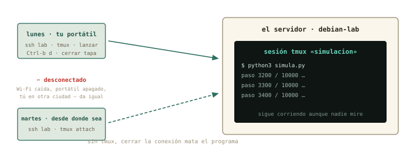
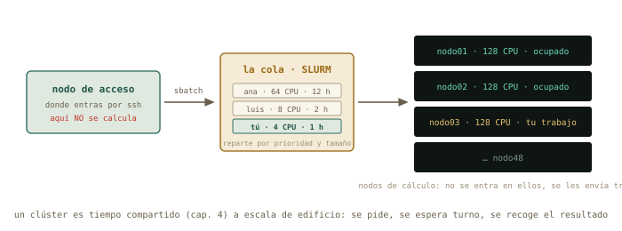

# Vivir en remoto {#sec-cap12}

::: {.lede}
Última sesión numerada, y la que junta todo. Ya entras y sales de tu
servidor; hoy aprendes a *quedarte* sin estar: lanzar una simulación,
cerrar el portátil, volver mañana desde otra ciudad y encontrarla
terminada. Después, el truco favorito del físico computacional — un
Jupyter corriendo en el servidor, abierto en el navegador de tu
portátil por un túnel cifrado. Y de postre, dos cosas que te van a
nombrar el primer día del doctorado: qué es «la nube» en términos
concretos, y qué es SLURM, la cola de trabajos de todos los clústeres
del mundo.
:::

::: {.chapmeta}
⏱ **2–3 h** con ejercicios · requisitos: **capítulo 11** · máquina: **tu Linux de diario y `debian-lab`**
:::

::: {.objetivos}
**Al terminar esta sesión sabrás**

- Por qué un programa lanzado por SSH muere al cerrar la conexión — y cómo evitarlo.
- Usar `tmux`: crear una sesión, desconectarte de ella, volver a engancharla desde cualquier sitio.
- Abrir un túnel SSH y ver en tu navegador un servicio que solo existe dentro del servidor.
- Ejecutar Jupyter en el servidor con los datos y la CPU de allí, y trabajar desde tu portátil.
- Qué es exactamente «una máquina en la nube», qué te dan y qué se paga.
- La anatomía de un clúster y de un *job script* de SLURM: enviar, consultar, cancelar.
:::

## La sesión que muere {#sec-sesion-muere}

Un experimento de treinta segundos que explica el capítulo. Entra en
`debian-lab`, lanza algo largo en segundo plano (capítulo 5), y cierra
la conexión:

```terminal
marcos@portatil:~$ ssh lab
marcos@debian-lab:~$ sleep 600 &
[1] 1204
marcos@debian-lab:~$ exit
marcos@portatil:~$ ssh lab "ps aux | grep sleep"
marcos      1231  0.0  0.0   6612  2200 ?  Ss  20:02  0:00 grep sleep
```

El `sleep` ha desaparecido: al cerrar la sesión, el shell envía a
todos sus hijos la señal SIGHUP — «se ha colgado la línea», nombre
heredado de los módems del capítulo 11 — y los procesos terminan.
Tu simulación de diez horas moriría a la primera caída de Wi-Fi.
Hay parches (`nohup`, el `&` con `disown`), pero la solución que usa
todo el mundo es otra idea: que la sesión viva *en el servidor*, y
que tú te enganches y desenganches de ella.

## `tmux`: la sesión que no muere {#sec-tmux}

`tmux` (*terminal multiplexer*) crea sesiones de terminal que
pertenecen al servidor, no a tu conexión. Te desconectas y siguen;
vuelves — desde el mismo portátil o desde otro — y las recuperas
tal como las dejaste.

{#fig-tmux fig-alt="Una sesión tmux en el servidor con una simulación en marcha; el portátil se desconecta el lunes y vuelve a engancharse el martes"}

Instálalo en `debian-lab` (`sudo apt install tmux`) y repite el
experimento, esta vez dentro de una sesión con nombre:

```terminal
marcos@debian-lab:~$ tmux new -s simulacion
```

La pantalla cambia: una barra verde abajo con el nombre de la sesión.
Estás *dentro* de tmux. Lanza tu trabajo largo — el `simula.py` de la
práctica, o el `sleep 600` de antes — y ahora el gesto clave:
<kbd>Ctrl</kbd>+<kbd>b</kbd> y luego <kbd>d</kbd> (*detach*,
desenganchar). Vuelves a tu prompt normal; la sesión sigue viva
detrás. Cierra SSH, apaga la Wi-Fi si quieres, y vuelve:

```terminal
marcos@portatil:~$ ssh lab
marcos@debian-lab:~$ tmux ls
simulacion: 1 windows (created Tue Aug 25 20:10:41 2026)
marcos@debian-lab:~$ tmux attach -t simulacion
```

Ahí está, con su `sleep` todavía contando. Todo lo que hay que saber
de tmux para vivir en remoto cabe en cuatro gestos: `tmux new -s
nombre`, <kbd>Ctrl</kbd>+<kbd>b</kbd> <kbd>d</kbd>, `tmux ls`,
`tmux attach -t nombre`. (Cuando quieras más: <kbd>Ctrl</kbd>+<kbd>b</kbd>
<kbd>c</kbd> abre otra ventana en la misma sesión,
<kbd>Ctrl</kbd>+<kbd>b</kbd> <kbd>%</kbd> parte la pantalla en dos,
y `exit` dentro de la última ventana cierra la sesión.)

::: {.truco}
**✚ Truco · La regla de los servidores**

En un servidor ajeno, **lo primero que se teclea tras entrar es
`tmux attach || tmux new`**: engánchate a tu sesión si existe, crea
una si no. Así, cada trabajo lanzado sobrevive a tu conexión, y
cuando el administrador pregunte «¿lo tienes en tmux?», la respuesta
será siempre sí. Su hermano mayor, `screen`, hace lo mismo y lo
encontrarás en máquinas antiguas: `screen -S nombre`,
<kbd>Ctrl</kbd>+<kbd>a</kbd> <kbd>d</kbd>, `screen -r nombre`.
:::

## El túnel: un servicio remoto en tu navegador {#sec-tunel}

Segunda idea del capítulo, y la más elegante del curso. En el
capítulo 10 viste que un servicio escucha en un puerto, y que un
puerto solo abierto a `localhost` es invisible desde fuera. SSH
puede **tender un túnel**: hacer que un puerto de *tu* máquina
desemboque en un puerto del servidor, cifrado, sin abrir nada a la
red.

{#fig-tunel fig-alt="Túnel SSH que conecta el puerto 8888 del portátil con el 8888 del servidor donde corre Jupyter"}

La prueba más simple no necesita instalar nada: Python trae un
servidor web de juguete. En `debian-lab`, dentro de tmux:

```terminal
marcos@debian-lab:~$ python3 -m http.server 8000 --bind 127.0.0.1
Serving HTTP on 127.0.0.1 port 8000 (http://127.0.0.1:8000/) ...
```

Escucha solo en `127.0.0.1`: desde tu Mint, `nmap debian-lab` no lo
vería. Ahora, desde tu Mint, la conexión con túnel:

```terminal
marcos@portatil:~$ ssh -L 8000:localhost:8000 lab
```

Y en tu navegador, `http://localhost:8000`: la lista de ficheros de
la casa de `debian-lab`, servida por una máquina que no tiene ese
puerto abierto. `-L 8000:localhost:8000` se lee «mi puerto 8000 →
lo que el servidor llama `localhost:8000`». Mientras esa sesión SSH
esté abierta, el túnel existe; al cerrarla, desaparece.

Y ahora el caso estrella: **Jupyter en el servidor**. Los datos
pesados, la CPU de cálculo y el entorno de Python viven allí; tu
portátil solo pone el navegador:

```terminal
marcos@debian-lab:~$ sudo apt install jupyter-notebook
marcos@debian-lab:~$ jupyter notebook --no-browser --port 8888
    http://localhost:8888/tree?token=4f2a9c…
```

Con `ssh -L 8888:localhost:8888 lab` abierto en tu Mint, esa URL —
copiada con su *token* — funciona en tu navegador. Lo que ves es un
Jupyter normal; lo que pasa es que cada celda se ejecuta a
kilómetros. Lánzalo dentro de tmux y sobrevivirá a tus
desconexiones: mañana, nuevo túnel, misma sesión, todo donde estaba.
Este flujo — tmux + túnel + Jupyter — es, literalmente, cómo trabaja
la física computacional en 2026.

::: {.aviso}
**△ Cuidado · Por qué el túnel y no «abrir el puerto»**

La tentación es lanzar Jupyter escuchando en todas las interfaces y
entrar directo por `http://debian-lab:8888`. Funcionaría — y dejaría
un intérprete de Python con tus permisos abierto a toda la red, sin
cifrar. En el servidor de la universidad, además, el portero del
capítulo 10 no te dejaría. El túnel resuelve las dos cosas: nada se
abre, todo va cifrado, y solo tú — con tu clave — lo ves.
:::

## Qué es «la nube», en concreto {#sec-nube}

Con el curso hecho, la palabra deja de ser humo. **Una máquina en la
nube es una VM como tu `debian-lab`, en un anfitrión de KVM (capítulo
7) que vive en un edificio de otro** — y que alquilas por horas. Te
dan exactamente tres cosas: una dirección IP *pública* (capítulo 9:
sin NAT delante), un usuario, y un sitio donde pegar tu clave pública
(capítulo 11). Desde ese momento es `ssh usuario@ip`, y todo este
bloque aplica sin cambiar una coma. Lo que se paga es el tiempo
encendida, el disco y el tráfico que sale — por eso el primer hábito
de la nube es apagar lo que no se usa. Y la física de la sección de
`ping` decide dónde: una máquina en Fráncfort responde a 30 ms; la
misma en Virginia, a 100.

::: {.historia}
**◷ Historia · Tiempo compartido, tercera edición**

El curso ha contado la misma historia tres veces. En los 70, muchos
usuarios compartían *un* ordenador por turnos de milisegundos
(capítulo 4). En 1967, IBM les dio a cada uno un ordenador de mentira
(capítulo 7). Y hoy, un **clúster** de cálculo — miles de nodos como
tu `debian-lab`, pero físicos, unidos por una red rapidísima y
compartidos por cientos de investigadores — reparte esos nodos con
una cola de trabajos. MareNostrum 4, en la capilla de Torre Girona de
Barcelona, tenía 3 456 nodos y 165 888 núcleos; su sucesor multiplica
eso. Las cuentas de la Red Española de Supercomputación se piden por
convocatoria, y tu grupo probablemente ya tenga horas: el día que te
den un usuario, este capítulo será tu primera semana.
:::

{#fig-marenostrum fig-alt="Filas de armarios del supercomputador MareNostrum dentro de una capilla de cristal" width="80%"}

## SLURM en dos páginas {#sec-slurm}

En un clúster no ejecutas nada: **pides**. Entras por SSH en el *nodo
de acceso* (*login node*), describes tu trabajo en un fichero, se lo
entregas a la cola, y cuando SLURM encuentra hueco en los nodos de
cálculo, lo ejecuta y te deja los resultados. Tres reglas que todo
administrador agradecerá que sepas antes de llegar: en el nodo de
acceso no se calcula (se edita, se envía, se consulta); se pide lo que
se necesita — pedir de más retrasa tu turno; y los resultados van a
donde te digan (`scratch`, normalmente), no a tu casa.

{#fig-slurm fig-alt="Nodo de acceso, cola de trabajos gestionada por SLURM y nodos de cálculo"}

El fichero que se entrega es un **job script** — y ya sabes
escribirlo: es un script de bash del capítulo 4, con unas líneas de
comentario que SLURM lee como instrucciones:

```default
#!/bin/bash
#SBATCH --job-name=pendulo
#SBATCH --cpus-per-task=4
#SBATCH --mem=8G
#SBATCH --time=02:00:00
#SBATCH --output=pendulo_%j.log

module load python/3.12
cd $HOME/pendulo
python3 simula.py --pasos 1000000 > resultados.csv
```

Cada `#SBATCH` es una petición: nombre, núcleos, memoria, tiempo
máximo, dónde escribir la salida (`%j` se sustituye por el número de
trabajo). Para bash son comentarios — el script se puede probar
localmente con `bash trabajo.sh` —; para SLURM son el contrato. El
`module load` es el mecanismo con que los clústeres ofrecen versiones
de software sin pisarse: cada `module` ajusta tu `$PATH` del
capítulo 5. Y el ciclo entero son cuatro comandos:

```terminal
usuario@login1:~$ sbatch trabajo.sh
Submitted batch job 48213
usuario@login1:~$ squeue -u usuario
  JOBID PARTITION     NAME     USER ST  TIME  NODES NODELIST(REASON)
  48213   general  pendulo  usuario PD  0:00      1 (Priority)
usuario@login1:~$ squeue -u usuario
  48213   general  pendulo  usuario  R  4:12      1 nodo03
usuario@login1:~$ scancel 48213
```

`sbatch` entrega; `squeue` consulta — `PD` es *pendiente* en la cola,
`R` es *corriendo*, y la columna final dice por qué espera o dónde
corre —; `scancel` retira. Cuando termine, `pendulo_48213.log` tendrá
lo que el script escribiera por pantalla, y `resultados.csv` estará
donde lo dejaste. Para pruebas cortas existe `srun --pty bash`: te
da una terminal *dentro* de un nodo de cálculo durante un rato, para
probar antes de enviar en serio. Con esto, el primer día de doctorado
tendrás más recorrido que la mayoría de los que llevan un año.

## Práctica: vivir en el servidor {#sec-practica-12}

Cuaderno en marcha (`script sesion12.log`). Los ejercicios de hoy son
el flujo de trabajo que usarás en la vida real; hazlos en orden.

**Nivel 1 · Lo esencial**

::: {.ejercicio}
**Ejercicio 12.1 · La muerte de la sesión**

Reproduce el experimento del capítulo: `sleep 600 &` dentro de una
sesión SSH, `exit`, y comprueba desde fuera si sigue vivo. Repite con
tmux — y comprueba de nuevo. *Pista: `ssh lab "ps aux | grep sleep"`
es la comprobación sin entrar; la primera vez desaparecerá, la segunda
seguirá ahí.*

:::: {.solucion}
::: {.callout-tip collapse="true" title="Solución razonada"}
Sin tmux, el `grep` solo se encuentra a sí mismo: SIGHUP mató al
`sleep`. Con `tmux new -s prueba`, `sleep 600 &`,
<kbd>Ctrl</kbd>+<kbd>b</kbd> <kbd>d</kbd>, `exit`, la comprobación
muestra el `sleep` vivo — y `tmux attach -t prueba` te lo devuelve.

**Por qué así** — Ver morir el proceso una vez vale más que cualquier
explicación: a partir de hoy el reflejo «¿lo tengo en tmux?» te
saldrá solo antes de lanzar nada que dure más que un café.
:::
::::
:::

::: {.ejercicio}
**Ejercicio 12.2 · La simulación que sobrevive**

Crea en `debian-lab` un `simula.py` de diez minutos (abajo), lánzalo
dentro de una sesión tmux llamada `simulacion`, desengánchate, cierra
SSH, espera unos minutos, vuelve a entrar desde tu Mint y comprueba
el progreso — sin engancharte, con `ssh lab "tail -2 progreso.txt"` —
y luego engánchate para verlo terminar. *Pista: con `nano simula.py`:*

```python
import time
for paso in range(1, 601):
    with open("progreso.txt", "a") as f:
        f.write(f"paso {paso}\n")
    print(f"paso {paso} / 600")
    time.sleep(1)
```

:::: {.solucion}
::: {.callout-tip collapse="true" title="Solución razonada"}
`tmux new -s simulacion`, `python3 simula.py`, desenganchar, `exit`.
Minutos después: `ssh lab "tail -2 progreso.txt"` muestra un paso
avanzado; `ssh lab` + `tmux attach -t simulacion` enseña la cuenta
en directo. El programa nunca supo que te fuiste.

**Por qué así** — Es el flujo del físico computacional entero en
miniatura: lanzar, irse, consultar sin entrar (el comando remoto del
capítulo 11), volver. Sustituye `simula.py` por tu código de verdad y
`600` por doce horas: el gesto es idéntico.
:::
::::
:::

::: {.ejercicio}
**Ejercicio 12.3 · Tu primer túnel**

En `debian-lab` (dentro de tmux), sirve tu casa con
`python3 -m http.server 8000 --bind 127.0.0.1`. Comprueba desde tu
Mint que el puerto *no* está abierto (`nmap debian-lab`), abre el
túnel con `ssh -L 8000:localhost:8000 lab`, y visita
`http://localhost:8000` en tu navegador. Cierra la sesión SSH y
recarga la página. *Pista: el túnel solo existe mientras esa conexión
SSH esté abierta.*

:::: {.solucion}
::: {.callout-tip collapse="true" title="Solución razonada"}
`nmap` sigue viendo solo el 22 — el 8000 es privado del servidor. Con
el túnel abierto, el navegador muestra el listado de ficheros de la
VM (ahí estará `progreso.txt`). Al cerrar SSH, la página deja de
cargar: el túnel murió con la conexión.

**Por qué así** — Has visto las tres propiedades del túnel: no abre
puertas, va por SSH, y vive lo que vive la conexión. Todo lo que
sigue (Jupyter, y cualquier panel web de un servidor) es este mismo
gesto con otro número.
:::
::::
:::

**Nivel 2 · El mecanismo**

::: {.ejercicio}
**Ejercicio 12.4 · Jupyter a distancia**

Instala `jupyter-notebook` en `debian-lab`, lánzalo dentro de tmux
con `--no-browser --port 8888`, abre el túnel del 8888 y trabaja
desde tu navegador: crea un cuaderno que lea `progreso.txt` y cuente
sus líneas. Desconéctate, vuelve, y comprueba que el cuaderno sigue
donde estaba. *Pista: la URL con el `token` la imprime Jupyter al
arrancar; si la pierdes, `jupyter notebook list` la repite.*

:::: {.solucion}
::: {.callout-tip collapse="true" title="Solución razonada"}
`sudo apt install jupyter-notebook`; en tmux: `jupyter notebook
--no-browser --port 8888`; en Mint: `ssh -L 8888:localhost:8888 lab`
y la URL con token en el navegador. El cuaderno con
`len(open("progreso.txt").readlines())` da 600. Tras cerrar y
reabrir túnel, el cuaderno y su kernel siguen vivos: viven en tmux.

**Por qué así** — Este es el montaje completo: los datos y el
cálculo en la máquina remota, tu comodidad en la local. En un
clúster el patrón es el mismo, con Jupyter lanzado desde un nodo de
cálculo vía SLURM — pregúntalo allí: casi todos tienen una receta
escrita para exactamente esto.
:::
::::
:::

::: {.ejercicio}
**Ejercicio 12.5 · Leer un job script**

Sin ejecutar nada (no tienes SLURM… todavía): lee el script de la
sección y responde en el cuaderno — ¿cuántos núcleos pide?, ¿cuánto
tiempo máximo?, ¿dónde quedará lo que el programa imprima por
pantalla si el trabajo recibe el número 48213?, ¿qué pasa si el
programa tarda tres horas?, ¿y por qué `bash trabajo.sh` lo ejecutaría
igualmente en tu portátil? *Pista: las líneas `#SBATCH` son
comentarios para bash y contrato para SLURM.*

:::: {.solucion}
::: {.callout-tip collapse="true" title="Solución razonada"}
4 núcleos; 2 horas; en `pendulo_48213.log`; si excede el tiempo,
SLURM lo mata sin contemplaciones (y por eso se pide con margen, pero
no de más); y bash ignora las líneas `#`, así que ejecuta el `cd` y
el `python3` sin más — salvo `module load`, que solo existe en el
clúster.

**Por qué así** — Leer con soltura un job script antes de tener
acceso a un clúster es exactamente la ventaja que este curso quería
darte. El resto — particiones, colas con nombre, GPU — son variantes
de estas cinco líneas.
:::
::::
:::

**Nivel 3 · El reto (opcional)**

::: {.ejercicio}
**Ejercicio 12.6 · Tu propio job script, ensayado en local**

Escribe `trabajo.sh` para tu `simula.py` con cabecera `#SBATCH`
(nombre, 1 núcleo, 512 MB, 15 minutos, salida `simula_%j.log`),
hazlo ejecutable, y *ensáyalo* en `debian-lab` con `bash trabajo.sh`
— sin SLURM, las peticiones se ignoran y el script corre igual.
Verifica que produce `progreso.txt`. *Pista: quita el `module load`
(no existe en tu VM) y usa rutas absolutas, como en el capítulo 1: en
un nodo de cálculo no sabes desde dónde te ejecutan.*

:::: {.solucion}
::: {.callout-tip collapse="true" title="Solución razonada"}
Un script con shebang, cinco `#SBATCH`, `cd /home/marcos` y
`python3 simula.py`. `chmod u+x trabajo.sh` y `bash trabajo.sh` lo
ejecuta igual que lo haría un nodo de cálculo. El día que tengas
cuenta en un clúster, este fichero — más el `module load` que allí
te indiquen — es lo primero que enviarás con `sbatch`.

**Por qué así** — Has cerrado el círculo del curso: un script de bash
(cap. 4) con rutas absolutas (cap. 1), lanzado en un servidor (cap.
8) al que entras por SSH con clave (cap. 11), preparado para una cola
(cap. 12). Doce sesiones, un físico que sabe dónde está parado.
Guarda `sesion12.log`.
:::
::::
:::

## Autocomprobación {#sec-quiz-12}

::: {.content-visible when-format="html"}

Marca una respuesta por pregunta; la corrección es inmediata.

```{=html}
<div class="quiz" id="quiz-cap12">
  <div class="qz"><p class="qq" data-n="1">Lanzas <code>python3 simula.py</code> por SSH y se corta la Wi-Fi. Sin tmux, el programa…</p>
    <label><input type="radio" name="z1" value="a"><span>sigue corriendo en el servidor</span></label>
    <label><input type="radio" name="z1" value="b"><span>muere: el cierre de la sesión le envía SIGHUP</span></label>
    <label><input type="radio" name="z1" value="c"><span>se pausa hasta que vuelvas</span></label>
    <div class="fb good"><b>Correcto.</b> «Se ha colgado la línea», la señal heredada de los módems. Por eso la sesión debe vivir en el servidor: tmux.</div>
    <div class="fb bad"><b>No exactamente.</b> Al cerrarse la sesión, sus procesos reciben SIGHUP y terminan. La solución no es rezar por la Wi-Fi: es tmux.</div>
  </div>
  <div class="qz"><p class="qq" data-n="2">Para desengancharte de una sesión tmux dejándola viva:</p>
    <label><input type="radio" name="z2" value="a"><span><kbd>Ctrl</kbd>+<kbd>C</kbd></span></label>
    <label><input type="radio" name="z2" value="b"><span><kbd>Ctrl</kbd>+<kbd>b</kbd> y después <kbd>d</kbd></span></label>
    <label><input type="radio" name="z2" value="c"><span>cerrar la ventana de la terminal</span></label>
    <div class="fb good"><b>Correcto.</b> <em>Detach</em>. Y de vuelta, <code>tmux attach -t nombre</code>. <kbd>Ctrl</kbd>+<kbd>C</kbd> mataría el programa que corre dentro.</div>
    <div class="fb bad"><b>No exactamente.</b> El gesto es el prefijo <kbd>Ctrl</kbd>+<kbd>b</kbd> seguido de <kbd>d</kbd>. Cerrar la ventana también funciona por accidente (la sesión sobrevive), pero <kbd>Ctrl</kbd>+<kbd>C</kbd> interrumpe el trabajo.</div>
  </div>
  <div class="qz"><p class="qq" data-n="3"><code>ssh -L 8888:localhost:8888 lab</code> hace que…</p>
    <label><input type="radio" name="z3" value="a"><span>el puerto 8888 del servidor se abra a toda la red</span></label>
    <label><input type="radio" name="z3" value="b"><span>tu puerto 8888 local desemboque, cifrado, en el 8888 del servidor</span></label>
    <label><input type="radio" name="z3" value="c"><span>Jupyter se instale en tu portátil</span></label>
    <div class="fb good"><b>Correcto.</b> Un túnel privado que vive lo que vive la conexión. Tu navegador habla con <code>localhost</code>; el trabajo ocurre lejos.</div>
    <div class="fb bad"><b>No exactamente.</b> Nada se abre en el servidor: el túnel conecta tu puerto local con el suyo por dentro de SSH. Es justo la alternativa a abrir puertos.</div>
  </div>
  <div class="qz"><p class="qq" data-n="4">Una «máquina en la nube» es, en concreto…</p>
    <label><input type="radio" name="z4" value="a"><span>una VM como <code>debian-lab</code> en un anfitrión ajeno, con IP pública, alquilada por horas</span></label>
    <label><input type="radio" name="z4" value="b"><span>un ordenador que no necesita sistema operativo</span></label>
    <label><input type="radio" name="z4" value="c"><span>un disco duro en internet</span></label>
    <div class="fb good"><b>Correcto.</b> Te dan una IP, un usuario y dónde pegar tu clave pública; a partir de ahí, todo el bloque E sin cambiar una coma.</div>
    <div class="fb bad"><b>No exactamente.</b> Es el capítulo 7 en el edificio de otro: una máquina virtual con sistema operativo completo, que se paga por tiempo encendida.</div>
  </div>
  <div class="qz"><p class="qq" data-n="5">En un clúster con SLURM, el nodo de acceso sirve para…</p>
    <label><input type="radio" name="z5" value="a"><span>ejecutar la simulación</span></label>
    <label><input type="radio" name="z5" value="b"><span>editar, enviar a la cola y consultar; el cálculo va a los nodos de cálculo</span></label>
    <label><input type="radio" name="z5" value="c"><span>nada: es solo un cortafuegos</span></label>
    <div class="fb good"><b>Correcto.</b> La regla número uno de todo clúster. Calcular en el nodo de acceso es la forma más rápida de recibir un correo del administrador.</div>
    <div class="fb bad"><b>No exactamente.</b> El nodo de acceso es la recepción: se prepara y se envía con <code>sbatch</code>. El trabajo corre donde SLURM decida.</div>
  </div>
  <div class="qz"><p class="qq" data-n="6">Las líneas <code>#SBATCH --time=02:00:00</code> de un job script son…</p>
    <label><input type="radio" name="z6" value="a"><span>comentarios para bash, instrucciones para SLURM</span></label>
    <label><input type="radio" name="z6" value="b"><span>errores de sintaxis que bash ignora por suerte</span></label>
    <label><input type="radio" name="z6" value="c"><span>obligatorias para que el script funcione en tu portátil</span></label>
    <div class="fb good"><b>Correcto.</b> Por eso un job script se ensaya con <code>bash</code> en cualquier máquina y se entrega con <code>sbatch</code> en el clúster: mismo fichero, dos lectores.</div>
    <div class="fb bad"><b>No exactamente.</b> Para bash empiezan por <code>#</code>: comentarios. SLURM las lee como el contrato del trabajo. En tu portátil no hacen falta ni estorban.</div>
  </div>
</div>
<script>
(function(){
  const OK = {z1:"b", z2:"b", z3:"b", z4:"a", z5:"b", z6:"a"};
  document.querySelectorAll("#quiz-cap12 .qz input").forEach(i => {
    i.addEventListener("change", () => {
      const qz = i.closest(".qz");
      qz.classList.remove("ok","ko");
      qz.classList.add(i.value === OK[i.name] ? "ok" : "ko");
    });
  });
})();
</script>
```

:::

:::: {.content-visible when-format="pdf"}

Responde de memoria; las respuestas están al final del capítulo.

1.  Lanzas `python3 simula.py` por SSH y se corta la Wi-Fi. Sin tmux, el programa…
    a)  sigue corriendo en el servidor
    b)  muere: el cierre de la sesión le envía SIGHUP
    c)  se pausa hasta que vuelvas

2.  Para desengancharte de una sesión tmux dejándola viva:
    a)  Ctrl+C
    b)  Ctrl+b y después d
    c)  cerrar la ventana de la terminal

3.  `ssh -L 8888:localhost:8888 lab` hace que…
    a)  el puerto 8888 del servidor se abra a toda la red
    b)  tu puerto 8888 local desemboque, cifrado, en el 8888 del servidor
    c)  Jupyter se instale en tu portátil

4.  Una «máquina en la nube» es, en concreto…
    a)  una VM como `debian-lab` en un anfitrión ajeno, con IP pública, alquilada por horas
    b)  un ordenador que no necesita sistema operativo
    c)  un disco duro en internet

5.  En un clúster con SLURM, el nodo de acceso sirve para…
    a)  ejecutar la simulación
    b)  editar, enviar a la cola y consultar; el cálculo va a los nodos de cálculo
    c)  nada: es solo un cortafuegos

6.  Las líneas `#SBATCH --time=02:00:00` de un job script son…
    a)  comentarios para bash, instrucciones para SLURM
    b)  errores de sintaxis que bash ignora por suerte
    c)  obligatorias para que el script funcione en tu portátil

::::

::: {.solucion-final}
**Autocomprobación (test de la sección 12.8)** — Respuestas: 1 b · 2 b · 3 b · 4 a · 5 b · 6 a.
:::

::: {.proxima}
**Lo que queda**

Doce sesiones: sabes hablar con la máquina, abrirle el capó,
instalarla, conectarla y trabajar en ella desde lejos. Queda el
ensayo general: el **proyecto final**, en el que montas de cero un
servidor — VM, instalación, red, SSH con clave, dataset, análisis en
tmux — sin más guía que una lista de objetivos. Y quedan los anexos
para cuando los necesites: scripting con bucles, la IA como
herramienta y no como oráculo, y el camino para quien venga de
Windows. Guarda
`sesion12.log`: son doce medidas.
:::

::: {.pie-piloto}
cap. 12 v0.1 · piloto — anota tiempo real invertido, dudas y erratas junto a tu `sesion12.log`
:::
