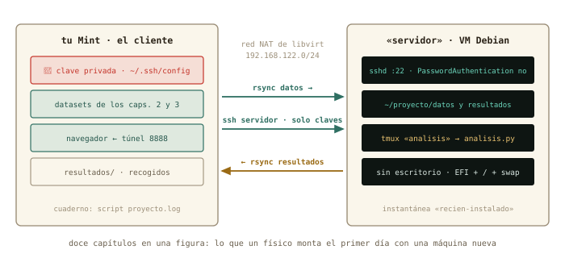

# Proyecto final: tu primer servidor {.unnumbered #sec-proyecto}

::: {.lede}
El ensayo general. Durante trece sesiones cada pieza vino con su
explicación y su solución plegada; hoy no hay solución: hay una lista
de objetivos, la referencia al capítulo donde vive cada pieza, y una
hoja de verificación. Montas de cero un servidor Linux, lo conectas,
lo aseguras, le subes un dataset, lanzas un análisis que sobrevive a
tu ausencia y recoges los resultados. Es, pieza a pieza, el flujo de
trabajo remoto de un físico computacional — y al terminar sabrás que
sabes hacerlo, que es distinto de haberlo leído.
:::

::: {.chapmeta}
⏱ **~3 h** · requisitos: **los doce capítulos** · máquina: **tu Linux de diario y una VM nueva**
:::

## Las reglas {.unnumbered}

- **Desde cero.** Crea una VM *nueva* llamada `servidor` (o borra
  `debian-lab` y empieza limpio). Que el músculo se acuerde sin el
  capítulo delante.
- **Todo por terminal**, salvo la creación de la VM y sus
  instantáneas, que se hacen en virt-manager.
- **Cuaderno obligatorio**: `script proyecto.log` en tu Mint antes de
  empezar. Anota el tiempo de cada hito y qué te atascó: es el dato
  que el curso quiere.
- **Cada hito se verifica con un comando**, no con una sensación. La
  hoja del final dice cuál.
- **Si te atascas**: primero el capítulo indicado; después `man`; y
  si sigues atascado, pide el comando a una IA con la disciplina del
  curso — léelo entero, verifica lo que no reconozcas, jamás un `sudo`
  o un `rm` a ciegas.

{#fig-arquitectura fig-alt="El portátil con Mint a la izquierda, la máquina virtual servidor a la derecha, y entre ambos las flechas de rsync y ssh sobre la red NAT"}

## Los hitos {.unnumbered}

**1. La máquina** *(capítulo 7)*. VM `servidor`: 2 CPU, 4 GB, disco
de 20 GB, red NAT, con la ISO de Debian verificada en la bandeja.

**2. La instalación** *(capítulos 6 y 8)*. Debian sin escritorio, con
servidor SSH. Particionado manual: EFI, raíz ext4 y swap — o, si te
atreves, `/home` separado. Contraseña de root vacía. Al terminar,
apaga desde dentro e instantánea `recien-instalado`.

**3. La red** *(capítulos 9–11)*. Averigua la IP del servidor,
bautízalo en el `/etc/hosts` de tu Mint como `servidor`, y comprueba
que responde por nombre. De propina: ¿qué puerta tiene abierta?

**4. El acceso** *(capítulo 12)*. Tu clave pública en el servidor,
alias `servidor` en `~/.ssh/config`, entrada sin contraseña. Después,
cierra la puerta a las contraseñas en `sshd_config` — con copia del
fichero y sesión de reserva abierta — y demuestra que te rechaza sin
clave.

**5. El sistema** *(capítulos 4 y 5)*. Actualízalo. Instala lo que el
análisis necesita: `tmux`, `htop`, `tree`. Comprueba con `which` que
están, y con `df -h` cuánto disco queda.

**6. Los datos** *(capítulos 2 y 11)*. Crea en el servidor
`~/proyecto/datos` y `~/proyecto/resultados`. Sube con `rsync` el
`adquisicion.log` del capítulo 3 y la carpeta `experimento-pendulo`
del capítulo 2. `tree ~/proyecto` debe enseñar el orden.

**7. El análisis** *(capítulos 3, 4 y 12)*. Escribe en el servidor
`analisis.py` (abajo tienes uno de partida) y un `analiza.sh` con
shebang que lo lance y anote la fecha en `resultados/registro.txt`.
Hazlo ejecutable. Lánzalo dentro de una sesión tmux `analisis`,
desengánchate, **cierra la conexión y apaga la Wi-Fi un minuto**.
Vuelve, engánchate, y mira si ha terminado.

**8. La recogida** *(capítulo 12)*. Trae `resultados/` a tu Mint con
`rsync`, y abre el informe. Repite el `rsync`: debe no transferir
nada.

**9. Propina** *(capítulo 13)*. Jupyter en el servidor a través de un
túnel, abriendo el informe desde el navegador. Y un `du -h` del disco
de la VM antes y después de todo: ¿cuánto ha crecido?

## El análisis de partida {.unnumbered}

Sin NumPy — un servidor recién instalado no lo tiene, y no lo
necesita para esto —. Solo biblioteca estándar, como en el capítulo 3:

```python
# analisis.py — recuento de errores por sensor y rango de temperaturas
from collections import Counter

errores = Counter()
temps = []
with open("datos/adquisicion.log") as f:
    for linea in f:
        campos = linea.split()
        nivel, sensor = campos[2], campos[3]
        if nivel == "ERROR":
            errores[sensor] += 1
        elif nivel == "INFO" and "temp_C=" in linea:
            temps.append(float(linea.split("temp_C=")[1]))

with open("resultados/informe.txt", "w") as out:
    out.write("Errores por sensor:\n")
    for sensor, n in errores.most_common():
        out.write(f"  {sensor}: {n}\n")
    out.write(f"Temperatura minima: {min(temps):.2f}\n")
    out.write(f"Temperatura maxima: {max(temps):.2f}\n")
print("informe escrito en resultados/informe.txt")
```

Si el informe dice `s3: 90`, `s1: 15`, `s4: 3` y un rango de 20,45 a
25,00, el análisis coincide con las tuberías del capítulo 3 — dos
métodos, un resultado, como debe ser. Y si te sobra tiempo: que
`analisis.py` genere también un CSV con errores por minuto, y
grafícalo en tu Mint.

## Hoja de verificación {.unnumbered}

| Hito | Comando (desde tu Mint salvo indicación) | Lo que debe salir |
|------|------------------------------------------|-------------------|
| 1 | `virsh list --all` | `servidor` en la lista |
| 2 | `ssh servidor lsblk` | EFI en `/boot/efi`, raíz en `/`, `[SWAP]` |
| 2 | `virsh snapshot-list servidor` | `recien-instalado` |
| 3 | `ping -c 1 servidor` | respuesta desde `192.168.122.x` |
| 3 | `nmap servidor` | solo `22/tcp open` |
| 4 | `ssh servidor hostname` | `servidor`, sin pedir contraseña |
| 4 | `ssh -o PubkeyAuthentication=no servidor` | `Permission denied (publickey)` |
| 5 | `ssh servidor "which tmux htop tree"` | tres rutas |
| 6 | `ssh servidor tree ~/proyecto` | `datos/` con el log y el experimento; `resultados/` vacío |
| 7 | `ssh servidor tmux ls` | la sesión `analisis` |
| 7 | `ssh servidor cat ~/proyecto/resultados/informe.txt` | el informe con `s3: 90` |
| 8 | `rsync -av servidor:~/proyecto/resultados/ ~/resultados/` (2.ª vez) | `sent … bytes`, ningún fichero listado |
| 9 | `du -sh` del `.qcow2` (con `sudo`) | más que en el capítulo 7 |

## Después {.unnumbered}

Escribe en el cuaderno, para ti, tres respuestas: qué hito te costó
más y por qué; qué harías distinto la segunda vez; y cuánto tardaste
en total. Esas tres líneas y `proyecto.log` son la medida del curso.

Y luego, el paso que ya no es un ejercicio: pide una cuenta en el
clúster de tu universidad — o mira qué horas tiene tu grupo en la
Red Española de Supercomputación. Cuando te la den, entra por SSH con
tu clave, teclea `tmux attach || tmux new`, y empieza a trabajar. Ya
sabes dónde estás parado.

::: {.pie-piloto}
proyecto final v0.1 · piloto — el cuaderno `proyecto.log` con tiempos por hito es el dato más valioso que puedes devolver al curso
:::
